---
lab:
  title: "Vorbereiten von Daten in Power\_BI Desktop"
  module: Module 2 - Get Data in Power BI
---

# **Vorbereiten von Daten in Power BI Desktop**

**Die geschätzte Dauer dieses Labs beträgt 45 Minuten.**

In diesem Lab befassen Sie sich mit der Entwicklung einer Power BI Desktop-Lösung für das Unternehmen „Adventure Works“. Dazu gehört das Herstellen einer Verbindung mit Quelldaten, das Anzeigen einer Vorschau der Daten und die Verwendung von Datenvorschaumethoden zum Verständnis der Merkmale und Qualität der Quelldaten.

In diesem Lab lernen Sie Folgendes:

- Öffnen von Power BI Desktop

- Festlegen von Power BI Desktop-Optionen

- Herstellen einer Verbindung mit Quelldaten

- Anzeigen einer Vorschau von Quelldaten

- Verwenden von Datenvorschaumethoden zum Verständnis der Daten

### **Labszenario**

Dieses Lab ist eines von vielen in einer Reihe von Labs, die als fortlaufendes Szenario von der Datenvorbereitung bis zur Veröffentlichung als Berichte und Dashboards entworfen wurde. Sie können die Labs in beliebiger Reihenfolge abschließen. Wenn Sie jedoch beabsichtigen, mehrere Labs durchzuarbeiten, sollten Sie die ersten zehn Labs in der folgenden Reihenfolge absolvieren:

1. **Vorbereiten von Daten in Power BI Desktop**

2. Laden von Daten in Power BI Desktop

3. Modellieren von Daten in Power BI Desktop

5. Erstellen von DAX-Berechnungen in Power BI Desktop, Teil 1

6. Erstellen von DAX-Berechnungen in Power BI Desktop, Teil 2

7. Entwerfen eines Berichts in Power BI Desktop, Teil 1

8. Entwerfen eines Berichts in Power BI Desktop, Teil 2

9. Erstellen eines Power BI-Dashboards

10. Analysieren von Daten in Power BI Desktop

11. Erzwingen von Sicherheit auf Zeilenebene

## **Übung 1: Vorbereiten von Daten**

In dieser Übung erstellen Sie acht Power BI Desktop-Abfragen. Sechs dieser Abfragen beziehen ihre Daten von SQL Server, während die restlichen zwei ihre Daten aus CSV-Dateien beziehen.

### **Aufgabe 1: Speichern der Power BI Desktop-Datei**

In dieser Aufgabe speichern Sie zunächst die Power BI Desktop-Datei.

1. Klicken Sie zum Öffnen von Power BI Desktop auf der Taskleiste auf die Verknüpfung „Microsoft Power BI Desktop“.

    

1. Um das Fenster „Erste Schritte“ zu schließen, klicken Sie rechts oben im Fenster auf das **X**.

    

1. Um die Datei zu speichern, klicken Sie auf die Registerkarte **Datei** des Menübands, um die Backstage-Ansicht zu öffnen.

1. Wählen Sie **Speichern** aus.

    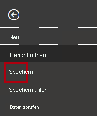

1. Navigieren Sie im Fenster **Speichern unter** zum Ordner **D:\PL300\MySolution**.

1. Geben Sie im Feld **Dateiname** den Namen **Sales Analysis** ein.

    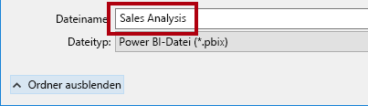

1. Klicken Sie auf **Speichern**.

    

    Tipp: Sie können die Datei speichern, indem Sie links oben auf das Symbol **Speichern** klicken.

    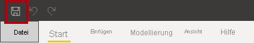

### **Aufgabe 2: Festlegen von Power BI Desktop-Optionen**

In dieser Aufgabe legen Sie Optionen für Power BI Desktop fest.

1. Klicken Sie in Power BI Desktop im Menüband auf die Registerkarte **Datei**, um die Backstage-Ansicht zu öffnen.

1. Klicken Sie links auf **Optionen und Einstellungen**, und wählen Sie dann **Optionen** aus.

    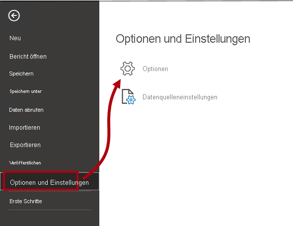

1. Klicken Sie links im Fenster **Optionen** in der Gruppe **Aktuelle Datei** auf **Daten laden**.

    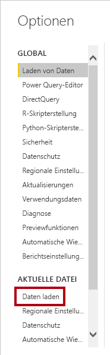

    Die Einstellungen für **Daten laden** der aktuellen Datei erlauben das Festlegen von Optionen, die die Standardverhaltensweisen bei der Modellierung bestimmen.

1. Deaktivieren Sie in der Gruppe **Beziehungen** die zwei bereits aktivierten Optionen.

    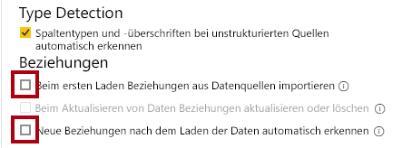

    Die Aktivierung dieser beiden Optionen kann bei der Entwicklung eines Datenmodells zwar praktisch sein, jedoch haben Sie sie zur Unterstützung des Labs deaktiviert. Wenn Sie Beziehungen im Lab **Laden von Daten in Power BI Desktop** erstellen, erfahren Sie, warum Sie die einzelnen Beziehungen hinzufügen.

1. Klicken Sie auf **OK**.

    

1. Speichern Sie die Power BI Desktop-Datei.

### **Aufgabe 3: Abrufen von Daten von SQL Server**

In dieser Aufgabe erstellen Sie Abfragen basierend auf SQL Server-Tabellen.

1. Klicken Sie auf der Registerkarte **Start** des Menübands in der Gruppe **Daten** auf **SQL Server**.

    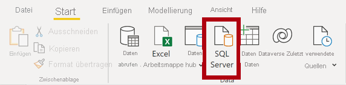

2. Geben Sie im Fenster **SQL Server-Datenbank** in das Feld **Server** die Zeichenfolge **localhost** ein.

    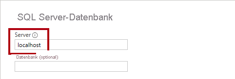

    Im Rahmen dieses Labs stellen Sie mit **localhost** eine Verbindung mit der SQL Server-Datenbank her. Von dieser Methode wird jedoch abgeraten, wenn Sie eigene Lösungen erstellen. Das liegt daran, dass Gatewaydatenquellen **localhost** nicht auflösen können.

3. Klicken Sie auf **OK**.

    

4. Erweitern Sie im Fenster **Navigator** auf der linken Seite die Datenbank **AdventureWorksDW2020**.

    Die Datenbank **AdventureWorksDW2020** basiert auf der Beispieldatenbank **AdventureWorksDW2017**. Sie wurde für die Zwecke der Lernziele der Kurslabs angepasst.

    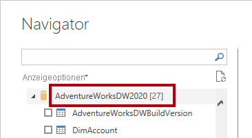

5. Wählen Sie die Tabelle **DimEmployee** aus, aber aktivieren Sie nicht das entsprechende Kontrollkästchen.

    

6. Im rechten Bereich wird eine Vorschau der Tabellendaten angezeigt.

    Diesen Vorschaudaten können Sie die Spalten und eine Auswahl von Zeilen entnehmen.

7. Aktivieren Sie für das Erstellen von Abfragen die Kontrollkästchen neben den folgenden sechs Tabellen:

    - DimEmployee

    - DimEmployeeSalesTerritory

    - DimProduct

    - DimReseller

    - DimSalesTerritory

    - FactResellerSales

8. Klicken Sie auf **Daten transformieren**, um Transformationen auf die Daten in den ausgewählten Tabellen anzuwenden.

    In diesem Lab transformieren Sie die Daten nicht. Die Ziele dieses Labs sind die Untersuchung von und die Profilerstellung für die Daten im Fenster **Power Query-Editor**.

    

### **Aufgabe 4: Anzeigen einer Vorschau für SQL Server-Abfragen**

In dieser Aufgabe zeigen Sie eine Vorschau der Daten für die SQL Server-Abfragen an. Zunächst erfahren Sie relevante Informationen über die Daten. Außerdem verwenden Sie die Tools „Spaltenqualität“, „Spaltenverteilung“ und „Spaltenprofil“, um die Daten zu verstehen und die Datenqualität zu bewerten.

1. Sehen Sie sich im Fenster **Power Query-Editor** links den Bereich **Abfragen** an.

    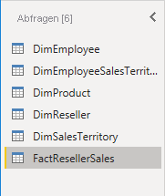

    Der Bereich **Abfragen** enthält je eine Abfrage für jede ausgewählte Tabelle.

2. Wählen Sie die erste Abfrage aus: **DimEmployee**.

    

    In der Tabelle **DimEmployee** in der SQL Server-Datenbank ist eine Zeile für jeden Mitarbeiter und jede Mitarbeiterin gespeichert. Eine Teilmenge der Zeilen aus dieser Tabelle bezieht sich auf die Vertriebsmitarbeiter*innen. Dies ist relevant für das Modell, das Sie entwickeln werden.

3. Beachten Sie links unten auf der Statusleiste die Tabellenstatistik. Die Tabelle besteht aus 33 Spalten und 296 Zeilen.

    

4. Scrollen Sie im Bereich „Datenvorschau“ horizontal, um alle Spalten zu überprüfen.

5. Beachten Sie, dass die letzten fünf Spalten Verknüpfungen mit **Tabellen** oder **Werten** enthalten.

    Diese fünf Spalten stellen Beziehungen zu anderen Tabellen in der Datenbank dar. Sie können zum Verknüpfen von Tabellen verwendet werden. Das Verknüpfen von Tabellen ist Thema das Labs **Laden von Daten in Power BI Desktop**.

6. Aktivieren Sie zum Überprüfen der Spaltenqualität auf der Registerkarte **Ansicht** des Menübands in der Gruppe **Datenvorschau** das Kontrollkästchen **Spaltenqualität**.

    

    Über die Funktion „Spaltenqualität“ können Sie den Prozentsatz von gültigen, fehlerhaften und leeren Spaltenwerten ganz einfach ermitteln.

7. Wie Sie sehen, sind in der Spalte **Position** (sechstletzte Spalte) 94 % der Zeilen leer (NULL).

    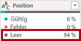

8. Aktivieren Sie zum Überprüfen der Spaltenverteilung auf der Registerkarte **Ansicht** des Menübands in der Gruppe **Datenvorschau** die Option **Spaltenverteilung**.

    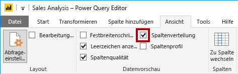

9. Sehen Sie sich wieder die Spalte **Position** an. Wie Sie sehen, enthält diese vier verschiedene Werte und einen eindeutigen Wert.

10. Überprüfen Sie die Spaltenverteilung für die (erste) Spalte **EmployeeKey**. Diese enthält 296 verschiedene Werte und 296 eindeutige Werte.

    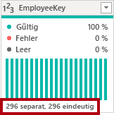

    Wenn die Anzahl von verschiedenen und eindeutigen Werten übereinstimmt, enthält die Spalte nur eindeutige Werte. Beim Modellieren ist wichtig, dass einige Modelltabellen eindeutige Spalten enthalten. Sie können diese eindeutigen Spalten zum Erstellen von 1:n-Beziehungen verwenden. Dies werden Sie im Lab **Modellieren von Daten in Power BI Desktop, Teil 1** ausführen.

11. Wählen Sie im Bereich **Abfragen** die Abfrage **DimEmployeeSalesTerritory** aus.

    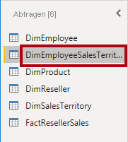

    Die Tabelle **DimEmployeeSalesTerritory** enthält je eine Zeile für jeden Mitarbeiter und die von diesem verwalteten Regionen des Vertriebsgebiets. Sie unterstützt das Zuordnen von vielen Regionen zu einem einzelnen Mitarbeiter. Einige Mitarbeiter verwalten eine, zwei oder möglicherweise sogar mehr Regionen. Beim Modellieren dieser Daten müssen Sie eine m:n-Beziehung definieren. Dies werden Sie im Lab **Modellieren von Daten in Power BI Desktop, Teil 2** ausführen.

12. Wählen Sie im Bereich **Abfragen** die Abfrage für **DimProduct** aus.

    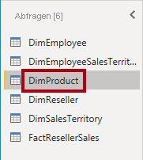

    Die Tabelle **DimProduct** enthält je eine Zeile für jedes vom Unternehmen verkaufte Produkt.

13. Scrollen Sie horizontal, um die letzten Spalten anzuzeigen.

14. Sehen Sie sich die Spalte **DimProductSubcategory** an.

    Wenn Sie dieser Abfrage im Lab **Laden von Daten in Power BI Desktop** Transformationen hinzufügen, verwenden Sie die Spalte **DimProductSubcategory** zum Verknüpfen der Tabellen.

15. Wählen Sie im Bereich **Abfragen** die Abfrage für **DimReseller** aus.

    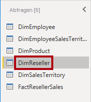

    Die Tabelle **DimReseller** enthält je eine Zeile für jeden Handelspartner. Handelspartner verkaufen oder vertreiben die Produkte von Adventure Works oder steigern deren Wert.

16. Aktivieren Sie auf der Registerkarte **Ansicht** des Menübands in der Gruppe **Datenvorschau** die Option **Spaltenprofil**, um Spaltenwerte anzuzeigen.

    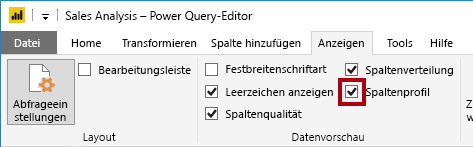

17. Wählen Sie die Spaltenüberschrift **BusinessType** aus.

18. Beachten Sie den neuen Bereich unterhalb des Bereichs „Datenvorschau“.

19. Überprüfen Sie die Spaltenstatistiken und die Werteverteilung im Bereich „Datenvorschau“.

20. Wie Sie sehen, liegt ein Datenqualitätsproblem vor: Es gibt zwei Bezeichnungen für „Warehouse“ (**Warehouse** und das falsch geschriebene **Ware House**).

    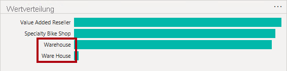

21. Zeigen Sie mit dem Mauszeiger auf den Balken für **Ware House**. Wie Sie sehen, gibt es fünf Zeilen mit diesem Wert.

    Sie wenden im Lab **Laden von Daten in Power BI Desktop** eine Transformation an, um diese fünf Zeilen neu zu bezeichnen.

22. Wählen Sie im Bereich **Abfragen** die Abfrage für **DimSalesTerritory** aus.

    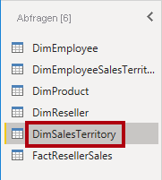

    Die Tabelle **DimSalesTerritory** enthält je eine Zeile für jede Vertriebsregion, einschließlich des **Unternehmenshauptsitzes**. Regionen werden einem Land zugewiesen, und Länder werden Gruppen zugewiesen. Im Lab **Modellieren von Daten in Power BI Desktop, Teil 1** erstellen Sie eine Hierarchie zur Unterstützung der Analyse auf Regions-, Länder- oder Gruppenebene.

23. Wählen Sie im Bereich **Abfragen** die Abfrage für **FactResellerSales** aus.

    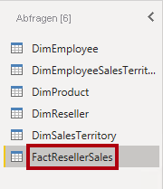

    Die Tabelle **FactResellerSales** enthält je eine Zeile für jede Auftragsposition. Ein Verkaufsauftrag enthält eine oder mehrere solcher Positionen.

24. Überprüfen Sie die Spaltenqualität für die Spalte **TotalProductCost**. Wie Sie sehen, sind 8 % der Zeilen leer.

    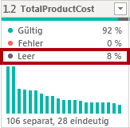

    Fehlende Werte in der Spalte **TotalProductCost** stellen ein Datenqualitätsproblem dar. Dieses Problem werden Sie im Lab **Laden von Daten in Power BI Desktop** durch die Anwendung von Transformationen behandeln, die fehlende Werte mithilfe der in der zugehörigen Tabelle **DimProduct** gespeicherten Standardproduktkosten ergänzen.

### **Aufgabe 5: Abrufen von Daten aus einer CSV-Datei**

In dieser Aufgabe erstellen Sie eine Abfrage auf Grundlage einer CSV-Datei.

1. Klicken Sie zum Hinzufügen einer neuen Abfrage im Fenster **Power Query-Editor** auf der Registerkarte **Start** des Menübands in der Gruppe **Neue Abfrage** auf den Pfeil nach unten bei **Neue Quelle**, und wählen Sie dann **Text/CSV** aus.

    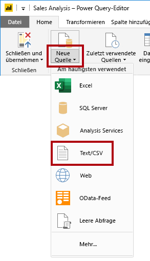

2. Navigieren Sie im Fenster **Öffnen** zum Ordner **D:\PL300\Resources**, und wählen Sie die Datei **ResellerSalesTargets.csv** aus.

3. Klicken Sie auf **Öffnen**.

4. Sehen Sie sich die Vorschaudaten im Fenster **ResellerSalesTargets.csv** an.

5. Klicken Sie auf **OK**.

    

  
‎ 

6. Beachten Sie, dass im Bereich **Abfragen** die Abfrage für **ResellerSalesTargets** hinzugefügt wurde.

    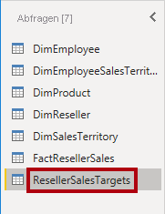

    Die CSV-Datei **ResellerSalesTargets** enthält je eine Zeile pro Vertriebsmitarbeiter für jedes Jahr. Jede Zeile enthält 12 monatliche Verkaufsziele (mit je tausend Verkäufen als Einheit). Beachten Sie, dass das Geschäftsjahr von Adventure Works am 1. Juli beginnt.

7. Beachten Sie auch, dass keine der Spalten leere Werte enthält.

    Wenn kein monatliches Verkaufsziel vorhanden ist, wird stattdessen ein Bindestrich eingetragen.

8. Überprüfen Sie die Symbole in den einzelnen Spaltenüberschriften links neben dem Spaltennamen.

    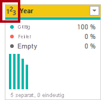

    Die Symbole stehen für den Datentyp der jeweiligen Spalte. **123** steht für ganze Zahlen und **ABC** für Text.

    Im Lab **Laden von Daten in Power BI Desktop** wenden Sie viele Transformationen an, um das Ergebnis von nur drei Spalten unterschiedlich zu formatieren: **Date**, **EmployeeKey** und **TargetAmount**.

### **Aufgabe 6: Abrufen zusätzlicher Daten aus einer CSV-Datei**

In dieser Aufgabe erstellen Sie eine weitere Abfrage auf Grundlage einer anderen CSV-Datei.

1. Erstellen Sie anhand der Schritte in der vorherigen Aufgabe eine auf der Datei **D:\PL300\Resources\ColorFormats.csv** basierende Abfrage.

    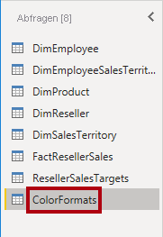

    Die CSV-Datei **ColorFormats** enthält je eine Zeile für jede Produktfarbe. Die einzelnen Zeilen enthalten jeweils die hexadezimalen Codes zum Formatieren von Hintergrund- und Schriftfarben. Im Lab **Laden von Daten in Power BI Desktop** integrieren Sie diese Daten mit den Daten der Abfrage **DimProduct**.

### **Aufgabe 7: Abschluss**

Mit dieser Aufgabe schließen Sie das Lab ab.

1. Deaktivieren Sie auf der Registerkarte **Ansicht** des Menübands in der Gruppe **Datenvorschau** die folgenden drei Datenvorschauoptionen, die Sie zuvor in diesem Lab aktiviert haben:

    - Spaltenqualität

    - Spaltenverteilung

    - Spaltenprofil

    

2. Wählen Sie im Fenster **Power Query-Editor** in der Backstage-Ansicht **Datei** die Option **Speichern** aus, um die Power BI Desktop-Datei zu speichern.

    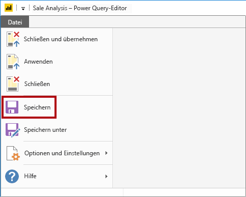

3. Wenn Sie zum Anwenden der Abfragen aufgefordert werden, klicken Sie auf **Später übernehmen**.

    

    Durch das Anwenden der Abfragen werden deren Daten in das Datenmodell geladen. An diesem Punkt sind Sie allerdings noch nicht, da erst noch viele Transformationen angewendet werden müssen.

4. Wenn Sie beabsichtigen, das nächste Lab zu starten, lassen Sie Power BI Desktop geöffnet.

    Im Lab **Laden von Daten in Power BI Desktop** wenden Sie verschiedene Transformationen auf die Abfragen an und verwenden die Abfragen dann, um sie in das Datenmodell zu laden.
