---
lab:
  title: "Laden von Daten in Power\_BI Desktop"
  module: 'Module 3 - Clean, Transform, and Load Data in Power BI'
---

# <a name="load-data-in-power-bi-desktop"></a>**Laden von Daten in Power BI Desktop**

**Die geschätzte Dauer dieses Labs beträgt 45 Minuten.**

In diesem Lab wenden Sie Transformationen auf alle Abfragen an, die Sie im vorherigen Lab erstellt haben. Anschließend wenden Sie die Abfragen jeweils als Tabelle in das Datenmodell laden.

In diesem Lab lernen Sie Folgendes:

- Anwenden verschiedener Transformationen

- Laden von Abfragen in das Datenmodell

### <a name="lab-story"></a>**Labszenario**

Dieses Lab ist eines von vielen in einer Reihe von Labs, die als fortlaufendes Szenario von der Datenvorbereitung bis zur Veröffentlichung als Berichte und Dashboards entworfen wurde. Sie können die Labs in beliebiger Reihenfolge abschließen. Wenn Sie jedoch beabsichtigen, mehrere Labs durchzuarbeiten, sollten Sie die ersten zehn Labs in der folgenden Reihenfolge absolvieren:

1. Vorbereiten von Daten in Power BI Desktop

2. **Laden von Daten in Power BI Desktop**

3. Modellieren von Daten in Power BI Desktop


5. Erstellen von DAX-Berechnungen in Power BI Desktop, Teil 1

6. Erstellen von DAX-Berechnungen in Power BI Desktop, Teil 2

7. Entwerfen eines Berichts in Power BI Desktop, Teil 1

8. Entwerfen eines Berichts in Power BI Desktop, Teil 2

9. Erstellen eines Power BI-Dashboards

10. Analysieren von Daten in Power BI Desktop

11. Erzwingen von Sicherheit auf Zeilenebene

## <a name="exercise-1-load-data"></a>**Übung 1: Laden von Daten**

In dieser Übung wenden Sie Transformationen auf alle Abfragen an, die Sie im vorherigen Lab erstellt haben.

### <a name="task-1-get-started"></a>**Aufgabe 1: Erste Schritte**

In dieser Aufgabe richten Sie die Umgebung für das Lab ein.

*Wichtig: Wenn Sie nach einem vorherigen Lab fortfahren (und dieses Lab erfolgreich abgeschlossen haben), überspringen Sie diese Aufgabe und fahren mit der nächsten fort.*

1. Klicken Sie zum Öffnen von Power BI Desktop auf der Taskleiste auf die Verknüpfung „Microsoft Power BI Desktop“.

    

1. Um das Fenster „Erste Schritte“ zu schließen, klicken Sie links oben im Fenster auf das **X**.

    

1. Um die Startdatei für Power BI Desktop zu öffnen, klicken Sie auf die Registerkarte **Datei** des Menübands, um die Backstage-Ansicht zu öffnen.

1. Wählen Sie **Bericht öffnen** aus.

    

1. Klicken Sie auf **Berichte durchsuchen**.

    

1. Navigieren Sie im Fenster **Öffnen** zum Ordner **D:\PL300\Labs\02-load-data-with-power-query-in-power-bi-desktop\Starter**.

1. Wählen Sie die Datei **Sales Analysis** aus.

1. Klicken Sie auf **Öffnen**.

    

1. Schließen Sie alle Informationsfenster, die möglicherweise geöffnet werden.

1. Beachten Sie die gelbe Warnmeldung unterhalb des Menübands.

    *Die Meldung weist Sie darauf hin, dass die Abfragen nicht als Modelltabellen geladen wurden. Sie werden die Abfragen später in diesem Lab anwenden.*

1. Wählen Sie rechts auf der gelben Warnmeldung das **X** aus, um sie zu verwerfen.

    

1. Um eine Kopie der Datei zu erstellen, klicken Sie auf die Registerkarte **Datei** des Menübands, um die Backstage-Ansicht zu öffnen.

1. Wählen Sie **Speichern unter** aus.

    

1. Wenn Sie aufgefordert werden, die Abfragen anzuwenden, klicken Sie auf **Später übernehmen**.

    

1. Navigieren Sie im Fenster **Speichern unter** zum Ordner **D:\PL300\MySolution**.

1. Klicken Sie auf **Speichern**.

    

1. Klicken Sie auf der Registerkarte **Start** des Menübands in der Gruppe **Abfragen** auf das Symbol **Daten transformieren**, um das Fenster **Power Query-Editor** zu öffnen.

    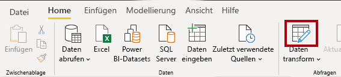

### <a name="task-2-configure-the-salesperson-query"></a>**Aufgabe 2: Konfigurieren der Abfrage „Salesperson“**

In dieser Aufgabe konfigurieren Sie die Abfrage **Salesperson**.

1. Wählen Sie im Fenster **Power Query-Editor** im Bereich **Abfragen** die Abfrage **DimEmployee** aus.

    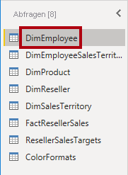

2. Ersetzen Sie zum Umbenennen der Abfrage im Bereich **Abfrageeinstellungen** (rechts) den Text im Feld **Name** durch **Salesperson**, und drücken Sie die **EINGABETASTE**.

    *Der Name der Abfrage bestimmt den Namen der Modelltabelle. Es wird empfohlen, präzise, aber benutzerfreundliche Namen zu nutzen.*

3. Überprüfen Sie im Bereich **Abfragen**, ob der Abfragename aktualisiert wurde.

    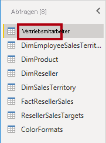

    *Jetzt werden Sie die Abfragezeilen filtern, um nur die Namen von Mitarbeiter*innen abzurufen, die im Vertrieb arbeiten.*

4. Klicken Sie auf der Registerkarte **Start** des Menübands in der Gruppe **Spalten verwalten** auf den Abwärtspfeil **Spalten auswählen**, und klicken Sie auf **Zur Spalte wechseln**.

    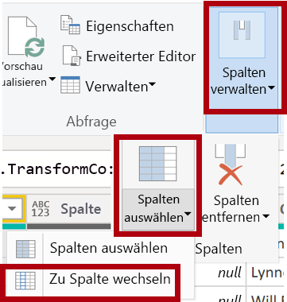

    *Tipp: Diese Technik ist hilfreich, wenn eine Abfrage viele Spalten enthält. Bei zu vielen Spalten scrollen Sie einfach horizontal bis zur gewünschten Spalte.*

5. Klicken Sie im Fenster **Zur Spalte wechseln** auf die Sortierschaltfläche **AZ**, um die Liste nach Spaltennamen zu sortieren, und wählen Sie dann **Name** aus.

    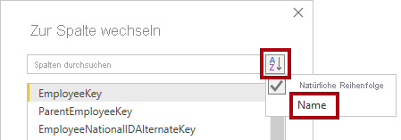

6. Wählen Sie die Spalte **SalesPersonFlag** aus, und klicken Sie auf **OK**.

7. Klicken Sie in der Spaltenüberschrift **SalesPersonFlag** auf den Abwärtspfeil, und deaktivieren Sie **FALSE**, um die Abfrage zu filtern.

    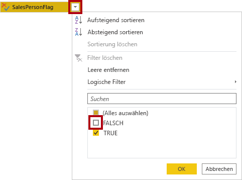

8. Klicken Sie auf **OK**.

    

9. Beachten Sie im Bereich **Abfrageeinstellungen** in der Liste **Angewendete Schritte**, dass der Schritt **Gefilterte Zeilen** hinzugefügt wurde.

    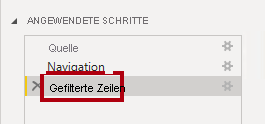

    *Jede Transformation, die Sie erstellen, führt zu einer zusätzlichen Schrittlogik. Schritte können auch bearbeitet oder gelöscht werden. Es ist ebenso möglich, einen Schritt auszuwählen und eine Vorschau der Abfrageergebnisse in dieser Phase der Abfragetransformation anzuzeigen.*

10. Klicken Sie auf der Registerkarte **Start** des Menübands in der Gruppe **Spalten verwalten** auf das Symbol **Spalten auswählen**, um Spalten zu entfernen.

    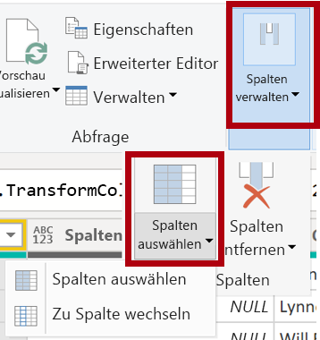

11. Deaktivieren Sie im Fenster **Spalten auswählen** das Element **(Alle Spalten auswählen)** , um alle Spalten zu deaktivieren.

    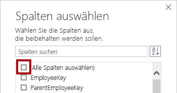

12. Damit Spalten berücksichtigt werden, müssen Sie die Kontrollkästchen für folgenden sechs Spalten aktivieren:

    - EmployeeKey

    - EmployeeNationalIDAlternateKey

    - FirstName

    - LastName

    - Title

    - EmailAddress

13. Klicken Sie auf **OK**.

    

14. Beachten Sie in der Liste **Angewendete Schritte**, dass ein weiterer Abfrageschritt hinzugefügt wurde.

    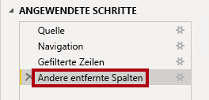

15. Klicken Sie zuerst auf die Spaltenüberschrift **FirstName**, um eine einzelne Namensspalte zu erstellen.

16. Klicken Sie auf die Spalte **LastName**, während Sie **STRG** gedrückt halten.

    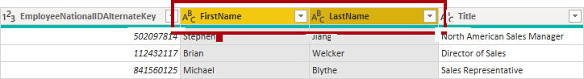

17. Klicken Sie mit der rechten Maustaste auf eine der markierten Spaltenüberschriften, und wählen Sie dann im Kontextmenü **Spalten zusammenführen** aus.

    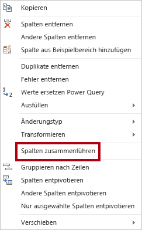

    *Viele gängige Transformationen können angewandt werden, indem Sie mit der rechten Maustaste auf die Spaltenüberschrift klicken und die Transformation im Kontextmenü auswählen. Beachten Sie jedoch, dass im Menüband mehr Transformationen verfügbar sind.*

18. Wählen Sie im Fenster **Spalten zusammenführen** in der Dropdownliste **Trennlinie** die Option **Leertaste** aus.

19. Ersetzen Sie im Feld **Neuer Spaltenname** den Text durch **Salesperson**.

    

20. Klicken Sie auf **OK**.

    

21. Doppelklicken Sie auf die Spaltenüberschrift **EmployeeNationalIDAlternateKey**, um die Spaltenüberschrift **EmployeeNationalIDAlternateKey** umzubenennen.

22. Ersetzen Sie den Text durch **EmployeeID**, und drücken Sie die **EINGABETASTE**.

    *Wichtig: Wenn Sie aufgefordert werden, Spalten umzubenennen, ist es wichtig, dass Sie genauso wie beschrieben vorgehen.*

23. Führen Sie die vorherigen Schritte noch einmal aus, um die Spalte **EmailAddress** in **UPN** umzubenennen.

    *Das Akronym „UPN“ steht für „User Principal Name“, zu Deutsch: „Benutzerprinzipalname“. Die Werte in dieser Spalte werden verwendet, wenn Sie die Sicherheit auf Zeilenebene im Lab **Modellieren von Daten in Power BI Desktop, Teil 2** konfigurieren.*

24. Überprüfen Sie links unten auf der Statusleiste, ob die Abfrage fünf Spalten und 18 Zeilen enthält.

    

    *Wichtig: Wenn Ihre Abfrage nicht das richtige Ergebnis liefert, sollten Sie unter keinen Umständen fortfahren, da Sie so spätere Labs nicht abschließen können. Wenn die Abfragespalten oder -zeilen nicht identisch sind, kehren Sie zu den Schritten in der Aufgabe zurück, um Probleme zu beheben.*

### <a name="task-3-configure-the-salespersonregion-query"></a>**Aufgabe 3: Konfigurieren der Abfrage „SalespersonRegion“**

In dieser Aufgabe konfigurieren Sie die Abfrage **SalespersonRegion**.

1. Wählen Sie im Bereich **Abfragen** die Abfrage **DimEmployeeSalesTerritory** aus.

    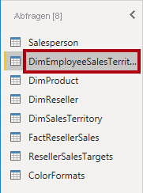

2. Benennen Sie die Abfrage im Bereich **Abfrageeinstellungen** in **SalespersonRegion** um.

3. Wählen Sie zuerst die Spaltenüberschrift **DimEmployee** aus, um die letzten zwei Spalten zu entfernen.

4. Halten Sie **STRG** gedrückt, und klicken Sie dann auf die Spaltenüberschrift **DimSalesTerritory**.

5. Klicken Sie mit der rechten Maustaste auf eine der markierten Spaltenüberschriften, und wählen Sie dann im Kontextmenü **Spalten entfernen** aus.

    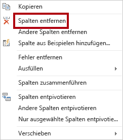

6. Überprüfen Sie auf der Statusleiste, ob die Abfrage zwei Spalten und 39 Zeilen enthält.

    

### <a name="task-4-configure-the-product-query"></a>**Aufgabe 4: Konfigurieren der Produktabfrage**

In dieser Aufgabe konfigurieren Sie die Abfrage **Product**.

*Wichtig: Da bereits ausführliche Anweisungen bereitgestellt wurden, enthalten die folgenden Schritte zum Lab kurzgefasste Anweisungen. Wenn Sie die ausführlichen Anweisungen benötigen, können Sie zu den Schritten der vorherigen Aufgaben zurückkehren.*

1. Wählen Sie die Abfrage **DimProduct** aus.

    

2. Benennen Sie die Abfrage in **Product** um.

3. Suchen Sie die Spalte **FinishedGoodsFlag**, und filtern Sie dann die Spalte, um Produkte abzurufen, bei denen es sich um fertiggestellte Waren handelt (d. h. sie weisen den Wert TRUE auf).

4. Entfernen Sie mit Ausnahme der folgenden alle Spalten:

    - ProductKey

    - EnglishProductName

    - StandardCost

    - Color

    - DimProductSubcategory

5. Beachten Sie, dass die Spalte **DimProductSubcategory** eine verknüpfte Tabelle ist (sie enthält **Value**-Verknüpfungen).

6. Klicken Sie in der Spaltenüberschrift **DimProductSubcategory** rechts neben dem Spaltennamen auf die Schaltfläche „Erweitern“.

    

7. Deaktivieren Sie das Element **(Alle Spalten auswählen)**, um alle Spalten zu deaktivieren.

8. Überprüfen Sie die Spalten **EnglishProductSubcategoryName** und **DimProductCategory**.

    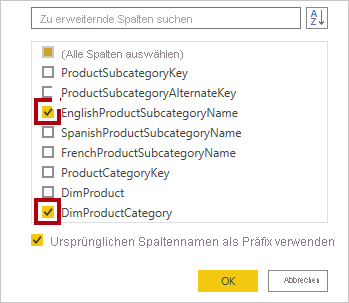

    *Indem Sie diese zwei Spalten auswählen, wird eine Transformation für eine Verknüpfung mit der Tabelle **DimProductSubcategory** durchgeführt. Daraufhin werden diese Spalten eingefügt. Bei der Spalte **DimProductCategory** handelt es sich tatsächlich um eine andere verknüpfte Tabelle in der Datenquelle.*

9. Deaktivieren Sie das Kontrollkästchen **Ursprünglichen Spaltennamen als Präfix verwenden**.

    

    *Abfragespaltennamen müssen immer eindeutig sein. Wenn das Kontrollkästchen aktiviert ist, wird der erweiterte Spaltenname allen Spalten als Präfix vorangestellt (in diesem Fall **DimProductSubcategory**). Da bekannt ist, dass die ausgewählten Spalten keinen Konflikt mit den Spalten in der Abfrage **Product** auslösen, ist diese Option deaktiviert.*

10. Klicken Sie auf **OK**.

    

11. Beachten Sie, dass die Transformation dazu geführt hat, dass zwei Spalten hinzugefügt wurden und dass die Spalte **DimProductSubcategory** entfernt wurde.

12. Erweitern Sie die Spalte **DimProductCategory**, und führen Sie dann nur die Spalte **EnglishProductCategoryName** ein.

13. Benennen Sie die folgenden vier Spalten um:

    - **EnglishProductName** in **Product**

    - **StandardCost** in **Standard Cost** (fügen Sie ein Leerzeichen ein)

    - **EnglishProductSubcategoryName** in **Subcategory**

    - **EnglishProductCategoryName** in **Category**

14. Überprüfen Sie in der Statusleiste, ob die Abfrage 6 Spalten und 397 Zeilen enthält.

    

### <a name="task-5-configure-the-reseller-query"></a>**Aufgabe 5: Konfigurieren der Abfrage „Reseller“**

In dieser Aufgabe konfigurieren Sie die Abfrage **Reseller**.

1. Wählen Sie die Abfrage **DimReseller** aus.

    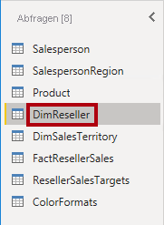

2. Benennen Sie die Abfrage in **Reseller** um.

3. Entfernen Sie mit Ausnahme der folgenden alle Spalten:

    - ResellerKey

    - BusinessType

    - ResellerName

    - DimGeography

4. Erweitern Sie die Spalte **DimGeography**, sodass nur die folgenden drei Spalten enthalten sind:

    - City

    - StateProvinceName

    - EnglishCountryRegionName

    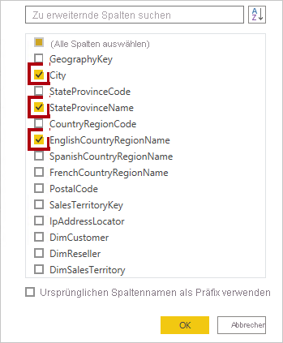

5. Klicken Sie in der Spaltenüberschrift **Business Type** auf den Pfeil nach unten, und überprüfen Sie dann die einzelnen Spaltenwerte. Beachten Sie die falsche Schreibweise von „warehouse“.

    

  
‎ 

6. Klicken Sie mit der rechten Maustaste auf die Spaltenüberschrift **Business Type**, und wählen Sie dann **Werte ersetzen** aus.

    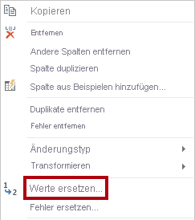

7. Konfigurieren Sie im Fenster **Werte ersetzen** die folgenden Werte:

    - Geben Sie in das Feld **Zu suchender Wert** **Ware House** ein.

    - Geben Sie in das Feld **Ersetzen durch** **Warehouse** ein.

    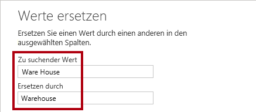

8. Klicken Sie auf **OK**.

    

9. Benennen Sie die folgenden vier Spalten um:

    - **BusinessType** in **Business Type** (fügen Sie ein Leerzeichen ein)

    - **ResellerName** in **Reseller**

    - **StateProvinceName** in **State-Province**

    - **EnglishCountryRegionName** in **Country-Region**

10. Überprüfen Sie auf der Statusleiste, ob die Abfrage sechs Spalten und 701 Zeilen enthält.

    

### <a name="task-6-configure-the-region-query"></a>**Aufgabe 6: Konfigurieren der Abfrage „Region“**

In dieser Aufgabe konfigurieren Sie die Abfrage **Region**.

1. Wählen Sie die Abfrage **DimSalesTerritory** aus.

    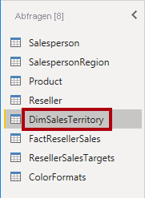

2. Benennen Sie die Abfrage in **Region** um.

3. Wenden Sie einen Filter auf die Spalte **SalesTerritoryAlternateKey** an, um den Wert 0 (null) zu entfernen.

    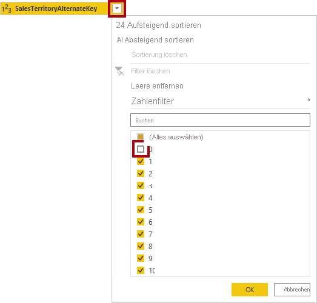

4. Entfernen Sie mit Ausnahme der folgenden alle Spalten:

    - SalesTerritoryKey

    - SalesTerritoryRegion

    - SalesTerritoryCountry

    - SalesTerritoryGroup

5. Benennen Sie die folgenden drei Spalten um:

    - **SalesTerritoryRegion** in **Region**

    - **SalesTerritoryCountry** in **Country**

    - **SalesTerritoryGroup** in **Group**

6. Überprüfen Sie auf der Statusleiste, ob die Abfrage vier Spalten und zehn Zeilen enthält.

    

### <a name="task-7-configure-the-sales-query"></a>**Aufgabe 7: Konfigurieren der Abfrage „Sales“**

In dieser Aufgabe konfigurieren Sie die Abfrage **Sales**.

1. Wählen Sie die Abfrage **FactResellerSales** aus.

    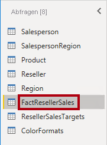

2. Benennen Sie die Abfrage in **Sales** um.

3. Entfernen Sie mit Ausnahme der folgenden alle Spalten:

    - SalesOrderNumber

    - OrderDate

    - ProductKey

    - ResellerKey

    - EmployeeKey

    - SalesTerritoryKey

    - OrderQuantity

    - UnitPrice

    - TotalProductCost

    - SalesAmount

    - DimProduct

    *Möglicherweise erinnern Sie sich, dass im Lab **Vorbereiten von Daten in Power BI Desktop** in den Zeilen **FactResellerSales** ein kleiner Prozentsatz an Werten von **TotalProductCost** fehlte. Die Spalte **DimProduct** wurde hinzugefügt, um die Spalten mit den Standardproduktkosten abzurufen und so die fehlenden Werte zu ergänzen.*

4. Erweitern Sie die Spalte **DimProduct**, deaktivieren Sie alle Spalten, und fügen Sie dann nur die Spalte **StandardCost** hinzu.

5. Klicken Sie zum Erstellen einer benutzerdefinierten Spalte auf der Registerkarte **Spalte hinzufügen** des Menübands in der Gruppe **Allgemein** auf **Benutzerdefinierte Spalte**.

    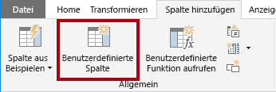

6. Ersetzen Sie im Fenster **Benutzerdefinierte Spalte** im Feld **Neuer Spaltenname** den Text durch **Cost**.

    

7. Geben Sie im Feld **Benutzerdefinierte Spaltenformel** den folgenden Ausdruck ein (nach dem Gleichheitszeichen):

8. Der Einfachheit halber können Sie den Ausdruck aus der Datei **D:\PL300\Labs\02-load-data-with-power-query-in-power-bi-desktop\Assets\Snippets.txt** kopieren.


   **Power Query**
   ```
   if [TotalProductCost] = null then [OrderQuantity] * [StandardCost] else [TotalProductCost]
   ```


*Mit diesem Ausdruck wird getestet, ob der Wert für **TotalProductCost** fehlt. Wenn dies der Fall ist, wird durch Multiplizieren des Werts für **OrderQuantity** mit dem für **StandardCost** ein Wert erzeugt. Andernfalls wird der vorhandene Wert für **TotalProductCost** verwendet.*

9. Klicken Sie auf **OK**.

    

10. Entfernen Sie die beiden folgenden Spalten:

    - TotalProductCost

    - StandardCost

11. Benennen Sie die folgenden drei Spalten um:

    - **OrderQuantity** in **Quantity**

    - **UnitPrice** in **Unit Price** (Ergänzen eines Leerzeichens)

    - **SalesAmount** in **Sales**

12. Klicken Sie zum Ändern des Datentyps in der Überschrift der Spalte **Quantity** links neben dem Spaltennamen auf das **1.2**-Symbol, und wählen Sie **Ganze Zahl** aus.

    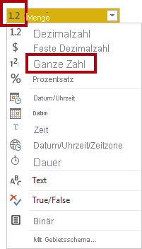

    *Es ist wichtig, den richtigen Datentyp zu konfigurieren. Wenn die Spalte einen numerischen Wert enthält, ist es auch wichtig, den richtigen Typ auszuwählen, wenn Sie planen, mit dem Wert mathematische Berechnungen durchzuführen.*

13. Ändern Sie bei den folgenden drei Spalten den Datentyp in **Feste Dezimalzahl**.

    - Unit Price

    - Sales

    - Cost

    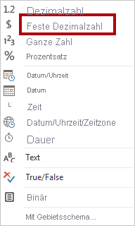

    *Beim Datentyp „Feste Dezimalzahl“ werden die Werte mit vollständiger Genauigkeit gespeichert, weshalb für solche Dezimalzahlen mehr Speicherplatz erforderlich ist. Es ist wichtig, diesen Datentyp für Geldbeträge oder Raten (z. B. Wechselkurse) zu verwenden.*

14. Überprüfen Sie in der Statusleiste, ob die Abfrage 10 Spalten und 999 Zeilen enthält.

    

    *Maximal 1000 Zeilen werden als Vorschaudaten für jede Abfrage geladen.*

### <a name="task-8-configure-the-targets-query"></a>**Aufgabe 8: Konfigurieren der Abfrage „Targets“**

In dieser Aufgabe konfigurieren Sie die Abfrage **Targets**.

1. Wählen Sie die Abfrage **ResellerSalesTargets** aus.

    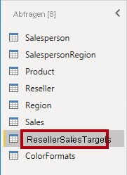

2. Benennen Sie sie um in **Targets**.

3. Wählen Sie zum Entpivotieren der 12 Monatsspalten (**M01**-**M12**) zunächst gleichzeitig die Überschriften der Spalten **Year** und **EmployeeID** aus.

    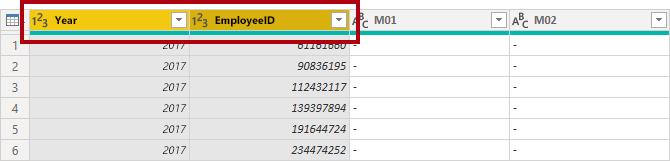

4. Klicken Sie mit der rechten Maustaste auf eine der markierten Spaltenüberschriften und dann mit der linken Maustaste im Kontextmenü auf **Andere Spalten entpivotieren**.

    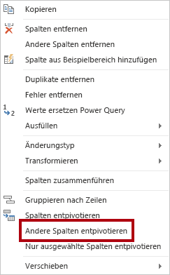

5. Wie Sie sehen, werden jetzt die Spaltennamen in der Spalte **Attribut** und die Werte in der Spalte **Wert** angezeigt.

6. Wenden Sie einen Filter auf die Spalte **Wert** an, um die Bindestrichwerte (-) zu entfernen.

    *Möglicherweise erinnern Sie sich, dass das Bindestrichzeichen in der CSV-Quelldatei verwendet wurde, um Null (0) darzustellen.*

7. Benennen Sie die beiden folgenden Spalten um:

    - **Attribut** in **MonthNumber** (kein Leerzeichen zwischen den beiden Wörtern, Spalte wird später entfernt)

    - **Wert** in **Target**

    *Nun wenden Sie Transformationen an, um eine Datumsspalte zu erstellen. Das Datum wird aus den Spalten **Year** und **MonthNumber** abgeleitet. Sie erstellen die Spalte mithilfe des Features **Spalte aus Beispielen**.*

8. Klicken Sie zum Vorbereiten der Werte in der Spalte **MonthNumber** mit der rechten Maustaste auf die Spaltenüberschrift **MonthNumber** und dann mit der linken Maustaste auf **Werte ersetzen**.

    

9. Geben Sie im Fenster **Werte ersetzen** in das Feld **Zu suchender Wert** den Wert **M** ein.

    

10. Klicken Sie auf **OK**.

11. Ändern Sie den Datentyp der Spalte **MonthNumber** in **Ganze Zahl**.

    

12. Klicken Sie auf der Registerkarte **Spalte hinzufügen** des Menübands in der Gruppe **Allgemein** auf das Symbol für **Spalte aus Beispielen**.

    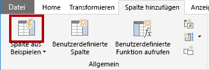

13. Beachten Sie, dass die erste Zeile für das Jahr **2017** und die Monatsnummer **7** ist.

14. Geben Sie in der Spalte **Column1** in der ersten Rasterzelle **7/1/2017**ein, und drücken Sie dann die **EINGABETASTE**.

    *Die VM verwendet das Gebietsschema für die USA, sodass dieses Datum dem 1. Juli 2017 entspricht.*

15. Wie Sie sehen, werden die Rasterzellen mit vorhergesagten Werten aktualisiert.

    *Das Feature hat richtig vorhergesagt, dass Sie Werte aus den Spalten **Year** und **MonthNumber** kombinieren.*

16. Beachten Sie auch die über dem Abfrageraster angezeigte Formel.

    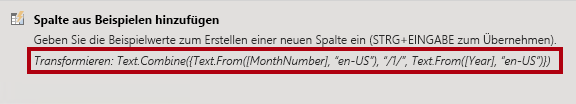

17. Doppelklicken Sie auf die Spaltenüberschrift **Zusammengeführt**, um die neue Spalte umzubenennen.

18. Benennen Sie die Spalte um in **TargetMonth**.

    

19. Klicken Sie auf **OK**, um die neue Spalte hinzuzufügen.

    

20. Entfernen Sie die folgenden Spalten:

    - Year

    - MonthNumber

21. Ändern Sie bei den folgenden Spalten den Datentyp:

    - Bei **Target** in „Feste Dezimalzahl“

    - Bei **TargetMonth** in „Datum“

22. Gehen Sie wie folgt vor, um die Werte in der Spalte **Target** mit 1000 zu multiplizieren: Klicken Sie auf die Spaltenüberschrift **Target**, dann auf der Registerkarte **Transformieren** des Menübands in der Gruppe **Zahlenspalte** auf **Standard**, und wählen Sie **Multiplizieren** aus.

    *Sicherlich erinnern Sie sich daran, dass die Zielwerte als Tausend gespeichert wurden.*

    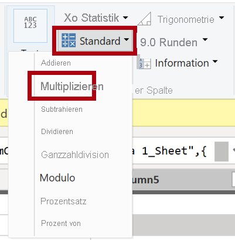

23. Geben Sie im Fenster **Multiplizieren** im Feld **Wert** den Wert **1000** an.

    

24. Klicken Sie auf **OK**.

    

25. Überprüfen Sie auf der Statusleiste, ob die Abfrage drei Spalten und 809 Zeilen enthält.

    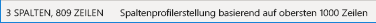

### <a name="task-9-configure-the-colorformats-query"></a>**Aufgabe 9: Konfigurieren der Abfrage „ColorFormats“**

In dieser Aufgabe konfigurieren Sie die Abfrage **ColorFormats**.

1. Wählen Sie die Abfrage **ColorFormats** aus.

    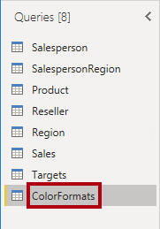

2. Wie Sie sehen, enthält die erste Zeile die Spaltennamen.

3. Klicken Sie auf der Registerkarte **Start** des Menübands in der Gruppe **Transformieren** auf **Erste Zeile als Überschriften verwenden**.

    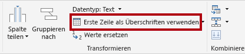

4. Überprüfen Sie auf der Statusleiste, ob die Abfrage drei Spalten und zehn Zeilen enthält.

    

### <a name="task-10-update-the-product-query"></a>**Aufgabe 10: Aktualisieren der Abfrage „Product“**

In dieser Aufgabe aktualisieren Sie die Abfrage **Product**, indem Sie sie mit der Abfrage **ColorFormats** zusammenführen.

1. Wählen Sie die Abfrage **Product** aus.

    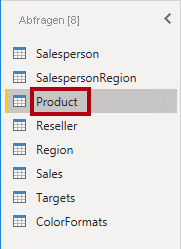

2. Klicken Sie zum Zusammenführen mit der Abfrage **ColorFormats** auf der Registerkarte **Start** des Menübands in der Gruppe **Kombinieren** auf **Abfragen zusammenführen**.

    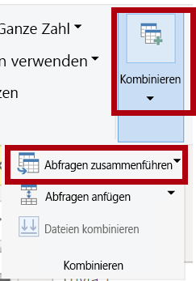

    *Das Zusammenführen von Abfragen ermöglicht das Integrieren von Daten, in diesem Fall aus verschiedenen Datenquellen (SQL Server und einer CSV-Datei).*

3. Klicken Sie im Fenster **Zusammenführen** im Abfrageraster für **Product** auf die Spaltenüberschrift **Color**.

    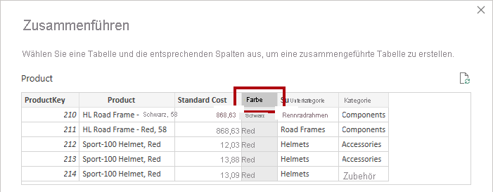

4. Wählen Sie in der Dropdownliste unterhalb des Abfragerasters für **Product** die Abfrage **ColorFormats** aus.

    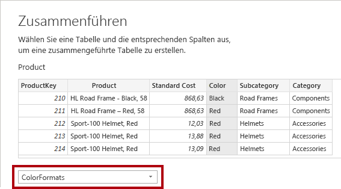

5. Klicken Sie im Abfrageraster für **ColorFormats** auf die Spaltenüberschrift **Color**.

6. Wenn das Fenster **Datenschutzebenen** geöffnet wird, wählen Sie dort für jede der beiden Datenquellen in der entsprechenden Dropdownliste **Organisation** aus.

    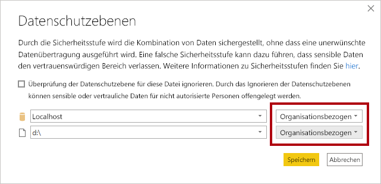

    *Datenschutzebenen können für Datenquellen konfiguriert werden, um festzulegen, ob Daten zwischen Quellen freigegeben werden können. Wenn Sie für alle Datenquellen **Organisation** festlegen, können diese bei Bedarf Daten freigeben. Beachten Sie, dass private Datenquellen nicht für andere Datenquellen freigegeben werden können. Dies bedeutet nicht, dass private Daten überhaupt nicht freigegeben werden können, sondern lediglich, dass die Power Query-Engine keine Daten zwischen den Quellen freigeben kann.*

7. Klicken Sie auf **Speichern**.

    

8. Verwenden Sie im Fenster **Zusammenführen** den Standardwert für die **Art des Joins**. Behalten Sie dabei die Auswahl von „Linker äußerer“ bei, und klicken Sie auf **OK**.

    

9. Erweitern Sie die Spalte **ColorFormats**, um die beiden folgenden Spalten hinzuzufügen:

    - Background Color Format

    - Font Color Format

    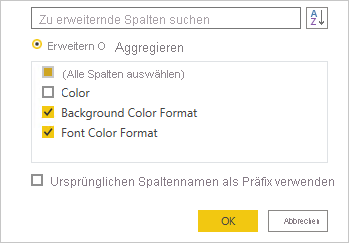

10. Überprüfen Sie auf der Statusleiste, ob die Abfrage acht Spalten und 397 Zeilen enthält.

    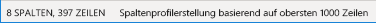

### <a name="task-11-update-the-colorformats-query"></a>**Aufgabe 11: Aktualisieren der Abfrage „ColorFormats“**

In dieser Aufgabe aktualisieren Sie **ColorFormats**, um das Laden für diese Abfrage zu deaktivieren.

1. Wählen Sie die Abfrage **ColorFormats** aus.

    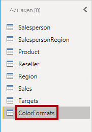

2. Klicken Sie im Bereich **Abfrageeinstellungen** auf den Link **Alle Eigenschaften**.

    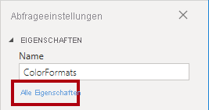

3. Deaktivieren Sie im Fenster **Abfrageeigenschaften** das Kontrollkästchen bei **Laden in Bericht aktivieren**.

    

    Das Deaktivieren des Ladens führt dazu, dass keine entsprechende Tabelle in das Datenmodell geladen wird. Diese Änderung wird vorgenommen, da die Abfrage mit der Abfrage **Product** zusammengeführt wurde, für die das Laden in das Datenmodell aktiviert ist.

4. Klicken Sie auf **OK**.

    

### <a name="task-12-finish-up"></a>**Aufgabe 12: Abschluss**

Mit dieser Aufgabe schließen Sie das Lab ab.

1. Stellen Sie sicher, dass Sie über acht Abfragen verfügen, die wie folgt korrekt benannt sind:

    - Salesperson

    - SalespersonRegion

    - Product

    - Reseller

    - Region

    - Sales

    - Targets

    - ColorFormats (wird nicht in das Datenmodell geladen)

2. Klicken Sie in der Backstage-Ansicht **Datei** auf **Schließen &amp; übernehmen**, um das Datenmodell zu laden.

    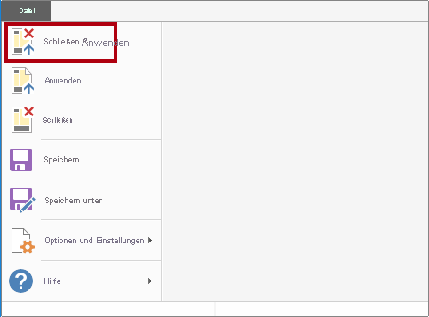

    *Alle Abfragen, für die das Laden aktiviert ist, werden nun in das Datenmodell geladen.*

3. Im Bereich **Felder** (auf der rechten Seite) sehen Sie die sieben Tabellen, die in das Datenmodell geladen wurden.

    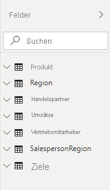

4. Speichern Sie die Power BI Desktop-Datei.

5. Wenn Sie beabsichtigen, das nächste Lab zu starten, lassen Sie Power BI Desktop geöffnet.

    *Sie konfigurieren Datenmodelltabellen und -beziehungen im Lab **Modellieren von Daten in Power BI Desktop, Teil 1**.*
