---
lab:
  title: "Modellieren von Daten in Power\_BI Desktop"
  module: Module 4 - Design a Data Model in Power BI
---

# **Modellieren von Daten in Power BI Desktop**

**Die geschätzte Dauer dieses Labs beträgt 45 Minuten.**

In diesem Lab beginnen Sie mit der Entwicklung des Datenmodells. Dies umfasst das Erstellen von Beziehungen zwischen Tabellen und das anschließende Konfigurieren von Tabellen- und Spalteneigenschaften, um die Benutzerfreundlichkeit und Nutzbarkeit des Datenmodells zu verbessern. Außerdem erstellen Sie Hierarchien und Quickmeasures.

In diesem Lab lernen Sie Folgendes:

- Erstellen von Modellbeziehungen

- Konfigurieren von Tabellen- und Spalteneigenschaften

- Erstellen von Hierarchien

### **Labszenario**

Dieses Lab ist eines von vielen in einer Reihe von Labs, die als fortlaufendes Szenario von der Datenvorbereitung bis zur Veröffentlichung als Berichte und Dashboards entworfen wurde. Sie können die Labs in beliebiger Reihenfolge abschließen. Wenn Sie jedoch beabsichtigen, mehrere Labs durchzuarbeiten, sollten Sie die ersten zehn Labs in der folgenden Reihenfolge absolvieren:

1. Vorbereiten von Daten in Power BI Desktop

2. Laden von Daten in Power BI Desktop

3. **Modellieren von Daten in Power BI Desktop**

5. Erstellen von DAX-Berechnungen in Power BI Desktop, Teil 1

6. Erstellen von DAX-Berechnungen in Power BI Desktop, Teil 2

7. Entwerfen eines Berichts in Power BI Desktop, Teil 1

8. Entwerfen eines Berichts in Power BI Desktop, Teil 2

9. Erstellen eines Power BI-Dashboards

10. Analysieren von Daten in Power BI Desktop

11. Erzwingen von Sicherheit auf Zeilenebene

## **Übung 1: Erstellen von Modellbeziehungen**

In dieser Übung erstellen Sie Modellbeziehungen.

### **Aufgabe 1: Erste Schritte**

In dieser Aufgabe richten Sie die Umgebung für das Lab ein.

*Wichtig: Wenn Sie nach einem vorherigen Lab fortfahren (und dieses Lab erfolgreich abgeschlossen haben), überspringen Sie diese Aufgabe und fahren mit der nächsten fort.*

1. Klicken Sie zum Öffnen von Power BI Desktop auf der Taskleiste auf die Verknüpfung „Microsoft Power BI Desktop“.

    

1. Um das Fenster „Erste Schritte“ zu schließen, klicken Sie links oben im Fenster auf das **X**.

    

1. Um die Startdatei für Power BI Desktop zu öffnen, klicken Sie auf die Registerkarte **Datei** des Menübands, um die Backstage-Ansicht zu öffnen.

1. Wählen Sie **Bericht öffnen** aus.

    

1. Klicken Sie auf **Berichte durchsuchen**.

    

1. Navigieren Sie im Fenster **Öffnen** zum Ordner **D:\PL300\Labs\03-configure-data-model-in-power-bi-desktop\Starter**.

1. Wählen Sie die Datei **Sales Analysis** aus.

1. Klicken Sie auf **Öffnen**.

    

1. Schließen Sie alle Informationsfenster, die möglicherweise geöffnet werden.

1. Um eine Kopie der Datei zu erstellen, klicken Sie auf die Registerkarte **Datei** des Menübands, um die Backstage-Ansicht zu öffnen.

1. Wählen Sie **Speichern unter** aus.

    

1. Wenn Sie aufgefordert werden, die Abfragen anzuwenden, klicken Sie auf **Anwenden**.

    

1. Navigieren Sie im Fenster **Speichern unter** zum Ordner **D:\PL300\MySolution**.

1. Klicken Sie auf **Speichern**.

    

### **Aufgabe 2: Erstellen von Modellbeziehungen**

In dieser Aufgabe erstellen Sie Modellbeziehungen.

1. Klicken Sie links in Power BI Desktop auf das Symbol für die **Modellansicht**.

    

2. Wenn Ihnen nicht alle sieben Tabellen angezeigt werden, scrollen Sie nach rechts, und ordnen Sie die Tabellen aneinander an, damit Sie alle gleichzeitig sehen können.

    *Tipp: Sie können auch das Zoomsteuerelement unten im Fenster verwenden.*

    *In der Modellansicht können Sie jede Tabelle und alle Beziehungen (Connectors zwischen Tabellen) anzeigen. Zurzeit gibt es keine Beziehungen, da Sie im Lab **Vorbereiten von Daten in Power BI Desktop** die Optionen für die Datenladebeziehung deaktiviert haben.*

3. Klicken Sie links auf das Symbol für die **Berichtsansicht**, um zur Berichtsansicht zurückzukehren.

    

4. Klicken Sie im Bereich **Felder** mit der rechten Maustaste auf einen leeren Bereich, und wählen Sie dann **Alle erweitern** aus.

    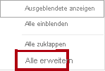

5. Aktivieren Sie zum Erstellen eines Tabellenvisuals im Bereich **Felder** innerhalb der Tabelle **Product** das Feld **Category**.

    

    *In den Labs wird eine verkürzte Notation verwendet, um auf ein Feld zu verweisen. Das sieht folgendermaßen aus: **Product \| Category**. In diesem Beispiel ist **Product** der Tabellenname und **Category** der Feldname.*

6. Aktivieren Sie im Bereich **Felder** das Feld **Sales \| Sales**, um der Tabelle eine Spalte hinzuzufügen.

7. Beachten Sie, dass das Tabellenvisual vier Produktkategorien aufführt und dass der Umsatzwert für alle Kategorien sowie für den Gesamtwert gleich ist.

    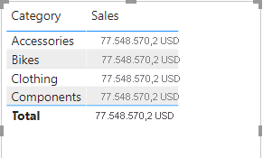

    *Das Problem besteht darin, dass die Tabelle auf Feldern aus anderen Tabellen basiert. Es wird erwartet, dass jede Produktkategorie den Umsatz für die Kategorie anzeigt. Allerdings wird die Tabelle **Sales** nicht gefiltert, da zwischen diesen Tabellen keine Modellbeziehung besteht. Im Folgenden fügen Sie eine Beziehung hinzu, um Filter zwischen den Tabellen weiterzugeben.*

8. Klicken Sie auf der Menübandregisterkarte **Modellierung** innerhalb der Gruppe **Beziehungen** auf **Beziehungen verwalten**.

    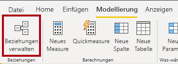

9. Beachten Sie, dass im Fenster **Beziehungen verwalten** keine Beziehungen definiert sind.

10. Klicken Sie auf **Neu**, um eine Beziehung zu erstellen.

    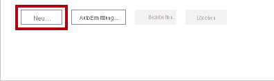

11. Wählen Sie im Fenster **Beziehung erstellen** in der ersten Dropdownliste die Tabelle **Product** aus.

    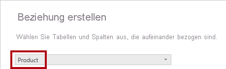

12. Wählen Sie in der zweiten Dropdownliste (unter dem Tabellenraster **Product**) die Tabelle **Sales** aus.

    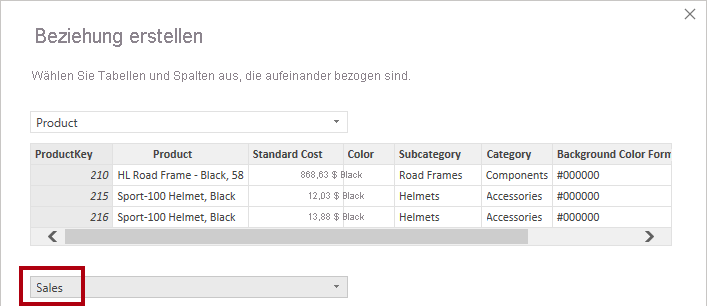

13. Beachten Sie, dass die **ProductKey**-Spalten in beiden Tabellen ausgewählt wurden.

    *Diese Spalten wurden ausgewählt, da sie denselben Namen und Datentyp haben.*

14. Beachten Sie, dass in der Dropdownliste **Kardinalität** die Option **1:n** ausgewählt ist.

    *Die Kardinalität wurde automatisch ermittelt, da Power BI versteht, dass die Spalte **ProductKey** der Tabelle **Product** eindeutige Werte enthält. 1:n-Beziehungen sind die gängigste Kardinalität, und alle Beziehungen, die Sie in diesem Lab erstellen, weisen diesen Typ auf. Im Lab **Modellieren von Daten in Power BI Desktop, Teil 2** arbeiten Sie mit einer m:n-Kardinalität.*

15. Beachten Sie, dass in der Dropdownliste **Kreuzfilterrichtung** die Option **Einfach** ausgewählt ist.

    *Die Filterrichtung „Einfach“ bedeutet, dass die Filter von der Seite „1“ zur Seite „n“ weitergegeben werden. In diesem Fall werden die Filter, die auf die Tabelle **Product** angewandt wurden, an die Tabelle **Sales** weitergegeben, aber nicht in die andere Richtung. Im Lab **Modellieren von Daten in Power BI Desktop, Teil 2** arbeiten Sie mit einer bidirektionalen Beziehung.*

16. Beachten Sie, dass das Kontrollkästchen **Diese Beziehung aktivieren** aktiviert ist.

    *Aktive Beziehungen geben Filter weiter. Eine Beziehung kann als inaktiv gekennzeichnet werden, damit die Filter nicht weitergegeben werden. Inaktive Beziehungen können vorhanden sein, wenn mehrere Beziehungspfade zwischen Tabellen vorliegen. In diesem Fall können Modellberechnungen spezielle Funktionen nutzen, um sie zu aktivieren. Im Lab **Modellieren von Daten in Power BI Desktop, Teil 2** arbeiten Sie mit einer inaktiven Beziehung.*

17. Klicken Sie auf **OK**.

    

18. Überprüfen Sie, ob die neue Beziehung im Fenster **Beziehungen verwalten** aufgelistet wird, und klicken Sie dann auf **Schließen**.

    

19. Beachten Sie, dass das Tabellenvisual im Bericht aktualisiert wurde und verschiedene Werte für alle Produktkategorien angezeigt werden.

    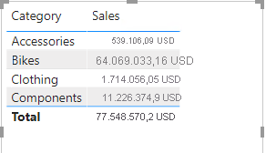

    *Die Filter, die auf die Tabelle **Product** angewandt werden, werden nun an die Tabelle **Sales** weitergegeben.*

20. Wechseln Sie zur Modellansicht, und beachten Sie, dass jetzt ein Connector zwischen den beiden Tabellen vorhanden ist (es spielt keine Rolle, ob die Tabellen nebeneinander positioniert sind).

    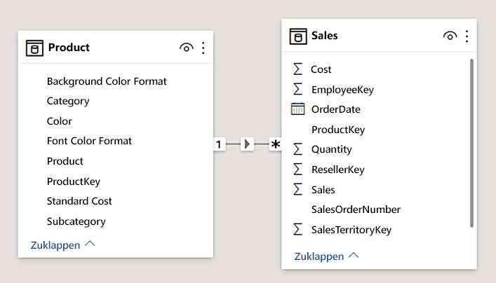

21. Sie können die Kardinalität im Diagramm interpretieren, die mit den Indikatoren **1** und ***** dargestellt wird.

    *Die Filterrichtung wird durch eine Pfeilspitze dargestellt. Eine durchgängige Linie stellt eine aktive Beziehung dar, während eine gestrichelte Linie eine inaktive Beziehung darstellt.*

22. Zeigen Sie mit dem Cursor auf die Beziehung, um die zugehörigen Spalten hervorzuheben.

    *Es gibt eine einfachere Methode zum Erstellen einer Beziehung. Im Modelldiagramm können Sie Spalten per Drag & Drop gruppieren, um eine neue Beziehung zu erstellen.*

23. Zum Erstellen einer neuen Beziehung auf andere Weise über die Tabelle **Reseller** ziehen Sie die Spalte **ResellerKey** auf die Spalte **ResellerKey** der Tabelle **Sales**.

    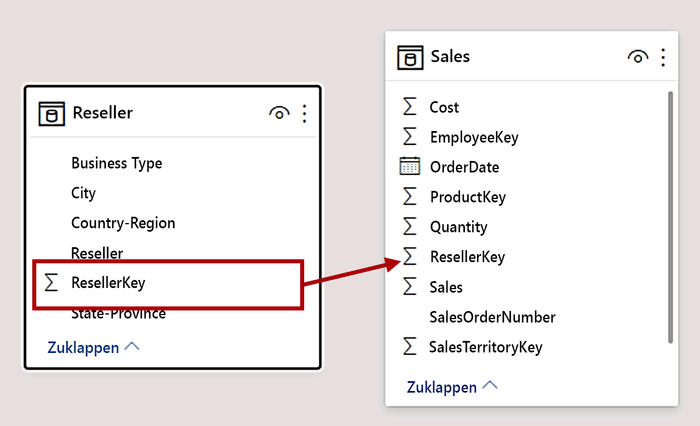

    *Tipp: Manchmal ist es nicht möglich, eine Spalte zu bewegen. Tritt eine solche Situation auf, wählen Sie zunächst eine andere Spalte und dann wieder die Spalte aus, die Sie bewegen möchten, und versuchen Sie es noch mal. Vergewissern Sie sich, dass die neue Beziehung im Diagramm hinzugefügt wurde.*

24. Erstellen Sie die folgenden zwei Modellbeziehungen mit der neuen Vorgehensweise:

    - **Region \| SalesTerritoryKey** mit **Sales \| SalesTerritoryKey**

    - **Salesperson \| EmployeeKey** mit **Sales \| EmployeeKey**

    *In diesem Lab wird keine Verbindung zwischen den Tabellen **SalespersonRegion** und **Targets** hergestellt. Es besteht eine m:n-Beziehung zwischen „salespeople“ und „regions“. Sie verwenden dieses spezielle Szenario im Lab **Modellieren von Daten in Power BI Desktop, Teil 2**.*

25. Ordnen Sie die Tabellen im Diagramm so an, dass die Tabelle **Sales** in der Mitte des Diagramms positioniert ist und die zugehörigen Tabellen darüber angeordnet sind. Platzieren Sie die getrennten Tabellen an der Seite.

    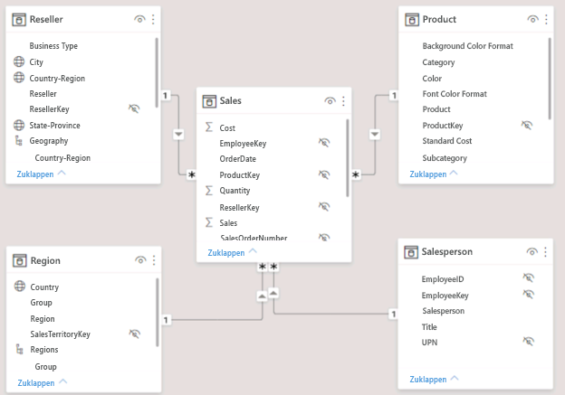

26. Speichern Sie die Power BI Desktop-Datei.

## **Übung 2: Konfigurieren von Tabellen**

In dieser Übung konfigurieren Sie die einzelnen Tabellen, indem Sie Hierarchien erstellen und Spalten ausblenden, formatieren und kategorisieren.

### **Aufgabe 1: Konfigurieren der Tabelle „Product“**

In dieser Aufgabe konfigurieren Sie die Tabelle **Product**.

1. Erweitern Sie in der Modellansicht im Bereich **Felder** bei Bedarf die Tabelle **Product**, um alle Felder anzuzeigen.

2. Klicken Sie zum Erstellen einer Hierarchie im Bereich **Felder** mit der rechten Maustaste auf die Spalte **Category**, und klicken Sie dann auf **Hierarchie erstellen**.

    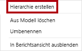

3. Ersetzen Sie im Bereich **Eigenschaften** (links neben dem Bereich **Felder**) im Feld **Name** den Text durch **Products**.

    

4. Scrollen Sie zum Hinzufügen einer zweiten Hierarchieebene im Bereich **Eigenschaften** in der Dropdownliste **Hierarchie** nach unten, und wählen Sie **Subcategory** aus (Sie müssen eventuell im Bereich nach unten scrollen).

5. Klicken Sie zum Hinzufügen einer dritten Hierarchieebene in der Dropdownliste **Hierarchie** auf **Product**.

6. Klicken Sie zum Abschließen der Hierarchieerstellung auf **Ebenenänderungen anwenden**.

    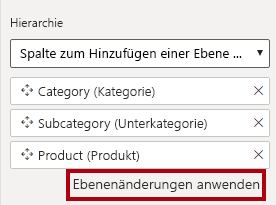

    *Tipp: Vergessen Sie nicht, auf **Ebenenänderungen anwenden** zu klicken. Es ist ein häufiger Fehler, diesen Schritt zu übersehen.*

7. Sehen Sie sich im Bereich **Felder** die Hierarchie **Products** an.

    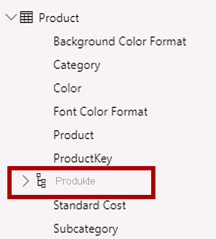

8. Damit die Hierarchieebenen angezeigt werden, erweitern Sie die Hierarchie **Products**.

    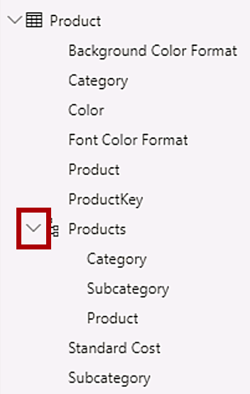

9. Wenn Sie die Spalten in einem Anzeigeordner organisieren möchten, klicken Sie im Bereich **Felder** zunächst auf die Spalte **Background Color Format**.

10. Wählen Sie die Spalte **Font Color Format** aus, während Sie **STRG** gedrückt halten.

11. Geben Sie im Bereich **Eigenschaften** im Feld **Anzeigeordner** **Formatting** ein.

    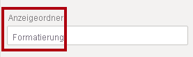

12. Beachten Sie, dass sich die beiden Spalten im Bereich **Felder** nun in einem Ordner befinden.

    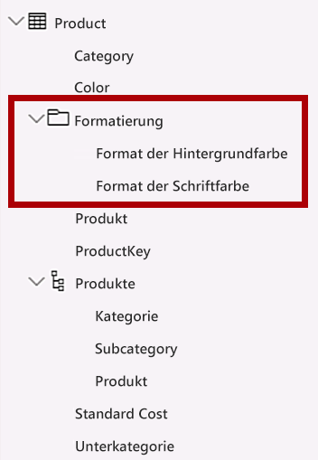

    *Anzeigeordner bieten eine sehr gute Möglichkeit, Tabellen zu bereinigen, insbesondere diejenigen, die viele Felder enthalten.*

### **Aufgabe 2: Konfigurieren der Tabelle „Region“**

In dieser Aufgabe konfigurieren Sie die Tabelle **Region**.

1. Erstellen Sie in der Tabelle **Region** eine Hierarchie namens **Regions** mit den folgenden drei Ebenen:

    - Group

    - Country

    - Region

    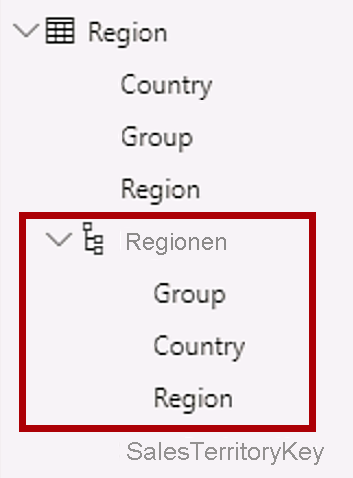

2. Wählen Sie die Spalte **Country** aus (nicht die Hierarchieebene **Country**).

3. Erweitern Sie im Bereich **Eigenschaften** den Abschnitt **Erweitert** (unten im Bereich), und wählen Sie dann in der Dropdownliste **Datenkategorie** die Option **Land/Region** aus.

    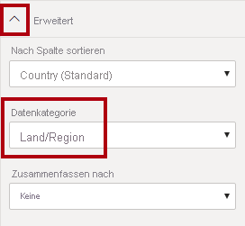

    *Eine Datenkategorisierung kann Hinweise für den Berichts-Designer geben. In diesem Fall gibt das Kategorisieren der Spalte als Land oder Region genauere Informationen beim Rendern einer Kartenvisualisierung durch Power BI.*

### **Aufgabe 3: Konfigurieren der Tabelle „Reseller“**

In dieser Aufgabe konfigurieren Sie die Tabelle **Reseller**.

1. Erstellen Sie in der Tabelle **Reseller** eine Hierarchie namens **Resellers** mit den folgenden beiden Ebenen:

    - Business Type

    - Reseller

    

2. Erstellen Sie eine zweite Hierarchie namens **Geography** mit den folgenden vier Ebenen:

    - Country-Region

    - State-Province

    - City

    - Reseller

    

3. Kategorisieren Sie die folgenden drei Spalten:

    - **Country-Region** als **Land/Region**

    - **State-Province** als **Bundesland/Kanton**

    - **City** als **Stadt**

### **Aufgabe 4: Konfigurieren der Tabelle „Sales“**

In dieser Aufgabe konfigurieren Sie die Tabelle **Sales**.

1. Klicken Sie in der Tabelle **Sales** auf die Spalte **Cost**.

2. Geben Sie im Bereich **Eigenschaften** in das Feld **Beschreibung** Folgendes ein: **Basierend auf Standardkosten**

    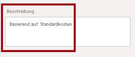

    *Beschreibungen können auf Tabellen, Spalten, Hierarchien oder Measures angewandt werden. Im Bereich **Felder** wird Beschreibungstext als QuickInfo angezeigt, wenn der Berichtersteller den Cursor über ein Feld bewegt.*

3. Klicken Sie auf die Spalte **Quantity**.

4. Verschieben Sie im Bereich **Eigenschaften** im Abschnitt **Formatierung** den Schieberegler für die Eigenschaft **Tausendertrennzeichen** auf **Ein**.

    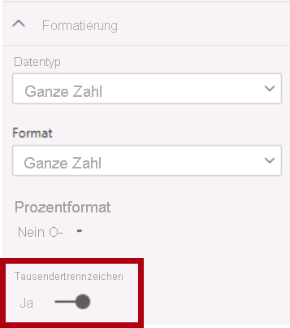

5. Klicken Sie auf die Spalte **Unit Price**.

6. Verschieben Sie im Bereich **Eigenschaften** im Abschnitt **Formatierung** den Schieberegler für die Eigenschaft **Dezimalstellen** auf **2**.

7. Klicken Sie in der Gruppe **Erweitert** (möglicherweise müssen Sie dazu nach unten scrollen) in der Dropdownliste **Zusammenfassen nach** auf **Durchschnitt**.

    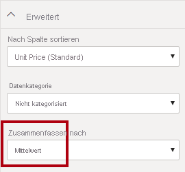

    *Standardmäßig werden numerische Spalten zusammengefasst, indem Werte summiert werden. Dieses Standardverhalten ist jedoch nicht für Spalten wie **Unit Price** geeignet, in denen eine Rate dargestellt wird. Das Festlegen der Standardzusammenfassung auf einen Durchschnitt erzeugt ein aussagekräftiges Ergebnis.*

### **Aufgabe 5: Massenaktualisieren von Eigenschaften**

Bei dieser Aufgabe aktualisieren Sie mehrere Spalten mit einer einzelnen Massenaktualisierung. Sie verwenden diesen Ansatz, um Spalten auszublenden und Spaltenwerte zu formatieren.

1. Wählen Sie im Bereich **Felder** die Spalte **Product \| ProductKey** aus.

2. Wählen Sie die folgenden 13 Spalten aus, die sich über mehrere Tabellen erstrecken, und halten Sie dabei **STRG** gedrückt:

    - Region \| SalesTerritoryKey

    - Reseller \| ResellerKey

    - Sales \| EmployeeKey
    
    - Sales \| ProductKey

    - Sales \| ResellerKey

    - Sales \| SalesOrderNumber

    - Sales \| SalesTerritoryKey

    - Salesperson \| EmployeeID

    - Salesperson \| EmployeeKey

    - Salesperson \| UPN

    - SalespersonRegion \| EmployeeKey

    - SalespersonRegion \| SalesTerritoryKey

    - Targets \| EmployeeID

3. Bewegen Sie im Bereich **Eigenschaften** den Schieberegler für **Ist verborgen** auf **Ein**.

    

    *Die Spalten wurden ausgeblendet, da sie entweder von Beziehungen oder in der Sicherheitskonfiguration oder Berechnungslogik auf Zeilenebene verwendet werden.*

    *Sie definieren die Sicherheit auf Zeilenebene im Lab **Modellieren von Daten in Power BI Desktop, Teil 2** mithilfe der Spalte **UPN**. Im Lab **Erstellen von DAX-Berechnungen in Power BI Desktop, Teil 1** verwenden Sie **SalesOrderNumber** in einer Berechnung.*

4. Nehmen Sie eine Mehrfachauswahl für die folgenden drei Spalten vor:

    - Product \| Standard Cost

    - Sales \| Cost

    - Sales \| Sales

5. Verschieben Sie im Bereich **Eigenschaften** im Abschnitt **Formatierung** den Schieberegler für die Eigenschaft **Dezimalstellen** auf **0** (null).

    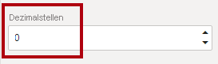

## **Übung 3: Überprüfen der Benutzeroberfläche des Modells**

In dieser Übung wechseln Sie zur Berichtsansicht und überprüfen die Benutzeroberfläche des Modells.

### **Aufgabe 1: Überprüfen der Benutzeroberfläche des Modells**

In dieser Aufgabe wechseln Sie zur Berichtsansicht und überprüfen die Benutzeroberfläche des Modells.

1. Wechseln Sie zur Ansicht „Bericht“.

2. Sehen Sie sich im Bereich **Felder** Folgendes an:

    - Spalten, Hierarchien und die zugehörigen Ebenen sind Felder, die zum Konfigurieren von Berichtsvisuals verwendet werden können.

    - Nur Felder, die für die Berichterstellung relevant sind, werden angezeigt.

    - Die Tabelle **SalespersonRegion** wird nicht angezeigt, da alle zugehörigen Felder ausgeblendet sind.

    - Felder mit räumlichen Daten in den Tabellen **Region** und **Reseller** werden mit einem entsprechenden Symbol hervorgehoben.

    - Felder mit dem Sigmasymbol (Ʃ) werden standardmäßig zusammengefasst.

    - Wenn der Cursor über das Feld **Sales \| Cost** bewegt wird, wird eine QuickInfo angezeigt.

3. Erweitern Sie das Feld **Sales \| OrderDate**. Daraufhin wird eine Datumshierarchie angezeigt.

    

    *Das Feld **Targets \| TargetMonth** bietet eine ähnliche Hierarchie. Diese Hierarchien wurden nicht von Ihnen erstellt. Sie wurden automatisch erstellt. Es gibt jedoch ein Problem. Das Finanzjahr von Adventure Works beginnt am 1. Juli jedes Jahres. Diese automatisch erstellten Datumshierarchien beginnen jedoch am 1. Januar jedes Jahres.*

    *Im Folgenden deaktivieren Sie dieses automatische Verhalten. Im Lab **Erstellen von DAX-Berechnungen in Power BI Desktop, Teil 1** erstellen Sie mit DAX eine Datumstabelle und konfigurieren sie so, dass sie dem Adventure Works-Kalender entspricht.*

4. Klicken Sie zum Deaktivieren der automatischen Datums-/Uhrzeitfunktion im Menüband auf die Registerkarte **Datei**, um die Backstage-Ansicht zu öffnen.

5. Klicken Sie links auf **Optionen und Einstellungen**, und wählen Sie dann **Optionen** aus.

    

6. Klicken Sie links im Fenster **Optionen** in der Gruppe **Aktuelle Datei** auf **Daten laden**.

    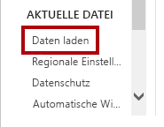

7. Deaktivieren Sie im Abschnitt **Zeitintelligenz** die Option **Autom. Datum/Uhrzeit**.

    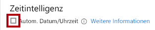

8. Klicken Sie auf **OK**.

    

9. Beachten Sie, dass die Datumshierarchien im Bereich **Felder** nicht mehr verfügbar sind.

    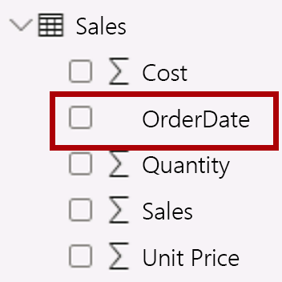

### **Aufgabe 2: Abschluss**

Mit dieser Aufgabe schließen Sie das Lab ab.

1. Speichern Sie die Power BI Desktop-Datei.

2. Wenn Sie aufgefordert werden, die Abfragen anzuwenden, wählen Sie **Später übernehmen** aus.

3. Wenn Sie beabsichtigen, das nächste Lab zu starten, lassen Sie Power BI Desktop geöffnet.

    *Sie werden das Datenmodell im Lab **Modellieren von Daten in Power BI Desktop, Teil 2** verbessern, indem Sie eine m:n-Beziehung und Sicherheit auf Zeilenebene konfigurieren.*
