---
lab:
  title: Entwerfen eines Berichts in Power BI Desktop, Teil 1
  module: Module 7 - Create Reports
ms.openlocfilehash: 9aa794d25d2eb2ec611315a7ec6ac472e9a3a141
ms.sourcegitcommit: 3520e7d016e94549d408464207c1b91cd47867c2
ms.translationtype: HT
ms.contentlocale: de-DE
ms.lasthandoff: 03/05/2022
ms.locfileid: "139839528"
---
# **Entwerfen eines Berichts in Power BI Desktop, Teil 1**

**Die geschätzte Dauer dieses Labs beträgt 45 Minuten.**

In diesem Lab erstellen Sie einen dreiseitigen Bericht. Danach veröffentlichen Sie ihn in Power BI, um ihn anschließend zu öffnen und mit ihm zu interagieren.

In diesem Lab lernen Sie Folgendes:

- Entwerfen eines Berichts

- Konfigurieren von Feldern und Formatierungseigenschaften für Visuals

### **Labszenario**

Dieses Lab ist eines von vielen in einer Reihe von Labs, die als fortlaufendes Szenario von der Datenvorbereitung bis zur Veröffentlichung als Berichte und Dashboards entworfen wurde. Sie können die Labs in beliebiger Reihenfolge abschließen. Wenn Sie jedoch beabsichtigen, mehrere Labs durchzuarbeiten, sollten Sie die ersten zehn Labs in der folgenden Reihenfolge absolvieren:

1. Vorbereiten von Daten in Power BI Desktop

2. Laden von Daten in Power BI Desktop

3. Modellieren von Daten in Power BI Desktop

5. Erstellen von DAX-Berechnungen in Power BI Desktop, Teil 1

6. Erstellen von DAX-Berechnungen in Power BI Desktop, Teil 2

7. **Entwerfen eines Berichts in Power BI Desktop, Teil 1**

8. Entwerfen eines Berichts in Power BI Desktop, Teil 2

9. Erstellen eines Power BI-Dashboards

10. Analysieren von Daten in Power BI Desktop

11. Erzwingen von Sicherheit auf Zeilenebene

## **Übung 1: Erstellen eines Berichts**

In dieser Übung erstellen Sie einen dreiseitigen Bericht mit dem Namen **Sales Report** (Verkaufsbericht).

### **Aufgabe 1: Erste Schritte – Anmelden**

In dieser Aufgabe richten Sie die Umgebung für das Lab ein, indem Sie sich bei Power BI anmelden.

*Wichtig: Wenn Sie sich bereits bei Power BI angemeldet haben, fahren Sie mit der nächsten Aufgabe fort.*

1. Klicken Sie zum Öffnen von Microsoft Edge auf der Taskleiste auf die Programmverknüpfung für Microsoft Edge.

    

1. Navigieren Sie im Browserfenster von Microsoft Edge zu **https://powerbi.com**.

    *Tipp: Sie können auch auf der Favoritenleiste von Microsoft Edge die Option für den Power BI-Dienst verwenden.*

1. Klicken Sie auf **Anmelden** (in der rechten oberen Ecke).

    

1. Geben Sie die für Sie bereitgestellten Kontodetails ein (siehe **Ressourcen**).

1. Wenn Sie aufgefordert werden, das Kennwort zu aktualisieren, geben Sie das bereitgestellte Kennwort erneut ein, und geben Sie dann das neue Kennwort zweimal zur Bestätigung ein.

    *Wichtig: Denken Sie daran, sich das neue Kennwort zu notieren.*

1. Schließen Sie den Anmeldevorgang ab.

1. Wenn Sie von Microsoft Edge gefragt werden, ob Sie angemeldet bleiben möchten, klicken Sie auf **Ja**.

1. Lassen Sie das Browserfenster von Microsoft Edge geöffnet.

### **Aufgabe 2: Erste Schritte – Aktivieren von Karten- und Flächenkartogrammvisuals**

In dieser Aufgabe aktivieren Sie Karten- und Flächenkartogrammvisuals in der Umgebung für das Lab, indem Sie die Integrationseinstellungen im Verwaltungsportal von Power BI aktualisieren. 

1. Um das Verwaltungsportal von Power BI zu öffnen, klicken Sie rechts oben im Browser auf das Symbol **Einstellungen**.

    

1. Wählen Sie **Verwaltungsportal** aus.

    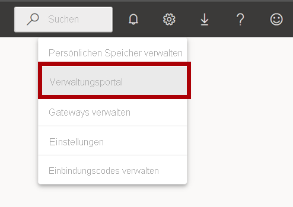

1. Scrollen Sie auf der Seite nach unten zu den Integrationseinstellungen. Klicken Sie auf den Pfeil, um die Option für Karten- und Flächenkartogrammvisuals zu erweitern.

    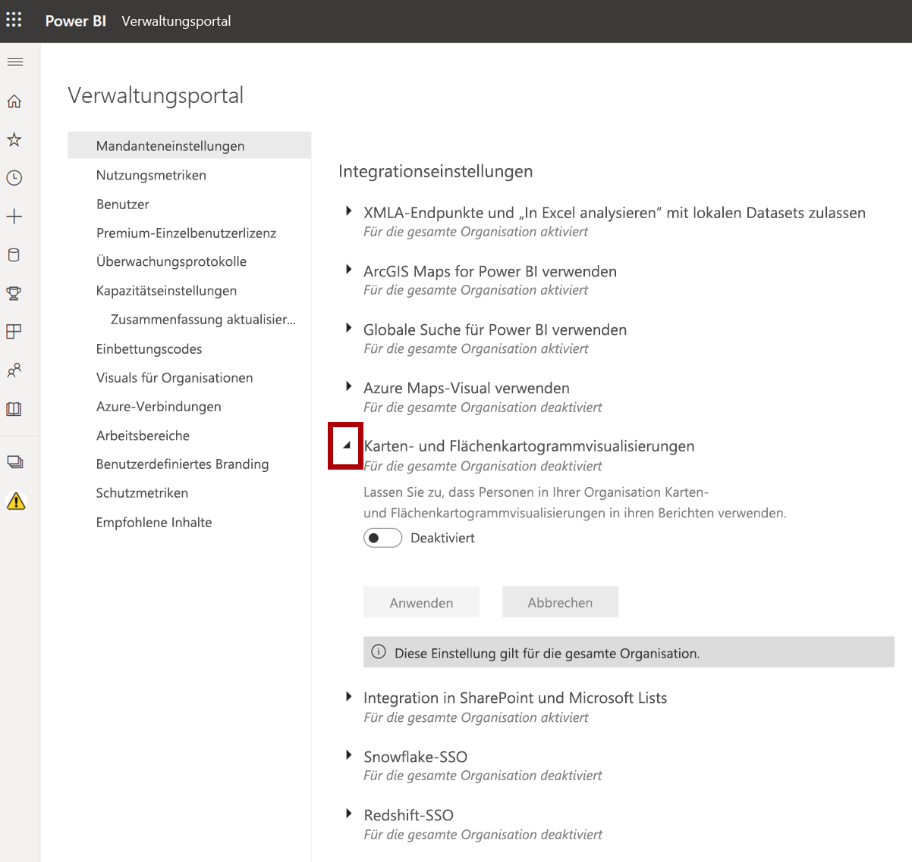

1. Legen Sie die Option für Karten- und Flächenkartogrammvisuals auf **Aktiviert** fest.

1. Klicken Sie auf **Übernehmen**, um die Änderungen anzuwenden. 

    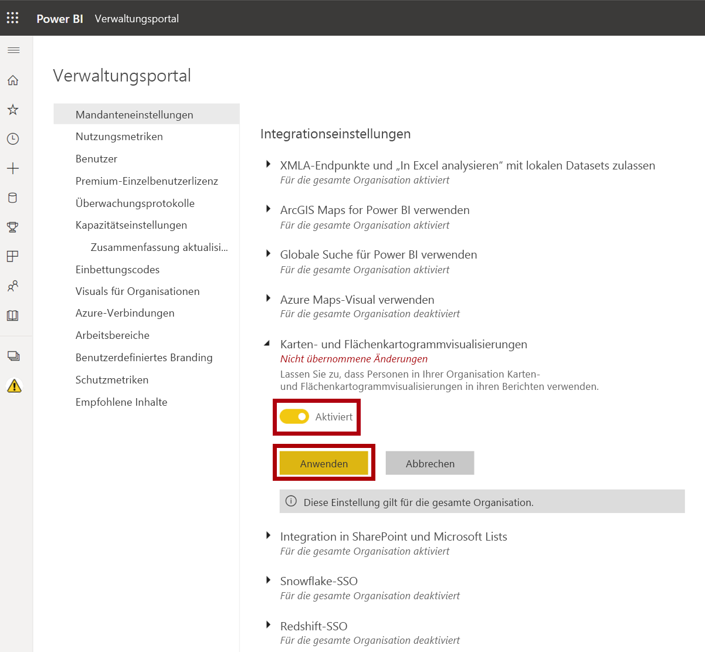

1. Rechts oben im Browser wird eine Meldung mit dem Hinweis angezeigt, dass die Änderungen an den Mandanteneinstellungen innerhalb der nächsten 15 Minuten angewandt werden. 

    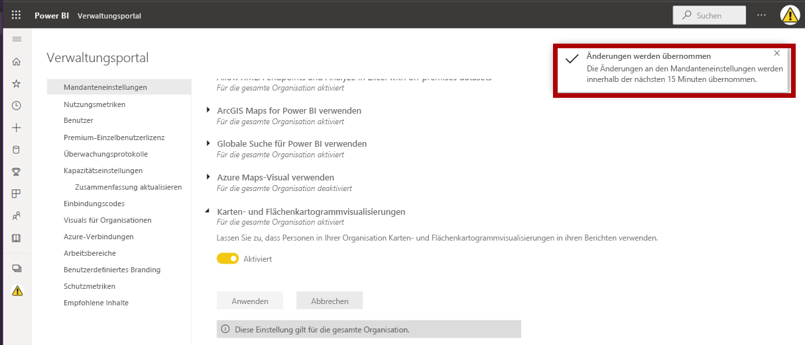

1. Lassen Sie das Browserfenster von Microsoft Edge geöffnet.

### **Aufgabe 3: Erste Schritte – Öffnen des Berichts**

In dieser Aufgabe richten Sie die Umgebung für das Lab ein, indem Sie den Starterbericht öffnen.

*Wichtig: Wenn Sie nach einem vorherigen Lab fortfahren (und dieses Lab erfolgreich abgeschlossen haben), überspringen Sie diese Aufgabe und fahren mit der nächsten fort.*

1. Klicken Sie zum Öffnen von Power BI Desktop auf der Taskleiste auf die Verknüpfung „Microsoft Power BI Desktop“.

    

2. Um das Fenster „Erste Schritte“ zu schließen, klicken Sie links oben im Fenster auf das **X**.

    

3. Klicken Sie rechts oben auf **Anmelden**, um sich beim Power BI-Dienst anzumelden.

    

4. Schließen Sie den Anmeldevorgang mit demselben Konto ab, das Sie für die Anmeldung beim Power BI-Dienst verwendet haben.

5. Um die Startdatei für Power BI Desktop zu öffnen, klicken Sie auf die Registerkarte **Datei** des Menübands, um die Backstage-Ansicht zu öffnen.

6. Wählen Sie **Bericht öffnen** aus.

    

7. Klicken Sie auf **Berichte durchsuchen**.

    

8. Navigieren Sie im Fenster **Öffnen** zum Ordner **D:\PL300\Labs\07-design-report-in-power-bi-desktop\Starter**.

9. Wählen Sie die Datei **Sales Analysis** aus.

10. Klicken Sie auf **Öffnen**.

    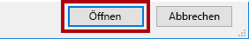

11. Schließen Sie alle Informationsfenster, die möglicherweise geöffnet werden.

12. Um eine Kopie der Datei zu erstellen, klicken Sie auf die Registerkarte **Datei** des Menübands, um die Backstage-Ansicht zu öffnen.

13. Wählen Sie **Speichern unter** aus.

    

14. Wenn Sie aufgefordert werden, die Abfragen anzuwenden, klicken Sie auf **Anwenden**.

    

15. Navigieren Sie im Fenster **Speichern unter** zum Ordner **D:\PL300\MySolution**.

16. Klicken Sie auf **Speichern**.

    

### **Aufgabe 4: Entwerfen der ersten Seite**

In dieser Aufgabe wird die erste Berichtsseite entworfen. Nach der Fertigstellung des Entwurfs sieht die Seite wie folgt aus:

1. Klicken Sie in Power BI Desktop zum Umbenennen der Seite links unten mit der rechten Maustaste auf **Seite 1**, und wählen Sie dann **Umbenennen** aus.

    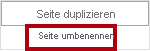

    *Tipp: Sie können auch auf den Seitennamen doppelklicken, um die Seite umzubenennen.*

2. Benennen Sie die Seite in **Overview** (Übersicht) um, und drücken Sie die **EINGABETASTE**.

    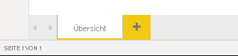

3. Klicken Sie zum Hinzufügen eines Bilds auf der Registerkarte **Einfügen** des Menübands in der Gruppe **Elemente** auf **Bild**.

    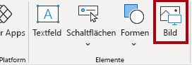

4. Navigieren Sie im Fenster **Öffnen** zum Ordner **D:\PL300\Resources**.

5. Wählen Sie die Datei **AdventureWorksLogo.jpg** aus, und klicken Sie anschließend auf **Öffnen**.

    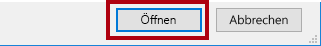

6. Ziehen Sie das Bild, um es in der linken oberen Ecke zu positionieren, und ziehen Sie auch die Führungslinienmarkierungen, um die Größe zu ändern.

    

7. Heben Sie zum Hinzufügen eines Datenschnitts zunächst die Auswahl des Bilds auf, indem Sie auf einen leeren Bereich der Berichtsseite klicken.
8. Wählen Sie im Bereich **Felder** das Feld **Date \| Year** aus (nicht die Ebene **Year** der Hierarchie).
    
    *In den Labs wird eine verkürzte Notation verwendet, um auf ein Feld zu verweisen. Das sieht folgendermaßen aus: **Date \| Year**. In diesem Beispiel ist **Date** der Tabellenname und **Year** der Feldname.*

9. Wie Sie sehen, wurde der Berichtsseite eine Tabelle mit Jahreswerten hinzugefügt.

10. Wenn Sie das Visual von einer Tabelle in einen Datenschnitt konvertieren möchten, wählen Sie im Bereich **Visualisierungen** die Option **Datenschnitt** aus.

    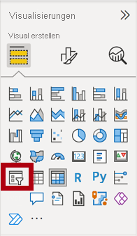

11. Wenn Sie den Datenschnitt von einer Liste in ein Dropdownfeld konvertieren möchten, klicken Sie in der rechten oberen Ecke des Datenschnitts auf den Abwärtspfeil, und wählen Sie **Dropdown** aus.

    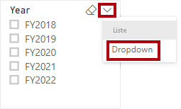

12. Ändern Sie Größe und Position des Slicers so, dass er sich unter dem Bild befindet und die gleiche Breite wie das Bild hat.

    

13. Öffnen Sie die Dropdownliste im Slicer **Year**, wählen Sie **FY2020** aus, und klappen Sie die Dropdownliste dann zu.

    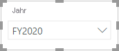

    *Die Berichtsseite wird nun nach dem Jahr **FY2020** gefiltert.*

14. Heben Sie die Auswahl des Datenschnitts auf, indem Sie auf einen leeren Bereich der Berichtsseite klicken.

15. Erstellen Sie einen zweiten Slicer auf der Grundlage des Felds **Region \| Region** (nicht auf der Grundlage der Hierarchieebene **Region**).

16. Behalten Sie das Listenformat des Slicers bei, und ändern Sie Größe und Position so, dass sich der Slicer unter dem Slicer **Year** befindet.

    

17. Öffnen Sie zum Formatieren des Datenschnitts unter dem Bereich **Visualisierungen** den Bereich **Format**.

    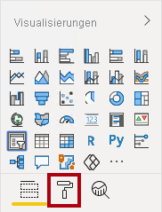

18. Erweitern Sie dann die Gruppe **Selection Controls** (Auswahlsteuerelemente).

    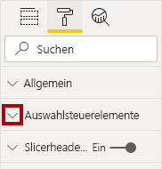

19. Legen Sie **Option „Alles auswählen“ anzeigen** auf **Ein** fest.

    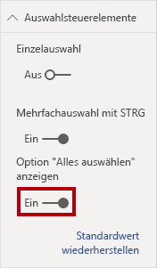

20. Wie Sie sehen, ist das erste Element im Datenschnitt **Region** jetzt **Alles auswählen**.

    *Wenn diese Option ausgewählt ist, werden entweder alle Elemente ausgewählt, oder die Auswahl aller Elemente wird aufgehoben. Dadurch können Berichtsbenutzer*innen einfacher die passenden Filter festlegen.*

21. Heben Sie die Auswahl des Datenschnitts auf, indem Sie auf einen leeren Bereich der Berichtsseite klicken.

22. Klicken Sie im Bereich **Visualisierungen** auf den Visualtyp **Linien- und gestapeltes Säulendiagramm**, um der Seite ein Diagramm hinzuzufügen.

    

23. Ändern Sie Größe und Position des Visuals so, dass es sich rechts neben dem Logo befindet und über die Breite der Berichtsseite erstreckt.

    

24. Ziehen Sie die folgenden Felder per Drag & Drop in das Visual:

    - Date \| Month

    - Sales \| Sales

25. Im Feldbereich des Visuals (nicht im Bereich **Felder**; der Feldbereich des Visuals befindet sich unter dem Bereich **Visualisierungen**) sehen Sie, dass die Felder den Bereichen **Gemeinsame Achse** und **Spaltenwerte** zugewiesen sind.

    

    *Wenn Sie Felder in ein Visual ziehen, werden sie den Standardbereichen hinzugefügt. Sie können Felder wie im nächsten Schritt auch direkt in die Bereiche ziehen, um eine höhere Genauigkeit zu erzielen.*

26. Ziehen Sie im Bereich **Felder** das Feld **Sales \| Profit Margin** in den Bereich **Zeilenwerte**.

    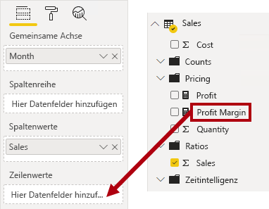

27. Beachten Sie, dass das Visual nur 11 Monate umfasst.

    *Für den letzten Monat des Jahres (Juni 2020) liegen noch keine Verkäufe vor. Monate OHNE Verkaufszahlen werden vom Visual standardmäßig entfernt. Im nächsten Schritt wird das Visual so konfiguriert, dass alle Monate angezeigt werden.*

28. Klicken Sie im Feldbereich des Visuals im Bereich **Gemeinsame Achse** für das Feld **Month** auf den Pfeil nach unten, und wählen Sie **Elemente ohne Daten anzeigen** aus.

    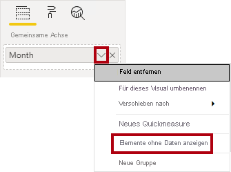

29. Wie Sie sehen, wird der Monat **2020 June** (Juni 2020) nun angezeigt.

30. Heben Sie die Auswahl des Diagramms auf, indem Sie auf einen leeren Bereich der Berichtsseite klicken.

31. Klicken Sie im Bereich **Visualisierungen** auf den Visualtyp **Karte**, um der Seite ein Diagramm hinzuzufügen.

    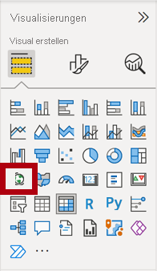

32. Ändern Sie Größe und Position des Visuals so, dass es sich unter dem Säulen-/Liniendiagramm befindet und die halbe Breite des darüber liegenden Diagramms einnimmt.

    

33. Fügen Sie den Visualbereichen die folgenden Felder hinzu:

    - Standort: **Region \| Country**

    - Legende: **Product \| Category**

    - Größe: **Sales \| Sales**

34. Heben Sie die Auswahl des Diagramms auf, indem Sie auf einen leeren Bereich der Berichtsseite klicken.

35. Klicken Sie im Bereich **Visualisierungen** auf den Visualtyp **Gestapeltes Balkendiagramm**, um der Seite ein Diagramm hinzuzufügen.

    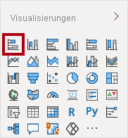

36. Ändern Sie Größe und Position des Visuals so, dass es die restliche Berichtsseite ausfüllt.

    

37. Fügen Sie den Visualbereichen die folgenden Felder hinzu:

    - Achse: **Product \| Category**

    - Wert: **Sales \| Quantity**

38. Öffnen Sie zum Formatieren des Visuals den Bereich **Format**.

    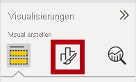

39. Erweitern Sie die Gruppe **Datenfarben**, und legen Sie die Eigenschaft **Standardfarbe** auf eine geeignete Farbe fest (als Kontrast zum Säulen-/Liniendiagramm).

40. Legen Sie die Eigenschaft **Datenbeschriftungen** auf **Ein** fest.

    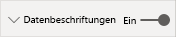

41. Speichern Sie die Power BI Desktop-Datei.

    *Damit ist der Entwurf der ersten Seite fertig.*

### **Aufgabe 5: Entwerfen der zweiten Seite**

In dieser Aufgabe wird die zweite Berichtsseite entworfen. Nach der Fertigstellung des Entwurfs sieht die Seite wie folgt aus:

*Wichtig: Da in den Labs bereits ausführliche Anweisungen bereitgestellt wurden, enthalten die folgenden Schritte zum Lab kurzgefasste Anweisungen. Wenn Sie die ausführlichen Anweisungen benötigen, können Sie zu den anderen Aufgaben in diesem Lab zurückkehren.*

1. Klicken Sie zum Erstellen einer neuen Seite links unten auf das Plussymbol.

    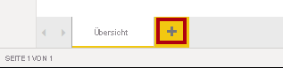

2. Benennen Sie die Seite in **Profit** (Gewinn) um.

    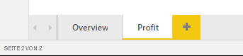

  
‎ 

3. Fügen Sie einen auf dem Feld **Region \| Region** basierenden Slicer hinzu.

4. Verwenden Sie den Bereich **Format**, um die Option „Alles auswählen“ zu aktivieren (in der Gruppe **Selection Controls** (Auswahlsteuerelemente)).

5. Ändern Sie die Größe und Position des Slicers so, dass er sich auf der linken Seite der Berichtsseite befindet und etwa die Hälfte der Seitenhöhe einnimmt.

    

6. Fügen Sie ein Matrixvisual hinzu, und ändern Sie seine Größe und Position so, dass es den restlichen Bereich der Berichtsseite einnimmt.

    

7. Fügen Sie dem Matrixbereich **Zeilen** die Hierarchie **Date \| Fiscal** hinzu.

    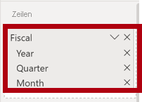

8. Fügen Sie dem Bereich **Werte** die folgenden fünf Felder der Tabelle **Sales** hinzu:

    - „Orders“ (Bestellungen) (aus dem Ordner **Counts** (Anzahl))

    - „Sales“ (Umsatz)

    - „Cost“ (Kosten)

    - „Profit“ (Gewinn)

    - Profit Margin

    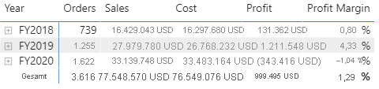

9. Beachten Sie im Bereich **Filter** (auf der linken Seite des Bereichs **Visualisierungen**) den Bereich **Filter für diese Seite**. (Hierzu müssen Sie möglicherweise nach unten scrollen.)

    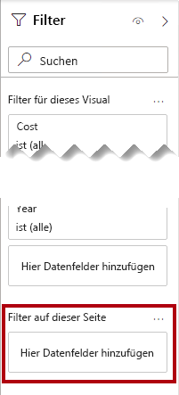

10. Ziehen Sie das Feld **Product \| Category** aus dem Bereich **Felder** in den Bereich **Filter für diese Seite**.

11. Klicken Sie rechts oben auf der Filterkarte auf den Pfeil, um die Karte zuzuklappen.

    

    *Mit Feldern, die dem Bereich **Filter** hinzugefügt werden, kann das gleiche Ergebnis erzielt werden wie mit einem Slicer. Ein Unterschied besteht darin, dass sie keinen Platz auf der Berichtsseite beanspruchen. Ein weiterer Unterschied besteht darin, dass sie für erweiterte Filteranforderungen konfiguriert werden können.*

12. Fügen Sie dem Bereich **Filter für diese Seite** die folgenden Felder der Tabelle **Product** hinzu, und reduzieren Sie sie jeweils (direkt unterhalb der Karte **Kategorie**):

    - „Subcategory“ (Unterkategorie)

    - „Product“ (Produkt)

    - „Color“ (Farbe)

    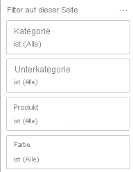

13. Speichern Sie die Power BI Desktop-Datei.

    *Damit ist der Entwurf der zweiten Seite fertig.*

### **Aufgabe 6: Entwerfen der dritten Seite**

In dieser Aufgabe wird die dritte und letzte Berichtsseite entworfen. Nach der Fertigstellung des Entwurfs sieht die Seite wie folgt aus:

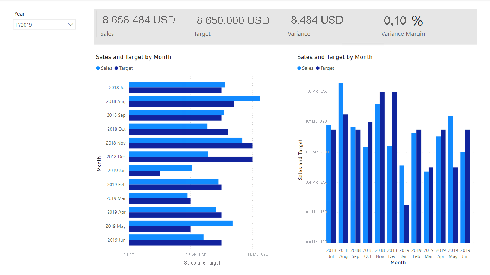

1. Erstellen Sie eine neue Seite, und benennen Sie sie in **My Performance** (Meine Leistung) um.

1. Um die Leistung von Filtern für die Sicherheit auf Zeilenebene zu simulieren, ziehen Sie das Feld **Salesperson (Performance) \| Salesperson** in die Filter auf Seitenebene im Filterbereich.
    
    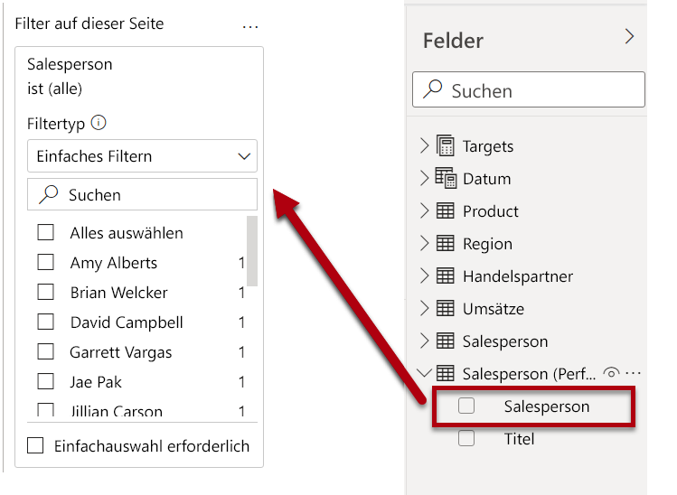 

1. Wählen Sie **Michael Blythe** aus. Die Daten auf der Berichtsseite **My Performance** (Meine Leistung) werden jetzt gefiltert, um nur Daten für Michael Blythe anzuzeigen.

1. Fügen Sie einen auf dem Feld **Date \| Year** basierenden Dropdown-Slicer hinzu, und ändern Sie Größe und Position so, dass er sich in der linken oberen Ecke der Seite befindet.

    

1. Legen Sie im Slicer die Seite so fest, dass Sie nach **FY2019** gefiltert wird.

    

1. Fügen Sie ein Visual vom Typ **Mehrzeilige Zuordnung** hinzu, und ändern Sie Größe und Position so, dass es sich rechts von der Schaltfläche befindet und die restliche Breite der Seite einnimmt.

    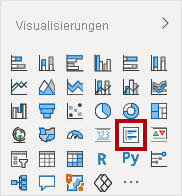

    

1. Fügen Sie dem Visual die folgenden vier Felder hinzu:

    - Sales \| Sales

    - Targets \| Target

    - Targets \| Variance

    - Targets \| Variance Margin

1. Formatieren Sie das Visual:

    - Erhöhen Sie in der Gruppe **Datenbeschriftungen** die Eigenschaft **Textgröße** auf **28 pt**.

    - Legen Sie in der Gruppe **Hintergrund** die Option **Farbe** auf ein helles Grau fest.

    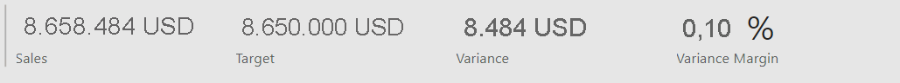

1. Fügen Sie ein Visual vom Typ **Balkendiagramm (gruppiert)** hinzu, und ändern Sie Größe und Position so, dass es sich unter dem Visual „Mehrzeilige Zuordnung“ befindet und die restliche Höhe der Seite sowie die Hälfte der Breite des Visuals „Mehrzeilige Zuordnung“ einnimmt.

    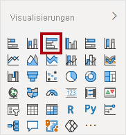

    

1. Fügen Sie den Visualbereichen die folgenden Felder hinzu:

    - Achse: **Date \| Month**

    - Wert: **Sales \| Sales** und **Targets \| Target**

    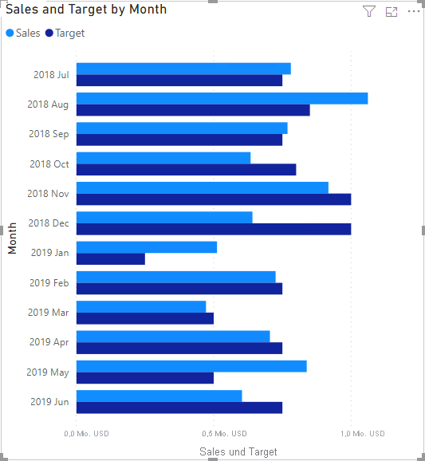

1. Drücken Sie **STRG+C**, um das Visual zu kopieren, und drücken Sie anschließend **STRG+V**.

1. Positionieren Sie das neue Visual rechts neben dem ursprünglichen Visual.

    

1. Wählen Sie zum Ändern des Visualisierungstyps im Bereich **Visualisierungen** die Option **Säulendiagramm (gruppiert)** aus.

    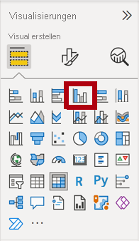

    *Nun werden die gleichen Daten mit zwei verschiedenen Visualisierungstypen dargestellt. Das ist keine gute Verwendung des Seitenlayouts, aber Sie werden dies im Lab **Entwerfen eines Berichts in Power BI Desktop, Teil 2** verbessern, indem Sie die Visuals überlagern. Wenn Sie der Seite Schaltflächen hinzufügen, können die Berichtsbenutzer*innen bestimmen, welches der beiden Visuals sichtbar ist.*

    *Damit ist der Entwurf der dritten und letzten Seite fertig.*

### **Aufgabe 7: Veröffentlichen des Berichts**

In dieser Aufgabe wird der Bericht veröffentlicht.

1. Wählen Sie die Seite **Übersicht** aus.

2. Speichern Sie die Power BI Desktop-Datei.

3. Klicken Sie auf der Registerkarte **Start** des Menübands innerhalb der Gruppe **Freigeben** auf **Veröffentlichen**.

    

4. Beachten Sie, dass im Fenster **In Power BI veröffentlichen** die Option **Mein Arbeitsbereich** ausgewählt ist.

5. Klicken Sie auf **Auswählen**, um den Bericht zu veröffentlichen.

    

6. Klicken Sie nach erfolgreicher Veröffentlichung auf **Verstanden**.

    

7. Lassen Sie Power BI Desktop geöffnet.

    *In der nächsten Übung untersuchen Sie den Bericht im Power BI-Dienst.*

## **Übung 2: Erkunden des Berichts**

In dieser Übung untersuchen Sie den Bericht, der in Power BI veröffentlicht wurde.

### **Aufgabe 1: Untersuchen des Berichts**

In dieser Aufgabe untersuchen Sie den Bericht, der in Power BI veröffentlicht wurde.

1. Erweitern Sie im Browserfenster von Microsoft Edge im Power BI-Dienst im Bereich **Navigation** (auf der linken Seite, möglicherweise ist der Bereich zugeklappt) die Option **Mein Arbeitsbereich**.

    

2. Überprüfen Sie die Inhalte des Arbeitsbereichs, und beachten Sie dabei den Bericht **Sales Analysis** und das Dataset.

    *Wenn Sie die Power BI Desktop-Datei veröffentlicht haben, wurde das Datenmodell als Dataset veröffentlicht.*

    *Sollte es nicht angezeigt werden, drücken Sie **F5**, um den Browser zu aktualisieren, und erweitern Sie den Arbeitsbereich noch einmal.*

    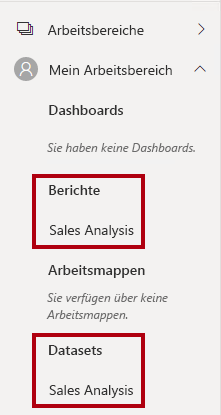

3. Klicken Sie auf den Bericht **Sales Analysis**, um den Bericht zu öffnen.

4. Wählen Sie links im Bereich **Seiten** die Seite **Overview** aus. 

5. Wählen Sie im Datenschnitt **Regions** (Regionen) mehrere Regionen aus, und halten Sie dabei **STRG** gedrückt.

6. Wählen Sie im Säulen-/Liniendiagramm eine beliebige Monatsspalte aus, um eine Kreuzfilterung der Seite durchzuführen.

7. Wählen Sie einen zusätzlichen Monat aus, und halten Sie dabei **STRG** gedrückt.

    *Bei der Kreuzfilterung werden standardmäßig alle anderen Visuals auf der Seite gefiltert.*

8. Wie Sie sehen, wird das Balkendiagramm gefiltert und hervorgehoben. Der fett formatierte Teil der Balken stellt dabei die gefilterten Monate dar.

9. Zeigen Sie mit dem Cursor auf das Visual mit dem Balkendiagramm und anschließend rechts oben auf das Filtersymbol.

    

    *Über das Filtersymbol können Sie nachvollziehen, welche Filter auf das Visual angewendet wurden (einschließlich Datenschnitte und Kreuzfilterungen von anderen Visuals).*

10. Zeigen Sie mit dem Mauszeiger auf einen Balken, und sehen Sie sich die QuickInfo an.

11. Klicken Sie zum Rückgängigmachen der Kreuzfilterung im Säulen-/Liniendiagramm auf einen leeren Bereich des Visuals.

12. Zeigen Sie mit dem Cursor auf das Kartenvisual, und klicken Sie anschließend rechts oben auf das Symbol für den **Fokusmodus**.

    

    *Im Fokusmodus wird das Visual auf die volle Seitengröße vergrößert.*

13. Zeigen Sie mit dem Cursor auf verschiedene Segmente der Balkendiagramme, um QuickInfos anzuzeigen.

14. Klicken Sie links oben auf **Zurück zum Bericht**, um zur Berichtsseite zurückzukehren.

    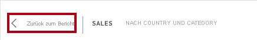

15. Zeigen Sie mit dem Cursor erneut auf das Kartenvisual, und klicken Sie dann rechts oben auf die Auslassungspunkte (...). Sehen Sie sich die Menüoptionen an.

    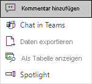

16. Testen Sie die einzelnen Optionen mit Ausnahme von **In Teams chatten**.

17. Wählen Sie links im Bereich **Seiten** die Seite **Profit** (Gewinn) aus.

    

18. Beachten Sie, dass der Slicer **Region** über eine andere Auswahl als der Slicer **Region** auf der Seite **Übersicht** verfügt.

    *Die Slicer werden nicht synchronisiert. Sie ändern den Berichtsentwurf im Lab **Entwerfen eines Berichts in Power BI Desktop, Teil 2**, um sicherzustellen, dass eine Synchronisierung zwischen den Seiten erfolgt.*

19. Erweitern Sie im Bereich **Filter** (rechts) eine Filterkarte, und wenden Sie einige Filter an.

    *Im Bereich **Filter** können Sie mehr Filter definieren als in Form von Slicern auf eine Seite passen.*

20. Verwenden Sie im Matrixvisual die Plusschaltfläche (+), um die Hierarchie **Geschäftskalender** zu erweitern.

21. Wählen Sie die Seite **My Performance** (Meine Leistung) aus.

    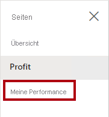

22. Klicken Sie rechts oben auf der Menüleiste auf **Ansicht**, und wählen Sie dann **Vollbild** aus.

    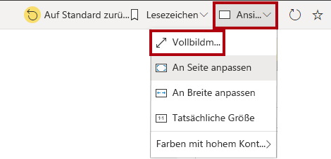

23. Interagieren Sie mit der Seite, indem Sie den Datenschnitt ändern und eine Kreuzfilterung der Seite durchführen.

24. Beachten Sie links unten auf dem Fenster die Befehle zum Ändern der Seite, zum Navigieren zwischen Seiten sowie zum Beenden des Vollbildmodus.

25. Klicken Sie auf das linke Symbol, um den Vollbildmodus zu beenden.

    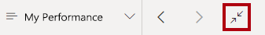

### **Aufgabe 2: Abschluss**

Mit dieser Aufgabe schließen Sie das Lab ab.

1. Klicken Sie auf dem Banner auf der Fensterwebseite auf **Mein Arbeitsbereich**, um zurück zu Ihrem Arbeitsbereich zu navigieren.

    

2. Lassen Sie das Browserfenster von Microsoft Edge geöffnet.

    *Sie erweitern den Berichtsentwurf um erweiterte Features im Lab **Entwerfen eines Berichts in Power BI Desktop, Teil 2**.*
