---
lab:
  title: "Entwerfen eines Berichts in Power\_BI Desktop, Teil\_2"
  module: Module 7 - Create Reports
---

# **Entwerfen eines Berichts in Power BI Desktop, Teil 2**

**Die geschätzte Dauer dieses Labs beträgt 45 Minuten.**

In diesem Lab optimieren Sie die Verkaufsanalyse **Sales Analysis** mit erweiterten Entwurfsfunktionen.

In diesem Lab lernen Sie Folgendes:

- Synchronisieren von Slicers

- Erstellen einer Drillthroughseite

- Anwenden von bedingter Formatierung

- Erstellen und Verwenden von Lesezeichen

### **Labszenario**

This lab is one of many in a series of labs that was designed as a complete story from data preparation to publication as reports and dashboards. You can complete the labs in any order. However, if you intend to work through multiple labs, for the first 10 labs, we suggest you do them in the following order:

1. Vorbereiten von Daten in Power BI Desktop

2. Laden von Daten in Power BI Desktop

3. Modellieren von Daten in Power BI Desktop

5. Erstellen von DAX-Berechnungen in Power BI Desktop, Teil 1

6. Erstellen von DAX-Berechnungen in Power BI Desktop, Teil 2

7. Entwerfen eines Berichts in Power BI Desktop, Teil 1

8. **Entwerfen eines Berichts in Power BI Desktop, Teil 2**

9. Erstellen eines Power BI-Dashboards

10. Analysieren von Daten in Power BI Desktop

11. Erzwingen von Sicherheit auf Zeilenebene

## **Übung 1: Konfigurieren von Synchronisierungsslicern**

In dieser Übung synchronisieren Sie die Slicer auf der Berichtsseite.

### Aufgabe 1: Erste Schritte – Anmelden

In dieser Aufgabe richten Sie die Umgebung für das Lab ein, indem Sie sich bei Power BI anmelden.

*Wichtig: Wenn Sie sich bereits bei Power BI angemeldet haben, fahren Sie mit der nächsten Aufgabe fort.*

1. Klicken Sie zum Öffnen von Microsoft Edge auf der Taskleiste auf die Programmverknüpfung für Microsoft Edge.

    

1. Navigieren Sie im Browserfenster von Microsoft Edge zu **https://powerbi.com**.

    *Tipp: Sie können auch auf der Favoritenleiste von Microsoft Edge die Option für den Power BI-Dienst verwenden.*

1. Klicken Sie auf **Anmelden** (in der rechten oberen Ecke).

    

1. Geben Sie die Kontodaten ein, die Sie erhalten haben.

1. Wenn Sie aufgefordert werden, das Kennwort zu aktualisieren, geben Sie das bereitgestellte Kennwort erneut ein, und geben Sie dann das neue Kennwort zweimal zur Bestätigung ein.

    *Wichtig: Denken Sie daran, sich das neue Kennwort zu notieren.*

1. Schließen Sie den Anmeldevorgang ab.

1. Wenn Sie von Microsoft Edge gefragt werden, ob Sie angemeldet bleiben möchten, klicken Sie auf **Ja**.

1. Erweitern Sie im Browserfenster von Microsoft Edge im Power BI-Dienst im **Navigationsbereich** die Option **Mein Arbeitsbereich**.

    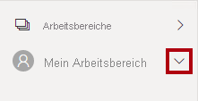

1. Lassen Sie das Browserfenster von Microsoft Edge geöffnet.

### Aufgabe 2: Erste Schritte – Öffnen des Berichts

In dieser Aufgabe richten Sie die Umgebung für das Lab ein, indem Sie den Starterbericht öffnen.

*Wichtig: Wenn Sie nach einem vorherigen Lab fortfahren (und dieses Lab erfolgreich abgeschlossen haben), überspringen Sie diese Aufgabe und fahren mit der nächsten fort.*

1. Klicken Sie zum Öffnen von Power BI Desktop auf der Taskleiste auf die Verknüpfung „Microsoft Power BI Desktop“.

    

2. Um das Fenster „Erste Schritte“ zu schließen, klicken Sie links oben im Fenster auf das **X**.

    

3. Klicken Sie rechts oben auf **Anmelden**, um sich beim Power BI-Dienst anzumelden.

    

4. Schließen Sie den Anmeldevorgang mit demselben Konto ab, das Sie für die Anmeldung beim Power BI-Dienst verwendet haben.

5. Um die Startdatei für Power BI Desktop zu öffnen, klicken Sie auf die Registerkarte **Datei** des Menübands, um die Backstage-Ansicht zu öffnen.

6. Wählen Sie **Bericht öffnen** aus.

    

7. Klicken Sie auf **Berichte durchsuchen**.

    

8. Navigieren Sie im Fenster **Öffnen** zum Ordner **D:\PL300\Labs\08-design-report-in-power-bi-desktop-enhanced\Starter**.

9. Wählen Sie die Datei **Sales Analysis** aus.

10. Klicken Sie auf **Öffnen**.

    

11. Schließen Sie alle Informationsfenster, die möglicherweise geöffnet werden.

12. Um eine Kopie der Datei zu erstellen, klicken Sie auf die Registerkarte **Datei** des Menübands, um die Backstage-Ansicht zu öffnen.

13. Wählen Sie **Speichern unter** aus.

    

14. Wenn Sie aufgefordert werden, die Abfragen anzuwenden, klicken Sie auf **Anwenden**.

    

15. Navigieren Sie im Fenster **Speichern unter** zum Ordner **D:\PL300\MySolution**.

16. Klicken Sie auf **Speichern**.

    

### **Aufgabe 3: Synchronisieren von Slicern**

Bei dieser Aufgabe synchronisieren Sie die Slicer **Year** und **Region**.

*Sie werden die Entwicklung des Berichts fortsetzen, der im Lab **Entwerfen eines Berichts in Power BI Desktop, Teil 1** erstellt wurde.*

1. Legen Sie In Power BI Desktop auf der Seite **Übersicht** den Slicer **Year** auf **FY2018** fest.

2. Wechseln Sie zur Seite **My Performance** (Meine Leistung). Sie sehen, dass der Slicer **Year** einen anderen Wert aufweist.

    *Wenn Slicer nicht synchronisiert werden, kann dies zu fehlerhaften Darstellungen von Daten und zu Frustration bei den Berichtsbenutzer*innen führen. Sie synchronisieren nun die Slicer im Bericht.*

3. Kehren Sie zur Seite **Übersicht** zurück, und wählen Sie dann den Slicer **Year** aus.

4. Klicken Sie auf der Registerkarte **Anzeigen** des Menübands in der Gruppe **Bereiche anzeigen** auf **Slicers synchronisieren**.

    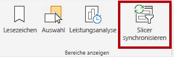

5. Aktivieren Sie im Bereich **Slicers synchronisieren** (links im Bereich **Visualisierungen**) in der zweiten Spalte (für die Synchronisierung) die Kontrollkästchen für die Seiten **Übersicht** und **My Performance** (Meine Leistung).

    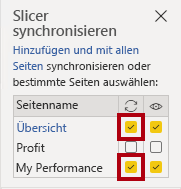

6. Wählen Sie auf der Seite **Übersicht** den Slicer **Region** aus.

7. Synchronisieren Sie den Slicer mit den Seiten **Übersicht** und **Gewinn**.

    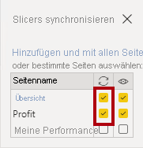

8. Testen Sie die Synchronisierungsslicer, indem Sie verschiedene Filteroptionen auswählen und dann überprüfen, ob mit den synchronisierten Slicern nach der gleichen Auswahl gefiltert wird.

9. Klicken Sie zum Schließen der Seite **Slicers synchronisieren** oben rechts im Bereich auf das **X**.

    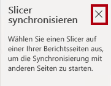

## **Übung 2: Konfigurieren eines Drillthroughs**

In this exercise you will create a new page and configure it as a drill through page. When you’ve completed the design, the page will look like the following:

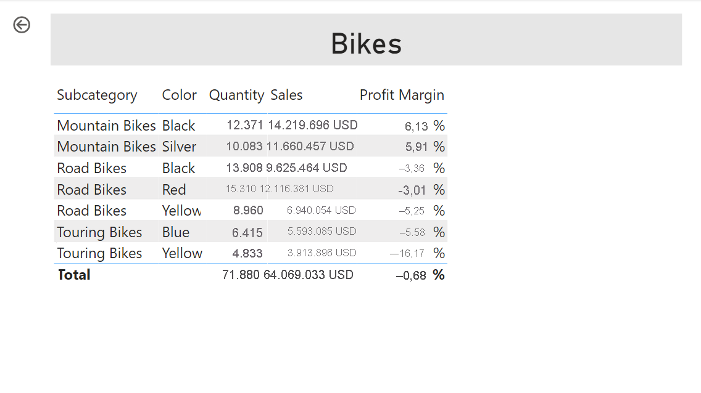

### **Aufgabe 1: Erstellen einer Drillthroughseite**

Bei dieser Aufgabe erstellen Sie eine neue Seite und konfigurieren sie als Drillthroughseite.

1. Fügen Sie eine neue Berichtsseite mit dem Namen **Produktdetails** hinzu.

    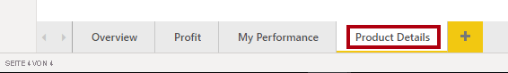

2. Klicken Sie mit der rechten Maustaste auf die Seitenregisterkarte **Produktdetails**, und wählen Sie dann die Option **Seite ausblenden** aus.

    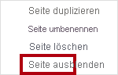

    *Berichtsbenutzer*innen können nicht direkt zur Drillthroughseite navigieren. Sie müssen über Visuals auf anderen Seiten darauf zugreifen. In der abschließenden Übung dieses Labs wird beschrieben, wie Sie den Drillthrough zur Seite durchführen.*

3. Fügen Sie unterhalb des Bereichs **Visualisierungen** im Abschnitt **Drillthrough** im Feld **Drillthroughfelder hier hinzufügen** das Feld **Product \| Category** hinzu.

    *In den Labs wird eine verkürzte Notation verwendet, um auf ein Feld zu verweisen. Das sieht folgendermaßen aus: **Product \| Category**. In diesem Beispiel ist **Product** der Tabellenname und **Category** der Feldname.*

    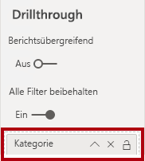

4. Wählen Sie zum Testen der Drillthroughseite auf der Drillthrough-Filterkarte die Option **Fahrräder** aus.

    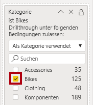

5. Beachten Sie oben links auf der Berichtsseite die Pfeilschaltfläche.

    

    *Eine Schaltfläche wird automatisch hinzugefügt, wenn dem Drillthroughbereich ein Feld hinzugefügt wird. Sie ermöglicht es Berichtsbenutzer*innen, zurück zu der Seite zu wechseln, auf der sie den Drillthrough gestartet haben.*

6. Fügen Sie der Seite das Visual **Karte** hinzu. Ändern Sie dann die Größe und Position so, dass es rechts von der Schaltfläche angeordnet ist und die restliche Breite der Seite ausfüllt.

    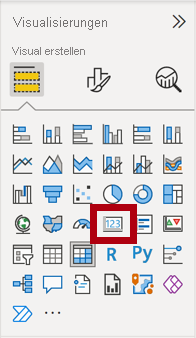

    

7. Ziehen Sie das Feld **Product \| Category** auf das Visual „Karte“.

8. Konfigurieren Sie die Formatoptionen für das Visual, und legen Sie die Eigenschaft **Kategoriebeschriftung** dann auf **Aus** fest.

    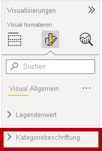

9. Legen Sie die Eigenschaft **Hintergrundfarbe** auf einen hellen Grauton fest.

10. Fügen Sie der Seite ein Visual vom Typ **Tabelle** hinzu. Ändern Sie dessen Größe und Position anschließend so, dass es unterhalb des Kartenvisuals angeordnet ist und den restlichen Platz der Seite einnimmt.

    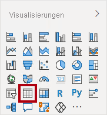

    

11. Fügen Sie dem Visual die folgenden Felder hinzu:

    - Product \| Subcategory

    - Product \| Color

    - Sales \| Quantity

    - Sales \| Sales

    - Sales \| Profit Margin

12. Konfigurieren Sie die Formatoptionen für das Visual, und legen Sie im Abschnitt **Raster** die Eigenschaft **Textgröße** auf **20 Pt** fest.

    *Der Entwurf der Drillthroughseite ist nun fast abgeschlossen. In der nächsten Übung reichern Sie die Seite mit bedingter Formatierung an.*

## **Übung 3: Hinzufügen von bedingter Formatierung**

In this exercise you will enhance the drill through page with conditional formatting. When you’ve completed the design, the page will look like the following:

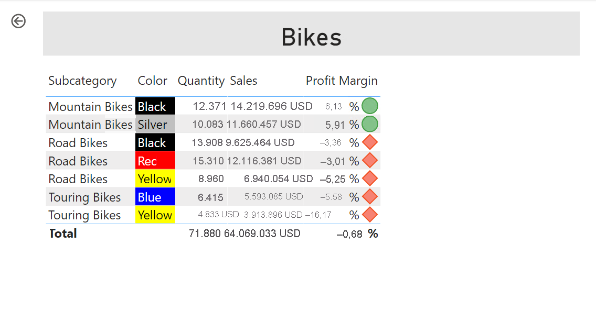

### **Aufgabe 1: Hinzufügen von bedingter Formatierung**

In dieser Aufgabe optimieren Sie die Drillthroughseite, indem Sie bedingte Formatierung hinzufügen.

1. Wählen Sie das Visual vom Typ „Tabelle“ aus.

2. Klicken Sie im Bereich „Visualisierung“ beim Wert **Profit Margin** auf den Pfeil nach unten, und wählen Sie dann **Bedingte Formatierung \| Symbole** aus.

    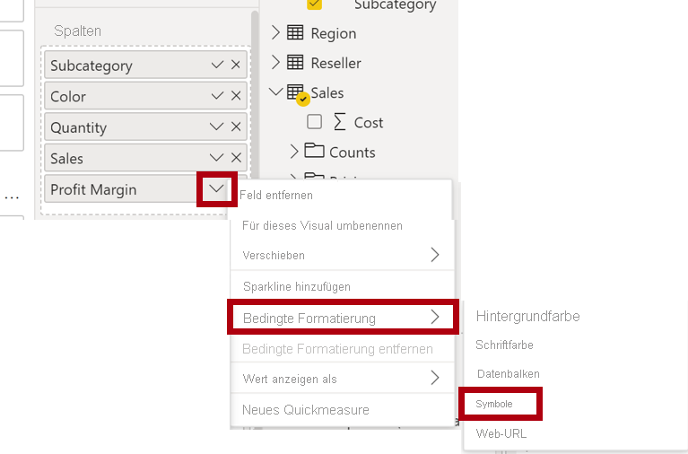

3. Wählen Sie im Fenster **Symbole – Profit Margin** in der Dropdownliste **Symbollayout** die Option **Rechts von den Daten** aus.

    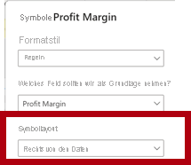

4. Klicken Sie links vom gelben Dreieck auf das **X**, um die mittlere Regel zu löschen.

    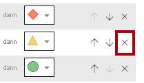

5. Konfigurieren Sie die erste Regel (rotes Karo) wie folgt:

    - Entfernen Sie im zweiten Steuerelement den Wert.

    - Wählen Sie für das dritte Steuerelement **Zahl** aus.

    - Geben Sie im fünften Steuerelement **0** ein.

    - Wählen Sie für das sechste Steuerelement **Zahl** aus.

6. Konfigurieren Sie die zweite Regel (grüner Kreis) wie folgt:

    - Geben Sie im zweiten Steuerelement **0** ein.

    - Wählen Sie für das dritte Steuerelement **Zahl** aus.

    - Entfernen Sie im fünften Steuerelement den Wert.

    - Wählen Sie für das sechste Steuerelement **Zahl** aus.

    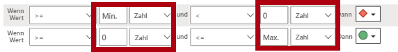

    *Die Regeln können wie folgt interpretiert werden: Anzeige eines roten Karos, wenn der Wert für die Rendite kleiner als „0“ ist, und Anzeige des grünen Kreises, wenn der Wert größer oder gleich null ist.*

7. Klicken Sie auf **OK**.

    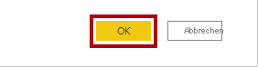

8. Überprüfen Sie im Visual „Tabelle“, ob die richtigen Symbole angezeigt werden.

    

9. Konfigurieren Sie die bedingte Formatierung der Hintergrundfarbe für das Feld **Farbe**.

10. Wählen Sie im Fenster **Hintergrundfarbe – Farbe** in der Dropdownliste **Formatieren nach** die Option **Feldwert** aus.

    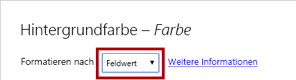

11. Wählen Sie in der Dropdownliste **Basierend auf Feld** die Option **Produkt \| Formatierung \| Background Color Format** (Format der Hintergrundfarbe) aus.

    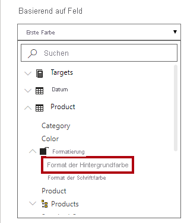

12. Klicken Sie auf **OK**.

    

13. Wiederholen Sie die obigen Schritte, um die bedingte Formatierung der Schriftfarbe für das Feld **Farbe** zu konfigurieren, indem Sie das Feld **Produkt \| Formatierung \| Font Color Format** (Format der Schriftfarbe) verwenden.

    *Sie erinnern sich vielleicht daran, dass die Hintergrundfarben aus der Datei **ColorFormats.csv** im Lab **Vorbereiten von Daten in Power BI Desktop** stammen und dann mit der Abfrage **Product** auf der Registerkarte **Daten in Power BI Desktop laden** integriert wurden.*

## **Übung 4: Hinzufügen von Lesezeichen und Schaltflächen**

In this exercise you will enhance the <bpt id="p1">**</bpt>My Performance<ept id="p1">**</ept> page with buttons, allowing the report user to select the visual type to display. When you’ve completed the design, the page will look like the following:

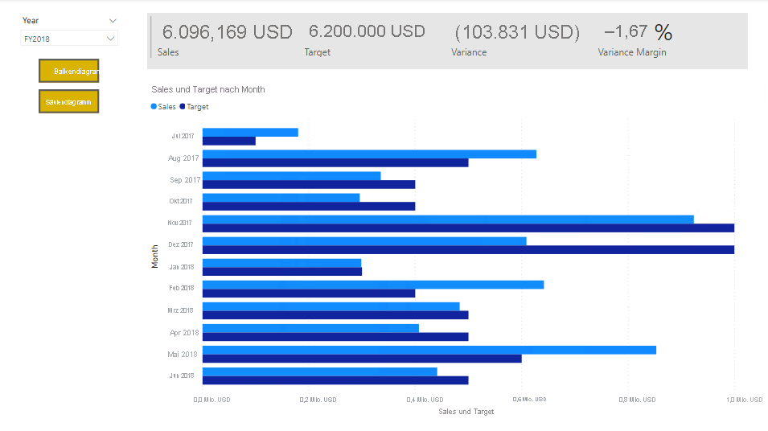

### **Aufgabe 1: Hinzufügen von Lesezeichen**

In dieser Aufgabe fügen Sie zwei Lesezeichen hinzu, und zwar jeweils eins für die Anzeige der Visuals für den monatlichen Umsatz bzw. das Umsatzziel.

1. Navigieren Sie zur Seite **My Performance** (Meine Leistung).

2. Klicken Sie auf der Registerkarte **Anzeigen** des Menübands in der Gruppe **Bereiche anzeigen** auf **Lesezeichen**.

    

3. Klicken Sie auf der Registerkarte **Anzeigen** des Menübands in der Gruppe **Bereiche anzeigen** auf **Auswahl**.

    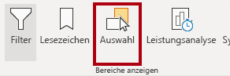

4. Klicken Sie zum Ausblenden des Visuals im Bereich **Auswahl** neben einem der Elemente unter **Sales and Target by Month** (Umsatz und Ziel nach Monat) auf das Augensymbol.

    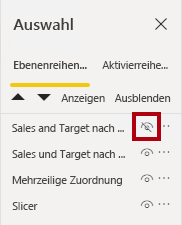

5. Klicken Sie im Bereich **Lesezeichen** auf **Hinzufügen**.

    

6. Doppelklicken Sie auf das Lesezeichen, um es umzubenennen.

7. Falls das Balkendiagramm angezeigt wird, sollten Sie das Lesezeichen in **Balkendiagramm EIN** umbenennen, und andernfalls in **Säulendiagramm EIN**.

8. Zeigen Sie zum Bearbeiten des Lesezeichens im Bereich **Lesezeichen** mit dem Cursor auf das Lesezeichen, klicken Sie auf die Auslassungspunkte, und wählen Sie dann **Daten** aus.

    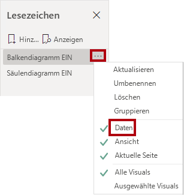

    *Das Deaktivieren der Option **Daten** bewirkt, dass das Lesezeichen den aktuellen Filterstatus nicht verwendet. Das ist wichtig, da andernfalls das Lesezeichen zu einer dauerhaften Sperre in dem Filter führen würde, der aktuell vom Slicer **Year** angewandt wird.*

9. Zum Aktualisieren des Lesezeichens klicken Sie erneut auf die Auslassungspunkte und wählen dann **Aktualisieren** aus.

    

    *In den folgenden Schritten erstellen und konfigurieren Sie ein zweites Lesezeichen, um das zweite Visual anzuzeigen.*

10. Schalten Sie im Bereich **Auswahl** die Sichtbarkeit der beiden Elemente unter **Sales and Target by Month** (Umsatz und Ziel nach Monat) um.

    *Anders ausgedrückt: Blenden Sie das angezeigte Visual aus und das ausgeblendete Visual ein.*

    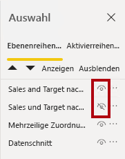

11. Erstellen Sie ein zweites Lesezeichen, und benennen Sie es entsprechend (entweder **Säulendiagramm EIN** oder **Balkendiagramm EIN)**.

    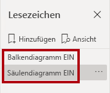

12. Konfigurieren Sie das zweite Lesezeichen so, dass Filter ignoriert werden (Option **Daten** AUS), und aktualisieren Sie das Lesezeichen.

13. Zeigen Sie im Bereich **Auswahl** einfach das ausgeblendete Visual an, um beide Visuals einzublenden.

14. Ändern Sie die Größe und Position beider Visuals so, dass sie die Seite unterhalb des Visuals mit mehreren Karten ausfüllen und einander vollständig überlappen.

    *Tipp: Das verdeckte Visual wählen Sie über den Bereich **Auswahl** aus.*

    

15. Wählen Sie im Bereich **Lesezeichen** die beiden Lesezeichen aus. Sie sehen, dass nur ein Visual sichtbar ist.

    *In der nächsten Entwurfsphase werden der Seite zwei Schaltflächen hinzugefügt, damit Berichtsbenutzer die Lesezeichen auswählen können.*

### **Aufgabe 2: Hinzufügen von Schaltflächen**

In dieser Aufgabe fügen Sie zwei Schaltflächen hinzu und weisen ihnen jeweils Lesezeichenaktionen zu.

1. Klicken Sie im Menüband **Einfügen** in der Gruppe **Elemente** auf **Schaltfläche**, und wählen Sie anschließend die Option **Leer** aus.

    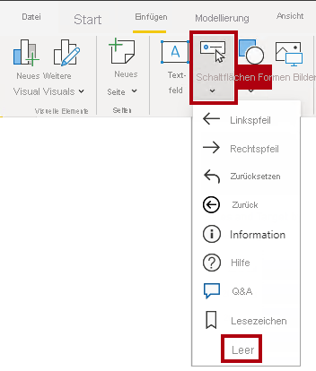

2. Platzieren Sie die Schaltfläche direkt unterhalb des Slicers **Year**.

3. Wählen Sie die Schaltfläche aus, und legen Sie im Bereich **Schaltfläche formatieren** die Eigenschaft **Schaltflächentext** auf **Ein** fest.

    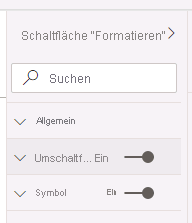

4. Erweitern Sie den Abschnitt **Schaltflächentext**, und geben Sie dann im Feld **Schaltflächentext** den Text **Balkendiagramm** ein.

5. Erweitern Sie den Abschnitt **Hintergrund**, und legen Sie dann eine Komplementärfarbe als Hintergrundfarbe fest.

6. Legen Sie die Eigenschaft **Aktion** auf **Ein** fest (am unteren Ende der Liste).

    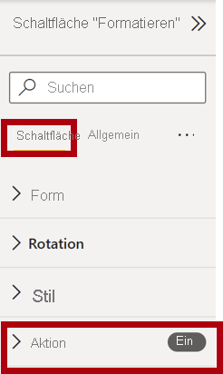

7. Erweitern Sie den Abschnitt **Aktion**, und wählen Sie dann in der Dropdownliste **Typ** die Option **Lesezeichen** aus.

8. Wählen Sie in der Dropdownliste **Lesezeichen** die Option **Balkendiagramm EIN** aus.

    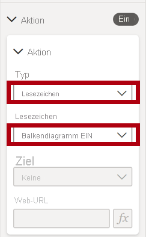

9. Erstellen Sie per Kopieren und Einfügen eine Kopie der Schaltfläche, und konfigurieren Sie die neue Schaltfläche dann wie folgt:

    *Tipp: Die Tastenkombination für das Kopieren und Einfügen ist **STRG+C** gefolgt von **STRG+V**.*

    - Legen Sie die Eigenschaft **Schaltflächentext** auf **Säulendiagramm** fest.

    - Wählen Sie im Abschnitt **Aktion** in der Dropdownliste **Lesezeichen** die Option **Säulendiagramm EIN** aus.

    *Der Entwurf des Sales Analysis-Berichts ist nun fertig gestellt.*

### **Aufgabe 3: Veröffentlichen des Berichts**

In dieser Aufgabe wird der Bericht veröffentlicht.

1. Wählen Sie die Seite **Übersicht** aus.

2. Wählen Sie im Slicer **Jahr** die Option **FY2020** (GJ2020) aus.

3. Wählen Sie im Slicer **Region** die Option **Alles auswählen** aus.

4. Speichern Sie die Power BI Desktop-Datei.

    *Die Datei muss vor dem Veröffentlichen im Power BI-Dienst immer gespeichert werden.*

5. Klicken Sie auf der Registerkarte **Start** des Menübands innerhalb der Gruppe **Freigeben** auf **Veröffentlichen**.

    

6. Beachten Sie, dass im Fenster **In Power BI veröffentlichen** die Option **Mein Arbeitsbereich** ausgewählt ist.

7. Klicken Sie auf **Auswählen**, um den Bericht zu veröffentlichen.

    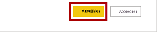

8. Wenn Sie zum Ersetzen des Datasets aufgefordert werden, klicken Sie auf **Ersetzen**.

9. Klicken Sie nach erfolgreicher Veröffentlichung auf **Verstanden**.

    

10. Schließen Sie Power BI Desktop.

    *In der nächsten Übung untersuchen Sie den Bericht im Power BI-Dienst.*

## **Übung 5: Erkunden des Berichts**

In dieser Übung erkunden Sie den Bericht im Power BI-Dienst.

### **Aufgabe 1: Untersuchen des Berichts**

In dieser Aufgabe erkunden Sie den Bericht im Power BI-Dienst.

1. Klicken Sie im Browserfenster von Microsoft Edge im Power BI-Dienst im **Navigationsbereich** auf den Bericht **Sales Analysis**.

2. Klicken Sie zum Testen des Drillthroughberichts auf der Seite **Übersicht** im Visual **Quantity by Category** (Menge nach Kategorie) mit der rechten Maustaste auf die Leiste **Clothing** (Bekleidung), und wählen Sie dann die Option **Drillthrough \| Produktdetails** aus.

    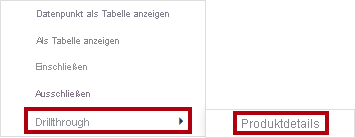

3. Beachten Sie, dass die Seite **Produktdetails** Informationen zu **Clothing** (Bekleidung) enthält.

4. Klicken Sie links oben auf die Pfeilschaltfläche, um zur Ausgangsseite zurückzukehren.

5. Wählen Sie die Seite **My Performance** (Meine Leistung) aus.

6. Klicken Sie auf die einzelnen Schaltflächen. Sie sehen, dass jeweils ein anderes Visual angezeigt wird.

### **Aufgabe 2: Abschluss**

Mit dieser Aufgabe schließen Sie das Lab ab.

1. Klicken Sie auf dem Banner auf der Fensterwebseite auf **Mein Arbeitsbereich**, um zurück zu Ihrem Arbeitsbereich zu navigieren.

    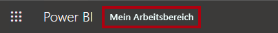

2. Lassen Sie das Browserfenster von Microsoft Edge geöffnet.
