---
lab:
  title: "Erstellen eines Power\_BI-Dashboards"
  module: Module 8 - Create Dashboards
---

# **Erstellen eines Power BI-Dashboards**

**Die geschätzte Dauer dieses Labs beträgt 45 Minuten.**

In diesem Lab erstellen Sie das Dashboard **Sales Monitoring** (Umsatzüberwachung).

In diesem Lab lernen Sie Folgendes:

- Anheften von Visuals an ein Dashboard

- Verwenden von Q&A zum Erstellen von Dashboardkacheln

### **Labszenario**

This lab is one of many in a series of labs that was designed as a complete story from data preparation to publication as reports and dashboards. You can complete the labs in any order. However, if you intend to work through multiple labs, for the first 10 labs, we suggest you do them in the following order:

1. Vorbereiten von Daten in Power BI Desktop

2. Laden von Daten in Power BI Desktop

3. Modellieren von Daten in Power BI Desktop

5. Erstellen von DAX-Berechnungen in Power BI Desktop, Teil 1

6. Erstellen von DAX-Berechnungen in Power BI Desktop, Teil 2

7. Entwerfen eines Berichts in Power BI Desktop, Teil 1

8. Entwerfen eines Berichts in Power BI Desktop, Teil 2

9. **Erstellen eines Power BI-Dashboards**

10. Analysieren von Daten in Power BI Desktop

11. Erzwingen von Sicherheit auf Zeilenebene

## **Übung 1: Erstellen eines Dashboards**

In this exercise you will create the <bpt id="p1">**</bpt>Sales Monitoring<ept id="p1">**</ept> dashboard. The completed dashboard will look like the following:

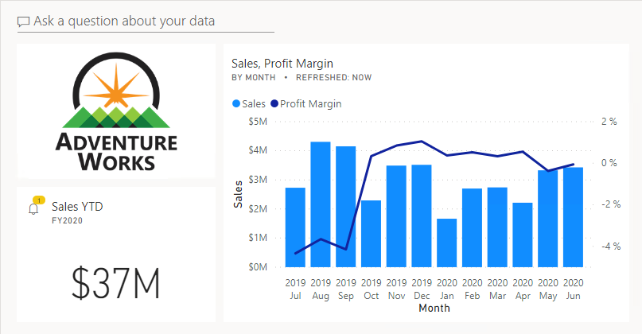

### **Aufgabe 1: Erste Schritte – Anmelden**

In dieser Aufgabe richten Sie die Umgebung für das Lab ein, indem Sie sich bei Power BI anmelden.

*Wichtig: Wenn Sie sich in einem vorherigen Lab bereits bei Power BI angemeldet haben, fahren Sie mit der nächsten Aufgabe fort.*

1. Klicken Sie zum Öffnen von Microsoft Edge auf der Taskleiste auf die Programmverknüpfung für Microsoft Edge.

    

2. Navigieren Sie im Browserfenster von Microsoft Edge zu **https://powerbi.com**.

    *Tipp: Sie können auch auf der Favoritenleiste von Microsoft Edge die Option für den Power BI-Dienst verwenden.*

3. Klicken Sie auf **Anmelden** (in der rechten oberen Ecke).

    

4. Geben Sie die Kontodaten ein, die Sie erhalten haben.

5. Wenn Sie aufgefordert werden, das Kennwort zu aktualisieren, geben Sie das bereitgestellte Kennwort erneut ein, und geben Sie dann das neue Kennwort zweimal zur Bestätigung ein.

    *Wichtig: Denken Sie daran, sich das neue Kennwort zu notieren.*

6. Schließen Sie den Anmeldevorgang ab.

7. Wenn Sie von Microsoft Edge gefragt werden, ob Sie angemeldet bleiben möchten, klicken Sie auf **Ja**.

8. Erweitern Sie im Browserfenster von Microsoft Edge im Power BI-Dienst im **Navigationsbereich** die Option **Mein Arbeitsbereich**.

    

9. Lassen Sie das Browserfenster von Microsoft Edge geöffnet.

### **Aufgabe 2: Erste Schritte – Öffnen des Berichts**

In dieser Aufgabe richten Sie die Umgebung für das Lab ein, indem Sie den Starterbericht öffnen.

*Wichtig: Wenn Sie nach einem vorherigen Lab fortfahren (und dieses Lab erfolgreich abgeschlossen haben), überspringen Sie diese Aufgabe und fahren mit der nächsten fort.*

1. Klicken Sie zum Öffnen von Power BI Desktop auf der Taskleiste auf die Verknüpfung „Microsoft Power BI Desktop“.

    

2. Um das Fenster „Erste Schritte“ zu schließen, klicken Sie links oben im Fenster auf das **X**.

    

3. Wenn Power BI Desktop nicht beim Power BI-Dienst angemeldet ist, klicken Sie rechts oben auf **Anmelden**.

    

4. Schließen Sie den Anmeldevorgang mit demselben Konto ab, das Sie für die Anmeldung beim Power BI-Dienst verwendet haben.

5. Um die Startdatei für Power BI Desktop zu öffnen, klicken Sie auf die Registerkarte **Datei** des Menübands, um die Backstage-Ansicht zu öffnen.

6. Wählen Sie **Bericht öffnen** aus.

    

7. Klicken Sie auf **Berichte durchsuchen**.

    

8. Navigieren Sie im Fenster **Öffnen** zum Ordner **D:\PL300\Labs\09-create-power-bi-dashboard\Starter**.

9. Wählen Sie die Datei **Sales Analysis** aus.

10. Klicken Sie auf **Öffnen**.

    

11. Schließen Sie alle Informationsfenster, die möglicherweise geöffnet werden.

12. Um eine Kopie der Datei zu erstellen, klicken Sie auf die Registerkarte **Datei** des Menübands, um die Backstage-Ansicht zu öffnen.

13. Wählen Sie **Speichern unter** aus.

    

14. Wenn Sie aufgefordert werden, die Abfragen anzuwenden, klicken Sie auf **Anwenden**.

    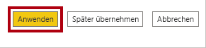

15. Navigieren Sie im Fenster **Speichern unter** zum Ordner **D:\PL300\MySolution**.

16. Klicken Sie auf **Speichern**.

    

### **Aufgabe 3: Erste Schritte – Veröffentlichen des Berichts**

In dieser Aufgabe richten Sie die Umgebung für das Lab ein, indem Sie ein Dataset erstellen.

*Wichtig: Wenn Sie den Bericht bereits im Lab **Entwerfen eines Berichts in Power BI Desktop, Teil 2** veröffentlicht haben, fahren Sie mit der nächsten Aufgabe fort.*

1. Klicken Sie im Browserfenster von Microsoft Edge im Power BI-Dienst im **Navigationsbereich** unten auf **Daten abrufen**.

    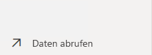

2. Klicken Sie auf der Kachel **Dateien** auf **Abrufen**.

    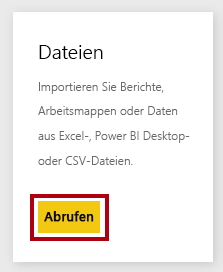

3. Klicken Sie auf die Kachel **Lokale Datei**.

    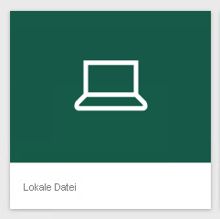

4. Navigieren Sie im Fenster **Öffnen** zum Ordner **D:\PL300\Labs\08-design-report-in-power-bi-desktop-enhanced\Solution**.

5. Wählen Sie die Datei **SalesAnalysis.pbix** aus, und klicken Sie dann auf **Öffnen**.

6. Wenn Sie zum Ersetzen des Datasets aufgefordert werden, klicken Sie auf **Ersetzen**.

### **Aufgabe 4: Erstellen des Dashboards**

In this task you will create the <bpt id="p1">**</bpt>Sales Monitoring<ept id="p1">**</ept> dashboard. You will pin a visual from the report, and add a tile based on an image data URI, and use Q&amp;A to create a tile.

1. Öffnen Sie im Browserfenster von Microsoft Edge im Power BI-Dienst den Bericht **Sales Analysis**.

2. Legen Sie auf der Seite **Übersicht** den Slicer **Year** auf **FY2020** fest.

    

3. Legen Sie den Slicer **Region** auf **Alle auswählen** fest.

    *Beim Anheften von Visuals an ein Dashboard verwenden diese den aktuellen Filterkontext. Nach dem Anheften kann der Filterkontext nicht geändert werden. Bei zeitbasierten Filtern empfiehlt es sich, einen relativen Slicer mit Datum (oder Q&A mit einer relativen zeitbasierten Frage) zu verwenden.*

4. Zeigen Sie mit dem Mauszeiger auf das Visual **Sales and Profit Margin by Month** (Spalte/Zeile), um ein Dashboard zu erstellen und ein Visual anzuheften.

5. Klicken Sie auf die Reißzwecke in der oberen rechten Ecke.

    

6. Geben Sie im Fenster **An Dashboard anheften** im Feld **Dashboardname** den Namen **Sales Monitoring** ein.

    

7. Klicken Sie auf **Anheften**.

    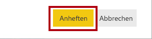

8. Öffnen Sie den **Navigationsbereich** und dann das Dashboard **Sales Monitoring**.

    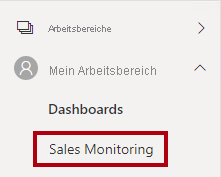

9. Beachten Sie, dass das Dashboard über eine einzelne Kachel verfügt.

    

10. Zum Hinzufügen einer Kachel, die auf einer Frage basiert, klicken Sie oben links im Dashboard auf **Stellen Sie eine Frage zu Ihren Daten**.

    

    *Mithilfe der Q&A-Funktion können Sie eine Frage stellen, und Power BI antwortet mit einem Visual.*

11. Klicken Sie auf eine der vorgeschlagenen Fragen, die unterhalb des Q&A-Felds in blauen Feldern angegeben sind.

12. Prüfen Sie die Antwort.

13. Entfernen Sie den gesamten Text aus dem Q&A-Feld.

14. Geben Sie im Q&A-Feld den folgenden Text ein: **Sales YTD**

    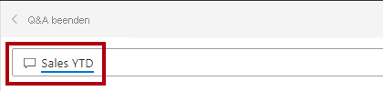

15. Die Antwort lautet **(Leer)**.

    

    *Möglicherweise erinnern Sie sich, dass Sie das Measure **Sales YTD** im Lab **Erstellen von DAX-Berechnungen in Power BI Desktop, Teil 2** hinzugefügt haben. Dieses Measure ist ein Zeitintelligenzausdruck und erfordert daher einen Filter für die Tabelle **Date**, damit ein Ergebnis generiert wird.*

16. Erweitern Sie die Frage um **in year FY2020** (im Jahr 2020).

    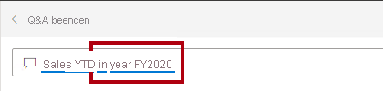

17. Die Antwort lautet nun **$33M**.

    

18. Zum Anheften der Antwort an das Dashboard klicken Sie in der oberen rechten Ecke auf **Visualisierung anheften**.

    

19. Wenn Sie aufgefordert werden, die Kachel an das Dashboard anzuheften, klicken Sie auf **Anheften**.

    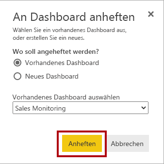

20. Um zum Dashboard zurückzukehren, klicken Sie links oben auf **Q&amp;A beenden**.

    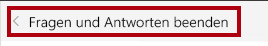

21. Klicken Sie auf der Menüleiste auf **Bearbeiten**, und wählen Sie dann **Kachel hinzufügen** aus, um das Firmenlogo hinzuzufügen.

    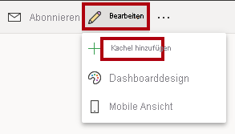

    *Mithilfe dieses Verfahrens zum Hinzufügen einer Dashboardkachel können Sie das Dashboard mit Medien überarbeiten, einschließlich Webinhalte, Bilder, Textfelder mit umfangreicher Formatierung und Videos (mit YouTube- oder Vimeo-Links).*

22. Wählen Sie im Bereich **Kachel hinzufügen** rechts die Kachel **Bild** aus.

    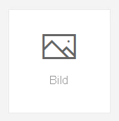

23. Klicken Sie auf **Weiter**.

    

24. Geben Sie im Bereich **Bildkachel hinzufügen** im Feld **URL** die vollständige URL aus der Datei **D:\PL300\Resources\AdventureWorksLogo_DataURL.txt** ein.

    *Sie können ein Bild mithilfe der zugehörigen URL einbetten oder eine Daten-URL verwenden, die Inhalte inline einbettet.*

25. Klicken Sie unten im Bereich auf **Übernehmen**.

    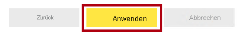

26. Um die Größe der Logokachel zu ändern, ziehen Sie die untere rechte Ecke. Ändern Sie die Größe der Kachel so, dass Sie eine Einheit breit und zwei Einheiten hoch ist.

    *Kachelgrößen sind auf eine rechteckige Form beschränkt. Es ist nur möglich, die Größe auf ein Vielfaches der rechteckigen Form zu ändern.*

27. Ordnen Sie die Kacheln so, dass das Logo ganz oben links angezeigt wird. Daneben ordnen Sie die Kachel **Sales YTD** und rechts die Kachel **Sales, Profit Margin** an.

    

### **Aufgabe 5: Bearbeiten von Kacheldetails**

In dieser Aufgabe bearbeiten Sie die Details von zwei Kacheln.

1. Zeigen Sie mit dem Mauszeiger auf die Kachel **Sales YTD** (Umsatz seit Jahresbeginn), klicken Sie dann oben rechts auf der Kachel auf die Auslassungszeichen, und wählen Sie anschließend **Details bearbeiten** aus.

    

2. Geben Sie im Bereich **Kacheldetails** (rechts) im Feld **Untertitel** den Text **FY2020** ein.

    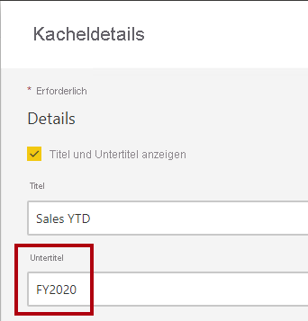

3. Klicken Sie auf **Übernehmen**.

    

4. Nun wird auf der Kachel **Sales YTD** ein Untertitel angezeigt.

    

5. Bearbeiten Sie die Kacheldetails für die Kachel **Sales, Profit Margin** (Umsatz, Gewinnspanne).

6. Aktivieren Sie im Bereich **Kacheldetails** im Abschnitt **Funktionalität** die Option **Zeitpunkt der letzten Aktualisierung anzeigen**.

    

7. Klicken Sie auf **Übernehmen**.

    

8. Die Kachel gibt jetzt den Zeitpunkt der letzten Aktualisierung an (bei der Aktualisierung des Datenmodells in Power BI Desktop).

    *In der nächsten Übung aktualisieren Sie das Dataset. Dies sollte normalerweise mithilfe einer geplanten Aktualisierung erfolgen. Power BI könnte dann über ein Gateway eine Verbindung mit der SQL Server-Datenbank herstellen. Aufgrund von Einschränkungen im Setup für diesen Kurs ist jedoch kein Gateway vorhanden. Daher öffnen Sie Power BI Desktop, führen eine manuelle Datenaktualisierung durch und laden die Datei dann in Ihren Arbeitsbereich hoch.*

## **Übung 2: Aktualisieren des Datasets**

In this exercise you will first load sales order data for June 2020 into the <bpt id="p1">**</bpt>AdventureWorksDW2020<ept id="p1">**</ept> database. You will then open your Power BI Desktop file, perform a data refresh, and then upload the file to your workspace.

### **Aufgabe 1: Aktualisieren der Labdatenbank**

In dieser Aufgabe führen Sie ein PowerShell-Skript aus, um Daten in der Datenbank **AdventureWorksDW2020** zu aktualisieren.

1. Klicken Sie im Datei-Explorer im Ordner **D:\PL300\Setup** mit der rechten Maustaste auf die Datei **UpdateDatabase-2-AddSales.ps1**, und wählen Sie dann **Mit PowerShell ausführen** aus.

    

2. Wenn Sie aufgefordert werden, die Ausführungsrichtlinie zu ändern, drücken Sie auf die Taste **A**.

3. Wenn Sie aufgefordert werden, zum Schließen eine beliebige Taste zu drücken, drücken Sie erneut die **EINGABETASTE**.

    *Die Datenbank **AdventureWorksDW2020** enthält nun Bestellungen vom Juni 2020.*

### **Aufgabe 2: Aktualisieren der Power BI Desktop-Datei**

In dieser Aufgabe öffnen Sie die Power BI Desktop-Datei **Sales Analysis**, führen eine Datenaktualisierung durch und laden die Datei anschließend in den Arbeitsbereich **Sales Analysis** hoch.

1. Klicken Sie in der Power BI Desktop-Datei im Bereich **Felder** mit der rechten Maustaste auf die Tabelle **Sales**, und wählen Sie dann **Daten aktualisieren** aus.

    

2. Wenn die Aktualisierung abgeschlossen ist, speichern Sie die Power BI Desktop-Datei.

3. Klicken Sie zum Veröffentlichen der Datei in Ihrem Arbeitsbereich auf der Registerkarte **Start** des Menübands innerhalb der Gruppe **Freigeben** auf **Veröffentlichen**.

    

4. Wenn Sie zum Ersetzen des Datasets aufgefordert werden, klicken Sie auf **Ersetzen**.

    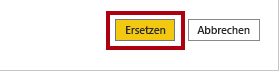

    *Das Dataset im Power BI-Dienst enthält jetzt Umsatzdaten vom Juni 2020.*

5. Schließen Sie Power BI Desktop.

## **Übung 3: Überprüfen des Dashboards**

In dieser Übung überprüfen Sie das Dashboard, um aktualisierte Umsätze zu erkennen und festzustellen, ob die Warnung ausgelöst wurde.

### **Aufgabe 1: Überprüfen des Dashboards**

In dieser Aufgabe überprüfen Sie das Dashboard, um aktualisierte Umsätze zu erkennen und festzustellen, ob die Warnung ausgelöst wurde.

1. Überprüfen Sie im Fenster des Microsoft Edge-Browsers im Power BI-Dienst das Dashboard für **Sales Monitoring**.

2. Auf der Kachel **Sales, Profit Margin** (Umsatz, Gewinnspanne) können Sie im Untertitel sehen, dass die Daten **JETZT** aktualisiert wurden.

3. Beachten Sie auch, dass nun eine Diagrammsäule für **2020 Jun** vorhanden ist.

    *Wenn die Daten für Juni 2020 nicht angezeigt werden, müssen Sie möglicherweise **F5** drücken, um den Browser zu aktualisieren.*

    

    *Die Warnung auf der Kachel **Sales YTD** (Umsatz seit Jahresbeginn) sollte ebenfalls ausgelöst worden sein. Nach kurzer Zeit sollten Sie durch die Warnung benachrichtigt werden, dass der Umsatz nun den konfigurierten Schwellenwert überschreitet.*

4. Beachten Sie, dass die Kachel **Sales YTD** auf **$37M** aktualisiert wurde.

5. Vergewissern Sie sich, dass auf der Kachel **Sales YTD** ein Symbol für eine Warnbenachrichtigung angezeigt wird.

    *Wenn die Benachrichtigung nicht angezeigt wird, müssen Sie möglicherweise **F5** drücken, um den Browser zu aktualisieren. Wenn die Benachrichtigung immer noch nicht angezeigt wird, warten Sie noch einige Minuten.*

    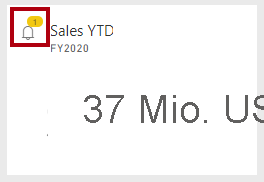

    *Warnbenachrichtigungen werden auf der Dashboardkachel angezeigt und können per E-Mail übermittelt werden. Zudem können Pushbenachrichtigungen an mobile Apps, einschließlich Apple Watch, gesendet werden.*

6. Klicken Sie in der rechten oberen Ecke auf der Webseite auf das Symbol **Benachrichtigungen**.

    

7. Überprüfen Sie im Bereich **Alle Benachrichtigungen** die Details der Warnungsbenachrichtigung.

8. Klicken Sie auf **Schließen**, um den Bereich zu schließen.
