---
lab:
  title: "Erstellen eines Power\_BI-Dashboards"
  module: Create Dashboards
---

# **Erstellen eines Power BI-Dashboards**

## **Labszenario**

In diesem Lab erstellen Sie das Dashboard **Sales Monitoring** im Power BI-Dienst mithilfe eines vorhandenen Berichts.

In diesem Lab lernen Sie Folgendes:

- Anheften von Visuals an ein Dashboard
- Verwenden von Q&A zum Erstellen von Dashboardkacheln

**Dieses Lab sollte ungefähr 30 Minuten in Anspruch nehmen.**

## **Erste Schritte: Anmelden**

In dieser Aufgabe richten Sie die Umgebung für das Lab ein, indem Sie sich bei Power BI anmelden.

*Hinweis: Wenn Sie sich bereits bei Power BI angemeldet haben, fahren Sie mit der nächsten Aufgabe fort.*

1. Klicken Sie zum Öffnen von Microsoft Edge auf der Taskleiste auf die Programmverknüpfung für Microsoft Edge.

     

1. Navigieren Sie im Browserfenster von Microsoft Edge zu **https://app.powerbi.com**.

    *Tipp: Sie können auch auf der Favoritenleiste von Microsoft Edge die Option für den Power BI-Dienst verwenden.*

1. Schließen Sie den Anmeldevorgang mit den Anmeldeinformationen Ihrer Organisation (oder den angegebenen Anmeldeinformationen) ab. Wenn Sie von Microsoft Edge gefragt werden, ob Sie angemeldet bleiben möchten, klicken Sie auf **Ja**.

1. Erweitern Sie im Browserfenster von Microsoft Edge im Power BI-Dienst im **Navigationsbereich** die Option **Mein Arbeitsbereich**. Lassen Sie das Browserfenster von Microsoft Edge geöffnet.

     

## **Erste Schritte: Öffnen des Berichts**

In dieser Aufgabe richten Sie die Umgebung für das Lab ein, indem Sie den Starterbericht öffnen.

*Wichtig: Wenn Sie nach einem vorherigen Lab fortfahren (und dieses Lab erfolgreich abgeschlossen haben), überspringen Sie diese Aufgabe und fahren mit der nächsten fort.*

1. Öffnen Sie Power BI Desktop.
    
    *Standardmäßig wird das Dialogfeld „Erste Schritte“ vor Power BI Desktop geöffnet. Melden Sie sich an und schließen Sie dann das Popup.*

    

1. Um die Power BI Desktop-Startdatei zu öffnen, wählen Sie **Datei > Bericht öffnen > Berichte durchsuchen** aus.

1. Navigieren Sie im Fenster **Öffnen** zum Ordner **D:\PL300\Labs\09-create-power-bi-dashboard\Starter**, und öffnen Sie die Datei **Verkaufsanalyse**.

1. Schließen Sie alle Informationsfenster, die möglicherweise geöffnet werden.

1. Beachten Sie die gelbe Warnmeldung unterhalb des Menübands. *In dieser Meldung werden Sie darauf hingewiesen, dass die Abfragen nicht als Modelltabellen geladen wurden. Sie wenden die Abfragen später in diesem Lab an.*
    
    *Klicken Sie rechts auf der gelben Warnmeldung auf das **X**, um die Warnmeldung zu verwerfen.*

1. Um eine Kopie der Datei zu erstellen, wechseln Sie zu **Datei > Speichern unter**, und speichern Sie sie im Ordner **D:\PL300\MySolution**.

1. Wenn Sie aufgefordert werden, Änderungen zu übernehmen, klicken Sie auf **Später übernehmen**.

## **Erste Schritte: Veröffentlichen des Berichts**

In dieser Aufgabe richten Sie die Umgebung für das Lab ein, indem Sie ein Dataset erstellen. *Wenn Sie das Dataset bereits veröffentlicht haben, fahren Sie mit der nächsten Aufgabe fort.*

1. Navigieren Sie im Browserfenster von Microsoft Edge im Power BI-Dienst zu **Mein Arbeitsbereich**.

1. Wählen Sie **Hochladen > Durchsuchen** aus.

1. Navigieren Sie zum Ordner **D:\PL300\Labs\09-create-power-bi-Dashboard\Starter**.

1. Wählen Sie die Datei **SalesAnalysis.pbix** und dann **Öffnen** aus.

*Wenn Sie zum Ersetzen des Datasets aufgefordert werden, wählen Sie **Ersetzen** aus.*

## **Erstellen eines Dashboards**

In dieser Aufgabe erstellen Sie das Dashboard **Sales Monitoring**. Sie heften ein Visual aus dem Bericht an, fügen eine Kachel auf der Grundlage eines Imagedaten-URIs hinzu, und verwenden Q&A, um eine Kachel zu erstellen.

1. Öffnen Sie im Power BI-Dienst den Bericht **Verkaufsanalyse**.

1. Legen Sie auf der Seite **Übersicht** den Slicer **Year** auf **FY2020** fest.

    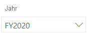

1. Legen Sie den Slicer **Region** auf **Alle auswählen** fest.

    *Angeheftete visuelle Elemente werden mit dem Filterkontext zum Zeitpunkt des Anheftens festgelegt. Wenn sich das zugrunde liegende visuelle Element ändert, müssen Sie auch die Dashboardkachel aktualisieren. Für zeitbasierte Filter ist es besser, einen relativen Datumsschnitt zu verwenden (oder Q&A unter Verwendung einer relativen zeitbasierten Frage).*

1. Zeigen Sie mit dem Mauszeiger auf das visuelle Element **Umsatz und Gewinnspanne nach Monat** (Spalte/Zeile), um ein Dashboard zu erstellen und ein visuelles Element anzuheften, und wählen Sie die Reißzwecke aus.

    

1. Geben Sie im Fenster **An Dashboard anheften** im Feld **Dashboardname** den Namen **Sales Monitoring**  (Umsatzüberwachung) ein, und wählen Sie **Anheften** aus.

    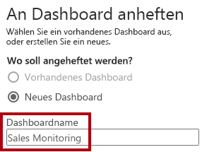

1. Öffnen Sie **Mein Arbeitsbereich** und anschließend das Dashboard **Sales Monitoring**.

1. Beachten Sie, dass das Dashboard über eine einzelne Kachel verfügt.

    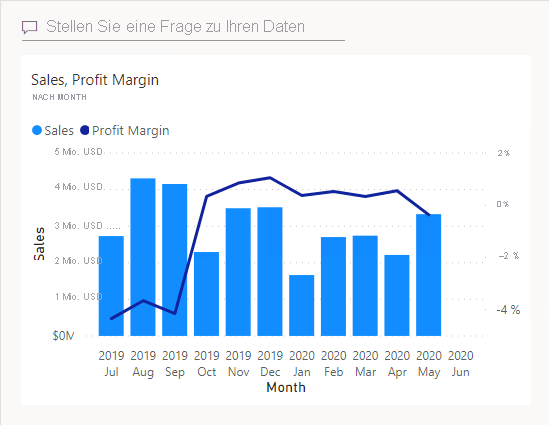

1. Zum Hinzufügen einer Kachel, die auf einer Frage basiert, klicken Sie oben links im Dashboard auf **Stellen Sie eine Frage zu Ihren Daten**.
    
    *Mithilfe der Q&A-Funktion können Sie eine Frage stellen, und Power BI antwortet mit einem Visual.*

    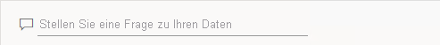

1. Klicken Sie auf eine der vorgeschlagenen Fragen, die unterhalb des Q&A-Felds in blauen Feldern angegeben sind, und überprüfen Sie die Antwort.

1. Entfernen Sie den gesamten Text aus dem Q&A-Feld, und geben Sie Folgendes ein: **Sales YTD**

1. Die Antwort lautet **(Leer)**.
    
    *Sie werden sich vielleicht daran erinnern, dass Sie das Measure **Sales YTD** im Lab **Erstellen von erweiterten DAX-Berechnungen in Power BI Desktop** hinzugefügt haben. Dieses Measure ist ein Zeitintelligenzausdruck und erfordert daher einen Filter für die Tabelle **Datum**, damit ein Ergebnis generiert wird.*

    

1. Erweitern Sie die Frage um **in year FY2020** (im Jahr 2020).

1. Die Antwort lautet nun **$33M**.

    

1. Zum Anheften der Antwort an das Dashboard klicken Sie oben rechts auf **Visualisierung anheften**.

    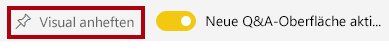

1. Wenn Sie aufgefordert werden, die Kachel an das Dashboard anzuheften, klicken Sie auf **Anheften**.

1. Klicken Sie links oben auf **Q&amp;A beenden**, um zum Dashboard zurückzukehren.

1. Wählen Sie in der Menüleiste **Bearbeiten** und **Kachel hinzufügen** aus, um das Firmenlogo hinzuzufügen.
    
    *Mithilfe dieses Verfahrens zum Hinzufügen einer Dashboardkachel können Sie das Dashboard mit Medien erweitern, einschließlich Webinhalten, Bildern, Textfeldern mit umfangreicher Formatierung und Videos (mit YouTube- oder Vimeo-Links).*

1. Klicken Sie im Bereich **Kachel hinzufügen** rechts auf die Kachel **Image** und dann auf **Weiter**.

1. Geben Sie im Bereich **Bildkachel hinzufügen** im Feld **URL** die vollständige URL aus der Datei **D:\PL300\Resources\AdventureWorksLogo_DataURL.txt** ein, und klicken Sie dann auf **Übernehmen**.
    
    *Sie können ein Bild mithilfe der zugehörigen URL einbetten oder eine Daten-URL verwenden, die Inhalte inline einbettet.*

1. Um die Größe der Logokachel zu ändern, ziehen Sie die untere rechte Ecke. Ändern Sie die Größe der Kachel so, dass Sie eine Einheit breit und zwei Einheiten hoch ist.
    
    *Kachelgrößen sind auf eine rechteckige Form beschränkt.*

1. Ordnen Sie die Kacheln so, dass das Logo ganz oben links angezeigt wird. Daneben ordnen Sie die Kachel **Sales YTD** und rechts die Kachel **Sales, Profit Margin** an.

    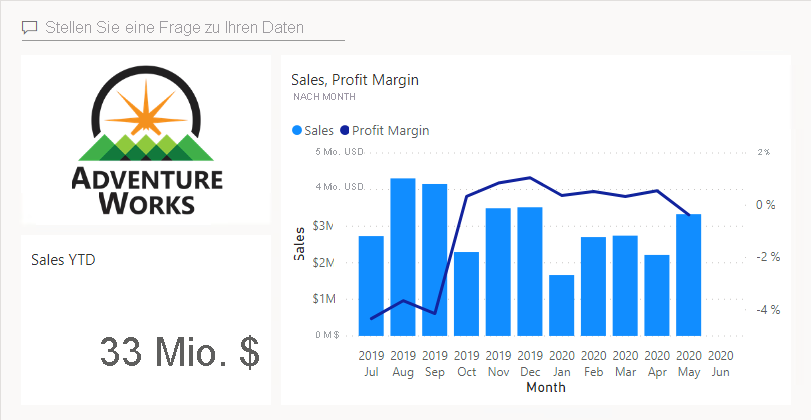

## **Bearbeiten von Kacheldetails**

In dieser Aufgabe bearbeiten Sie die Details von zwei Kacheln.

1. Zeigen Sie mit dem Mauszeiger auf die Kachel **Sales YTD**, klicken Sie dann oben rechts auf der Kachel auf die Auslassungspunkte und anschließend auf **Details bearbeiten**.

    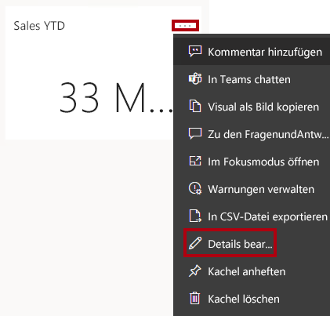

1. Geben Sie im Bereich **Kacheldetails** (rechts) im Feld **Untertitel** den Text **FY2020** ein, und wählen Sie **Übernehmen** aus.

1. Nun wird auf der Kachel **Sales YTD** ein Untertitel angezeigt.

    

1. Bearbeiten Sie die Kacheldetails für die Kachel **Sales, Profit Margin** (Umsatz, Gewinnspanne).

1. Aktivieren Sie im Bereich **Kacheldetails** im Abschnitt **Funktionalität** die Option **Zeitpunkt der letzten Aktualisierung anzeigen**, und wählen Sie **Übernehmen** aus.

    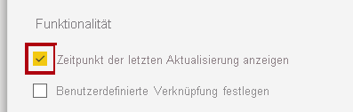

1. Die Kachel gibt jetzt den Zeitpunkt der letzten Aktualisierung an (bei der Aktualisierung des Datenmodells in Power BI Desktop).

*In der nächsten Übung aktualisieren Sie das Dataset. Abhängig von Ihren Daten und Berichten können Sie jederzeit eine Adhoc-Datenaktualisierung durchführen oder einen Zeitplan festlegen. Geplante Aktualisierungen erfordern jedoch Gateways, die wir für dieses Lab nicht konfigurieren können. Von Power BI Desktop aus führen Sie also eine manuelle Datenaktualisierung durch und laden die Datei dann in Ihren Arbeitsbereich hoch.*

## **Aktualisieren des Datasets**

In dieser Übung laden Sie zuerst Bestelldaten für Juni 2020 in die Datenbank **AdventureWorksDW2020**. Anschließend öffnen Sie die Power BI Desktop-Datei, führen eine Datenaktualisierung aus und laden die Datei in Ihren Arbeitsbereich hoch.

## **Aktualisieren der Lab-Datenbank**

In dieser Aufgabe führen Sie ein PowerShell-Skript aus, um Daten in der Datenbank **AdventureWorksDW2020** zu aktualisieren.

1. Klicken Sie im Datei-Explorer im Ordner **D:\PL300\Setup** mit der rechten Maustaste auf die Datei **UpdateDatabase-2-AddSales.ps1**, und wählen Sie dann **Mit PowerShell ausführen** aus.

    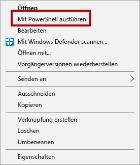

1. Wenn Sie aufgefordert werden, die Ausführungsrichtlinie zu ändern, drücken Sie auf die Taste **A**.

1. Wenn Sie aufgefordert werden, zum Schließen eine beliebige Taste zu drücken, drücken Sie erneut die **EINGABETASTE**.

*Die Datenbank **AdventureWorksDW2020** enthält nun Bestellungen vom Juni 2020.*

## **Aktualisieren der Power BI Desktop-Datei**

In dieser Aufgabe öffnen Sie die Power BI Desktop-Datei **Verkaufsanalyse**, führen eine Datenaktualisierung aus und laden die Datei anschließend in den Arbeitsbereich **Verkaufsanalyse** hoch.

1. Klicken Sie in der Power BI Desktop-Datei im Bereich **Daten** mit der rechten Maustaste auf die Tabelle **Sales** und dann auf **Daten aktualisieren**.

    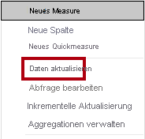

1. Wenn die Aktualisierung abgeschlossen ist, speichern Sie die Power BI Desktop-Datei.

1. Klicken Sie auf der Registerkarte **Start** des Menübands innerhalb der Gruppe **Freigeben** auf **Veröffentlichen**, und wählen Sie **Auswählen** aus, um die Datei in Ihrem Arbeitsbereich zu veröffentlichen.

    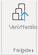

1. Wenn Sie zum Ersetzen des Datasets aufgefordert werden, klicken Sie auf **Ersetzen**.

1. Schließen Sie Power BI Desktop.

*Das Dataset im Power BI-Dienst enthält jetzt Umsatzdaten vom Juni 2020.*

### **Überprüfen des Dashboards**

Bei dieser Aufgabe überprüfen Sie das Dashboard, um aktualisierte Umsatzdaten anzuzeigen.

1. Öffnen Sie im Microsoft Edge-Browserfenster Power BI-Dienst, und überprüfen Sie dann das Dashboard **Sales Monitoring** in **Mein Arbeitsbereich**.

2. Auf der Kachel **Sales, Profit Margin** (Umsatz, Gewinnspanne) können Sie im Untertitel **Refreshed: NOW** sehen, dass die Daten JETZT aktualisiert wurden.

3. Beachten Sie auch, dass nun eine Spalte für **2020 Jun** vorhanden ist.
    
    *Wenn die Daten für Juni 2020 nicht angezeigt werden, müssen Sie möglicherweise **F5** drücken, um den Browser zu aktualisieren.*

    

### **Abschluss**

Mit dieser Aufgabe schließen Sie das Lab ab.

1. Speichern Sie den Bericht, und schließen Sie Ihren Browser.
