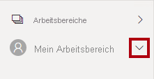
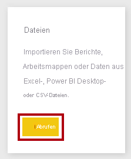
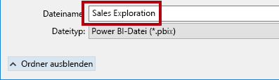
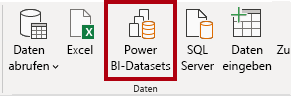
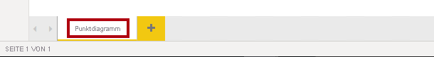
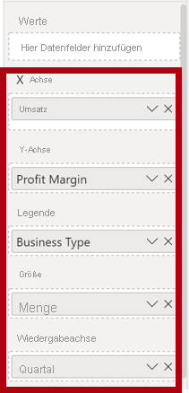
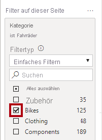
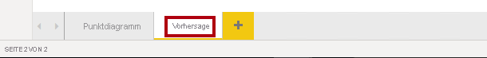
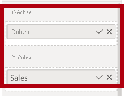
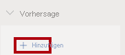

---
lab:
  title: "Analysieren von Daten in Power\_BI Desktop"
  module: Module 10 - Perform Advanced Analytics
---

# **Analysieren von Daten in Power BI Desktop**

**Die geschätzte Dauer dieses Labs beträgt 45 Minuten.**

In diesem Lab erstellen Sie den Bericht **Sales Exploration** (Umsatzanalyse).

In diesem Lab lernen Sie Folgendes:

- Erstellen von animierten Punktdiagrammen

- Verwenden eines Visuals zum Vorhersagen von Werten

### **Labszenario**

Dieses Lab ist eines von vielen in einer Reihe von Labs, die als fortlaufendes Szenario von der Datenvorbereitung bis zur Veröffentlichung als Berichte und Dashboards entworfen wurde. Sie können die Labs in beliebiger Reihenfolge abschließen. Wenn Sie jedoch beabsichtigen, mehrere Labs durchzuarbeiten, sollten Sie die ersten zehn Labs in der folgenden Reihenfolge absolvieren:

1. Vorbereiten von Daten in Power BI Desktop

2. Laden von Daten in Power BI Desktop

3. Modellieren von Daten in Power BI Desktop

5. Erstellen von DAX-Berechnungen in Power BI Desktop, Teil 1

6. Erstellen von DAX-Berechnungen in Power BI Desktop, Teil 2

7. Entwerfen eines Berichts in Power BI Desktop, Teil 1

8. Entwerfen eines Berichts in Power BI Desktop, Teil 2

9. Erstellen eines Power BI-Dashboards

10. **Analysieren von Daten in Power BI Desktop**

11. Erzwingen von Sicherheit auf Zeilenebene

## **Übung 1: Erstellen des Berichts**

In dieser Übung erstellen Sie den Bericht **Sales Exploration**.

### **Aufgabe 1: Erste Schritte – Anmelden**

In dieser Aufgabe richten Sie die Umgebung für das Lab ein, indem Sie sich bei Power BI anmelden.

*Wichtig: Wenn Sie sich in einem vorherigen Lab bereits bei Power BI angemeldet haben, fahren Sie mit der nächsten Aufgabe fort.*

1. Klicken Sie zum Öffnen von Microsoft Edge auf der Taskleiste auf die Programmverknüpfung für Microsoft Edge.

    

1. Navigieren Sie im Browserfenster von Microsoft Edge zu **https://powerbi.com**.

    *Tipp: Sie können auch auf der Favoritenleiste von Microsoft Edge die Option für den Power BI-Dienst verwenden.*

1. Klicken Sie auf **Anmelden** (in der rechten oberen Ecke).

    

1. Geben Sie die Kontodaten ein, die Sie erhalten haben.

1. Wenn Sie aufgefordert werden, das Kennwort zu aktualisieren, geben Sie das bereitgestellte Kennwort erneut ein, und geben Sie dann das neue Kennwort zweimal zur Bestätigung ein.

    *Wichtig: Denken Sie daran, sich das neue Kennwort zu notieren.*

1. Schließen Sie den Anmeldevorgang ab.

1. Wenn Sie von Microsoft Edge gefragt werden, ob Sie angemeldet bleiben möchten, klicken Sie auf **Ja**.

1. Erweitern Sie im Browserfenster von Microsoft Edge im Power BI-Dienst im **Navigationsbereich** die Option **Mein Arbeitsbereich**.

    

1. Lassen Sie das Browserfenster von Microsoft Edge geöffnet.

### **Aufgabe 2: Erste Schritte – Erstellen eines Datasets**

In dieser Aufgabe richten Sie die Umgebung für das Lab ein, indem Sie ein Dataset erstellen.

*Wichtig: Wenn Sie das Dataset bereits im Lab **Erstellen eines Power BI-Dashboards** veröffentlicht haben, fahren Sie mit der nächsten Aufgabe fort.*

1. Klicken Sie im Browserfenster von Microsoft Edge im Power BI-Dienst im **Navigationsbereich** unten auf **Daten abrufen**.

    

2. Klicken Sie auf der Kachel **Dateien** auf **Abrufen**.

    

3. Klicken Sie auf die Kachel **Lokale Datei**.

    

4. Navigieren Sie im Fenster **Öffnen** zum Ordner **D:\PL300\Labs\09-create-power-bi-dashboard\Solution**.

5. Wählen Sie die Datei **SalesAnalysis.pbix** aus, und klicken Sie dann auf **Öffnen**.

6. Wenn Sie zum Ersetzen des Datasets aufgefordert werden, klicken Sie auf **Ersetzen**.

### **Aufgabe 3: Erstellen des Berichts**

In dieser Aufgabe erstellen Sie den Bericht **Sales Exploration**.

1. Klicken Sie zum Öffnen von Power BI Desktop auf der Taskleiste auf die Verknüpfung „Microsoft Power BI Desktop“.

    *Wichtig: Wenn Power BI Desktop bereits (aus einem früheren Lab) geöffnet ist, schließen Sie diese Instanz.*

    

2. Um das Fenster „Erste Schritte“ zu schließen, klicken Sie links oben im Fenster auf das **X**.

    

3. Wenn Power BI Desktop nicht beim Power BI-Dienst angemeldet ist, klicken Sie rechts oben auf **Anmelden**.

    

4. Schließen Sie den Anmeldevorgang mit demselben Konto ab, das Sie für die Anmeldung beim Power BI-Dienst verwendet haben.

5. Um die Datei zu speichern, klicken Sie auf die Registerkarte **Datei** des Menübands, um die Backstage-Ansicht zu öffnen.

6. Wählen Sie **Speichern** aus.

    

7. Navigieren Sie im Fenster **Speichern unter** zum Ordner **D:\PL300\MySolution**.

8. Geben Sie im Feld **Dateiname** den Namen **Sales Exploration** ein.

    

9. Klicken Sie zum Erstellen einer Liveverbindung mit dem Dataset **Sales Analysis** auf der Registerkarte **Start** des Menübands in der Gruppe **Daten** auf **Power BI-Datasets**.

    

10. Wählen Sie im Fenster **Dataset für Berichterstellung auswählen** das Dataset **Sales Analysis** (Verkaufsanalyse) aus.

11. Klicken Sie auf **Erstellen**.

    

12. Speichern Sie die Power BI Desktop-Datei.

    *Sie erstellen nun vier Berichtsseiten, und auf jeder Seite arbeiten Sie mit einem anderen Visual, um Daten zu analysieren und zu erkunden.*

## **Übung 2: Erstellen eines Punktdiagramms**

In dieser Übung erstellen Sie ein Punktdiagramm, das animiert werden kann.

### **Aufgabe 1: Erstellen eines animierten Punktdiagramms**

In dieser Aufgabe erstellen Sie ein Punktdiagramm, das animiert werden kann.

1. Benennen Sie **Seite 1** in **Punktdiagramm** um.

    

2. Fügen Sie der Berichtsseite ein **Punktdiagrammvisual** hinzu und ändern anschließend seine Position und Größe, damit es die gesamte Seite ausfüllt.

    

    

3. Fügen Sie den Visualbereichen die folgenden Felder hinzu:

    In den Labs wird eine verkürzte Notation verwendet, um auf ein Feld zu verweisen. Das sieht folgendermaßen aus: **Reseller** **\|** **Business Type**. In diesem Beispiel ist **Handelspartner** der Tabellenname und **Geschäftstyp** der Feldname.

    - Legende: **Reseller \| Business Type**

    - X-Achse: **Sales \| Sales** 

    - Y-Achse: **Sales \| Profit Margin**

    - Größe: **Sales \| Quantity**

    - Wiedergabeachse: **Date \| Quarter**

    

    *Das Diagramm kann animiert werden, wenn dem Bereich **Wiedergabeachse** ein Feld hinzugefügt wird.*

4. Fügen Sie im Bereich **Filter** das Feld **Product \| Category** im Bereich **Filter für diese Seite** hinzu.

5. Filtern Sie auf der Filterkarte nach **Bikes** (Fahrräder).

    

6. Wenn Sie das Diagramm animieren möchten, klicken Sie in der unteren linken Ecke auf **Wiedergeben**.

    

7. Sehen Sie sich den gesamten Animationszyklus vom ersten Quartal im Jahr 2018 (**FY2018 Q1**) bis zum viertel Quartal im Jahr 2020 (**FY2020 Q4**) an.

    *Das Punktdiagramm ermöglicht Ihnen, die Measurewerte gleichzeitig aufzuschlüsseln, also in diesem Fall die Bestellmenge (order quantity), den Nettoumsatz (sales revenue) und die Gewinnspanne (profit margin).*

    *Jede Blase stellt einen Handelspartner-Unternehmenstyp dar. Änderungen an der Blasengröße spiegeln eine größere oder kleinere Bestellmenge wider. Horizontale Bewegungen stellen eine Erhöhung/Abnahme des Nettoumsatzes dar, und vertikale Verschiebungen stellen eine Erhöhung/Abnahme der Rentabilität dar.*

8. Wenn die Animation angehalten wird, klicken Sie auf eine der Blasen, um die Nachverfolgung in einem Zeitraum anzuzeigen.

9. Bewegen Sie den Cursor auf eine beliebige Blase, um eine QuickInfo mit den Measurewerten für den Handelspartnertyp zu diesem Zeitpunkt anzuzeigen.

10. Filtern Sie im Bereich **Filter** nach **Clothing** (Kleidung), und beachten Sie, dass das Ergebnis ein anderes ist.

11. Speichern Sie die Power BI Desktop-Datei.

## **Übung 3: Erstellen einer Vorhersage**

In dieser Übung erstellen Sie eine Vorhersage, um den möglichen zukünftigen Umsatz zu ermitteln.

### **Aufgabe 1: Erstellen einer Vorhersage**

In dieser Aufgabe erstellen Sie eine Vorhersage, um den möglichen zukünftigen Umsatz zu ermitteln.

1. Fügen Sie eine neue Seite hinzu, und benennen Sie dann die Seite in **Vorhersage** um.

    

2. Fügen Sie der Berichtsseite ein **Liniendiagrammvisual** hinzu und ändern anschließend seine Position und Größe, damit es die gesamte Seite ausfüllt.

    

    

  

3. Fügen Sie den Visualbereichen die folgenden Felder hinzu:

    - Achse: **Date \| Date**

    - Werte: **Sales \| Sales** 

    

4. Fügen Sie im Bereich **Filter** das Feld **Date \| Year** im Bereich **Filter für diese Seite** hinzu.

5. Filtern Sie auf der Filterkarte nach zwei Jahren: **FY2019** und **FY2020**.

    

    *Wenn Sie eine Vorhersage über eine Zeitachse treffen, benötigen Sie mindestens zwei Zyklen (Jahre) von Daten, um eine präzise und beständige Vorhersage zu erhalten.*

  

6. Fügen Sie ebenso das Feld **Product \| Category** im Bereich **Filter für diese Seite** hinzu, und filtern Sie nach **Bikes** (Fahrrädern).

    

7. Wählen Sie zum Hinzufügen einer Vorhersage unter dem Bereich **Visualisierung** den Bereich **Analyse** aus.

    

8. Erweitern Sie den Abschnitt **Vorhersage**.

    

    *Wenn der Abschnitt **Vorhersage** nicht verfügbar ist, wurde das Visual wahrscheinlich nicht ordnungsgemäß konfiguriert. Die Vorhersage ist nur verfügbar, wenn zwei Bedingungen erfüllt sind: Die Achse verfügt über ein einzelnes Feld vom Typ „Date“ (Datum), und es gibt nur ein Wertfeld.*

9. Klicken Sie auf **Hinzufügen**.

    

10. Konfigurieren Sie die folgenden Vorhersageeigenschaften:

    - Länge prognostizieren: 1 Monat

    - Konfidenzintervall: 80

    - Saisonalität: 365

11. Klicken Sie auf **Übernehmen**.

    

12. Beachten Sie, dass die Vorhersage im Linienvisual einen Monat über die Verlaufsdaten hinaus verlängert wurde.

    *Der graue Bereich stellt die Konfidenz dar. Je breiter die Konfidenz, desto weniger beständig und präzise ist wahrscheinlich auch die Vorhersage.*

    *Wenn Sie die Länge des Zyklus kennen (in diesem Fall jährlich), sollten Sie die Saisonalitätspunkte eingeben. Manchmal ist sind diese wöchentlich (7) oder monatlich (30).*

13. Filtern Sie im Bereich **Filter** nun nach **Clothing** (Kleidung). Sie sehen, dass das Ergebnis sich verändert.

14. Speichern Sie die Power BI Desktop-Datei.

### **Aufgabe 2: Abschluss**

Mit dieser Aufgabe schließen Sie das Lab ab.

1. Wählen Sie die Seite **Punktdiagramm** aus.

2. Speichern Sie die Power BI Desktop-Datei.

3. Klicken Sie zum Veröffentlichen der Datei in Ihrem Arbeitsbereich auf der Registerkarte **Start** des Menübands innerhalb der Gruppe **Freigeben** auf **Veröffentlichen**.

    

4.  Schließen Sie Power BI Desktop.
