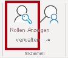
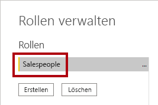
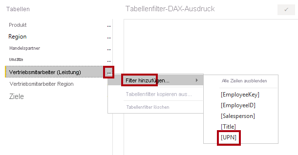
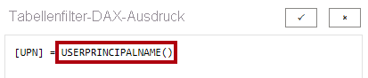
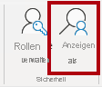
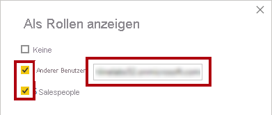
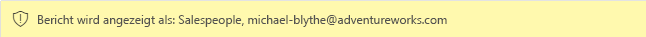
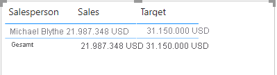
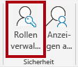
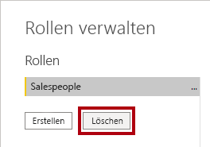

---
lab:
  title: Erzwingen von Sicherheit auf Zeilenebene
  module: Enforce Row-Level Security
---

# **Erzwingen von Sicherheit auf Zeilenebene**

## **Labszenario**

In diesem Lab erzwingen Sie die Sicherheit auf Zeilenebene, um sicherzustellen, dass ein Vertriebsmitarbeiter nur die Vertriebsdaten für die ihm zugewiesenen Regionen analysieren kann.

In diesem Lab lernen Sie Folgendes:

- Erzwingen von Sicherheit auf Zeilenebene
- Auswahl zwischen dynamischen und statischen Methoden

**Dieses Lab sollte ungefähr 45 Minuten in Anspruch nehmen.**

## **Erste Schritte**

In dieser Aufgabe richten Sie die Umgebung für das Lab ein.

*Wichtig: Wenn Sie nach einem vorherigen Lab fortfahren (und dieses Lab erfolgreich abgeschlossen haben), überspringen Sie diese Aufgabe und fahren mit der nächsten fort.*

1. Öffnen Sie Power BI Desktop.

    

    *Tipp: Standardmäßig wird das Dialogfeld „Erste Schritte“ vor Power BI Desktop geöffnet. Sie können sich mit **Anmelden** anmelden und das Popup dann schließen.*

1. Um die Power BI Desktop-Startdatei zu öffnen, wählen Sie **Datei > Bericht öffnen > Berichte durchsuchen** aus.

1. Navigieren Sie im Fenster **Öffnen** zum Ordner **D:\PL300\Labs\10-row-level-security\Starter**, und öffnen Sie die Datei **Verkaufsanalyse**.

1. Schließen Sie alle Informationsfenster, die möglicherweise geöffnet werden.

1. Beachten Sie die gelbe Warnmeldung unterhalb des Menübands. *In dieser Meldung werden Sie darauf hingewiesen, dass die Abfragen nicht als Modelltabellen geladen wurden. Sie wenden die Abfragen später in diesem Lab an.*
    
    *Klicken Sie rechts auf der gelben Warnmeldung auf das **X**, um die Warnmeldung zu verwerfen.*

1. Um eine Kopie der Datei zu erstellen, wechseln Sie zu **Datei > Speichern unter**, und speichern Sie sie im Ordner **D:\PL300\MySolution**.

1. Wenn Sie aufgefordert werden, Änderungen zu übernehmen, klicken Sie auf **Später übernehmen**.

## **Erzwingen von Sicherheit auf Zeilenebene**

In dieser Aufgabe erzwingen Sie Sicherheit auf Zeilenebene, um sicherzustellen, dass Vertriebsmitarbeiter nur Umsätze in den zugewiesenen Regionen anzeigen können.

1. Wechseln Sie zur Ansicht „Daten“.

   

1. Wählen Sie im Bereich **Daten** die Tabelle **Salesperson (Performance)** aus.

1. Wenn Sie die Daten überprüfen, werden Sie bemerken, dass Michael Blythe (EmployeeKey 281) den UPN-Wert **michael-blythe@adventureworks.com** hat.
    
    *Sie werden sich erinnern, dass Michael Blythe drei Vertriebsregionen zugewiesen ist: „USA, Nordosten“, „USA, Mitte“ und „USA, Südosten“.*

1. Wählen Sie auf der Registerkarte **Modellierung** des Menübands in der Gruppe **Sicherheit** die Option **Rollen verwalten** aus.

    

1. Wählen Sie im Fenster **Rollen verwalten** die Option **Erstellen** aus.

1. Ersetzen Sie im Feld den ausgewählten Text durch den Namen der Rolle: Geben Sie **Salespeople** ein, und drücken Sie dann die **EINGABETASTE**.

   

1. Wenn Sie der Tabelle **Salesperson (Performance)** einen Filter zuweisen möchten, klicken Sie auf das Symbol mit den Auslassungspunkten (...), und wählen Sie **Filter hinzufügen \| [UPN]** aus.

   

1. Ändern Sie im Feld **Tabellenfilter-DAX-Ausdruck** den Ausdruck, indem Sie **Value** durch **USERPRINCIPALNAME()** ersetzen, und klicken Sie auf **Speichern**.
    
    *USERPRINCIPALNAME() ist eine DAX-Funktion (Data Analysis Expressions), die den Namen des authentifizierten Benutzers zurückgibt. Dies bedeutet, dass die Tabelle **Salesperson (Performance)** nach dem Benutzerprinzipalnamen (User Principal Name, UPN) des Benutzers gefiltert wird, der das Modell abfragt.*

   

1. Zum Testen der Sicherheitsrolle wählen Sie auf der Registerkarte **Modellierung** des Menübands in der Gruppe **Sicherheit** die Option **Anzeigen als** aus.

   

1. Aktivieren Sie im Fenster **Als Rollen anzeigen** das Element **Anderer Benutzer**, und geben Sie dann in das entsprechende Feld Folgendes ein: **michael-blythe@adventureworks.com**

1. Aktivieren Sie die Rolle **Salespeople**, und klicken Sie auf **OK**.
    
    *Diese Konfiguration führt dazu, dass die Rolle **Salespeople** verwendet und die Identität des Benutzers mit dem Namen „Michael Blythe“ angenommen wird.*

   

1. Beachten Sie das gelbe Banner oberhalb der Berichtsseite, das den Testsicherheitskontext angibt.

   

1. Beachten Sie, dass im Tabellenvisual nur der Vertriebsmitarbeiter **Michael Blythe** aufgeführt ist.

   

1. Wählen Sie zum Beenden des Tests auf der rechten Seite des gelben Banners **Anzeige beenden** aus.

   

1. Wählen Sie zum Löschen der Rolle **Salespeople** auf der Registerkarte **Modellierung** des Menübands in der Gruppe **Sicherheit** die Option **Rollen verwalten** aus.

   

1. Wählen Sie im Fenster **Rollen verwalten** die Option **Löschen** aus. Wenn Sie aufgefordert werden, den Löschvorgang zu bestätigen, wählen Sie **Ja, Löschen** aus.

   

### **Abschluss**

Mit dieser Aufgabe schließen Sie das Lab ab.

1. Wählen Sie **Speichern** aus, und speichern Sie dann die Power BI Desktop-Datei, um das Lab zu beenden.

*Hinweis: Wenn die Power BI Desktop-Datei im Power BI-Dienst veröffentlicht wird, müssen Sie noch eine Aufgabe nach der Veröffentlichung durchführen, um der Rolle **Salespeople** Sicherheitsprinzipale zuzuordnen. Das erledigen Sie in diesem Lab nicht.*
