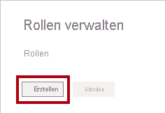
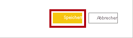
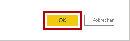
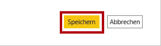

---
lab:
  title: Erzwingen von Sicherheit auf Zeilenebene
  module: Module 13 - Row-Level Security
---

# **Erzwingen von Sicherheit auf Zeilenebene**

**Die geschätzte Dauer dieses Labs beträgt 45 Minuten.**

In this lab you will create a many-to-many relationship between the <bpt id="p1">**</bpt>Salesperson<ept id="p1">**</ept> table and the <bpt id="p2">**</bpt>Sales<ept id="p2">**</ept> table. You will also enforce row-level security to ensure that a salesperson can only analyze sales data for their assigned region(s).

In diesem Lab lernen Sie Folgendes:

- Wie m:n-Beziehungen konfiguriert werden

- Erzwingen von Sicherheit auf Zeilenebene

### **Labszenario**

This lab is one of many in a series of labs that was designed as a complete story from data preparation to publication as reports and dashboards. You can complete the labs in any order. However, if you intend to work through multiple labs, for the first 10 labs, we suggest you do them in the following order:

1. Vorbereiten von Daten in Power BI Desktop

2. Laden von Daten in Power BI Desktop

3. Modellieren von Daten in Power BI Desktop

5. Erstellen von DAX-Berechnungen in Power BI Desktop, Teil 1

6. Erstellen von DAX-Berechnungen in Power BI Desktop, Teil 2

7. Entwerfen eines Berichts in Power BI Desktop, Teil 1

8. Entwerfen eines Berichts in Power BI Desktop, Teil 2

9. Erstellen eines Power BI-Dashboards

10. Analysieren von Daten in Power BI Desktop

11. **Erzwingen von Sicherheit auf Zeilenebene**

## **Übung 1: Erzwingen von Sicherheit auf Zeilenebene**

In dieser Übung erzwingen Sie Sicherheit auf Zeilenebene, um sicherzustellen, dass Vertriebsmitarbeiter*innen nur Umsätze in den zugewiesenen Regionen anzeigen können.

### **Aufgabe 1: Erste Schritte**

In dieser Aufgabe richten Sie die Umgebung für das Lab ein.

*Wichtig: Wenn Sie nach einem vorherigen Lab fortfahren (und dieses Lab erfolgreich abgeschlossen haben), überspringen Sie diese Aufgabe und fahren mit der nächsten fort.*

1. Klicken Sie zum Öffnen von Power BI Desktop auf der Taskleiste auf die Verknüpfung „Microsoft Power BI Desktop“.

    

1. Um das Fenster „Erste Schritte“ zu schließen, klicken Sie links oben im Fenster auf das **X**.

    

1. Um die Startdatei für Power BI Desktop zu öffnen, klicken Sie auf die Registerkarte **Datei** des Menübands, um die Backstage-Ansicht zu öffnen.

1. Wählen Sie **Bericht öffnen** aus.

    

1. Klicken Sie auf **Berichte durchsuchen**.

    

1. Navigieren Sie im Fenster **Öffnen** zum Ordner **D:\PL300\Labs\12-row-level-security\Starter**.

1. Wählen Sie die Datei **Sales Analysis** aus.

1. Klicken Sie auf **Öffnen**.

    

1. Schließen Sie alle Informationsfenster, die möglicherweise geöffnet werden.

1. Um eine Kopie der Datei zu erstellen, klicken Sie auf die Registerkarte **Datei** des Menübands, um die Backstage-Ansicht zu öffnen.

1. Wählen Sie **Speichern unter** aus.

    

1. Wenn Sie aufgefordert werden, die Abfragen anzuwenden, klicken Sie auf **Anwenden**.

    

1. Navigieren Sie im Fenster **Speichern unter** zum Ordner **D:\PL300\MySolution**.

1. Klicken Sie auf **Speichern**.

    

### **Aufgabe 2: Erzwingen von Sicherheit auf Zeilenebene**

In dieser Aufgabe erzwingen Sie Sicherheit auf Zeilenebene, um sicherzustellen, dass Vertriebsmitarbeiter*innen nur Umsätze in den zugewiesenen Regionen anzeigen können.

1. Wechseln Sie zur Ansicht „Daten“.

    

2. Wählen Sie im Bereich **Felder** die Tabelle **Salesperson (Performance)** aus.

3. Wenn Sie die Daten überprüfen, werden Sie bemerken, dass Michael Blythe (EmployeeKey 281) den UPN-Wert **michael-blythe@adventureworks.com** hat.

    *Denken Sie daran, dass Michael Blythe drei Vertriebsregionen zugewiesen ist: „US Northeast“, „US Central“ und „US Southeast“.*

4. Wechseln Sie zur Ansicht „Bericht“.

5. Klicken Sie auf der Registerkarte **Modellierung** des Menübands in der Gruppe **Sicherheit** auf **Rollen verwalten**.

    

6. Klicken Sie im Fenster **Rollen verwalten** auf **Erstellen**.

    

7. Ersetzen Sie im Feld den ausgewählten Text durch den Namen der Rolle: Geben Sie **Salespeople** ein, und drücken Sie dann die **EINGABETASTE**.

    

8. Wenn Sie der Tabelle **Salesperson (Performance)** einen Filter zuweisen möchten, klicken Sie auf das Symbol mit den Auslassungspunkten (...) und wählen dann **Filter hinzufügen \| [UPN]** aus.

    

9. Ändern Sie im Feld **Tabellenfilter-DAX-Ausdruck** den Ausdruck, indem Sie **Value** durch **USERPRINCIPALNAME()** ersetzen.

    

    *USERPRINCIPALNAME() ist eine DAX-Funktion (Data Analysis Expressions), die den Namen des authentifizierten Benutzers zurückgibt. Dies bedeutet, dass die Tabelle **Salesperson (Performance)** nach dem Benutzerprinzipalnamen (User Principal Name, UPN) des Benutzers gefiltert wird, der das Modell abfragt.*

10. Klicken Sie auf **Speichern**.

    

11. Zum Testen der Sicherheitsrolle klicken Sie auf der Registerkarte **Modellierung** des Menübands in der Gruppe **Sicherheit** auf **Anzeigen als**.

    

12. Aktivieren Sie im Fenster **Als Rollen anzeigen** das Element **Anderer Benutzer**, und geben Sie dann in das entsprechende Feld Folgendes ein: **michael-blythe@adventureworks.com**

13. Wählen Sie die Rolle **Salespeople** aus.

    

    *Diese Konfiguration führt dazu, dass die Rolle **Salespeople** verwendet und die Identität des Benutzers mit dem Namen „Michael Blythe“ angenommen wird.*

14. Klicken Sie auf **OK**.

    

15. Beachten Sie das gelbe Banner oberhalb der Berichtsseite, das den Testsicherheitskontext angibt.

    

16. Beachten Sie, dass im Tabellenvisual nur der Vertriebsmitarbeiter **Michael Blythe** aufgeführt ist.

    

17. Klicken Sie zum Beenden des Tests auf der rechten Seite des gelben Banners auf **Anzeige beenden**.

    

    *Wenn die Power BI Desktop-Datei im Power BI-Dienst veröffentlicht wird, müssen Sie noch eine Aufgabe nach der Veröffentlichung durchführen, um der Rolle **Salespeople** Sicherheitsprinzipale zuzuordnen. Das erledigen Sie in diesem Lab nicht.*

18. Klicken Sie zum Löschen der Rolle auf der Registerkarte **Modellierung** des Menübands in der Gruppe **Sicherheit** auf **Rollen verwalten**.

    

19. Klicken Sie im Fenster **Rollen verwalten** auf **Löschen**.

    

20. Wenn Sie aufgefordert werden, den Löschvorgang zu bestätigen, klicken Sie auf **Ja, löschen**.

21. Klicken Sie auf **Speichern**.

    

### **Aufgabe 2: Abschluss**

Mit dieser Aufgabe schließen Sie das Lab ab.

1. Speichern Sie die Power BI Desktop-Datei.
