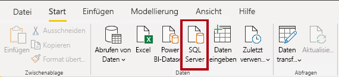
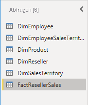
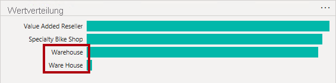
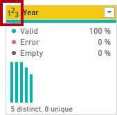

---
lab:
  course: 'PL-300, DP-605'
  title: Abrufen von Daten in Power BI Desktop
  module: Get Data in Power BI
---

# Abrufen von Daten in Power BI Desktop

## **Labszenario**

In diesem Lab erfahren Sie mehr über die Anwendung Power BI Desktop, wie Sie eine Verbindung mit Daten herstellen und wie Sie Datenvorschautechniken verwenden, um die Eigenschaften und die Qualität der Quelldaten zu verstehen. Sie Lernziele sind:

- Öffnen von Power BI Desktop
- Verbindungsherstellung mit verschiedenen Datenquellen
- Vorschau der Quelldaten mit Power Query
- Verwenden von Datenprofilerstellungsfeatures in Power Query

**Dieses Lab sollte ungefähr 30 Minuten in Anspruch nehmen.**

## **Erste Schritte mit Power BI Desktop**

 In dieser Aufgabe öffnen Sie zunächst eine Power BI-Starterdatei (PBIX). Die Starterdatei enthält keine Daten, wurde jedoch speziell für die Durchführung des Labs konfiguriert. Die folgenden Einstellungen auf Berichtsebene wurden in der Startdatei deaktiviert:

- Datenladevorgang > Beim ersten Laden Beziehungen aus Datenquellen importieren
- Datenladevorgang > Neue Beziehungen nach dem Laden der Daten automatisch erkennen

*Hinweis: Obwohl diese beiden Optionen bei der Entwicklung eines Datenmodells hilfreich sein können, haben Sie sie zuvor deaktiviert, um die Labumgebung zu unterstützen. Wenn Sie Beziehungen im Lab **Laden von transformierten Daten in Power BI Desktop** erstellen, erfahren Sie, warum Sie die einzelnen Elemente hinzufügen.*

1. Öffnen Sie Power BI Desktop.

    

1. Um die Power BI Desktop-Starterdatei zu öffnen, wählen Sie **Öffnen > Dieses Gerät durchsuchen**.

1. Navigieren Sie im Fenster **Öffnen** zum Ordner **D:\Allfiles\Labs\01-prepare-data-with-power-query-in-power-bi-desktop\Starter**.

1. Wählen Sie die Datei **Sales Analysis** aus.

    *Hinweis: An dieser Stelle werden Sie von Power BI aufgefordert, sich anzumelden, falls Sie das noch nicht getan haben. Sie können sich entweder anmelden oder **Abbrechen** wählen und das Lab fortsetzen.*

1. Speichern Sie eine Kopie der Datei mit **Datei > Speichern unter** im Ordner **D:\Allfiles\MySolution**.

## **Abrufen von Daten aus SQL Server**

In dieser Aufgabe erfahren Sie, wie Sie eine Verbindung mit einer SQL Server-Datenbank herstellen und Tabellen importieren, mit denen Abfragen in Power Query erstellt werden.

1. Wählen Sie auf der Registerkarte **Start** des Menübands in der Gruppe **Daten** die Option **SQL Server** aus.

     

1. Geben Sie im Fenster **SQL Server-Datenbank** im Feld **Server** den Text **localhost** ein. Lassen Sie **Datenbank** leer, und wählen Sie dann **OK** aus.

    *Hinweis: In diesem Lab stellen Sie mithilfe von **localhost** eine Verbindung mit der SQL Server-Datenbank her, da Gatewaydatenquellen **localhost** nicht auflösen können. Dies wird nicht als Vorgehensweise beim Erstellen eigener Lösungen empfohlen.*

1. Wenn Sie zur Eingabe von Anmeldeinformationen aufgefordert werden, klicken Sie im Fenster **SQL Server-Datenbank** auf **Aktuelle Anmeldeinformationen verwenden** und wählen sie **Verbinden** aus.

1. Erweitern Sie im Bereich **Navigator** die Datenbank **AdventureWorksDW2020**.

    *Hinweis: Die **AdventureWorksDW2020**-Datenbank basiert auf der **AdventureWorksDW2017**-Beispieldatenbank. Sie wurde geändert, um die Lernziele der Kurslabs zu unterstützen.*

1. Wählen Sie die Tabelle **DimEmployee** aus, und betrachten Sie die Vorschau der Tabellendaten.

     

    *Hinweis: Diesen Vorschaudaten können Sie die Spalten und eine Auswahl von Zeilen entnehmen.*

1. Um die Tabellendaten zu importieren, **aktivieren Sie das Kontrollkästchen** neben den folgenden sechs Tabellen:

    - DimEmployee
    - DimEmployeeSalesTerritory
    - DimProduct
    - DimReseller
    - DimSalesTerritory
    - FactResellerSales

1. Führen Sie diese Aufgabe aus, indem Sie **Daten transformieren** auswählen, wodurch Power Query-Editor geöffnet wird.

Sie haben nun eine Verbindung zu den Daten hergestellt und der Power Query-Editor steht Ihnen für die nächste Aufgabe zur Verfügung.

## **Vorschau der Daten in Power Query-Editor**

Diese Aufgabe führt den Power Query-Editor ein und ermöglicht es Ihnen, die Daten zu überprüfen und ein Profil zu erstellen. Auf diese Weise können Sie bestimmen, wie die Daten später bereinigt und transformiert werden. Außerdem überprüfen Sie sowohl Dimensionstabellen mit dem Präfix „Dim“ als auch Faktentabellen mit dem Präfix „Fakt“.

1. Sehen Sie sich im Fenster **Power Query-Editor** links den Bereich **Abfragen** an. Der Bereich **Abfragen** enthält je eine Abfrage für jede ausgewählte Tabelle.

     

1. Wählen Sie die erste Abfrage aus: **DimEmployee**.

    *Die Tabelle **DimEmployee** in der SQL Server-Datenbank speichert eine Zeile für jeden Mitarbeiter. Eine Teilmenge der Zeilen aus dieser Tabelle stellt die Vertriebsmitarbeiter dar, die für das von Ihnen zu entwickelnde Modell relevant sind.*

1. Sehen Sie sich unten links in der Statusleiste die Tabellenstatistik an. Die Tabelle besteht aus 33 Spalten und 296 Zeilen.

     

1. Scrollen Sie im Bereich „Datenvorschau“ horizontal, um alle Spalten zu überprüfen. Beachten Sie, dass die letzten fünf Spalten Verknüpfungen mit **Tabellen** oder **Werten** enthalten.

    *Diese fünf Spalten stellen Beziehungen zu anderen Tabellen in der Datenbank dar. Mit ihnen können Sie Tabellen miteinander verknüpfen. Tabellen werden im Lab **Laden von transformierten Daten in Power BI Desktop** verknüpft.*

1. Aktivieren Sie zum Überprüfen der Spaltenqualität auf der Registerkarte **Ansicht** des Menübands in der Gruppe **Datenvorschau** das Kontrollkästchen **Spaltenqualität**. Über die Funktion „Spaltenqualität“ können Sie den Prozentsatz von gültigen, fehlerhaften und leeren Spaltenwerten ganz einfach ermitteln.

     

1. Beachten Sie, dass die Spalte **Position** 94 % leere Zeilen (NULL) enthält.

     

1. Aktivieren Sie zum Überprüfen der Spaltenverteilung auf der Registerkarte **Ansicht** des Menübands in der Gruppe **Datenvorschau** die Option **Spaltenverteilung**.

1. Sehen Sie sich wieder die Spalte **Position** an. Wie Sie sehen, enthält diese vier verschiedene Werte und einen eindeutigen Wert.

1. Überprüfen Sie die Spaltenverteilung für die Spalte **EmployeeKey**. Diese enthält 296 unterschiedliche („distinct“) Werte und 296 eindeutige („unique“) Werte.

    *Wenn die Anzahl der unterschiedlichen und eindeutigen Werte identisch ist, bedeutet dies, dass die Spalte eindeutige Werte enthält. Beim Modellieren ist es wichtig, dass einige Modelltabellen eindeutige Spalten aufweisen. Mit diesen eindeutigen Spalten können 1:n-Beziehungen erstellt werden, was im Lab **Modelldaten in Power BI Desktop** erfolgt.*

     

1. Wählen Sie im Bereich **Abfragen** die Abfrage für **DimProduct** aus.

    *Die Tabelle **DimProduct** enthält je eine Zeile für jedes vom Unternehmen verkaufte Produkt.*

1. Wählen Sie im Bereich **Abfragen** die Abfrage für **DimReseller** aus.

    *Die Tabelle **DimReseller** enthält eine Zeile pro Wiederverkäufer. Wiederverkäufer verkaufen oder verteilen die Adventure Works-Produkte oder fügen ihnen einen Mehrwert hinzu.*

1. Aktivieren Sie auf der Registerkarte **Ansicht** des Menübands in der Gruppe **Datenvorschau** die Option **Spaltenprofil**, um Spaltenwerte anzuzeigen.

1. Wählen Sie die Spaltenüberschrift **BusinessType** aus, und beachten Sie den neuen Bereich unter dem Datenvorschaubereich.

1. Überprüfen Sie die Spaltenstatistiken und die Werteverteilung im Bereich „Datenvorschau“.

    *Wie Sie sehen, liegt ein Datenqualitätsproblem vor: Es gibt zwei Bezeichnungen für „Warehouse“ (**Warehouse** und das falsch geschriebene **Ware House**).*

     

1. Zeigen Sie mit dem Mauszeiger auf den Balken für **Ware House**. Wie Sie sehen, gibt es fünf Zeilen mit diesem Wert.

    *Sie wenden im Lab **Laden von transformierten Daten in Power BI Desktop** eine Transformation an, um diese fünf Zeilen neu zu bezeichnen.*

1. Wählen Sie im Bereich **Abfragen** die Abfrage für **DimSalesTerritory** aus.  

    *Die Tabelle **DimSalesTerritory** enthält eine Zeile pro Vertriebsregion, einschließlich **Corporate HQ** (Hauptsitz). Regionen werden einem Land und Länder werden Gruppen zugewiesen. Im Lab **Modelldaten in Power BI Desktop** erstellen Sie eine Hierarchie zur Unterstützung der Analyse auf Regions-, Länder- oder Gruppenebene.*

1. Wählen Sie im Bereich **Abfragen** die Abfrage für **FactResellerSales** aus.

    *Die Tabelle **FactResellerSales** enthält je eine Zeile für jede Auftragsposition. Ein Verkaufsauftrag enthält eine oder mehrere solcher Positionen.*

1. Überprüfen Sie die Spaltenqualität für die Spalte **TotalProductCost**. Wie Sie sehen, sind 8 % der Zeilen leer.

    *Die fehlenden Werte in der Spalte **TotalProductCost** sind ein Datenqualitätsproblem. Um dieses Problem zu behandeln, wenden Sie im Lab **Laden von transformierten Daten in Power BI Desktop** Transformationen an, um die fehlenden Werte mithilfe der in der zugehörigen Tabelle **DimProduct** gespeicherten Standardproduktkosten zu ergänzen.*

## **Abrufen von Daten aus einer CSV-Datei**

In dieser Aufgabe erstellen Sie eine neue Abfrage basierend auf CSV-Dateien.

1. Wählen Sie zum Hinzufügen einer neuen Abfrage im Fenster **Power Query-Editor** auf der Registerkarte **Start** des Menübands in der Gruppe **Neue Abfrage** den Pfeil nach unten bei **Neue Quelle** und dann **Text/CSV** aus.

1. Navigieren Sie im Fenster **Öffnen** zum Ordner **D:\Allfiles\Resources**, und wählen Sie die Datei **ResellerSalesTargets.csv** aus. Klicken Sie auf **Öffnen**.

1. Sehen Sie sich die Vorschaudaten im Fenster **ResellerSalesTargets.csv** an. Klicken Sie auf **OK**.

1. Beachten Sie, dass im Bereich **Abfragen** die Abfrage für **ResellerSalesTargets** hinzugefügt wurde.

    *Die CSV-Datei **ResellerSalesTargets** enthält eine Zeile pro Vertriebsmitarbeiter und Jahr. In jeder Zeile werden 12 monatliche Umsatzziele (ausgedrückt in Tausend) aufgezeichnet. Das Geschäftsjahr für die Firma Adventure Works beginnt am 1. Juli.*

1. Beachten Sie auch, dass keine der Spalten leere Werte enthält.  Wenn kein monatliches Verkaufsziel vorhanden ist, wird stattdessen ein Bindestrich eingetragen.

1. Überprüfen Sie die Symbole in den einzelnen Spaltenüberschriften links neben dem Spaltennamen. Die Symbole stehen für den Datentyp der jeweiligen Spalte. **123** steht für ganze Zahlen und **ABC** für Text.

     

1. Wiederholen Sie die Schritte zum Erstellen einer Abfrage auf Grundlage der Datei **D:\Allfiles\Resources\ColorFormats.csv**.

    *Die CSV-Datei **ColorFormats** enthält eine Zeile pro Produktfarbe. Jede Zeile zeichnet die HEX-Codes auf, um Hintergrund- und Schriftfarben zu formatieren.*

*Sie sollten jetzt über zwei neue Abfragen verfügen: **ResellerSalesTargets** und **ColorFormats**.*

 

### **Abschluss**

Mit dieser Aufgabe schließen Sie das Lab ab.

1. Deaktivieren Sie auf der Registerkarte **Ansicht** des Menübands in der Gruppe **Datenvorschau** die folgenden drei Datenvorschauoptionen, die Sie zuvor in diesem Lab aktiviert haben:

    - Spaltenqualität
    - Spaltenverteilung
    - Spaltenprofil

     

1. **Speichern** Sie die Power BI Desktop-Datei. Wenn Sie aufgefordert werden, die ausstehenden Änderungen zu übernehmen, wählen Sie **Später übernehmen** aus.

    *Tipp: Durch das Anwenden der Abfragen werden ihre Daten in das Datenmodell geladen. Sie sind hierzu noch nicht bereit, da es noch viele Transformationen gibt, die zuerst übernommen werden müssen.*
