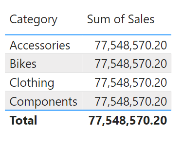
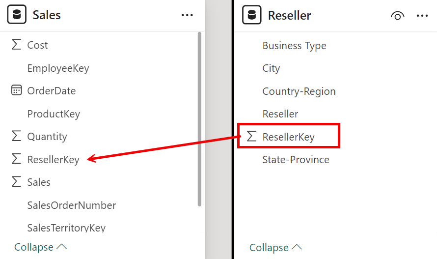
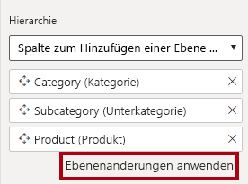
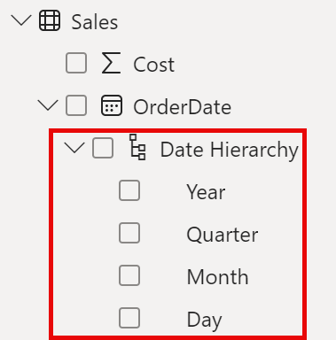
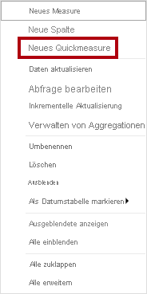
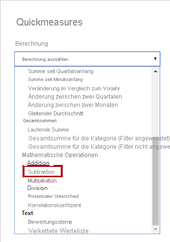
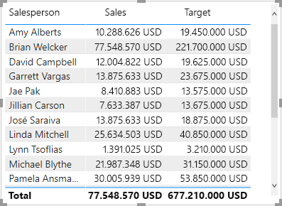

---
lab:
  title: Entwerfen eines Datenmodells in Power BI
  module: Design a Data Model in Power BI
---

# Entwerfen eines Datenmodells in Power BI

## Labszenario

In diesem Lab beginnen Sie mit der Entwicklung des Datenmodells. Dies umfasst das Erstellen von Beziehungen zwischen Tabellen und das anschließende Konfigurieren von Tabellen- und Spalteneigenschaften, um die Benutzerfreundlichkeit und Nutzbarkeit des Datenmodells zu verbessern. Außerdem erstellen Sie Hierarchien und Quickmeasures.

In diesem Lab lernen Sie Folgendes:

- Erstellen von Modellbeziehungen
- Konfigurieren von Tabellen- und Spalteneigenschaften
- Erstellen von Hierarchien

**Dieses Lab sollte ungefähr 45 Minuten in Anspruch nehmen.**

## Erste Schritte

Um diese Übung abzuschließen, öffnen Sie zuerst einen Webbrowser, und geben Sie die folgende URL ein, um den ZIP-Ordner herunterzuladen:

`https://github.com/MicrosoftLearning/PL-300-Microsoft-Power-BI-Data-Analyst/raw/Main/Allfiles/Labs/03-configure-data-model-in-power-bi-desktop/03-model-data.zip`

Extrahieren Sie den Ordner in den Ordner **C:\Users\Student\Downloads\03-model-data**.

Öffnen Sie die Datei **03-Starter-Sales Analysis.pbix** .

> ***Hinweis**: Sie können die Anmeldung abbrechen, indem Sie **Abbrechen** wählen. Schließen Sie alle anderen Informationsfenster. Wählen Sie **Später anwenden**, wenn Sie aufgefordert werden, die Änderungen anzuwenden.*

## Erstellen von Modellbeziehungen

In dieser Aufgabe erstellen Sie Modellbeziehungen. Die Datei wurde so konfiguriert, dass keine Beziehungen zwischen Tabellen identifiziert werden, was nicht die Standardeinstellung ist, jedoch empfohlen wird, um zusätzliche Arbeit beim Erstellen der richtigen Beziehungen für Ihr Modell zu vermeiden.

> **Wichtig**: *In den Labs wird eine verkürzte Notation verwendet, um auf ein Feld zu verweisen. Das sieht folgendermaßen aus: **Product \| Category**. In diesem Beispiel ist **Product** der Tabellenname und **Category** der Feldname.*

1. Wählen Sie links in Power BI Desktop das Symbol für die **Berichtansicht** aus.

     

1. Klicken Sie im Bereich **Daten** mit der rechten Maustaste auf einen leeren Bereich, und wählen Sie dann **Alle erweitern** aus.

1. Aktivieren Sie zum Erstellen eines Tabellenvisuals im Bereich **Daten** innerhalb der Tabelle **Product** das Feld **Category**.

1. Aktivieren Sie im Bereich **Daten** das Feld **Sales \| Sales**, um eine weitere Spalte zur Tabelle hinzuzufügen.

1. Beachten Sie, dass das Tabellenvisual vier Produktkategorien aufführt und dass der Umsatzwert für alle Kategorien sowie für den Gesamtwert gleich ist.

     

     > *Das Problem besteht darin, dass die Tabelle auf Feldern aus anderen Tabellen basiert. Es wird erwartet, dass jede Produktkategorie den Umsatz für die Kategorie anzeigt. Allerdings wird die Tabelle **Sales** nicht gefiltert, da zwischen diesen Tabellen keine Modellbeziehung besteht. Im Folgenden fügen Sie eine Beziehung hinzu, um Filter zwischen den Tabellen weiterzugeben.*

1. Wählen Sie im linken Navigationsbereich das Symbol für die **Modellansicht** aus und wählen Sie dann **Beziehungen verwalten** aus.

     

1. Beachten Sie, dass im Fenster **Beziehungen verwalten** keine Beziehungen definiert sind. Wählen Sie **Neue Beziehung** aus, um eine Beziehung zu erstellen.

1. Konfigurieren Sie die Beziehung der Tabelle **Product** zur Tabelle **Sales**. Beachten Sie, dass die folgenden Elemente automatisch konfiguriert wurden:

    - **In jeder Tabelle ist die Spalte „ProductKey“ ausgewählt**. *Die Spalten wurden ausgewählt, da sie denselben Namen und Datentyp aufweisen. Möglicherweise müssen Sie übereinstimmende Spalten mit unterschiedlichen Namen in realen Daten finden.*
    - **Der Kardinalitätstyp ist Eins-zu-viele (1:\*)**. *Die Kardinalität wurde automatisch ermittelt, da Power BI versteht, dass die Spalte **ProductKey** der Tabelle **Product** eindeutige Werte enthält. 1:n-Beziehungen sind die gängigste Kardinalität, und alle Beziehungen, die Sie in diesem Lab erstellen, weisen diesen Typ auf.*
    - **Der Typ der Kreuzfilterrichtung ist „Single“**. *Die Filterrichtung „Einfach“ bedeutet, dass die Filter von der Seite „1“ zur Seite „n“ weitergegeben werden. In diesem Fall werden die Filter, die auf die Tabelle **Product** angewandt wurden, an die Tabelle **Sales** weitergegeben, aber nicht in die andere Richtung.*
    - **Das Kontrollkästchen „Diese Beziehung aktivieren“ ist markiert**. *Aktive Beziehungen geben Filter weiter. Eine Beziehung kann als inaktiv gekennzeichnet werden, damit die Filter nicht weitergegeben werden. Inaktive Beziehungen können vorhanden sein, wenn mehrere Beziehungspfade zwischen Tabellen vorliegen. In diesem Fall können Modellberechnungen spezielle Funktionen nutzen, um sie zu aktivieren.*

     

1. Wählen Sie **OK** aus, überprüfen Sie, ob die neue Beziehung im Fenster **Beziehungen verwalten** aufgelistet wird, und wählen Sie dann **Schließen** aus.

     

Beachten Sie, dass jetzt ein Connector zwischen den beiden Tabellen vorhanden ist (*es spielt keine Rolle, ob die Tabellen nebeneinander positioniert sind*).
    - Sie können die Kardinalität interpretieren, die durch die Indikatoren **1** und **(*)** dargestellt wird.
    - Die Filterrichtung wird von einer Pfeilspitze dargestellt.
    - Eine durchgängige Linie stellt eine aktive Beziehung dar, während eine gestrichelte Linie eine inaktive Beziehung darstellt.
    - Zeigen Sie mit dem Cursor auf die Beziehung, um die zugehörigen Spalten hervorzuheben.

### Erstellen zusätzlicher Beziehungen

Es gibt eine einfachere Methode zum Erstellen einer Beziehung. Im Modelldiagramm können Sie Spalten per Drag & Drop gruppieren, um eine neue Beziehung zu erstellen.

1. Zum Erstellen einer neuen Beziehung auf andere Weise über die Tabelle **Reseller** ziehen Sie die Spalte **ResellerKey** auf die Spalte **ResellerKey** der Tabelle **Sales**.

    > ***Tipp**: Manchmal ist es nicht möglich, eine Spalte zu bewegen. Tritt eine solche Situation auf, wählen Sie zunächst eine andere Spalte und dann wieder die Spalte aus, die Sie bewegen möchten, und versuchen Sie es noch mal. Vergewissern Sie sich, dass die neue Beziehung im Diagramm hinzugefügt wurde.*

     

1. Erstellen Sie die folgenden zwei Modellbeziehungen mit der neuen Vorgehensweise:

     - **Region \| SalesTerritoryKey** mit **Sales \| SalesTerritoryKey**
     - **Salesperson \| EmployeeKey** mit **Sales \| EmployeeKey**

1. Ordnen Sie die Tabellen im Diagramm so an, dass die Tabelle **Sales** in der Mitte des Diagramms positioniert ist und die zugehörigen Tabellen darüber angeordnet sind. Platzieren Sie die getrennten Tabellen an der Seite.

     

1. Beachten Sie, dass das visuelle Tabellenelement in der Berichtsansicht aktualisiert wurde und dass verschiedene Werte für alle Produktkategorien angezeigt werden.

    > *Die Filter, die auf die Tabelle **Product** angewandt werden, werden nun an die Tabelle **Sales** weitergegeben.*

     

1. **Speichern** Sie die Power BI Desktop-Datei.

## Konfigurieren der Tabelle „Product“

In dieser Aufgabe konfigurieren Sie die Tabelle **Product** mit einer Hierarchie und einem Anzeigeordner.

1. Erweitern Sie in **Modellansicht > Datenbereich** bei Bedarf die Tabelle **Product**, um alle Felder anzuzeigen.

1. Klicken Sie zum Erstellen einer Hierarchie im Bereich „Daten“ mit der rechten Maustaste auf die Spalte **Category** und klicken Sie dann auf **Hierarchie erstellen**.

1. Aktualisieren Sie den Namen auf **Products** (klicken Sie mit der rechten Maustaste oder doppelklicken Sie, um den Namen zu ändern).

1. Scrollen Sie zum Hinzufügen einer zweiten Hierarchieebene im Bereich **Eigenschaften** in der Dropdownliste **Hierarchie** nach unten, und wählen Sie **Subcategory** aus (Sie müssen eventuell im Bereich nach unten scrollen).

1. Klicken Sie zum Hinzufügen einer dritten Hierarchieebene in der Dropdownliste **Hierarchie** auf **Product**.

1. Wählen Sie zum Abschließen der Hierarchieerstellung **Ebenenänderungen anwenden** aus.

     

1. Sehen Sie sich im Bereich **Daten** die Hierarchie **Products** an. Damit die Hierarchieebenen angezeigt werden, erweitern Sie die Hierarchie **Products**.

     

1. Wenn Sie die Spalten in einem Anzeigeordner organisieren möchten, klicken Sie im Bereich **Daten** zunächst auf die Spalte **Background Color Format**.

1. Wählen Sie die Spalte **Font Color Format** aus, während Sie **STRG** gedrückt halten.

1. Geben Sie im Bereich **Eigenschaften** im Feld **Anzeigeordner** **Formatting** ein.

     

1. Beachten Sie, dass sich die beiden Spalten im Bereich **Daten** nun in einem Ordner befinden.

   > *Anzeigeordner bieten eine sehr gute Möglichkeit, Tabellen zu organisieren, insbesondere diejenigen, die viele Felder enthalten. Sie dienen nur zur logischen Präsentation.*

     

## Konfigurieren der Tabelle „Region“

In dieser Aufgabe konfigurieren Sie die Tabelle **Region** mit einer Hierarchie und aktualisierten Kategorien.

1. Erstellen Sie in der Tabelle **Region** eine Hierarchie namens **Regions** mit den folgenden drei Ebenen:

     - Group
     - Country
     - Region

1. Wählen Sie die Spalte **Country** aus (nicht die Hierarchieebene **Country**).

1. Erweitern Sie im Bereich **Eigenschaften** den Abschnitt **Erweitert** (unten im Bereich), und wählen Sie dann in der Dropdownliste **Datenkategorie** die Option **Land/Region** aus.

    

    > *Eine Datenkategorisierung kann Hinweise für den Berichts-Designer geben. In diesem Fall gibt das Kategorisieren der Spalte als Land oder Region genauere Informationen beim Rendern einer Kartenvisualisierung durch Power BI.*

## Konfigurieren der Tabelle „Reseller“

In dieser Aufgabe konfigurieren Sie die Tabelle **Reseller**, um eine Hierarchie hinzuzufügen und Datenkategorien zu aktualisieren.

1. Erstellen Sie in der Tabelle **Reseller** eine Hierarchie namens **Resellers** mit den folgenden beiden Ebenen:

     - Business Type
     - Reseller

1. Erstellen Sie eine zweite Hierarchie namens **Geography** mit den folgenden vier Ebenen:

     - Country-Region
     - State-Province
     - City
     - Reseller

1. Legen Sie die **Datenkategorie** für die folgenden Spalten fest (nicht innerhalb der Hierarchie):

    - Country-Region als **Land/Region**
    - State-Province als **Bundesland/Kanton**
    - City als **Stadt**

## Konfigurieren der Tabelle „Sales“

In dieser Aufgabe konfigurieren Sie die Tabelle **Sales** mit aktualisierten Beschreibungen, Formatierungen und Zusammenfassungen.

1. Klicken Sie in der Tabelle **Sales** auf die Spalte **Cost**.

1. Geben Sie im Bereich **Eigenschaften** in das Feld **Beschreibung** Folgendes ein: *Basierend auf Standardkosten*.

 > *Beschreibungen können auf Tabellen, Spalten, Hierarchien oder Measures angewandt werden. Im Bereich **Daten** wird Beschreibungstext als QuickInfo angezeigt, wenn der Berichtersteller den Cursor über ein Feld bewegt.*

1. Klicken Sie auf die Spalte **Quantity**.

1. Verschieben Sie im Bereich **Eigenschaften** im Abschnitt **Formatierung** den Schieberegler für die Eigenschaft **Tausendertrennzeichen** auf **Ja**.

1. Klicken Sie auf die Spalte **Unit Price**.

1. Legen Sie die Eigenschaft **Dezimalstellen** im Bereich **Eigenschaften** im Abschnitt **Formatierung** auf **2** fest.

1. Klicken Sie in der Gruppe **Erweitert** (möglicherweise müssen Sie dazu nach unten scrollen) in der Dropdownliste **Zusammenfassen nach** auf **Durchschnitt**.

 > *Standardmäßig werden numerische Spalten zusammengefasst, indem Werte summiert werden. Dieses Standardverhalten ist jedoch nicht für Spalten wie **Unit Price** geeignet, in denen eine Rate dargestellt wird. Das Festlegen der Standardzusammenfassung auf einen Durchschnitt erzeugt ein aussagekräftiges Ergebnis.*

## Massenaktualisierung von Eigenschaften

Bei dieser Aufgabe aktualisieren Sie mehrere Spalten mit einer einzelnen Massenaktualisierung. Sie verwenden diesen Ansatz, um Spalten auszublenden und Spaltenwerte zu formatieren.

1. Wählen Sie im Bereich **Modellansicht** > **Daten** die Spalte **Produkt \|ProductKey** aus.

1. Wählen Sie die folgenden 13 Spalten aus, die sich über mehrere Tabellen erstrecken, und halten Sie dabei **STRG** gedrückt:

     - Region \| SalesTerritoryKey
     - Reseller \| ResellerKey
     - Sales \| EmployeeKey
     - Sales \| ProductKey
     - Sales \| ResellerKey
     - Sales \| SalesOrderNumber
     - Sales \| SalesTerritoryKey
     - Salesperson \| EmployeeID
     - Salesperson \| EmployeeKey
     - Salesperson \| UPN
     - SalespersonRegion \| EmployeeKey
     - SalespersonRegion \| SalesTerritoryKey
     - Targets \| EmployeeID

1. Bewegen Sie im Bereich **Eigenschaften** den Schieberegler für die Eigenschaft **Ist verborgen** auf **Ja**.

 > *Die Spalten wurden ausgeblendet, da sie entweder von Beziehungen oder in der Sicherheitskonfiguration oder Berechnungslogik auf Zeilenebene verwendet werden.*

  *Im Lab **Erstellen von DAX-Berechnungen in Power BI Desktop** verwenden Sie **SalesOrderNumber** in einer Berechnung.*

1. Nehmen Sie eine Mehrfachauswahl für die folgenden drei Spalten vor:

     - Product \| Standard Cost
     - Sales \| Cost
     - Sales \| Sales

1. Verschieben Sie im Bereich **Eigenschaften** im Abschnitt **Formatierung** den Schieberegler für die Eigenschaft **Dezimalstellen** auf **0** (null).

## Erkunden der Modell-Benutzeroberfläche

In dieser Aufgabe wechseln Sie zur Berichtsansicht, überprüfen die Benutzeroberfläche des Datenmodells und konfigurieren die Einstellung „Autom. Datum/Uhrzeit“.

1. Wechseln Sie zur **Berichtansicht**.

1. Sehen Sie sich im Bereich **Daten** Folgendes an:

     - Spalten, Hierarchien und die zugehörigen Ebenen sind Felder, die zum Konfigurieren von Berichtsvisuals verwendet werden können.
     - Nur Felder, die für die Berichterstellung relevant sind, werden angezeigt.
     - Die Tabelle **SalespersonRegion** wird nicht angezeigt, da alle dazugehörigen Felder ausgeblendet sind.
     - Felder mit räumlichen Daten in den Tabellen **Region** und **Reseller** werden mit einem entsprechenden Symbol hervorgehoben.
     - Felder mit dem Sigmasymbol (Ʃ) werden standardmäßig zusammengefasst.
     - Wenn der Cursor über das Feld **Sales \| Cost** bewegt wird, wird eine QuickInfo angezeigt.

1. Erweitern Sie das Feld **Sales \| OrderDate**. Daraufhin wird eine **Datumshierarchie** angezeigt. Das Feld **Targets \| TargetMonth** bietet eine ähnliche Hierarchie.

      

> **Wichtig**: *Diese Hierarchien wurden nicht von Ihnen erstellt. Sie wurden automatisch als Standardeinstellung erstellt. Es gibt jedoch ein Problem. Das Finanzjahr von Adventure Works beginnt am 1. Juli jedes Jahres. Diese automatisch erstellten Datumshierarchien beginnen jedoch am 1. Januar jedes Jahres.*

1. Um die Einstellung **Autom. Datum/Uhrzeit** zu deaktivieren, navigieren Sie zu **Datei > Optionen und Einstellungen > Optionen**.

1. Navigieren Sie im Abschnitt **Aktuelle Datei** zu **Datenladevorgang > Zeitintelligenz** und deaktivieren Sie das Kontrollkästchen **Autom. Datum/Uhrzeit**.

    

1. Beachten Sie, dass die Datumshierarchien im Bereich **Daten** nicht mehr verfügbar sind.

## Erstellen von Quickmeasures

In dieser Aufgabe erstellen Sie zwei Quickmeasures zur Berechnung des Gewinns und der Gewinnspanne. Quickmeasures erstellen die Berechnungsformel für Sie. Sie können diese schnell für einfache und häufige Berechnungen erstellen.

1. Klicken Sie im Bereich **Daten** mit der rechten Maustaste auf die Tabelle **Sales**, und wählen Sie dann die Option **Neues Quickmeasure** aus.

     

1. Wählen Sie im Fenster **Quickmeasures** in der Dropdownliste **Berechnung** innerhalb der Gruppe **Mathematische Operationen** die Option **Subtraktion** aus.

     

1. Erweitern Sie im Bereich **Daten** des Fensters **Quickmeasures** die Tabelle **Sales**.

1. Ziehen Sie das Feld **Sales** in das Feld **Basiswert**.

1. Ziehen Sie das Feld **Cost** in das Feld **Wert, der subtrahiert werden soll**, und wählen Sie dann **Hinzufügen** aus.  

     

1. Beachten Sie das neue Measure im Bereich **Daten** in der Tabelle **Sales**. 
    > *Measures werden durch das Rechnersymbol angezeigt.*

     

1. Um das Measure umzubenennen, klicken Sie mit der rechten Maustaste darauf, wählen Sie **Umbenennen** aus und benennen Se es dann in **Profit** um.

    > *Tipp: Zum Umbenennen eines Feldes können Sie auf dieses doppelklicken oder es auswählen und **F2** drücken.*

1. Fügen Sie in der Tabelle **Sales** ein zweites Quickmeasure basierend auf den folgenden Anforderungen hinzu:

     - Verwenden Sie die mathematische Operation **Division**.
     - Legen Sie als **Numerator** das Feld **Sales \| Profit** fest.
     - Legen Sie als **Denominator** das Feld **Sales \| Sales** fest.
     - Benennen Sie das Measure in **Profit Margin** um.

1. Stellen Sie sicher, dass das Measure **Profit Margin** ausgewählt ist, und legen Sie dann im Kontextmenüband **Messtools** das Format **Prozent** mit zwei Dezimalstellen fest.

     

1. Um die beiden Measures zu testen, wählen Sie zunächst das **Tabellenvisual** aus.

1. Markieren Sie die zwei Measures im Bereich **Daten**.

     

1. Wählen Sie die Führungslinie aus, und ziehen Sie diese, um das Tabellenvisual zu erweitern.

     

1. Stellen Sie sicher, dass die Measures sinnvolle Ergebnisse erzeugen, die ordnungsgemäß formatiert sind.

     

## Erstellen einer m:n-Beziehung

In dieser Aufgabe erstellen Sie eine m:n-Beziehung zwischen den Tabellen **Salesperson** und **Sales**.

1. Aktivieren Sie in Power BI Desktop in der Berichtsansicht im Bereich **Daten** die folgenden zwei Felder, um ein **Tabellenvisual** zu erstellen.

     - Salesperson \| Salesperson
     - Sales \| Sales

     

     > *Die Tabelle zeigt die Umsätze der einzelnen Vertriebsmitarbeiter an. Allerdings besteht eine weitere Beziehung zwischen den Vertriebsmitarbeiter*innen und den Umsätzen. Einige Vertriebsmitarbeiter gehören zu einer oder mehreren Vertriebsregionen. Darüber hinaus können den Vertriebsregionen mehrere Vertriebsmitarbeiter zugewiesen sein.*
     >
     > *Aus der Leistungsverwaltungsperspektive müssen die Umsätze von Vertriebsmitarbeiter*innen (anhand den ihnen zugewiesenen Regionen) analysiert und mit Verkaufszielen verglichen werden. In der nächsten Übung erstellen Sie Beziehungen, um diese Analyse zu unterstützen.*

1. Beachten Sie, dass **Michael Blythe** einen Umsatz von fast 9 Millionen Dollar erzielt hat.

1. Wechseln Sie zur Ansicht „Modell“ und ziehen Sie die Tabelle **SalespersonRegion** zwischen die Tabellen **Region** und **Salesperson**.

1. Erstellen Sie die folgenden zwei Modellbeziehungen per Drag & Drop:

     - **Salesperson \| EmployeeKey** mit **SalespersonRegion \| EmployeeKey**
     - **Region \| SalesTerritoryKey** mit **SalespersonRegion \| SalesTerritoryKey**

    > *Die Tabelle **SalespersonRegion** kann als Bridgingtabelle betrachtet werden.*

1. Wechseln Sie zur Berichtsansicht. Sie sollten sehen, dass das visuelle Element nicht aktualisiert wurde, d. h. die Ergebnisse für Michael Blythe wurden nicht geändert.

1. Wechseln Sie zurück zur Modellansicht, und führen Sie dann die Anweisungen für den Beziehungsfilter (Pfeilspitzen) von der Tabelle **Salesperson**.

     > *Beachten Sie, dass die Tabelle **Salesperson** die Tabelle **Sales** filtert. Außerdem filtert sie die Tabelle **SalespersonRegion**, gibt aber keine Filter an die Tabelle **Region** weiter (der Pfeil zeigt in die falsche Richtung).*

     

1. Doppelklicken Sie auf die Beziehung, um die Beziehung zwischen den Tabellen **Region** und **SalespersonRegion** zu bearbeiten.

1. Wählen Sie im Fenster **Beziehung bearbeiten** in der Dropdownliste **Kreuzfilterrichtung** die Option **Beide** aus.

1. Aktivieren Sie das Kontrollkästchen **Sicherheitsfilter in beide Richtungen anwenden** und wählen Sie „OK“ aus.

     

1. Beachten Sie, dass die Beziehung über Pfeile in beide Richtungen verfügt.

     

1. Wechseln Sie zur Berichtsansicht, und beachten Sie, dass die Umsätze sich noch immer nicht geändert haben.

    > *Das Problem besteht nun darin, dass es zwei mögliche Pfade für die Filterweiterleitung zwischen den Tabellen **Salesperson** und **Sales** gibt. Diese Mehrdeutigkeit wird anhand einer Bewertung nach der „geringsten Anzahl an Tabellen“ intern aufgelöst. Sie sollten keine Modelle mit einer solchen Mehrdeutigkeit erstellen. Das Problem wird später in diesem Lab und im Laufe des Labs **Erstellen von DAX-Berechnungen in Power BI Desktop** aufgegriffen.*

1. Wechseln Sie zur Modellansicht, um die Filterweitergabe über die Bridgingtabelle zu erzwingen. Bearbeiten Sie (per Doppelklick) die Beziehung zwischen den Tabellen **Salesperson** und **Sales**.

1. Deaktivieren Sie im Fenster **Beziehung bearbeiten** das Kontrollkästchen **Diese Beziehung aktivieren** und wählen Sie **OK** aus.

    > *Die Filterweitergabe erfolgt nun über den einzigen aktiven Pfad.*

1. Beachten Sie, dass die inaktive Beziehung im Diagramm mit einer gestrichelten Linie dargestellt wird.

     

1. Wechseln Sie zur Berichtsansicht, dort sollten Sie nun sehen, dass der Umsatz von Michael Blythe nun nahezu 22 Millionen Dollar beträgt.

     

1. Beachten Sie, dass die Umsätze aller Vertriebsmitarbeiter*innen die Tabellensumme überschreiten würden, wenn sie summiert werden.

     > *Dies kann bei m:n-Beziehungen häufig beobachtet werden, da die regionalen Verkaufsergebnisse mehrmals gezählt werden. Sehen Sie sich den zweiten Vertriebsmitarbeiter, Brian Welcker, in der Liste an. Sein Umsatz entspricht dem Gesamtumsatz. Dabei handelt es sich um das richtige Ergebnis, da er der Vertriebsleiter ist und sein Umsatz sich aus den Umsätzen aller Regionen ergibt.*
     >
     > *Zwar funktionieren die m:n-Beziehungen nun, jedoch ist es nicht möglich, den Umsatz von Vertriebsmitarbeitern zu analysieren (da die Beziehung inaktiv ist). Sie können die Beziehung reaktivieren, wenn Sie eine berechnete Tabelle einführen, die die Analyse von Umsätzen in den Vertriebsregionen ermöglicht, die den Vertriebsmitarbeitern (für die Leistungsanalyse) im Lab **Erstellen von DAX-Berechnungen in Power BI Desktop** zugewiesen wurden.*

1. Wechseln Sie zur Modellansicht und wählen Sie im Diagramm die Tabelle **Salesperson** aus.

1. Ersetzen Sie im Bereich **Eigenschaften** den Text im Feld **Name** durch **Salesperson (Performance)**.

    > *Die umbenannte Tabelle spiegelt nun ihren Zweck wider: Sie wird dazu verwendet, die Leistung von Vertriebsmitarbeiter*innen anhand ihrer Umsätze in den ihnen zugewiesenen Vertriebsregionen zu dokumentieren und zu analysieren.*

## Zuordnen der Targets-Tabelle

Im Rahmen dieser Aufgabe erstellen Sie eine Beziehung zur Tabelle **Targets**.

1. Erstellen Sie eine Beziehung zwischen den Spalten **Salesperson (Performance) \| EmployeeID** und **Targets \| EmployeeID**.

1. Fügen Sie in der Berichtsansicht das Feld **Targets \| Target** zum Tabellenvisual hinzu.

1. Ändern Sie die Größe des Tabellenvisuals, sodass alle Spalten angezeigt werden.

     

 > *Zwar können Sie nun Verkäufe und Ziele visualisieren, aber Sie sollten aus zwei Gründen vorsichtig vorgehen. Erstens gibt es keinen Filter für einen Zeitraum, weshalb Ziele auch zukünftige Zielwerte einschließen. Zweitens sind Ziele nicht additiv, weshalb die Summe nicht angezeigt werden sollte. Diese können entweder durch das Formatieren des visuellen Elements deaktiviert oder mithilfe von Berechnungslogik entfernt werden.*

## Lab abgeschlossen
