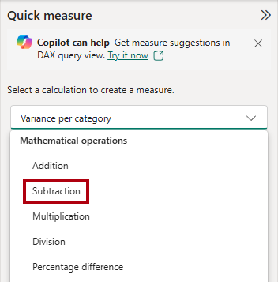
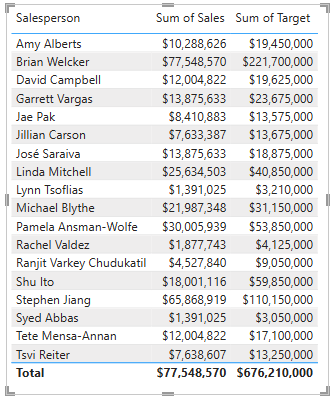

---
lab:
  title: "Konfigurieren eines Semantikmodells in Power\_BI"
  module: Configure a semantic model in Power BI
---

# Konfigurieren eines Semantikmodells in Power BI

## Labszenario

In diesem Lab beginnen Sie mit der Entwicklung des Datenmodells. Dies umfasst das Erstellen von Beziehungen zwischen Tabellen und das anschließende Konfigurieren von Tabellen- und Spalteneigenschaften, um die Benutzerfreundlichkeit und Nutzbarkeit des Datenmodells zu verbessern. Außerdem erstellen Sie Hierarchien und Quickmeasures.

In diesem Lab lernen Sie Folgendes:

- Erstellen von Modellbeziehungen.
- Konfigurieren von Tabellen- und Spalteneigenschaften.
- Erstellen von Hierarchien
- Erstellen von Quickmeasures
- Erstellen einer m:n-Beziehung

**Dieses Lab sollte ungefähr 45 Minuten in Anspruch nehmen.**

## Erste Schritte

Um diese Übung abzuschließen, öffnen Sie zuerst einen Webbrowser, und geben Sie die folgende URL ein, um die ZIP-Datei herunterzuladen:

`https://github.com/MicrosoftLearning/PL-300-Microsoft-Power-BI-Data-Analyst/raw/Main/Allfiles/Labs/03-configure-semantic-model/03-model-data.zip`

Extrahieren Sie die Datei in den Ordner **C:\Users\Student\Downloads\03-model-data**.

Öffnen Sie die Datei **03-Starter-Sales Analysis.pbix** .

> _**Hinweis**: Möglicherweise wird beim Laden der Datei ein Anmeldedialogfeld angezeigt. Wählen Sie **Abbrechen** aus, um das Anmeldedialogfeld zu schließen. Schließen Sie alle anderen Informationsfenster. Wählen Sie **Später übernehmen** aus, wenn Sie aufgefordert werden, die Änderungen anzuwenden._

## Erstellen von Modellbeziehungen

In dieser Aufgabe erstellen Sie Modellbeziehungen. Die Datei wurde so konfiguriert, dass keine Beziehungen zwischen Tabellen identifiziert werden, was nicht die Standardeinstellung ist, jedoch empfohlen wird, um zusätzliche Arbeit beim Erstellen der richtigen Beziehungen für Ihr Modell zu vermeiden.

> In den Labs wird eine verkürzte Notation verwendet, um auf ein Feld zu verweisen. Sie sieht wie folgt aus: `Product | Category`. In diesem Beispiel `Product` ist der Tabellenname und `Category` der Feldname.

1. Klicken Sie in Power BI Desktop im Bereich **Daten** mit der rechten Maustaste auf einen leeren Bereich, und wählen Sie dann **Alle erweitern** aus.

1. Aktivieren Sie zum Erstellen eines Tabellenvisuals im Bereich **Daten** innerhalb der Tabelle `Product` das Feld `Category`.

1. Aktivieren Sie im Bereich **Daten** das Feld `Sales | Sales`, um eine weitere Spalte zur Tabelle hinzuzufügen.

1. Beachten Sie, dass das Tabellenvisual vier Produktkategorien aufführt und dass der Umsatzwert für alle Kategorien sowie für den Gesamtwert gleich ist.

    

    > _Das Problem besteht darin, dass die Tabelle auf Feldern aus anderen Tabellen basiert. Es wird erwartet, dass jede Produktkategorie den Umsatz für die Kategorie anzeigt. Allerdings wird die Tabelle `Sales` nicht gefiltert, weil zwischen diesen Tabellen keine Modellbeziehung besteht. Im Folgenden fügen Sie eine Beziehung hinzu, um Filter zwischen den Tabellen weiterzugeben._

1. Um zum Modell-Designer zu wechseln, wählen Sie links das Symbol **Modellansicht** aus.

    

1. Wählen Sie im Menüband **Startseite** die Option **Beziehungen verwalten** aus.

    

1. Beachten Sie, dass im Fenster **Beziehungen verwalten** keine Beziehungen definiert sind.

1. Wählen Sie **+ Neue Beziehung** aus, um eine Beziehung zu erstellen.

1. Um eine Beziehung von der `Product`-Tabelle zur `Sales`-Tabelle zu konfigurieren, wählen Sie aus der Dropdownliste **Aus Tabelle** die `Product`-Tabelle und aus der Dropdownliste **In Tabelle** die `Sales`-Tabelle aus.

    

1. Beachten Sie, dass die folgenden Eigenschaften automatisch konfiguriert wurden:

    - **In jeder Tabelle ist die Spalte „ProductKey“ ausgewählt**. _Die Spalten wurden ausgewählt, da sie denselben Namen und Datentyp aufweisen. Möglicherweise müssen Sie übereinstimmende Spalten mit unterschiedlichen Namen in realen Daten finden._
    - **Der Kardinalitätstyp ist Eins-zu-viele (1:\*)**. _Die Kardinalität wurde automatisch ermittelt, weil Power BI versteht, dass die Spalte `ProductKey` der Tabelle `Product` eindeutige Werte enthält. 1:n-Beziehungen sind die gängigste Kardinalität, und alle Beziehungen, die Sie in diesem Lab erstellen, weisen diesen Typ auf._
    - **Der Typ der Kreuzfilterrichtung ist „Single“**. _Die Filterrichtung „Einfach“ bedeutet, dass die Filter von der Seite „1“ zur Seite „n“ weitergegeben werden. In diesem Fall werden die Filter, die auf die Tabelle `Product` angewandt wurden, an die Tabelle `Sales` weitergegeben, aber nicht in die andere Richtung._
    - **Das Kontrollkästchen „Diese Beziehung aktivieren“ ist markiert**. _Aktive Beziehungen geben Filter weiter. Eine Beziehung kann als inaktiv gekennzeichnet werden, damit die Filter nicht weitergegeben werden. Inaktive Beziehungen können vorhanden sein, wenn mehrere Beziehungspfade zwischen Tabellen vorliegen. In diesem Fall können Modellberechnungen spezielle Funktionen nutzen, um sie zu aktivieren._

    

1. Wählen Sie **Speichern** aus, überprüfen Sie, ob die neue Beziehung im Fenster **Beziehungen verwalten** aufgelistet wird, und wählen Sie dann **Schließen** aus.

1. Beachten Sie im Modelldiagramm, dass es jetzt eine Verbindung zwischen den beiden Tabellen gibt (Sie können die Tabellen neu positionieren, um die Beziehung deutlicher anzuzeigen).

    

    > _Sie können viele der Beziehungseigenschaften interpretieren, indem Sie die Beziehungslinie im Diagramm betrachten:_
    >
    > - _Die Kardinalität wird durch die Indikatoren **1** und **(\*)** dargestellt._
    > - _Die Filterrichtung wird von einer Pfeilspitze dargestellt._
    > - _Eine durchgängige Linie stellt eine aktive Beziehung dar, während eine punktierte Linie eine inaktive Beziehung darstellt._
    >
    > Tipp: Wenn Sie mit dem Cursor auf die Beziehung zeigen, werden die zugehörigen Spalten hervorgehoben.

1. Wenn Sie zur **Berichtsansicht** wechseln, werden Sie feststellen, dass das Tabellenvisual aktualisiert wurde und dass verschiedene Werte für alle Produktkategorien angezeigt werden.

    > _Filter, die auf die `Product`-Tabelle angewendet werden, werden jetzt an die `Sales`-Tabelle weitergegeben._

    

## Erstellen zusätzlicher Beziehungen

Es gibt eine einfachere Methode zum Erstellen einer Beziehung. Im Modelldiagramm können Sie Spalten per Drag & Drop gruppieren, um eine neue Beziehung zu erstellen.

1. Um eine neue Beziehung mit einer anderen Methode zu erstellen, wechseln Sie zur **Modellansicht**.

1. Ziehen Sie die `ResellerKey`-Spalte aus der `Reseller`-Tabelle auf die `ResellerKey`-Spalte der `Sales`-Tabelle.

    > _**Wichtig:** Manchmal ist es nicht möglich, eine Spalte zu bewegen. Tritt eine solche Situation auf, wählen Sie zunächst eine andere Spalte und dann wieder die Spalte aus, die Sie bewegen möchten, und versuchen Sie es noch mal. Vergewissern Sie sich, dass die neue Beziehung im Diagramm hinzugefügt wurde._

    

1. Überprüfen Sie im Fenster **Neue Beziehung** die Konfiguration, und wählen Sie dann **Speichern** aus.

1. Erstellen Sie die folgenden zwei Modellbeziehungen mit der neuen Vorgehensweise:

     - `Region | SalesTerritoryKey` in `Sales | SalesTerritoryKey`
     - `Salesperson | EmployeeKey` in `Sales | EmployeeKey`

1. Ordnen Sie die Tabellen im Diagramm so an, dass die Tabelle `Sales` in der Mitte des Diagramms positioniert ist und die zugehörigen Tabellen darüber angeordnet sind. Platzieren Sie die getrennten Tabellen an der Seite.

    

1. Speichern Sie die Power BI Desktop-Datei.

## Konfigurieren der Tabelle „Product“

In dieser Aufgabe konfigurieren Sie die Tabelle `Product` mit einer Hierarchie und einem Anzeigeordner.

1. Wechseln Sie zur Ansicht**Modell**.

1. Erweitern Sie im Bereich **Daten** bei Bedarf die `Product`-Tabelle, um alle Felder anzuzeigen.

1. Klicken Sie in der Tabelle `Product` mit der rechten Maustaste auf die Spalte `Category`, und wählen Sie **Hierarchie erstellen** aus.

    

1. Ersetzen Sie im Bereich **Eigenschaften** im Feld **Name** den Wert durch _Produkte_.

    

1. Fügen Sie zwei Ebenen zur Hierarchie hinzu, wählen Sie in der Dropdownliste **Hierarchie** die Option **Unterkategorie**, dann **Produkt** und anschließend **Ebenenänderungen anwenden** aus.

    

1. Sehen Sie sich im Bereich **Daten** die Hierarchie `Products` an. Um die Hierarchieebenen anzuzeigen, erweitern Sie sie.

    

1. Um Spalten in einem Anzeigeordner zu organisieren, wählen Sie im Bereich **Daten** zuerst die `Background Color Format`-Spalte aus.

1. Klicken Sie auf die Spalte `Font Color Format`, während Sie **STRG** gedrückt halten.

1. Geben Sie im Bereich **Eigenschaften** im Feld **Anzeigeordner** _Formatting_ ein.

    

1. Beachten Sie, dass sich die beiden Spalten im Bereich **Daten** nun in einem Ordner befinden.

    

    > _Anzeigeordner bieten eine sehr gute Möglichkeit, Tabellen zu organisieren, insbesondere diejenigen, die viele Felder enthalten. Sie dienen nur zur logischen Präsentation._

## Konfigurieren der Tabelle „Region“

In dieser Aufgabe konfigurieren Sie die Tabelle `Region` mit einer Hierarchie und aktualisierten Kategorien.

1. Erstellen Sie in der Tabelle `Region` eine Hierarchie namens _Regionen_ mit den folgenden drei Ebenen:

     - `Group`
     - `Country`
     - `Region`

1. Wählen Sie die `Country`-Spalte (nicht die `Country`-Hierarchieebene) aus.

1. Erweitern Sie im Bereich **Eigenschaften** den Abschnitt **Erweitert** (unten im Bereich), und wählen Sie dann in der Dropdownliste **Datenkategorie** die Option **Land/Region** aus.

    

    > _Eine Datenkategorisierung kann Hinweise für den Berichts-Designer geben. In diesem Fall gibt das Kategorisieren der Spalte als Land oder Region genauere Informationen beim Rendern einer Kartenvisualisierung durch Power BI._

## Konfigurieren der Tabelle „Reseller“

In dieser Aufgabe konfigurieren Sie die Tabelle `Reseller`, um eine Hierarchie hinzuzufügen und Datenkategorien zu aktualisieren.

1. Erstellen Sie in der Tabelle `Reseller` eine Hierarchie namens _Resellers_ mit den folgenden beiden Ebenen:

     - `Business Type`
     - `Reseller`

1. Erstellen Sie eine zweite Hierarchie namens _Geography_ mit den folgenden vier Ebenen:

     - `Country-Region`
     - `State-Province`
     - `City`
     - `Reseller`

1. Legen Sie die Datenkategorie für die folgenden Spalten fest (nicht innerhalb der Hierarchie):

    - `Country-Region` zu **Land/Region**
    - `State-Province` zu **Bundesland oder Provinz**
    - `City` zu **Stadt**

## Konfigurieren der Tabelle „Sales“

In dieser Aufgabe konfigurieren Sie die Tabelle `Sales` mit aktualisierten Beschreibungen, Formatierungen und Zusammenfassungen.

1. Wählen Sie in der Tabelle `Sales` die Spalte `Cost` aus.

1. Geben Sie im Bereich **Eigenschaften** in das Feld **Beschreibung** Folgendes ein: _Basierend auf Standardkosten_

    > _Beschreibungen können auf Tabellen, Spalten, Hierarchien oder Measures angewandt werden. Im Bereich **Daten** wird Beschreibungstext als QuickInfo angezeigt, wenn der Berichtersteller den Cursor über ein Feld bewegt._

1. Wählen Sie die Spalte `Quantity` aus.

1. Legen Sie im Bereich **Eigenschaften** im Abschnitt **Formatierung** die Eigenschaft **Tausendertrennzeichen** auf _Ja_ fest.

1. Wählen Sie die Spalte `Unit Price` aus.

1. Legen Sie die Eigenschaft **Dezimalstellen** im Bereich **Eigenschaften** im Abschnitt **Formatierung** auf _2_ fest.

1. Klicken Sie in der Gruppe **Erweitert** (möglicherweise müssen Sie dazu nach unten scrollen) in der Dropdownliste **Zusammenfassen nach** auf **Durchschnitt**.

    > _Standardmäßig werden numerische Spalten zusammengefasst, indem Werte summiert werden. Dieses Standardverhalten ist jedoch nicht für Spalten wie `Unit Price` geeignet, in denen eine Rate dargestellt wird. Das Festlegen der Standardzusammenfassung auf einen Durchschnitt erzeugt ein aussagekräftiges Ergebnis._

## Massenaktualisierung von Eigenschaften

Bei dieser Aufgabe aktualisieren Sie mehrere Spalten mit einer einzelnen Massenaktualisierung. Sie verwenden diesen Ansatz, um Spalten auszublenden und Spaltenwerte zu formatieren.

1. Wählen Sie im Bereich **Daten** (oder im Modelldiagramm) die `Product | ProductKey`-Spalte aus.

1. Wählen Sie die folgenden 13 Spalten aus, die sich über mehrere Tabellen erstrecken, und halten Sie dabei **STRG** gedrückt:

     - `Region | SalesTerritoryKey`
     - `Reseller | ResellerKey`
     - `Sales | EmployeeKey`
     - `Sales | ProductKey`
     - `Sales | ResellerKey`
     - `Sales | SalesOrderNumber`
     - `Sales | SalesTerritoryKey`
     - `Salesperson | EmployeeID`
     - `Salesperson | EmployeeKey`
     - `Salesperson | UPN`
     - `SalespersonRegion | EmployeeKey`
     - `SalespersonRegion | SalesTerritoryKey`
     - `Targets | EmployeeID`

1. Legen Sie die Eigenschaft **Is Hidden** (Ist verborgen) im Bereich **Eigenschaften** auf _Ja_ fest.

    > _Die Spalten wurden ausgeblendet, da sie entweder von Beziehungen oder in der Sicherheitskonfiguration oder Berechnungslogik auf Zeilenebene verwendet werden._
    >
    > _Im Lab **Erstellen von DAX-Berechnungen in Power BI Desktop** verwenden Sie die Spalte `SalesOrderNumber` in einer Berechnung._

1. Nehmen Sie eine Mehrfachauswahl für die folgenden drei Spalten vor:

     - `Product | Standard Cost`
     - `Sales | Cost`
     - `Sales | Sales`

1. Verschieben Sie im Bereich **Eigenschaften** im Abschnitt **Formatierung** den Schieberegler für die Eigenschaft **Dezimalstellen** auf _0_ (null).

## Erkunden der Modell-Benutzeroberfläche

In dieser Aufgabe wechseln Sie zur **Berichtsansicht**, überprüfen die Benutzeroberfläche des Datenmodells und konfigurieren die Einstellung „Autom. Datum/Uhrzeit“.

1. Wechseln Sie zur **Berichtansicht**.

1. Sehen Sie sich im Bereich **Daten** Folgendes an:

     - Spalten, Hierarchien und die dazugehörigen Ebenen sind Felder, die zum Konfigurieren von Berichtsvisuals verwendet werden können.
     - Nur Felder, die für die Berichterstellung relevant sind, werden angezeigt.
     - Die Tabelle `SalespersonRegion` ist nicht sichtbar, da alle Felder ausgeblendet sind.
     - Räumliche Felder in der Tabelle `Region` und `Reseller` sind mit einem räumlichen Symbol versehen.
     - Felder mit dem Sigmasymbol (Ʃ) werden standardmäßig zusammengefasst.
     - Wenn der Mauszeiger über das Feld `Sales | Cost` bewegt wird, wird eine QuickInfo angezeigt.

1. Erweitern Sie das Feld `Sales | OrderDate`, und beachten Sie dann, dass es eine `Date Hierarchy` enthält. Das Feld `Targets | TargetMonth` liefert eine ähnliche Hierarchie.

    

    > _**Wichtig:** Diese Hierarchien wurden nicht von Ihnen erstellt. Sie wurden automatisch als Standardeinstellung erstellt. Es gibt jedoch ein Problem. Das Finanzjahr von Adventure Works beginnt am 1. Juli jedes Jahres. Diese automatisch erstellten Datumshierarchien beginnen jedoch am 1. Januar jedes Jahres._

1. Um die Einstellung „Autom. Datum/Uhrzeit“ zu deaktivieren, navigieren Sie zu **Datei > Optionen und Einstellungen > Optionen**.

1. Navigieren Sie im Fenster **Optionen** im Abschnitt **Aktuelle Datei** zu **Daten laden > Zeitintelligenz**, und deaktivieren Sie das Kontrollkästchen **Autom. Datum/Uhrzeit**.

    

1. Beachten Sie, dass die Datumshierarchien im Bereich **Daten** nicht mehr verfügbar sind.

## Erstellen von Quickmeasures

In dieser Aufgabe erstellen Sie zwei Quickmeasures zur Berechnung des Gewinns und der Gewinnspanne. Quickmeasures erstellen die Berechnungsformel für Sie. Sie können diese schnell für einfache und häufige Berechnungen erstellen.

1. Klicken Sie im Bereich **Daten** mit der rechten Maustaste auf die Tabelle `Sales`, und wählen Sie dann die Option **Neues Quickmeasure** aus.

    

1. Wählen Sie im Bereich **Quickmeasures** in der Dropdownliste **Berechnung auswählen** innerhalb der Gruppe **Mathematische Operationen** die Option **Subtraktion** aus.

    

1. Ziehen Sie im Bereich **Daten** das Feld `Sales | Sales` in den Well **Basiswert**.

    

1. Ziehen Sie das Feld `Sales | Cost` in das Feld **Wert, der subtrahiert werden soll**.  

    

1. Wählen Sie **Hinzufügen**.

1. Beachten Sie das neue Measure im Bereich **Daten** in der Tabelle `Sales`.

    > _Measures werden durch das Rechnersymbol angezeigt._

    

1. Um das Measure umzubenennen, klicken Sie mit der rechten Maustaste darauf, wählen Sie **Umbenennen** aus und benennen Sie es dann in _Profit_ um.

    > _Tipp: Zum Umbenennen eines Feldes können Sie auf dieses doppelklicken oder es auswählen und **F2** drücken._

1. Fügen Sie in der Tabelle `Sales` ein zweites Quickmeasure basierend auf den folgenden Anforderungen hinzu:

    > _**Wichtig**: Wenn die Option zum Erstellen eines Quickmeasure nicht im Kontextmenü angezeigt wird, verwenden Sie den Befehl im Menüband **Start** aus der Gruppe **Berechnungen**.

    - Verwenden Sie den mathematische Vorgang **Division**.
    - Legen Sie den **Zähler** auf das Feld `Sales | Profit` fest.
    - Legen Sie den **Nenner** auf Feld `Sales | Sales` fest.
    - Benennen Sie das Measure in _Profit Margin_ um.

1. Stellen Sie sicher, dass das Measure Profit `Profit Margin` ausgewählt ist, und legen Sie dann im Kontextmenüband **Messtools** das Format **Prozent** mit zwei Dezimalstellen fest.

    

1. Wählen Sie das zuerst das vorhandene Tabellenvisual auf der Seite aus, um die zwei Measures zu testen.

1. Überprüfen Sie im Bereich **Daten** die Measures `Profit` und `Profit Margin`, um sie der Tabelle hinzuzufügen.

    

1. Wählen Sie die Führungslinie aus, und ziehen Sie diese, um das Tabellenvisual zu erweitern.

    

1. Stellen Sie sicher, dass die Measures sinnvolle Ergebnisse erzeugen, die ordnungsgemäß formatiert sind.

    

## Erstellen einer m:n-Beziehung

In dieser Aufgabe erstellen Sie eine m:n-Beziehung zwischen der Tabelle `Salesperson` und der Tabelle `Sales`.

1. Wählen Sie in der **Berichtsansicht** einen leeren Bereich der Berichtsseite aus.

1. Um ein neues Tabellenvisual zu erstellen, überprüfen Sie im Bereich **Daten** die folgenden beiden Felder:

     - `Salesperson | Salesperson`
     - `Sales | Sales`

    

    > _Das Tabellenvisual zeigt die Umsätze der einzelnen Vertriebsmitarbeiter an. Allerdings besteht eine weitere Beziehung zwischen den Vertriebsmitarbeitenden und den Umsätzen. Einige Vertriebsmitarbeiter gehören zu einer oder mehreren Vertriebsregionen. Darüber hinaus können den Vertriebsregionen mehrere Vertriebsmitarbeiter zugewiesen sein._
    >
    > _Aus der Leistungsverwaltungsperspektive müssen die Umsätze von Vertriebsmitarbeitern (anhand den ihnen zugewiesenen Regionen) analysiert und mit Verkaufszielen verglichen werden. In der nächsten Übung erstellen Sie Beziehungen, um diese Analyse zu unterstützen._

1. Beachten Sie, dass _Michael Blythe_ fast 9 Millionen Dollar Umsatz generiert hat.

1. Wechseln Sie zur **Modellansicht**, und ziehen Sie dann die Tabelle `SalespersonRegion`, um sie zwischen den Tabellen `Region` und `Salesperson` zu positionieren.

1. Erstellen Sie die folgenden zwei Modellbeziehungen per Drag & Drop:

    - `Salesperson | EmployeeKey` in `SalespersonRegion | EmployeeKey`
    - `Region | SalesTerritoryKey` in `SalespersonRegion | SalesTerritoryKey`

    > _Die Tabelle `SalespersonRegion` kann als Überbrückungstabelle betrachtet werden._

1. Wenn Sie zur **Berichtsansicht** wechseln, sehen Sie, dass das Visual nicht aktualisiert wurde, d. h. die Verkaufsergebnisse für Michael Blythe wurden nicht geändert.

1. Wechseln Sie zurück zur **Modellansicht**, und führen Sie dann die Anweisungen für den Beziehungsfilter (Pfeilspitzen) von der Tabelle `Salesperson` aus.

    > _Beachten Sie, dass die Tabelle `Salesperson` die Tabelle `Sales` filtert. Außerdem filtert sie die Tabelle `SalespersonRegion`, gibt aber keine Filter an die Tabelle `Region` weiter (der Pfeil zeigt in die falsche Richtung)._

    

1. Doppelklicken Sie auf die Beziehung, um die Beziehung zwischen den Tabellen `SalespersonRegion` und `Region` zu bearbeiten.

1. Wählen Sie im Fenster **Beziehung bearbeiten** in der Dropdownliste **Kreuzfilterrichtung** die Option _Beide_ aus.

1. Aktivieren Sie das Kontrollkästchen **Sicherheitsfilter in beide Richtungen anwenden**.

    

1. Wählen Sie **Speichern**.

1. Beachten Sie, dass die Beziehung über Pfeile in beide Richtungen verfügt.

    

1. Wechseln Sie zur **Berichtsansicht**. Sie sehen, dass sich die Umsatzwerte noch immer nicht geändert haben.

    > _Das Problem besteht nun darin, dass es zwei mögliche Pfade für die Filterweiterleitung zwischen den Tabellen `Salesperson` und `Sales` gibt. Diese Mehrdeutigkeit wird anhand einer Bewertung nach „der geringsten Anzahl an Tabellen“ intern aufgelöst. Sie sollten keine Modelle mit einer solchen Mehrdeutigkeit erstellen. Das Problem wird später in diesem Lab und im Laufe des Labs **Erstellen von DAX-Berechnungen in Power BI Desktop** aufgegriffen._

1. Wechseln Sie zur Ansicht**Modell**.

1. Bearbeiten (doppelklicken) Sie die Beziehung zwischen den Tabellen `Salesperson` und `Sales`, um die Filterweiterleitung über die Bridgingtabelle zu erzwingen.

1. Deaktivieren Sie im Fenster **Beziehung bearbeiten** das Kontrollkästchen **Diese Beziehung aktivieren**.

    

1. Wählen Sie **Speichern**.

    > _Die Filterweitergabe erfolgt nun über den einzigen aktiven Pfad._

1. Beachten Sie, dass die inaktive Beziehung im Modelldiagramm mit einer punktierten Linie dargestellt wird.

    

1. Wechseln Sie zur **Berichtsansicht**. Dort sollten Sie nun sehen, dass der Umsatz von Michael Blythe nun nahezu 22 Millionen Dollar beträgt.

1. Beachten Sie, dass die Umsätze aller Vertriebsmitarbeiter*innen die Tabellensumme überschreiten würden, wenn sie summiert werden.

     > _Dies kann bei m:n-Beziehungen häufig beobachtet werden, da die regionalen Verkaufsergebnisse mehrmals gezählt werden. Sehen Sie sich den zweiten Vertriebsmitarbeiter, Brian Welcker, in der Liste an. Sein Umsatz entspricht dem Gesamtumsatz. Dabei handelt es sich um das richtige Ergebnis, weil er der Vertriebsleiter ist und sein Umsatz sich aus den Umsätzen aller Regionen ergibt._
     >
     > _Zwar funktionieren die m:n-Beziehungen nun, jedoch ist es nicht möglich, den Umsatz von Vertriebsmitarbeitenden zu analysieren (da die Beziehung inaktiv ist). Sie können die Beziehung reaktivieren, wenn Sie eine berechnete Tabelle einführen, die die Analyse von Umsätzen in den Vertriebsregionen ermöglicht, die den Vertriebsmitarbeitenden (für die Leistungsanalyse) im Lab **Erstellen von DAX-Berechnungen in Power BI Desktop** zugewiesen wurden._

1. Wechseln Sie zur **Modellansicht**, und wählen Sie dann im Modelldiagramm die Tabelle `Salesperson` aus.

1. Ersetzen Sie im Bereich **Eigenschaften** den Text im Feld **Name** durch _Salesperson (Performance)_.

    > _Die umbenannte Tabelle spiegelt nun ihren Zweck wider: Sie wird dazu verwendet, die Leistung von Vertriebsmitarbeitenden anhand ihrer Umsätze in den ihnen zugewiesenen Vertriebsregionen zu dokumentieren und zu analysieren._

## Zuordnen der Targets-Tabelle

Im Rahmen dieser Aufgabe erstellen Sie eine Beziehung zur `Targets`-Tabelle.

1. Erstellen Sie eine Beziehung aus der Spalte `Salesperson (Performance) | EmployeeID` und der Spalte `Targets | EmployeeID`.

1. Fügen Sie in der **Berichtsansicht** das Feld `Targets | Target` zum Tabellenvisual hinzu.

1. Ändern Sie die Größe des Tabellenvisuals, sodass alle Spalten angezeigt werden.

    

 > _Zwar können Sie nun Verkäufe und Ziele visualisieren, allerdings sollten Sie aus zwei Gründen zunächst vorsichtig vorgehen. Erstens gibt es keinen Filter für einen Zeitraum, weshalb Ziele auch zukünftige Zielwerte einschließen. Zweitens sind Ziele nicht additiv, weshalb die Summe nicht angezeigt werden sollte. Diese können entweder durch das Formatieren des Visuals deaktiviert oder mithilfe von Berechnungslogik entfernt werden._

1. Speichern Sie die Power BI Desktop-Datei.

## Lab abgeschlossen

Sie können Ihren Power BI-Bericht speichern, aber für dieses Lab ist dies nicht erforderlich. In der nächsten Übung arbeiten Sie mit einer vorgefertigten Startdatei.

1. Navigieren Sie zum Menü **Datei** in der oberen linken Ecke, und wählen Sie **Speichern unter** aus. 
1. Wählen Sie **Dieses Gerät durchsuchen** aus.
1. Wählen Sie den Ordner aus, in dem Sie die Datei speichern möchten, und geben Sie ihm einen aussagekräftigen Namen. 
1. Wählen Sie die Schaltfläche **Speichern** aus, um den Bericht als PBIX-Datei zu speichern. 
1. Wenn ein Dialogfeld angezeigt wird, in dem Sie aufgefordert werden, ausstehende Abfrageänderungen anzuwenden, wählen Sie **Übernehmen** aus.
1. Schließen Sie Power BI Desktop.