---
lab:
  course: 'PL-300, DP-605'
  title: Erstellen von DAX-Berechnungen in Power BI Desktop
  module: Create Model Calculations using DAX in Power BI
---


# Erstellen von DAX-Berechnungen in Power BI Desktop

## **Labszenario**

In diesem Lab erstellen Sie mithilfe von Data Analysis Expressions (DAX) berechnete Tabellen, berechnete Spalten und einfache Measures.

In diesem Lab lernen Sie Folgendes:

- Erstellen berechneter Tabellen
- Erstellen berechneter Spalten
- Erstellen von Measures

**Dieses Lab sollte ungefähr 45 Minuten in Anspruch nehmen.**

## **Erstellen berechneter Tabellen**

In dieser Übung erstellen Sie zwei berechnete Tabellen. Die erste ist die Tabelle **Salesperson**, um eine direkte Beziehung zwischen ihr und der Tabelle **Sales** zu ermöglichen. Die zweite ist die Tabelle **Date**.

*Wichtig: Wenn Sie nach einem vorherigen Lab fortfahren (und dieses Lab erfolgreich abgeschlossen haben), überspringen Sie diese Aufgabe und fahren mit der nächsten fort.*

1. Öffnen Sie Power BI Desktop.

    

    *Tipp: Standardmäßig wird das Dialogfeld „Erste Schritte“ vor Power BI Desktop geöffnet. Sie können sich anmelden und dann das Popup schließen.*

1. Um die Power BI Desktop-Startdatei zu öffnen, wählen Sie **Datei > Bericht öffnen > Berichte durchsuchen** aus.

1. Navigieren Sie im Fenster **Öffnen** zum Ordner **D:\Allfiles\Labs\04-create-dax-calculations-in-power-bi-desktop\Starter**, und öffnen Sie die Datei **Verkaufsanalyse**.

1. Schließen Sie alle Informationsfenster, die möglicherweise geöffnet werden.

1. Beachten Sie die Warnmeldung unterhalb des Menübands.

    *In dieser Meldung werden Sie darauf hingewiesen, dass die Abfragen nicht als Modelltabellen geladen wurden. Sie wenden die Abfragen später in diesem Lab an.*

    *Wählen Sie rechts auf der Warnmeldung das **X** aus, um die Warnmeldung zu schließen.*

1. Um eine Kopie der Datei zu erstellen, wechseln Sie zu **Datei > Speichern unter**, und speichern Sie sie im Ordner **D:\Allfiles\MySolution**.

1. Wenn Sie aufgefordert werden, Änderungen zu übernehmen, klicken Sie auf **Später übernehmen**.

## **Erstellen der Tabelle „Salesperson“**

In dieser Aufgabe erstellen Sie die berechnete Tabelle **Salesperson** (direkte Beziehung zu **Sales**).

Eine berechnete Tabelle wird erstellt, indem zuerst der Tabellenname eingegeben wird, gefolgt vom Gleichheitssymbol (=), gefolgt von einer DAX-Formel, die eine Tabelle zurückgibt. Der Tabellenname darf nicht bereits im Datenmodell vorhanden sein.

Die Bearbeitungsleiste unterstützt das Eingeben einer gültigen DAX-Formel. Sie bietet Features wie AutoVervollständigen, Intellisense und Farbcodierung, mit denen Sie die Formel schnell und fehlerfrei eingeben können.

1. Klicken Sie in Power BI Desktop in der Berichtsansicht auf dem Menüband **Modellierung** in der Gruppe **Berechnungen** auf **Neue Tabelle**.

     

2. Geben Sie in die Bearbeitungsleiste (die beim Erstellen oder Bearbeiten von Berechnungen direkt unterhalb des Menübands geöffnet wird) **SalesPerson =** ein. Drücken Sie **UMSCHALT+EINGABE**, geben Sie **'SalesPerson (Performance)'** ein, und drücken Sie dann die **EINGABETASTE**.

    *Der Einfachheit halber können Sie alle DAX-Definitionen in diesem Lab aus den Codebeispielen in der Datei **D:\Allfiles\Labs\04-create-dax-calculations-in-power-bi-desktop\Assets\Snippets.txt** kopieren.*

     

     *Mit dieser Tabellendefinition wird eine Kopie der Tabelle **Salesperson (Performance)** erstellt. Es werden nur die Daten kopiert. Eigenschaften wie Sichtbarkeit, Formatierung usw. werden jedoch nicht kopiert.*

     *Tipp: Es wird empfohlen, „Leerraum“ (d. h. Zeilenschaltungen und Tabulatoren) einzugeben, um Formeln in einem intuitiven und einfach lesbaren Format zu gestalten, insbesondere bei langen und komplexen Formeln. Um eine Zeilenschaltung einzugeben, drücken Sie **Umschalt+Eingabetaste**. „Leerraum“ ist optional.*

1. Beachten Sie im Bereich **Daten**, dass das Tabellensymbol einen Blauton hat (zur Kennzeichnung einer berechneten Tabelle).

    

    *Hinweis: Berechnete Tabellen werden mithilfe einer DAX-Formel definiert, die eine Tabelle zurückgibt. Es ist wichtig zu verstehen, dass berechnete Tabellen das Datenmodell vergrößern, da sie Werte materialisieren und speichern. Sie werden immer dann neu berechnet, wenn die Formelabhängigkeiten aktualisiert werden, wie es in diesem Datenmodell der Fall sein wird, wenn (in Zukunft) neue Datumswerte in Tabellen geladen werden.*

    *Im Gegensatz zu Power Query-Tabellen können berechnete Tabellen nicht zum Laden von Daten aus externen Datenquellen genutzt werden. Sie können Daten nur auf Grundlage dessen transformieren, was bereits in das Datenmodell geladen wurde.*

1. Wechseln Sie zur Modellansicht, und beachten Sie, dass die Tabelle **Salesperson** verfügbar ist (möglicherweise müssen Sie die Ansicht zurücksetzen, um die Tabelle zu finden).

1. Erstellen Sie eine Beziehung zwischen der Spalte **Salesperson \| EmployeeKey** und der Spalte **Sales \| EmployeeKey**.

1. Klicken Sie mit der rechten Maustaste auf die inaktive Beziehung zwischen den Tabellen **Salesperson (Performance)** und **Sales**, und wählen Sie **Löschen** aus. Wenn Sie aufgefordert werden, den Löschvorgang zu bestätigen, klicken Sie auf **Ja**.

1. Wählen Sie in der Tabelle **Salesperson** die folgenden Spalten zusammen aus, und blenden Sie sie dann aus (legen Sie die Eigenschaft **Ausgeblendet** auf **Ja** fest):

    - EmployeeID
    - EmployeeKey
    - UPN

1. Wählen Sie im Modelldiagramm die Tabelle **Salesperson** aus.

1. Geben Sie im Bereich **Eigenschaften** in das Feld **Beschreibung** Folgendes ein: **Salesperson related to Sales**
    
    *Denken Sie daran, dass die Beschreibungen als QuickInfo im Bereich **Daten** angezeigt werden, wenn Benutzer*innen den Cursor über eine Tabelle oder ein Feld bewegen.*

1. Legen Sie für die Tabelle **Salesperson (Performance)** die Beschreibung wie folgt fest: **Salesperson related to region(s)**

*Das Datenmodell bietet zwei Alternativen bei der Analyse von Vertriebsmitarbeiter*innen. Die Tabelle **Salesperson** ermöglicht die Analyse der von einem Vertriebsmitarbeiter erzielten Umsätze, während die Tabelle **Salesperson (Performance)** die Analyse der Umsätze ermöglicht, die in den dem Vertriebsmitarbeiter zugewiesenen Vertriebsregionen erzielt wurden.*

## **Erstellen der Tabelle „Date“**

In dieser Aufgabe erstellen Sie die Tabelle **Date**.

1. Wechseln Sie zur Ansicht „Daten“. Klicken Sie auf der Registerkarte **Start** des Menübands in der Gruppe **Berechnungen** auf **Neue Tabelle**.

    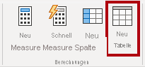

1. Geben Sie auf der Formelleiste Folgendes ein:

    **DAX**

    ```
    Date =  
    CALENDARAUTO(6)
    ```

    


    *Die CALENDARAUTO()-Funktion gibt eine Tabelle mit einer einzigen Spalte mit Datumswerten zurück. Es werden automatisch alle Datumsspalten des Datenmodells durchsucht, um die im Datenmodell gespeicherten frühesten und spätesten Datumswerte zu ermitteln. Anschließend wird für jedes Datum innerhalb dieses Bereichs eine Zeile angelegt, wobei der Bereich in beide Richtungen erweitert wird, um sicherzustellen, dass Daten für vollständige Jahre gespeichert werden.*

    *Diese Funktion kann ein einzelnes optionales Argument verwenden, das die Zahl des letzten Monats eines Jahres ist. Falls weggelassen, ist der Wert 12, was bedeutet, dass Dezember der letzte Monat des Jahres ist. In diesem Fall wird „6“ eingegeben, was bedeutet, dass Juni der letzte Monat des Geschäftsjahres ist.*

1. Beachten Sie die Spalte mit Datumswerten.

    

    *Die gezeigten Datumsangaben sind mit US-amerikanischen Regionseinstellungen formatiert (d. h. MM/TT/JJJJ).*

5. Links unten auf der Statusleiste sehen Sie die Tabellenstatistik, die bestätigt, dass 1.826 Datenzeilen generiert wurden, was den Daten fünf vollständiger Jahre entspricht.

    

## **Erstellen berechneter Spalten**

In dieser Aufgabe fügen Sie weitere Spalten hinzu, um das Filtern und Gruppieren nach verschiedenen Zeiträumen zu aktivieren. Sie erstellen auch eine berechnete Spalte, um die Sortierreihenfolge anderer Spalten zu steuern.

*Der Einfachheit halber können Sie alle DAX-Definitionen in diesem Lab aus den Codebeispielen in der Datei **D:\Allfiles\Labs\04-create-dax-calculations-in-power-bi-desktop\Assets\Snippets.txt** kopieren.*

1. Klicken Sie auf dem kontextbezogenen Menüband **Tabellentools** in der Gruppe **Berechnungen** auf **Neue Spalte**.

    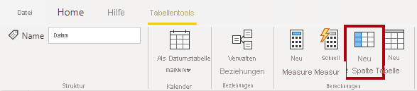

1. Geben Sie auf der Formelleiste Folgendes ein (oder kopieren Sie die Eingaben aus der Datei mit den Codeausschnitten), und drücken Sie dann die **EINGABETASTE**:


    **DAX**


    ```
    Year =
    "FY" & YEAR('Date'[Date]) + IF(MONTH('Date'[Date]) > 6, 1)
    ```


    *Eine berechnete Spalte wird erstellt, indem zuerst der Spaltenname eingegeben wird, gefolgt vom Gleichheitszeichen (=), gefolgt von einer DAX-Formel, die ein Ergebnis mit einem Wert zurückgibt. Der Spaltenname darf nicht bereits in der Tabelle vorhanden sein.*

    *Die Formel nutzt den Jahreswert des Datums, addiert jedoch 1 zum Jahreswert, wenn der Monat später als Juni ist. Auf diese Weise werden Geschäftsjahre bei Adventure Works berechnet.*

1. Vergewissern Sie sich, dass die neue Spalte hinzugefügt wurde.

    

1. Erstellen Sie mithilfe der Definitionen in der Codeausschnittsdatei die folgenden beiden berechneten Spalten für die Tabelle **Date**:

    - Quarter
    - Month

    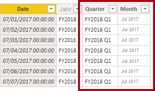

1. Um die Berechnungen zu überprüfen, wechseln Sie zur Ansicht „Bericht“.

1. Um eine neue Berichtsseite zu erstellen, wählen Sie das Plussymbol neben Seite 1 aus.

    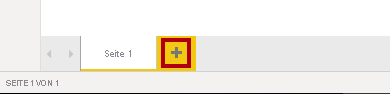

1. Um der neuen Berichtsseite ein Matrixvisual hinzuzufügen, wählen Sie im Bereich **Visualisierungen** den Visualtyp der Matrix aus.

    *Tipp: Sie können den Cursor über jedes Symbol bewegen, um eine QuickInfo mit einer Beschreibung des Visualtyps anzuzeigen.*

    

1. Ziehen Sie im Bereich **Daten** aus der Tabelle **Date** das Feld **Year** in den Bereich **Zeilen**.

    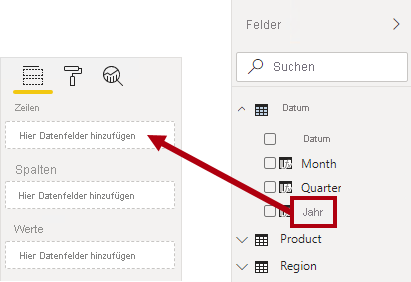

1. Ziehen Sie das Feld **Month** in den Bereich **Zeilen** direkt unter dem Feld **Year**.

    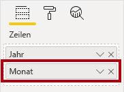

1. Klicken Sie rechts oben im visuellen Matrixelement (oder unten, je nach Position des visuellen Elements) auf den gabelförmigen Doppelpfeil (damit werden alle Jahre um eine Ebene nach unten erweitert).

    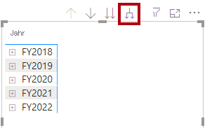

1. Beachten Sie, dass die Jahre zu Monaten aufgeklappt und dass die Monate nicht chronologisch, sondern alphabetisch sortiert sind.

    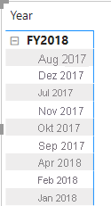

    *Standardmäßig werden Textwerte alphabetisch, Zahlen vom kleinsten bis zum größten Wert und Datumsangaben vom frühesten bis zum spätesten Wert sortiert.*

1. Um die Sortierreihenfolge des Felds **Month** anzupassen, wechseln Sie zur Ansicht „Daten“.

1. Fügen Sie die Spalte **MonthKey** zur Tabelle **Date** hinzu.


    **DAX**


    ```
    MonthKey =
    (YEAR('Date'[Date]) * 100) + MONTH('Date'[Date])
    ```


    *Diese Formel berechnet für jede Kombination aus Jahr/Monat einen numerischen Wert.*

1. Überprüfen Sie in der Datenansicht, ob die neue Spalte numerische Werte enthält (z. B. 201707 für Juli 2017).

    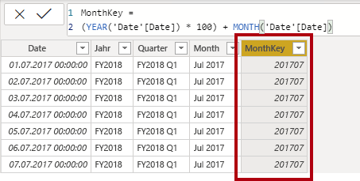

1. Wechseln Sie zurück zur Berichtsansicht. Stellen Sie sicher, dass im Bereich **Daten** das Feld **Month** ausgewählt ist (falls ausgewählt, hat es einen dunkelgrauen Hintergrund).

1. Klicken Sie auf dem kontextbezogenen Menüband **Spaltentools** innerhalb der Gruppe **Sortieren** auf **Nach Spalte sortieren**, und wählen Sie dann **MonthKey** aus.

    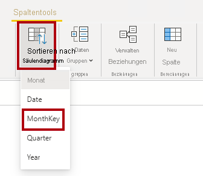

1. Beachten Sie im Matrixvisual, dass die Monate jetzt chronologisch sortiert sind.

    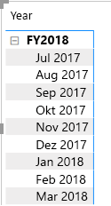

## **Vervollständigen der Tabelle „Date“**

In dieser Aufgabe vervollständigen Sie den Entwurf der Tabelle **Date**, indem Sie eine Spalte ausblenden und eine Hierarchie erstellen. Sie erstellen dann Beziehungen zu den Tabellen **Sales** und **Targets**.

1. Wechseln Sie zur Ansicht „Modell“. Blenden Sie in der Tabelle **Date** die Spalte **MonthKey** aus (legen Sie **Ausgeblendet** auf **Ja** fest).


1. Wählen Sie im Bereich **Daten** rechts die Tabelle **Date** aus, klicken Sie mit der rechten Maustaste auf die Spalte **Year**, und wählen Sie **Hierarchie erstellen** aus. 

1. Benennen Sie die neu erstellte Hierarchie mit **Fiscal**, indem Sie mit der rechten Maustaste darauf klicken und **Umbenennen** auswählen.


1. Fügen Sie der Hierarchie „Fiscal“ die folgenden beiden verbleibenden Felder hinzu, indem Sie sie im Bereich **Daten** auswählen, mit der rechten Maustaste darauf klicken und **Zu Hierarchie hinzufügen** -> **Fiscal** auswählen.

    - Quarter
    - Month

    

1. Erstellen Sie die beiden folgenden Modellbeziehungen:

    - **Date \| Date** mit **Sales \| OrderDate**
    - **Date \| Date** mit **Targets \| TargetMonth**

1. Blenden Sie die folgenden beiden Spalten aus:

    - Sales \| OrderDate
    - Targets \| TargetMonth

## **Markieren der „Date“-Tabelle**

In dieser Aufgabe markieren Sie die Tabelle **Date** als Datumstabelle.

1. Wechseln Sie zur Ansicht „Bericht“. Wählen Sie im Bereich **Daten** die Tabelle **Date** und nicht das Feld **Date** aus.

1. Klicken Sie auf dem kontextbezogenen Menüband **Tabellentools** innerhalb der Gruppe **Kalender** auf **Als Datumstabelle markieren**, und wählen Sie dann **Als Datumstabelle markieren** aus.

    

1. Wählen Sie im Fenster **Als Datumstabelle markieren** in der Dropdownliste **Datumsspalte** den Eintrag **Date** aus. Klicken Sie auf **OK**.

    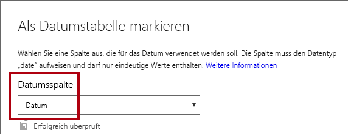

1. Speichern Sie die Power BI Desktop-Datei.

    *Power BI Desktop versteht nun, dass diese Tabelle das Datum (die Uhrzeit) definiert. Dies ist wichtig, wenn Sie sich auf Berechnungen der Zeitintelligenz stützen. Im Lab **Erstellen von erweiterten DAX-Berechnungen in Power BI Desktop** arbeiten Sie mit Zeitintelligenzberechnungen.*

    *Dieser Entwurfsansatz ist für eine Datumstabelle geeignet, wenn in Ihrer Datenquelle keine Datumstabelle vorhanden ist. Wenn Sie ein Data Warehouse verwenden, wäre es angebracht, Datumsdaten aus dessen Datendimensionstabelle zu laden, anstatt die Datumslogik in Ihrem Datenmodell neu zu definieren.*

## **Erstellen einfacher Measures**

In dieser Aufgabe erstellen Sie einfache Measures. Einfache Measures aggregieren Werte in einer einzelnen Spalte oder zählen die Zeilen einer Tabelle.

1. Ziehen Sie in der Berichtsansicht auf **Seite 2** im Bereich **Daten** das Feld **Sales \| Unit Price** in das Matrixvisual.

    *In den Labs wird eine verkürzte Notation verwendet, um auf ein Feld zu verweisen. Das sieht folgendermaßen aus: **Sales \| Unit Price**. In diesem Beispiel ist **Sales** der Tabellenname und **Unit Price** der Feldname.*

    

    *Im Lab **Modellieren von Daten in Power BI Desktop** haben Sie die Spalte **Unit Price** so festgelegt, dass sie nach **Durchschnitt** zusammengefasst wird. Das Ergebnis, das im Matrixvisual angezeigt wird, ist der durchschnittliche monatliche Einzelpreis (Summe der Einzelpreise dividiert durch die Anzahl der Einzelpreise).*

1. Beachten Sie, dass im Bereich der Visualfelder (unterhalb des Bereichs **Visualisierungen**) im Bereich **Werte** der **Unit Price** aufgeführt ist.

    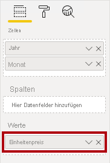

1. Klicken Sie auf den nach unten zeigenden Pfeil für **Unit Price**, und sehen Sie sich die verfügbaren Menüoptionen an.

    

    *Sichtbare numerische Spalten ermöglichen Berichtsautoren, zur Zeit der Berichtsgestaltung zu entscheiden, wie eine Spalte summiert wird (oder nicht). Dies kann zu einer ungeeigneten Berichterstellung führen. Einige Datenmodellierer überlassen Dinge jedoch nicht gerne dem Zufall und entscheiden sich dafür, diese Spalten auszublenden und stattdessen eine durch Measures definierte Aggregationslogik verfügbar zu machen. Dies ist der Ansatz, den Sie nun in diesem Lab verfolgen.*

1. Um ein Measure zu erstellen, klicken Sie im Bereich **Daten** mit der rechten Maustaste auf die Tabelle **Sales**, und wählen Sie dann **Neues Measure** aus.

1. Fügen Sie in der Bearbeitungsleiste die folgende Measuredefinition hinzu:


    **DAX**


    ```
    Avg Price =  
    AVERAGE(Sales[Unit Price])
    ```

1. Fügen Sie das Measure **Avg Price** dem Matrixvisual hinzu.

1. Beachten Sie, dass dadurch das gleiche Ergebnis wie in der Spalte **Unit Price** erzielt wird (jedoch mit anderer Formatierung).

1. Öffnen Sie unter **Werte** das Kontextmenü für das Feld **Avg Price**, und beachten Sie, dass die Aggregationsmethode nicht geändert werden kann.

    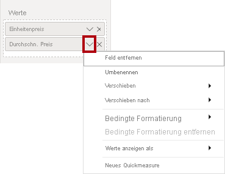

    *Es ist nicht möglich, das Aggregationsverhalten eines Measure zu ändern.*

1. Erstellen Sie mithilfe der Definitionen in der Codeausschnittsdatei die folgenden fünf Measures für die Tabelle **Sales**:

    - Median Price
    - Min Price
    - Max Price
    - Orders
    - Order Lines

    *Die im Measure **Orders** verwendete DISTINCTCOUNT()-Funktion zählt Aufträge nur einmal (Duplikate werden ignoriert). Die im Measure **Order Lines** verwendete COUNTROWS()-Funktion wird auf eine Tabelle angewandt.*

    *In diesem Fall wird die Anzahl der Aufträge durch Zählen der eindeutigen Werte in der Spalte **SalesOrderNumber** berechnet, während die Anzahl der Auftragszeilen einfach die Anzahl der Tabellenzeilen ist (jede Zeile ist eine Auftragsposition).*

10. Wechseln Sie zur Ansicht „Modell“, und wählen Sie in einer Mehrfachauswahl die vier Measures für Preise aus: **Avg Price**, **Max Price**, **Median Price** und **Min Price**.

11. Konfigurieren Sie für die Mehrfachauswahl von Measures die folgenden Anforderungen:

    - Legen Sie das Format auf zwei Dezimalstellen fest.

    - Weisen Sie sie einem Anzeigeordner namens **Pricing** zu.

    

12. Blenden Sie die Spalte **Unit Price** aus.

    *Die Spalte **Unit Price** ist jetzt für Berichtsautor*innen nicht mehr verfügbar. Sie müssen die Preismeasuresverwenden, die Sie dem Modell hinzugefügt haben. Dieser Entwurfsansatz stellt sicher, dass Berichtsautor*innen die Preise nicht unsachgemäß aggregieren, z. B. durch Addition.*

13. Wählen Sie in einer Mehrfachauswahl die Measures **Order Lines** und **Orders** aus, und konfigurieren Sie dann die folgenden Anforderungen:

    - Legen Sie das Format so fest, dass Tausendertrennzeichen verwendet werden.

    - Weisen Sie sie einem Anzeigeordner namens **Counts** zu.

    

14. Klicken Sie in der Berichtsansicht im Bereich **Werte** des visuellen Matrixelements für das Feld **Unit Price** auf **X**, um es zu entfernen.

    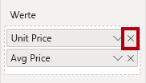

15. Vergrößern Sie das Matrixvisual so, dass es die Seitenbreite und -höhe ausfüllt.

16. Fügen Sie dem Matrixvisual die folgenden fünf Measures hinzu:

    - Median Price
    - Min Price
    - Max Price
    - Orders
    - Order Lines

17. Stellen Sie sicher, dass die Ergebnisse sinnvoll aussehen und richtig formatiert sind.

    

## **Erstellen zusätzlicher Measures**

In dieser Aufgabe erstellen Sie weitere Measures, die komplexere Formeln verwenden.

1. Wählen Sie in der Berichtsansicht **Seite 1** aus, und überprüfen Sie das visuelle Tabellenelement, wobei Sie die Summe für die Spalte **Target** notieren.

    


1. Wählen Sie das Tabellenvisual aus, und entfernen Sie dann im Bereich **Visualisierungen** das Feld **Ziel**.

1. Benennen Sie die Spalte **Targets \| Target** in **Targets \| TargetAmount** um.

    *Tipp: Es gibt mehrere Möglichkeiten, die Spalte in der Ansicht „Bericht“ umzubenennen: Im Bereich **Daten** können Sie mit der rechten Maustaste auf die Spalte klicken und dann **Umbenennen** auswählen. Alternativ können Sie auf die Spalte doppelklicken oder **F2** drücken.*

    *Sie sind im Begriff, ein Measure namens **Target** zu erstellen. In einer Tabelle ist es nicht möglich, dass eine Spalte und ein Measure denselben Namen haben.*

1. Erstellen Sie das folgende Measure für die Tabelle **Targets**:

    **DAX**


    ```
    Target =

    IF(

    HASONEVALUE('Salesperson (Performance)'[Salesperson]),

    SUM(Targets[TargetAmount])

    )
    ```

    *Die Funktion „HASONEVALUE()“ prüft, ob ein einzelner Wert in der Spalte **Salesperson** gefiltert wird. Falls TRUE, gibt der Ausdruck die Summe der Zielbeträge (für genau diesen Vertriebsmitarbeiter) zurück. Bei „false“ wird „BLANK“ zurückgegeben.*

1. Formatieren Sie das Measure **Target** ohne Dezimalstellen.

    *Tipp: Sie können das kontextbezogene Menüband **Measuretools** verwenden.*

1. Blenden Sie die Spalte **TargetAmount** aus.

    *Tipp: Im Bereich **Daten** können Sie mit der rechten Maustaste auf die Spalte klicken und dann **Ausblenden** auswählen.*

1. Fügen Sie das Measure **Target** dem Tabellenvisual hinzu.

1. Beachten Sie, dass die Gesamtsumme der Spalte **Target** jetzt BLANK ist.

    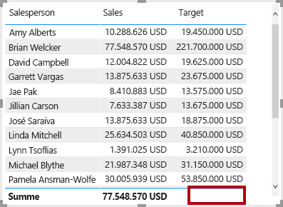

1. Erstellen Sie mithilfe der Definitionen in der Codeausschnittsdatei die folgenden zwei Measures für die Tabelle **Targets**:

    - Variance
    - Variance Margin

1. Formatieren Sie das Measure **Variance** ohne Dezimalstellen.

1. Formatieren Sie das Measure **Variance Margin** als Prozentsatz mit zwei Dezimalstellen.

1. Fügen Sie die Measures **Variance** und **Variance Margin** zum Tabellenvisual hinzu.

1. Ändern Sie die Größe des Tabellenvisuals, sodass alle Spalten und Zeilen angezeigt werden.

    

    *Auch wenn es den Anschein hat, dass nicht alle Vertriebsmitarbeiter die Zielvorgaben erfüllen, denken Sie daran, dass das visuelle Tabellenelement noch nicht nach einem bestimmten Zeitraum gefiltert wurde. Sie erstellen Umsatzleistungsberichte, die nach einem von Benutzer ausgewählten Zeitraum im Lab **Entwerfen eines Berichts in Power BI Desktop** filtern.*

1. Klappen Sie rechts oben im Bereich **Daten** den Bereich zu, und klappen Sie ihn dann auf.

    *Durch das Zuklappen und erneute Öffnen des Bereichs wird der Inhalt zurückgesetzt.*

1. Beachten Sie, dass die Tabelle **Targets** jetzt oben in der Liste steht.

    

    *Tabellen, die nur sichtbare Measures enthalten, werden automatisch am Anfang der Liste angezeigt.*

### **Fertigstellen**

Speichern Sie die Power BI Desktop-Datei.

*Im Lab **Erstellen von erweiterten DAX-Berechnungen in Power BI Desktop** erweitern Sie das Datenmodell um weitere Berechnungen mithilfe von DAX.*
