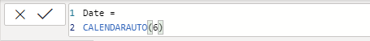
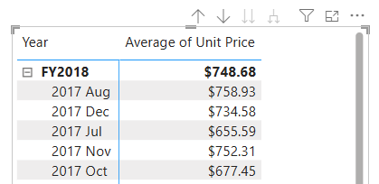
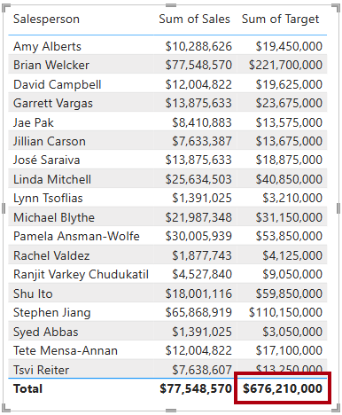

---
lab:
  title: Erstellen von DAX-Berechnungen in semantischen Modellen
  module: Create DAX calculations in semantic models
---

# Erstellen von DAX-Berechnungen in semantischen Modellen

## Labszenario

In diesem Lab erstellen Sie mithilfe von Data Analysis Expressions (DAX) berechnete Tabellen, berechnete Spalten und einfache Measures.

In diesem Lab lernen Sie Folgendes:

- Erstellen berechneter Tabellen
- Erstellen berechneter Spalten
- Erstellen von Measures

**Dieses Lab sollte ungefähr 45 Minuten in Anspruch nehmen.**

## Erste Schritte

Um diese Übung abzuschließen, müssen Sie zuerst einen Webbrowser öffnen und die folgende URL eingeben, um die ZIP-Datei herunterzuladen:

`https://github.com/MicrosoftLearning/PL-300-Microsoft-Power-BI-Data-Analyst/raw/Main/Allfiles/Labs/04-create-dax-calculations\04-dax-calculations.zip`

Extrahieren Sie die Datei in den Ordner **C:\Benutzer\Student\Downloads\04-dax-calculations**.

Öffnen Sie die Datei **04-Starter-Sales Analysis.pbix**.

> _**Hinweis**: Möglicherweise wird beim Laden der Datei ein Anmeldedialogfeld angezeigt. Wählen Sie **Abbrechen** aus, um das Anmeldedialogfeld zu schließen. Schließen Sie alle anderen Informationsfenster. Wählen Sie **Später übernehmen** aus, wenn Sie aufgefordert werden, die Änderungen anzuwenden._

## Erstellen der berechneten Tabelle „Salesperson“

In dieser Aufgabe erstellen Sie die berechnete Tabelle `Salesperson` (die eine direkte Beziehung zur Tabelle `Sales` haben wird).

Eine berechnete Tabelle wird erstellt, indem zuerst der Tabellenname eingegeben wird, gefolgt vom Gleichheitssymbol (=), gefolgt von einer DAX-Formel, die eine Tabelle zurückgibt. Der Tabellenname darf nicht bereits im Datenmodell vorhanden sein.

Geben Sie eine gültige DAX-Formel in die _Bearbeitungsleiste_ ein. Die Bearbeitungsleiste bietet Features wie AutoVervollständigen, IntelliSense und Farbcodierung, mit denen Sie die Formel schnell und fehlerfrei eingeben können.

1. Klicken Sie in Power BI Desktop in der **Berichtsansicht** auf dem Menüband **Modellierung** in der Gruppe **Berechnungen** auf **Neue Tabelle**.

    

1. Geben Sie `Salesperson =` in der Bearbeitungsleiste ein (die direkt unter dem Menüband geöffnet wird, wenn Sie Berechnungen erstellen oder bearbeiten), drücken Sie **UMSCHALT+EINGABETASTE**, geben Sie `'Salesperson (Performance)'` ein, und drücken Sie dann die **EINGABETASTE**.

    > _**Hinweis**: Der Einfachheit halber können alle DAX-Definitionen in diesem Lab aus der Schnipseldatei kopiert werden, die sich in der Datei **04-dax-calculations\Snippets.txt** befindet._

    

    > _Diese Tabellendefinition erstellt eine Kopie der Tabelle`Salesperson (Performance)`. Es werden nur die Daten kopiert. Modelleigenschaften wie Sichtbarkeit und Formatierung werden jedoch nicht kopiert._

1. Im Bereich **Daten** sehen Sie, dass dem Symbol für die neue Tabelle ein zusätzlicher Rechner vorangestellt ist (zur Kennzeichnung einer berechneten Tabelle).

    

    > _**Hinweis**: Berechnete Tabellen werden mithilfe einer DAX-Formel definiert, die eine Tabelle zurückgibt. Es ist wichtig zu verstehen, dass berechnete Tabellen das Datenmodell vergrößern, da sie Werte materialisieren und speichern. Sie werden außerdem immer dann neu berechnet, wenn die Formelabhängigkeiten aktualisiert werden, wie es in diesem Datenmodell der Fall sein wird, wenn neue (zukünftige) Datumswerte in Tabellen geladen werden._
    >
    > _Im Gegensatz zu auf Power Query basierenden Tabellen können berechnete Tabellen nicht zum Laden von Daten aus externen Datenquellen genutzt werden. Sie können Daten nur auf Grundlage dessen transformieren, was bereits in das Datenmodell geladen wurde._

1. Wechseln Sie zur **Modellansicht**, und beachten Sie, dass die Tabelle `Salesperson` verfügbar ist.

1. Erstellen Sie eine Beziehung von der `Salesperson | EmployeeKey`-Spalte zur `Sales | EmployeeKey`-Spalte.

    > _In den Labs wird eine verkürzte Notation verwendet, um auf ein Feld zu verweisen. Sie sieht wie folgt aus: `Salesperson | EmployeeKey`. In diesem Beispiel ist `Salesperson` der Tabellenname und `EmployeeKey` der Spaltenname._

1. Klicken Sie mit der rechten Maustaste auf die inaktive Beziehung (punktierte Linie) zwischen den Tabellen `Salesperson (Performance)` und `Sales`, und wählen Sie dann **Löschen** aus. Wenn Sie aufgefordert werden, den Löschvorgang zu bestätigen, klicken Sie auf **Ja**.

1. Wählen Sie in der Tabelle `Salesperson` die folgenden Spalten gleichzeitig aus, und blenden Sie sie dann aus (legen Sie die Eigenschaft **Ist verborgen** auf _Ja_ fest):

    - `EmployeeID`
    - `EmployeeKey`
    - `UPN`

1. Wählen Sie im Modelldiagramm die Tabelle `Salesperson` aus.

1. Geben Sie im Bereich **Eigenschaften** in das Feld **Beschreibung** Folgendes ein: _Für den Umsatz verantwortliche Vertriebsmitarbeitende_

    > _Unter Umständen erinnern Sie daran, dass Beschreibungen als QuickInfo im Bereich **Daten** angezeigt werden, wenn Benutzende den Cursor über eine Tabelle oder ein Feld bewegen._

1. Legen Sie für die Tabelle `Salesperson (Performance)` die folgende Beschreibung fest: _Salesperson related to region(s)_

> _Das Datenmodell bietet zwei Alternativen bei der Analyse von Vertriebsmitarbeiter*innen. Die Tabelle `Salesperson` ermöglicht die Analyse der von Vertriebsmitarbeitenden erzielten Umsätze, während die Tabelle `Salesperson (Performance)` die Analyse der Umsätze ermöglicht, die in den Vertriebsregionen erzielt wurden, die den Vertriebsmitarbeitenden zugewiesen sind._

## Erstellen der Tabelle „Date“

In dieser Aufgabe erstellen Sie die Tabelle `Date`.

1. Wechseln Sie zur **Tabellenansicht**. Klicken Sie auf der Registerkarte **Start** des Menübands in der Gruppe **Berechnungen** auf **Neue Tabelle**.

    

1. Geben Sie auf der Formelleiste die folgende DAX ein:

    ```dax
    Date =  
    CALENDARAUTO(6)
    ```

    

    > _Die `CALENDARAUTO`-Funktion gibt eine einspaltige Tabelle zurück, die Datumswerte enthält. Das „auto“-Verhalten scannt alle Datumsspalten des Datenmodells, um die im Datenmodell gespeicherten frühesten und spätesten Datumswerte zu ermitteln. Anschließend wird für jedes Datum innerhalb dieses Bereichs eine Zeile angelegt, wobei der Bereich in beide Richtungen erweitert wird, um sicherzustellen, dass Daten für vollständige Jahre gespeichert werden._
    >
    > _Diese Funktion kann ein einzelnes optionales Argument verwenden, das die Zahl des letzten Monats eines Jahres ist. Falls weggelassen, ist der Wert 12, was bedeutet, dass Dezember der letzte Monat des Jahres ist. In diesem Fall wird „6“ eingegeben, was bedeutet, dass Juni der letzte Monat des Geschäftsjahres ist._

1. Beachten Sie die Spalte mit Datumswerten, die möglicherweise mit US-amerikanischen Regionseinstellungen formatiert sind (d. h. MM/TT/JJJJ).

    

1. Links unten auf der Statusleiste sehen Sie die Tabellenstatistik, die bestätigt, dass 1.826 Datenzeilen generiert wurden, was den Daten fünf vollständiger Jahre entspricht.

    

## Erstellen berechneter Spalten

In dieser Aufgabe fügen Sie weitere Spalten hinzu, um das Filtern und Gruppieren nach verschiedenen Zeiträumen zu aktivieren. Sie erstellen auch eine berechnete Spalte, um die Sortierreihenfolge anderer Spalten zu steuern.

> _**Hinweis**: Der Einfachheit halber können Sie alle DAX-Definitionen in diesem Lab aus der Datei **Snippets.txt** kopieren._

1. Klicken Sie auf dem kontextbezogenen Menüband **Tabellentools** in der Gruppe **Berechnungen** auf **Neue Spalte**.

    > _Eine berechnete Spalte wird erstellt, indem zuerst der Spaltenname eingegeben wird, gefolgt vom Gleichheitszeichen (=), gefolgt von einer DAX-Formel, die ein Ergebnis mit einem Wert zurückgibt. Der Spaltenname darf nicht bereits in der Tabelle vorhanden sein._

    

1. Geben Sie auf der Formelleiste Folgendes ein (oder kopieren Sie die Eingaben aus der Datei mit den Codeausschnitten), und drücken Sie dann die **EINGABETASTE**:

    > _Die Formel nutzt den Jahreswert des Datums, addiert jedoch 1 zum Jahreswert, wenn der Monat nach Juni kommt. Auf diese Weise werden Geschäftsjahre bei Adventure Works berechnet._

   ```dax
   Year =
   "FY" & YEAR('Date'[Date]) + IF(MONTH('Date'[Date]) > 6, 1)
   ```

1. Erstellen Sie mithilfe der Definitionen in der Schnipseldatei die folgenden beiden berechneten Spalten für die Tabelle `Date`:

    - `Quarter`
    - `Month`

1. Überprüfen Sie, ob die neuen Spalten hinzugefügt wurden.

    

1. Um die Berechnungen zu überprüfen, wechseln Sie zur **Berichtsansicht**.

1. Um eine neue Berichtsseite zu erstellen, wählen Sie das Plussymbol neben **Seite 1** aus.

    

1. Um der neuen Berichtsseite ein Matrixvisual hinzuzufügen, wählen Sie im Bereich **Visualisierungen** den Visualtyp der Matrix aus.

    > _Tipp: Sie können den Cursor über jedes Symbol bewegen, um eine QuickInfo mit einer Beschreibung des Visualtyps anzuzeigen._

    

1. Ziehen Sie im Bereich **Daten** aus der Tabelle `Date` das Feld `Year` in den Bucket **Rows**.

    

1. Ziehen Sie das Feld `Month` in den Bucket **Rows** direkt unter dem Feld `Year`.

1. Klicken Sie rechts oben im visuellen Matrixelement (oder unten, je nach Position des visuellen Elements) auf den gabelförmigen Doppelpfeil (damit werden alle Jahre um eine Ebene nach unten erweitert).

    

1. Beachten Sie, dass die Jahre zu Monaten aufgeklappt und dass die Monate nicht chronologisch, sondern alphabetisch sortiert sind.

    

    > _Standardmäßig werden Textwerte alphabetisch, Zahlen vom kleinsten bis zum größten Wert und Datumsangaben vom frühesten bis zum spätesten Wert sortiert._

1. Um die Sortierreihenfolge des Felds `Month` anzupassen, wechseln Sie zur **Tabellenansicht**.

1. Fügen Sie der Tabelle `Date` die Spalte `MonthKey` hinzu.

    ```dax
    MonthKey =
    (YEAR('Date'[Date]) * 100) + MONTH('Date'[Date])
    ```

    > _Diese Formel berechnet für jede Kombination aus Jahr/Monat einen numerischen Wert._

1. Überprüfen Sie in der **Tabellenansicht**, ob die neue Spalte numerische Werte enthält (z. B. 201707 für Juli 2017 usw.).

    

1. Wechseln Sie zurück zur **Berichtsansicht**.

1. Wählen Sie im Bereich **Daten** das Feld `Month` aus.

1. Klicken Sie auf dem kontextbezogenen Menüband **Spaltentools** innerhalb der Gruppe **Sortieren** auf **Nach Spalte sortieren**, und wählen Sie dann **MonthKey** aus.

    

1. Beachten Sie im Matrixvisual, dass die Monate jetzt chronologisch sortiert sind.

    

## Vervollständigen der Tabelle „Date“

In dieser Aufgabe vervollständigen Sie den Entwurf der Tabelle `Date`, indem Sie eine Spalte ausblenden und eine Hierarchie erstellen. Anschließend erstellen Sie Beziehungen zu den Tabellen `Sales` und `Targets`.

1. Wechseln Sie zur Ansicht**Modell**.

1. Blenden Sie in der Tabelle `Date` die Spalte `MonthKey` aus (legen Sie **Ist verborgen** auf _Ja_ fest).

1. Wählen Sie im Bereich **Daten** die Tabelle `Date` aus, klicken Sie mit der rechten Maustaste auf die Spalte `Year`, und wählen Sie **Hierarchie erstellen** aus.

    

1. Ersetzen Sie im Bereich **Eigenschaften** im Feld **Name** den Wert durch _Fiscal_.

    

1. Um der Hierarchie Ebenen hinzuzufügen, wählen Sie in der Dropdownliste **Hierarchie** die Optionen **Quartal** und dann **Monat** aus, und klicken Sie auf **Ebenenänderungen anwenden**.

    

1. Erstellen Sie die beiden folgenden Modellbeziehungen:

    - `Date | Date` in `Sales | OrderDate`
    - `Date | Date` in `Targets | TargetMonth`

1. Blenden Sie die folgenden beiden Spalten aus:

    - `Sales | OrderDate`
    - `Targets | TargetMonth`

## Markieren der „Date“-Tabelle

In dieser Aufgabe markieren Sie die Tabelle `Date` als Datumstabelle.

1. Wechseln Sie zur **Berichtansicht**.

1. Wählen Sie im Bereich **Daten** die Tabelle `Date` (nicht das Feld `Date`) aus.

1. Wählen Sie im kontextbezogenen Menüband **Tabellentools** innerhalb der Gruppe **Kalender** die Option **Als Datumstabelle markieren**.

    

1. Legen Sie im Fenster **Als Datumstabelle markieren** die Eigenschaft **Als Datumstabelle markieren** auf _Ja_ fest.

1. Wählen Sie in der Dropdownliste **Datumsspalte auswählen** die Option **Datum** aus.

    

1. Wählen Sie **Speichern**.

1. Speichern Sie die Power BI Desktop-Datei.

> _Power BI Desktop versteht nun, dass diese Tabelle das Datum (die Uhrzeit) definiert._
>
> _Dieser Entwurfsansatz für eine Datumstabelle ist geeignet, wenn Ihre Datenquelle keine Datumstabelle enthält. Wenn Sie ein Data Warehouse verwenden, wäre es angebracht, Datumsdaten aus dessen Datendimensionstabelle zu laden, anstatt die Datumslogik in Ihrem Datenmodell neu zu definieren._

## Erstellen einfacher Measures

In dieser Aufgabe erstellen Sie einfache Measures. Einfache Measures aggregieren Werte in einer einzelnen Spalte oder zählen die Zeilen einer Tabelle.

1. Ziehen Sie das Feld `Sales | Unit Price` in der **Berichtsansicht** auf **Seite 2** aus dem Bereich **Daten** in das Matrixvisual.

    

1. Beachten Sie im Bereich mit den Visuals (im Bereich **Visualisierungen**) im Bucket **Values**, dass das Feld `Unit Price` als **Average of Unit Price** konfiguriert ist.

    

1. Klicken Sie bei **Average of Unit Price** auf den Pfeil nach unten, und sehen Sie sich die verfügbaren Menüoptionen an.

    > _Sichtbare numerische Spalten ermöglichen Berichtsautor*innen, zur Zeit der Berichtsgestaltung zu entscheiden, wie eine Spalte summiert wird (oder nicht). Dies kann jedoch zu einer ungeeigneten Berichterstellung führen._
    >
    > _Manche Datenmodellierende überlassen Dinge nicht gern dem Zufall und entscheiden sich dafür, diese Spalten auszublenden und stattdessen eine durch Measures definierte Aggregationslogik verfügbar zu machen. Dies ist der Ansatz, den Sie nun in diesem Lab verfolgen._

1. Um ein Measure zu erstellen, klicken Sie im Bereich **Daten** mit der rechten Maustaste auf die Tabelle `Sales`, und wählen Sie dann **Neues Measure** aus.

1. Fügen Sie in der Bearbeitungsleiste die folgende Measuredefinition hinzu:

    ```DAX
    Avg Price =  
    AVERAGE(Sales[Unit Price])
    ```

1. Fügen Sie das Measure `Avg Price` zum Matrixvisual hinzu, und beachten Sie, dass dadurch das gleiche Ergebnis wie in der Spalte `Unit Price` erzielt wird (jedoch mit anderer Formatierung).

1. Öffnen Sie im Bucket **Values** das Kontextmenü für das Feld `Avg Price`, und beachten Sie, dass die Aggregationsmethode nicht geändert werden kann.

    

    > _Es ist nicht möglich, das Aggregationsverhalten eines Measure zu ändern._

1. Erstellen Sie mithilfe der Definitionen in der Schnipseldatei die folgenden fünf Measures für die Tabelle `Sales`:

    - `Median Price`
    - `Min Price`
    - `Max Price`
    - `Orders`
    - `Order Lines`

    > _Die im `Orders`-Measure verwendete `DISTINCTCOUNT`-Funktion zählt Bestellungen nur einmal (und ignoriert Duplikate). Die im `Order Lines`-Measure verwendete `COUNTROWS`-Funktion wird für eine Tabelle ausgeführt._
    >
    > _In diesem Fall wird die Anzahl der Bestellungen durch Zählen der eindeutigen Werte in der Spalte `SalesOrderNumber` berechnet, während die Anzahl der Bestellungszeilen einfach die Anzahl der Tabellenzeilen ist (jede Zeile ist eine Bestellung)._

1. Wechseln Sie zur **Modellansicht**, und wählen Sie in einer Mehrfachauswahl die vier Preismeasures aus: `Avg Price`, `Max Price`, `Median Price` und `Min Price`.

1. Konfigurieren Sie für die Mehrfachauswahl von Measures die folgenden Anforderungen:

    - Legen Sie das Format auf zwei Dezimalstellen fest.
    - Nehmen Sie eine Zuweisung zu einem Anzeigeordner namens _Pricing_ vor (verwenden Sie die Eigenschaft **Anzeigeordner** im Bereich **Eigenschaften**).

    

1. Blenden Sie die Spalte `Unit Price` aus.

    > _Die Spalte `Unit Price` ist nicht mehr für Berichtsverfassende verfügbar. Sie müssen die Preismeasures verwenden, die Sie dem Modell hinzugefügt haben. Dieser Entwurfsansatz stellt sicher, dass Berichtsverfassende die Preise nicht unsachgemäß aggregieren, zum Beispiel durch Summieren._

1. Wählen Sie in einer Mehrfachauswahl die Measures `Order Lines` und `Orders` aus, und konfigurieren Sie dann die folgenden Anforderungen:

    - Legen Sie das Format so fest, dass Tausendertrennzeichen verwendet werden.
    - Nehmen Sie eine Zuweisung zu einem Anzeigeordner namens _Counts_ vor.

    

1. Wählen Sie in der **Berichtsansicht** im Bucket **Werte** des Matrixvisuals für das Feld **Durchschnittlicher Einzelpreis** das **X** aus, um es zu entfernen.

    

1. Vergrößern Sie das Matrixvisual so, dass es die Seitenbreite und -höhe ausfüllt.

1. Fügen Sie dem Matrixvisual die folgenden fünf Measures hinzu:

    - `Median Price`
    - `Min Price`
    - `Max Price`
    - `Orders`
    - `Order Lines`

1. Stellen Sie sicher, dass die Ergebnisse sinnvoll aussehen und richtig formatiert sind.

    

## Erstellen zusätzlicher Measures

In dieser Aufgabe erstellen Sie weitere Measures, die komplexere Formeln verwenden.

1. Wählen Sie in der **Berichtsansicht** die **Seite 1** aus, überprüfen Sie das Tabellenvisual für Vertriebsmitarbeitende (rechts), und sehen Sie sich die Summe der Spalte **Summe des Ziels** an.

    

1. Wählen Sie das Tabellenvisual aus, und entfernen Sie dann im Bereich **Visualisierungen** das Feld **Sum of Target**.

1. Benennen Sie die Spalte `Targets | Target` um in _TargetAmount_.

    > _Tipp: Es gibt mehrere Möglichkeiten, die Spalte in der **Berichtsansicht** umzubenennen: Im Bereich **Daten** können Sie mit der rechten Maustaste auf die Spalte klicken und dann **Umbenennen** auswählen. Sie können auch auf die Spalte doppelklicken oder **F2** drücken._

1. Erstellen Sie das folgende Measure für die Tabelle `Targets`:

    ```dax
    Target =
    IF(
        HASONEVALUE('Salesperson (Performance)'[Salesperson]),
        SUM(Targets[TargetAmount])
    )
    ```

    > _Die `HASONEVALUE`-Funktion testet, ob ein einzelner Wert in der Spalte `Salesperson` gefiltert wird. Falls TRUE, gibt der Ausdruck die Summe der Zielbeträge (für genau diesen Vertriebsmitarbeiter) zurück. Andernfalls wird `BLANK` zurückgegeben._

1. Formatieren Sie das Measure `Target` mit null Dezimalstellen.

    > _Tipp: Sie können das kontextbezogene Menüband **Measuretools** verwenden._

1. Blenden Sie die Spalte `TargetAmount` aus.

    > _Tipp: Im Bereich **Daten** können Sie mit der rechten Maustaste auf die Spalte klicken und dann **Ausblenden** auswählen._

1. Beachten Sie, dass die Tabelle `Targets` jetzt oben in der Liste steht.

    

    > _Tabellen, die nur sichtbare Measures enthalten, werden automatisch am Anfang der Liste angezeigt._

1. Fügen Sie dem Tabellenvisual das neue Measure `Target` hinzu.

1. Beachten Sie, dass die Gesamtsumme der Spalte **Target** jetzt `BLANK` ist.

    

1. Erstellen Sie mithilfe der Definitionen in der Schnipseldatei die folgenden zwei Measures für die Tabelle `Targets`:

    - `Variance`
    - `Variance Margin`

1. Formatieren Sie das Measure `Variance` mit null Dezimalstellen.

1. Formatieren Sie das Measure `Variance Margin` als Prozentsatz mit zwei Dezimalstellen.

1. Fügen Sie die Measures `Variance` und `Variance Margin` zum Tabellenvisual hinzu.

1. Ändern Sie die Größe des Tabellenvisuals, sodass alle Spalten und Zeilen angezeigt werden.

    

    > _Es scheint zwar, als würden keine Vertriebsmitarbeitenden die Zielvorgaben erfüllen, jedoch wurde das Tabellenvisual auch noch nicht nach einem bestimmten Zeitraum gefiltert. Sie erstellen Umsatzleistungsberichte, die nach einem benutzerdefinierten Zeitraum im Lab **Entwerfen eines Berichts in Power BI Desktop** filtern._

1. Speichern Sie die Power BI Desktop-Datei.

## Lab abgeschlossen

Sie können Ihren Power BI-Bericht speichern, aber für dieses Lab ist dies nicht erforderlich. In der nächsten Übung arbeiten Sie mit einer vorgefertigten Startdatei.

1. Navigieren Sie zum Menü **Datei** in der oberen linken Ecke, und wählen Sie **Speichern unter** aus. 
1. Wählen Sie **Dieses Gerät durchsuchen** aus.
1. Wählen Sie den Ordner aus, in dem Sie die Datei speichern möchten, und geben Sie ihm einen aussagekräftigen Namen. 
1. Wählen Sie die Schaltfläche **Speichern** aus, um den Bericht als PBIX-Datei zu speichern. 
1. Wenn ein Dialogfeld angezeigt wird, in dem Sie aufgefordert werden, ausstehende Abfrageänderungen anzuwenden, wählen Sie **Übernehmen** aus.
1. Schließen Sie Power BI Desktop.