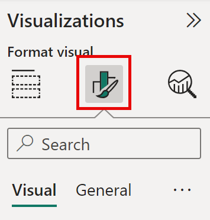
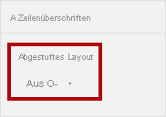
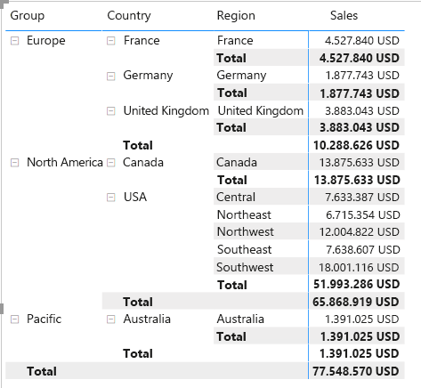
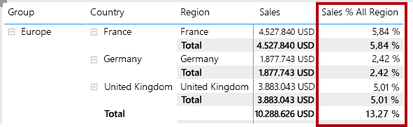
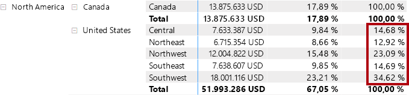
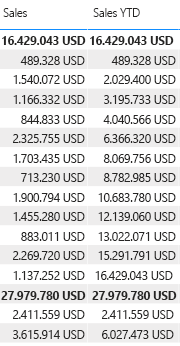

---
lab:
  course: PL-300
  title: Erstellen erweiterter DAX-Berechnungen in Power BI Desktop
  module: Create Model Calculations using DAX in Power BI
---


# Erstellen erweiterter DAX-Berechnungen in Power BI Desktop

## **Labszenario**

In diesem Lab erstellen Sie Measures mit DAX-Ausdrücken, die eine Änderung des Filterkontexts vorsehen.

In diesem Lab lernen Sie Folgendes:

- Ändern von Filtern mit der Funktion CALCULATE()
- Verwenden von Zeitintelligenzfunktionen

**Dieses Lab sollte ungefähr 45 Minuten in Anspruch nehmen.**

## **Arbeiten mit Filterkontext**

*Wichtig: Wenn Sie nach einem vorherigen Lab fortfahren (und dieses Lab erfolgreich abgeschlossen haben), überspringen Sie diese Aufgabe und fahren mit der nächsten fort.*

1. Öffnen Sie Power BI Desktop.

    

    *Tipp: Standardmäßig wird das Dialogfeld „Erste Schritte“ vor Power BI Desktop geöffnet. Sie können sich anmelden und dann das Popup schließen.*

1. Um die Power BI Desktop-Startdatei zu öffnen, wählen Sie **Datei > Bericht öffnen > Berichte durchsuchen** aus.

1. Navigieren Sie im Fenster **Öffnen** zum Ordner **D:\Allfiles\Labs\05-create-dax-calculations-in-power-bi-desktop-advanced\Starter**, und öffnen Sie die Datei **Verkaufsanalyse**.

1. Schließen Sie alle Informationsfenster, die möglicherweise geöffnet werden.

1. Beachten Sie die Warnmeldung unterhalb des Menübands. 

    *In dieser Meldung werden Sie darauf hingewiesen, dass die Abfragen nicht als Modelltabellen geladen wurden. Sie wenden die Abfragen später in diesem Lab an.*
    
    *Wählen Sie rechts auf der Warnmeldung das **X** aus, um die Warnmeldung zu schließen.*

1. Um eine Kopie der Datei zu erstellen, wechseln Sie zu **Datei > Speichern unter**, und speichern Sie sie im Ordner **D:\Allfiles\MySolution**.

## **Erstellen eines Matrixvisuals**

In dieser Aufgabe erstellen Sie ein visuelles Matrixelement, um das Testen Ihrer neuen Measures zu unterstützen.

1. Erstellen Sie im Power BI Desktop in der Ansicht „Bericht“ eine neue Berichtsseite.

1. Fügen Sie auf **Seite 3**ein Matrixvisual hinzu.

    

1. Ändern Sie die Größe des Matrixvisuals so, dass es die gesamte Seite einnimmt.

1. Um die Felder des Matrixvisuals zu konfigurieren, ziehen Sie die Hierarchie **Region \| Regions** aus dem Bereich **Daten**, und legen Sie sie innerhalb des Visuals ab.
    
    *In den Labs wird eine verkürzte Notation verwendet, um auf ein Feld oder eine Hierarchie zu verweisen. Das sieht folgendermaßen aus: **Region \| Regions**. In diesem Beispiel ist **Region** der Tabellenname und **Regions** der Hierarchiename.*

1. Fügen Sie auch das Feld **Sales \| Sales** hinzu.

1. Klicken Sie rechts oben im Matrixvisual zweimal auf das gabelförmige Doppelpfeilsymbol, um die gesamte Hierarchie aufzuklappen.
    
    *Zur Erinnerung: Die Hierarchie **Regions** hat die Ebenen **Group**, **Country** und **Region**.*

    

1. Um das Visual zu formatieren, wählen Sie im Bereich **Visualisierungen** den Bereich **Format** aus.

    

1. Geben Sie in das Feld **Suchen** den Begriff **Abgestuft** ein.

1. Legen Sie die Eigenschaft **Abgestuftes Layout** auf **Aus** fest.

    

1. Vergewissern Sie sich, dass das Matrixvisual jetzt vier Spaltenüberschriften hat.

    

    *Bei Adventure Works sind die Vertriebsregionen in Gruppen, Ländern und Regionen organisiert. Alle Länder mit Ausnahme der USA haben nur eine Region, die nach dem Land benannt ist. Da die USA ein derart großes Vertriebsgebiet sind, sind sie in fünf Vertriebsregionen unterteilt.*

    *In dieser Übung erstellen Sie mehrere Measures, und testen sie dann, indem Sie sie zum Matrixvisual hinzufügen.*

## **Ändern des Filterkontexts**

In dieser Aufgabe erstellen Sie mehrere Measures mit DAX-Ausdrücken, die den Filterkontext mithilfe der Funktion CALCULATE() ändern.

1. Fügen Sie der Tabelle **Sales** ein Measure basierend auf dem folgenden Ausdruck hinzu:
    
     *Der Einfachheit halber können Sie alle DAX-Definitionen in diesem Lab aus der Datei **D:\Allfiles\Labs\05-create-dax-calculations-in-power-bi-desktop-advanced\Assets\Snippets.txt** kopieren.*


    **DAX**


    ```
    Sales All Region =

    CALCULATE(SUM(Sales[Sales]), REMOVEFILTERS(Region))
    ```


    *Die CALCULATE()-Funktion ist eine leistungsstarke Funktion zum Ändern des Filterkontexts. Das erste Argument verwendet einen Ausdruck oder ein Measure (ein Measure ist lediglich ein benannter Ausdruck). Nachfolgende Argumente ermöglichen das Ändern des Filterkontexts.*

    *Mit der REMOVEFILTERS()-Funktion werden aktive Filter entfernt. Sie kann entweder keine Argumente oder eine Tabelle, eine Spalte oder mehrere Spalten als Argument verwenden.*

    *In dieser Formel wertet das Measure die Summe der Spalte **Sales** in einem geänderten Filterkontext aus, der alle auf die Tabelle **Region** angewandten Filter entfernt.*

1. Fügen Sie dem Matrixvisual das Measure **Sales All Region** hinzu.

    

1. Beachten Sie, dass das Measure **Sales All Region** die Summe der Umsätze aller Regionen für jede Region, jedes Land (Zwischensumme) und jede Gruppe (Zwischensumme) berechnet.

    *Das neue Measure muss erst noch ein nützliches Ergebnis liefern. Wenn der Umsatz für eine Gruppe, ein Land oder eine Region durch diesen Wert geteilt wird, ergibt sich ein nützliches Verhältnis, das als „Prozent des Gesamtergebnisses“ bezeichnet wird.*

1. Stellen Sie sicher, dass im Bereich **Daten** das Measure **Sales All Region** ausgewählt ist (wenn es ausgewählt ist, weist es einen dunkelgrauen Hintergrund auf). Ersetzen Sie anschließend auf der Bearbeitungsleiste den Namen des Measures und die Formel durch folgende Formel:

    *Tipp: Um die vorhandene Formel zu ersetzen, kopieren Sie zuerst den Ausschnitt. Klicken Sie dann auf die Bearbeitungsleiste, und drücken Sie **Strg+A**, um den gesamten Text auszuwählen. Drücken Sie dann **Strg+V**, um den Ausschnitt einzufügen und den markierten Text zu überschreiben. Drücken Sie anschließend die **Eingabetaste**.*


    **DAX**


    ```
    Sales % All Region =  
    DIVIDE(  
     SUM(Sales[Sales]),  
     CALCULATE(  
     SUM(Sales[Sales]),  
     REMOVEFILTERS(Region)  
     )  
    )
    ```

    *Das Measure wurde so umbenannt, dass es die aktualisierte Formel genau wiedergibt. Die DIVIDE()-Funktion teilt das Measure **Sales** (nicht durch Filterkontext modifiziert) durch das Measure **Sales** in einem modifizierten Kontext, der alle auf die Tabelle **Region** angewandten Filter entfernt.*

1. Beachten Sie im visuellen Matrixelement, dass das Measure umbenannt wurde und dass jetzt für jede Gruppe, jedes Land und jede Region andere Werte angezeigt werden.

1. Formatieren Sie das Measure **Sales % All Region** als Prozentsatz mit zwei Dezimalstellen.

1. Überprüfen Sie im Matrixvisual die Werte des Measures **Sales % All Region**.

    

1. Fügen Sie der Tabelle **Sales** ein weiteres Measure basierend auf dem folgenden Ausdruck hinzu, und formatieren Sie es als Prozentsatz:


    **DAX**

    ```
    Sales % Country =  
    DIVIDE(  
     SUM(Sales[Sales]),  
     CALCULATE(  
     SUM(Sales[Sales]),  
     REMOVEFILTERS(Region[Region])  
     )  
    )
    ```

1. Beachten Sie, dass sich die Formel des Measures **Sales % Country** geringfügig von der Formel des Measures **Sales % All Region** unterscheidet.

    *Der Unterschied besteht darin, dass der Nenner den Filterkontext durch Entfernen von Filtern für die Spalte **Region** in der Tabelle **Region** und nicht für alle Spalten in der Tabelle **Region** ändert. Das bedeutet, dass alle Filter, die auf die Gruppen- oder Länderspalten angewendet wurden, erhalten bleiben. Dadurch wird ein Ergebnis erzielt, das den Umsatz als Prozentsatz des Lands darstellt.*

1. Fügen Sie das Measure **Sales % Country** zum Matrixvisual hinzu.

1. Beachten Sie, dass nur die Regionen der USA einen Wert aufweisen, der nicht 100 % beträgt.
    
    *Denken Sie daran, dass nur die USA mehrere Regionen haben. Alle anderen Länder haben eine einzige Region, was bei allen das Ergebnis von 100 % erklärt.*

    

    

1. Um die Lesbarkeit dieses Measures im Visual zu verbessern, überschreiben Sie das Measure **Sales % Country** durch diese verbesserte Formel.


    **DAX**


    ```
    Sales % Country =  
    IF(  
     ISINSCOPE(Region[Region]),  
     DIVIDE(  
     SUM(Sales[Sales]),  
     CALCULATE(  
     SUM(Sales[Sales]),  
     REMOVEFILTERS(Region[Region])  
     )  
     )  
    )
    ```


    *Die IF()-Funktion verwendet die Funktion ISINSCOPE()-Funktion, um zu testen, ob die Spalte „Region“ die Ebene in einer Ebenenhierarchie ist. Falls TRUE, wird die DIVIDE()-Funktion ausgewertet. Falls FALSE, wird ein leerer Wert zurückgegeben, da die Spalte „Region“ nicht im Geltungsbereich liegt.*

1. Beachten Sie, dass das Measure **Sales % Country** jetzt nur dann einen Wert zurückgibt, wenn eine Region im Geltungsbereich liegt.

    

1. Fügen Sie der Tabelle **Sales** ein weiteres Measure basierend auf dem folgenden Ausdruck hinzu, und formatieren Sie es als Prozentsatz:


    **DAX**


    ```
    Sales % Group =  
    DIVIDE(  
     SUM(Sales[Sales]),  
     CALCULATE(  
     SUM(Sales[Sales]),  
     REMOVEFILTERS(  
     Region[Region],  
     Region[Country]  
     )  
     )  
    )
    ```


    *Um den Umsatz als Prozentsatz der Gruppe zu erreichen, können zwei Filter angewendet werden, um die Filter für zwei Spalten effektiv zu entfernen.*

1. Fügen Sie das Measure **Sales % Group** zum Matrixvisual hinzu.

1. Um die Lesbarkeit dieses Measures im Visual zu verbessern, überschreiben Sie das Measure **Sales % Group** durch diese verbesserte Formel.


    **DAX**


    ```
    Sales % Group =  
    IF(  
     ISINSCOPE(Region[Region])  
     || ISINSCOPE(Region[Country]),  
     DIVIDE(  
     SUM(Sales[Sales]),  
     CALCULATE(  
     SUM(Sales[Sales]),  
     REMOVEFILTERS(  
     Region[Region],  
     Region[Country]  
     )  
     )  
     )  
    )
    ```


1. Beachten Sie, dass das Measure **Sales % Group** jetzt nur dann einen Wert zurückgibt, wenn eine Region oder ein Land im Geltungsbereich liegt.

1. Legen Sie in der Ansicht „Modell“ die drei neuen Measures in einem Anzeigeordner mit dem Namen **Ratios** ab.

    

1. Speichern Sie die Power BI Desktop-Datei.

*Die der Tabelle **Sales** hinzugefügten Measures haben den Filterkontext so geändert, dass eine hierarchische Navigation ermöglicht wird. Beachten Sie, dass das Muster zur Berechnung einer Zwischensumme das Entfernen einiger Spalten aus dem Filterkontext erfordert. Um eine Gesamtsumme zu erhalten, müssen alle Spalten entfernt werden.*

## **Arbeiten mit Zeitintelligenz**

In dieser Übung erstellen Sie ein Measure für den Umsatz seit Jahresbeginn (Year-to-Date, YTD) und eines für das Umsatzwachstum von Jahr zu Jahr (Year-over-Year, YoY).

## **Erstellen eines YTD-Measures**

In dieser Aufgabe erstellen Sie ein YTD-Measure für den Umsatz.

1. Beachten Sie in der Berichtsansicht auf **Seite 2** das Matrixvisual, in dem verschiedene Measures mit Jahren und Monaten in den Zeilen gruppiert dargestellt sind.

2. Fügen Sie der Tabelle **Sales** ein Measure hinzu, das auf dem folgenden Ausdruck basiert und ohne Dezimalstellen formatiert ist:


    **DAX**


    ```
    Sales YTD =  
    TOTALYTD(SUM(Sales[Sales]), 'Date'[Date], "6-30")
    ```


    *Die TOTALYTD()-Funktion wertet einen Ausdruck aus – in diesem Fall die Summe der Spalte **Sales** für eine bestimmte Datumsspalte. Die Datumsspalte muss zu einer Datumstabelle gehören, die als Datumstabelle gekennzeichnet ist, wie im Lab **Erstellen von DAX-Berechnungen in Power BI Desktop**.*

    *Die Funktion kann auch ein drittes optionales Argument verwenden, das das letzte Datum eines Jahres darstellt. Das Fehlen dieses Datums bedeutet, dass der 31. Dezember das letzte Datum des Jahres ist. Bei Adventure Works ist der Juni der letzte Monat des Geschäftsjahres, weshalb „6-30“ verwendet wird.*

3. Fügen Sie das Feld **Sales** und das Measure **Sales YTD** zum Matrixvisual hinzu.

4. Beachten Sie die Akkumulation der Umsatzwerte innerhalb des Jahres.

    

    *Die TOTALYTD()-Funktion nimmt Filteränderungen vor, insbesondere Zeitfilteränderungen. Um beispielsweise den YTD-Umsatz für September 2017 (den dritten Monat des Geschäftsjahres) zu berechnen, werden alle Filter für die Tabelle **Date** entfernt und durch einen neuen Datumsfilter ersetzt, der mit dem Jahresanfang (1. Juli 2017) beginnt und sich bis zum letzten Datum des kontextbezogenen Datumsbereichs (30. September 2017) erstreckt.*

    *In DAX sind viele Zeitintelligenzfunktionen verfügbar, um gängige Zeitfilteränderungen zu unterstützen.*

## **Erstellen eines YoY-Measures des Umsatzwachstums**

In dieser Aufgabe erstellen Sie ein YoY-Measure des Umsatzwachstums.

1. Fügen Sie der Tabelle **Sales** ein weiteres Measure basierend auf dem folgenden Ausdruck hinzu:


    **DAX**


    ```
    Sales YoY Growth =  
    VAR SalesPriorYear =  
     CALCULATE(  
     SUM(Sales[Sales]),  
     PARALLELPERIOD(  
     'Date'[Date],  
     -12,  
     MONTH  
     )  
     )  
    RETURN  
     SalesPriorYear
    ```


    *Das Measure **Sales YoY Growth** verwendet eine Variable. Mit Variablen können Sie die Formel vereinfachen, und sie sind effizienter, wenn die Logik mehrmals innerhalb einer Formel verwendet wird.*

    *Variablen werden mit einem eindeutigen Namen deklariert, und der Measureausdruck muss dann nach dem Schlüsselwort **RETURN** ausgegeben werden. Im Gegensatz zu einigen anderen Programmiersprachenvariablen können DAX-Variablen nur innerhalb der einzelnen Formel verwendet werden.*

    *Der Variablen **SalesPriorYear** ist ein Ausdruck zugewiesen, der die Summe der Spalte **Sales** in einem modifizierten Kontext berechnet. Dabei wird die Funktion PARALLELPERIOD() verwendet, um bei jedem Datum im Filterkontext eine Verschiebung zurück um 12 Monate vorzunehmen.*

1. Fügen Sie das Measure **Sales YoY Growth** zum Matrixvisual hinzu.

1. Beachten Sie, dass das neue Measure für die ersten 12 Monate BLANK zurückgibt (vor dem Geschäftsjahr 2017 wurden keine Umsätze verzeichnet).

1. Beachten Sie, dass der Wert des Measures **Sales YoY Growth** für **Juli 2018** der Wert von **Sales** für **Juli 2017** ist.

    

    *Nachdem nun der „schwierige Teil“ der Formel getestet wurde, können Sie das Measure mit der endgültigen Formel überschreiben, mit der das Wachstumsergebnis berechnet wird.*

1. Um das Measure zu vervollständigen, überschreiben Sie das Measure **Sales YoY Growth** mit dieser Formel und formatieren es als Prozentsatz mit zwei Dezimalstellen:


    **DAX**


    ```
    Sales YoY Growth =  
    VAR SalesPriorYear =  
     CALCULATE(  
     SUM(Sales[Sales]),  
     PARALLELPERIOD(  
     'Date'[Date],  
     -12,  
     MONTH  
     )  
     )  
    RETURN  
     DIVIDE(  
     (SUM(Sales[Sales]) - SalesPriorYear),  
     SalesPriorYear  
     )
    ```


1. Beachten Sie, dass in der Formel in der **RETURN**-Klausel zweimal auf die Variable verwiesen wird.

1. Vergewissern Sie sich, dass für **Juli 2018** das YoY-Wachstum **392,83 %** beträgt.

    

    *Das YoY-Wachstumsmeasure identifiziert einen Umsatzanstieg von nahezu 400 % (oder 4x) gegenüber dem gleichen Zeitraum des Vorjahres.*

1. Legen Sie in der Ansicht „Modell“ die beiden neuen Measures in einen Anzeigeordner mit dem Namen **Time Intelligence** ab.

    

### **Abschluss**

Mit dieser Aufgabe schließen Sie das Lab ab.

1. Klicken Sie links unten mit der rechten Maustaste auf die Registerkarte **Seite 2**, und klicken Sie dann auf **Seite löschen**, um die Lösung zu bereinigen, sodass sie für die Berichtsentwicklung bereit ist. Wenn Sie aufgefordert werden, die Seite zu löschen, wählen Sie **Löschen** aus.

1. Löschen Sie ebenfalls **Seite 3**.

1. Wählen Sie zum Löschen der Seite auf der verbleibenden Seite das Tabellenvisual aus, und drücken Sie die Taste **ENTF**.

1. Speichern Sie die Power BI Desktop-Datei.

1. Wenn Sie beabsichtigen, das nächste Lab zu starten, lassen Sie Power BI Desktop geöffnet.

*Sie erstellen einen Bericht auf der Grundlage des Datenmodells im Lab **Entwerfen eines Berichts in Power BI Desktop**.*
