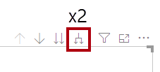
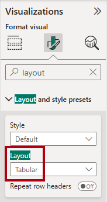
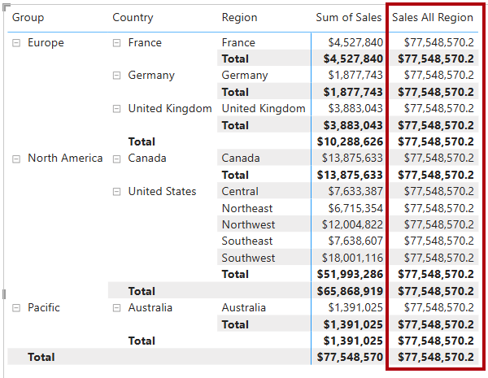

---
lab:
  title: "Ändern des DAX-Filterkontexts in Power\_BI"
  module: Modify DAX filter context in Power BI
---

# Ändern des DAX-Filterkontexts in Power BI

## Labszenario

In diesem Lab erstellen Sie Measures mit DAX-Ausdrücken, die eine Änderung des Filterkontexts vorsehen.

Folgendes wird vermittelt:

 - Ändern von Filtern mit der Funktion`CALCULATE`

**Dieses Lab sollte ungefähr 30 Minuten in Anspruch nehmen.**

## Erste Schritte

Um diese Übung abzuschließen, müssen Sie zuerst einen Webbrowser öffnen und die folgende URL eingeben, um die ZIP-Datei herunterzuladen:

`https://github.com/MicrosoftLearning/PL-300-Microsoft-Power-BI-Data-Analyst/raw/Main/Allfiles/Labs/05-modify-dax-filter-context/05-modify-dax-filter-context.zip`

Extrahieren Sie die Datei in den Ordner**C:\Benutzer\Student\Downloads\05-modify-dax-filter-context**.

Öffnen Sie die Datei**05-Starter-Sales Analysis.pbix**.

> _**Hinweis**: Möglicherweise wird beim Laden der Datei ein Anmeldedialogfeld angezeigt. Wählen Sie**Abbrechen** aus, um das Anmeldedialogfeld zu schließen. Schließen Sie alle anderen Informationsfenster. Wählen Sie**Später übernehmen** aus, wenn Sie aufgefordert werden, die Änderungen anzuwenden._

## Erstellen eines Matrixvisuals

In dieser Aufgabe erstellen Sie ein visuelles Matrixelement, um das Testen Ihrer neuen Measures zu unterstützen.

1. Erstellen Sie in Power BI Desktop eine neue Berichtsseite.

1. Fügen Sie auf**Seite 3**ein Matrixvisual hinzu.

    

1. Ändern Sie die Größe des Matrixvisuals so, dass es die gesamte Seite einnimmt.

1. Um die Felder des Matrixvisuals zu konfigurieren, ziehen Sie die Hierarchie`Region | Regions` aus dem Bereich**Daten**, und legen Sie sie innerhalb des Visuals ab.

    > In den Labs wird eine verkürzte Notation verwendet, um auf ein Feld oder eine Hierarchie zu verweisen. Sie sieht wie folgt aus:`Region | Regions`. In diesem Beispiel ist`Region` der Tabellenname und`Regions` der Hierarchiename.

1. Fügen Sie das Feld`Sales | Sales` dem Bereich**Werte** hinzu.

1. Klicken Sie rechts oben im Matrixvisual zweimal auf das gabelförmige Doppelpfeilsymbol, um die gesamte Hierarchie aufzuklappen.

    

1. Um das Visual zu formatieren, wählen Sie im Bereich**Visualisierungen** den Bereich**Format** aus.

    

1. Geben Sie im Feld **Suche** den Begriff _Layout_ ein.

1. Legen Sie die Eigenschaft**Layout** auf_Tabellarisch_ fest.

    

1. Vergewissern Sie sich, dass das Matrixvisual jetzt vier Spaltenüberschriften hat.

    

    > _Bei Adventure Works sind die Vertriebsregionen in Gruppen, Ländern und Regionen organisiert. Alle Länder mit Ausnahme der USA haben nur eine Region, die nach dem Land benannt ist. Da die USA ein derart großes Vertriebsgebiet sind, sind sie in fünf Vertriebsregionen unterteilt._

In dieser Übung erstellen Sie verschiedene Measures, und testen sie dann, indem Sie sie zum Matrixvisual hinzufügen.

## Ändern des Filterkontexts

In dieser Aufgabe erstellen Sie mehrere Measures mit DAX-Ausdrücken, die den Filterkontext mithilfe der Funktion`CALCULATE` ändern.

> _Die`CALCULATE`-Funktion ist eine leistungsstarke Funktion zum Ändern des Filterkontexts. Das erste Argument verwendet einen Ausdruck oder ein Measure (ein Measure ist lediglich ein benannter Ausdruck). Nachfolgende Argumente ermöglichen das Ändern des Filterkontexts._

1. Fügen Sie der Tabelle`Sales` ein Measure basierend auf dem folgenden Ausdruck hinzu:

    > _**Hinweis**: Der Einfachheit halber können Sie alle DAX-Definitionen in diesem Lab aus der Datei**C:\Benutzer\Student\Downloads\05-modify-dax-filter-context\Snippets.txt** kopieren._

    ```dax
    Sales All Region =
    CALCULATE(
        SUM(Sales[Sales]),
        REMOVEFILTERS(Region)
    )
    ```

    > _Die Funktion`REMOVEFILTERS` entfernt aktive Filter. Sie kann entweder keine Argumente oder eine Tabelle, eine Spalte oder mehrere Spalten als Argument verwenden._
    >
    > _In dieser Formel wertet das Measure die Summe der Spalte`Sales` in einem geänderten Filterkontext aus, der alle auf die Tabelle_ angewandten Filter entfernt.`Region`

1. Fügen Sie das Measure`Sales All Region` dem Matrixvisual hinzu.

    

1. Beachten Sie, dass das Measure die Summe der Umsätze aller Regionen für jede Region, jedes Land (Zwischensumme) und jede Gruppe (Zwischensumme) berechnet.

    > _Das neue Measure muss erst noch ein nützliches Ergebnis liefern. Wenn der Umsatz für eine Gruppe, ein Land oder eine Region durch diesen Wert geteilt wird, ergibt sich ein nützliches Verhältnis, das als „Prozent des Gesamtergebnisses“ bezeichnet wird._

1. Stellen Sie sicher, dass im Bereich**Daten** das Measure`Sales All Region` ausgewählt ist (wenn es ausgewählt ist, weist es einen dunkelgrauen Hintergrund auf). Ersetzen Sie anschließend auf der Bearbeitungsleiste den Namen des Measures und die Formel durch folgende Formel:

    > _Tipp: Um die vorhandene Formel zu ersetzen, kopieren Sie zuerst den Ausschnitt. Klicken Sie dann auf die Bearbeitungsleiste, und drücken Sie**Strg+A**, um den gesamten Text auszuwählen. Drücken Sie dann**Strg+V**, um den Ausschnitt einzufügen und den markierten Text zu überschreiben. Drücken Sie anschließend die**Eingabetaste**._

    ```dax
    Sales % All Region =
    DIVIDE(
        SUM(Sales[Sales]),
        CALCULATE(
            SUM(Sales[Sales]),
            REMOVEFILTERS(Region)
        )
    )
    ```

    > _Das Measure wurde so umbenannt, dass es die aktualisierte Formel genau wiedergibt. Die Funktion`DIVIDE` dividiert die Summe der Spalte`Sales` (nicht durch den Filterkontext geändert) durch die Summe der Spalte`Sales` in einem geänderten Kontext, wodurch alle Filter entfernt werden, die auf die Tabelle`Region` angewendet werden._

1. Beachten Sie im visuellen Matrixelement, dass das Measure umbenannt wurde und dass jetzt für jede Gruppe, jedes Land und jede Region andere Werte angezeigt werden.

1. Formatieren Sie das Measure`Sales % All Region` als Prozentsatz mit zwei Dezimalstellen.

1. Überprüfen Sie im Matrixvisual die Measurewerte`Sales % All Region`.

    

1. Fügen Sie der Tabelle`Sales` ein weiteres Measure basierend auf dem folgenden Ausdruck hinzu, und formatieren Sie es als Prozentsatz:

    ```dax
    Sales % Country =
    DIVIDE(
        SUM(Sales[Sales]),
        CALCULATE(
            SUM(Sales[Sales]),
            REMOVEFILTERS(Region[Region])
        )
    )
    ```

1. Beachten Sie, dass sich die Measureformel`Sales % Country` geringfügig von der Measureformel`Sales % All Region` unterscheidet.

    > _Der Unterschied besteht darin, dass der Nenner den Filterkontext durch Entfernen von Filtern für die Spalte`Region` in der Tabelle`Region` und nicht für alle Spalten in der Tabelle`Region` ändert. Das bedeutet, dass alle Filter, die auf die Gruppen- oder Länderspalten angewendet wurden, erhalten bleiben. Dadurch wird ein Ergebnis erzielt, das den Umsatz als Prozentsatz des Lands darstellt._

1. Fügen Sie das Measure`Sales % Country` dem Matrixvisual hinzu.

1. Beachten Sie, dass nur die Regionen der USA einen Wert aufweisen, der nicht 100 % beträgt.

    

    > _Denken Sie daran, dass nur die USA mehrere Regionen haben. Alle anderen Länder haben eine einzige Region, was bei allen das Ergebnis von 100 % erklärt._

1. Um die Lesbarkeit dieses Measures im Visual zu verbessern, überschreiben Sie das Measure`Sales % Country` durch die folgende verbesserte Formel.

    ```dax
    Sales % Country =
    IF(
        ISINSCOPE(Region[Region]),
        DIVIDE(
            SUM(Sales[Sales]),
            CALCULATE(
                SUM(Sales[Sales]),
                REMOVEFILTERS(Region[Region])
            )
        )
    )
    ```

    > _Die Funktion`IF` verwendet die Funktion`ISINSCOPE`, um zu testen, ob die Regionsspalte die Ebene in einer Hierarchie von Ebenen ist. Falls TRUE, wird die Funktion`DIVIDE` ausgewertet. Bei FALSE wird`BLANK` zurückgegeben, da sich die Regionsspalte nicht im Bereich befindet._

1. Beachten Sie, dass das Measure`Sales % Country` jetzt nur dann einen Wert zurückgibt, wenn eine Region im Geltungsbereich liegt.

    

1. Fügen Sie der Tabelle`Sales` ein weiteres Measure basierend auf dem folgenden Ausdruck hinzu, und formatieren Sie es als Prozentsatz:

    ```dax
    Sales % Group =
    DIVIDE(
        SUM(Sales[Sales]),
        CALCULATE(
            SUM(Sales[Sales]),
            REMOVEFILTERS(
                Region[Region],
                Region[Country]
            )
        )
    )
    ```

    > _Um den Umsatz als Prozentsatz der Gruppe zu erreichen, können zwei Filter angewendet werden, um die Filter für zwei Spalten effektiv zu entfernen._

1. Fügen Sie das Measure`Sales % Group` dem Matrixvisual hinzu.

1. Um die Lesbarkeit dieses Measures im Visual zu verbessern, überschreiben Sie das Measure`Sales % Group` durch die folgende Formel.

    ```dax
    Sales % Group =
    IF(
        ISINSCOPE(Region[Region])
            || ISINSCOPE(Region[Country]),
        DIVIDE(
            SUM(Sales[Sales]),
            CALCULATE(
                SUM(Sales[Sales]),
                REMOVEFILTERS(
                    Region[Region],
                    Region[Country]
                )
            )
        )
    )
    ```

1. Beachten Sie, dass das Measure`Sales % Group` jetzt nur dann einen Wert zurückgibt, wenn eine Region oder ein Land im Geltungsbereich liegt.

1. Legen Sie in der**Modellansicht** die drei neuen Measures in einem Anzeigeordner mit dem Namen_Ratios_ ab.

    

1. Speichern Sie die Power BI Desktop-Datei.

> _Die der Tabelle`Sales` hinzugefügten Measures haben den Filterkontext so geändert, dass eine hierarchische Navigation ermöglicht wird. Beachten Sie, dass das Muster zur Berechnung einer Zwischensumme das Entfernen einiger Spalten aus dem Filterkontext erfordert. Um eine Gesamtsumme zu erhalten, müssen alle Spalten entfernt werden._

## Lab abgeschlossen

Sie können Ihren Power BI-Bericht speichern, aber für dieses Lab ist dies nicht erforderlich. In der nächsten Übung arbeiten Sie mit einer vorgefertigten Startdatei.

1. Navigieren Sie zum Menü**Datei** in der oberen linken Ecke, und wählen Sie**Speichern unter** aus. 
1. Wählen Sie**Dieses Gerät durchsuchen** aus.
1. Wählen Sie den Ordner aus, in dem Sie die Datei speichern möchten, und geben Sie ihm einen aussagekräftigen Namen. 
1. Wählen Sie die Schaltfläche**Speichern** aus, um den Bericht als PBIX-Datei zu speichern. 
1. Wenn ein Dialogfeld angezeigt wird, in dem Sie aufgefordert werden, ausstehende Abfrageänderungen anzuwenden, wählen Sie**Übernehmen** aus.
1. Schließen Sie Power BI Desktop.