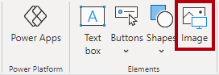
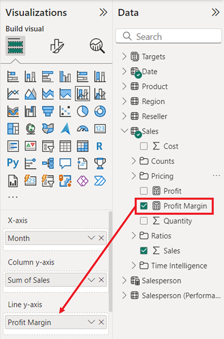
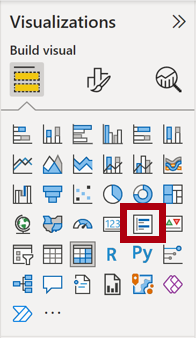
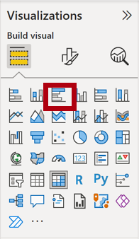

---
lab:
  title: Entwerfen eines Berichts in Power BI Desktop
  module: Create Reports in Power BI Desktop
---

# Entwerfen eines Berichts in Power BI Desktop

## **Labszenario**

In diesem Lab erstellen Sie einen dreiseitigen Bericht. Danach veröffentlichen Sie ihn in Power BI, um ihn anschließend zu öffnen und mit ihm zu interagieren.

In diesem Lab lernen Sie Folgendes:

- Entwerfen eines Berichts
- Konfigurieren von Feldern und Formatierungseigenschaften für Visuals

**Dieses Lab sollte ungefähr 45 Minuten in Anspruch nehmen.**

## **Erstellen eines Berichts**

In dieser Aufgabe richten Sie die Umgebung für das Lab ein, indem Sie den Starterbericht öffnen.

1. Navigieren Sie in Power BI Desktop zu **Datei** > **Bericht öffnen** > **Berichte durchsuchen**.

1. Öffnen Sie die Datei **Verkaufsanalyse** im Ordner **D:\PL300\Labs\06-design-report-in-power-bi-desktop\Starter**.

1. Erstellen Sie eine Kopie der Datei, indem Sie zu **Datei** > **Speichern unter** wechseln, und speichern Sie die Kopie im Ordner **D:\PL300\MySolution**.

## **Entwerfen der ersten Seite**

In dieser Aufgabe wird die erste Berichtsseite entworfen. Nach der Fertigstellung des Entwurfs sieht die Seite wie folgt aus:

1. Klicken Sie in Power BI Desktop zum Umbenennen der Seite links unten mit der rechten Maustaste auf **Seite 1**, dann auf **Umbenennen** und benennen Sie die Seite in **Übersicht** um.

    *Tipp: Sie können auch auf den Seitennamen doppelklicken, um die Seite umzubenennen.*

1. Klicken Sie zum Hinzufügen eines Bilds auf der Registerkarte **Einfügen** des Menübands in der Gruppe **Elemente** auf **Bild**.

    

1. Navigieren Sie im Fenster **Öffnen** zum Ordner **D:\PL300\Resources**.

1. Wählen Sie die Datei **AdventureWorksLogo.jpg** aus, und klicken Sie anschließend auf **Öffnen**.

1. Ziehen Sie das Bild, um es in der linken oberen Ecke zu positionieren, und ziehen Sie auch die Führungslinienmarkierungen, um die Größe zu ändern.

     

1. Um einen Datenschnitt hinzuzufügen, heben Sie zuerst die Auswahl des Bilds auf, indem Sie auf einen leeren Bereich der Berichtsseite klicken, und wählen Sie dann im Bereich **Visualisierungen** den **Datenschnitt** aus.

     

1. Ziehen Sie im Bereich **Daten** das Feld **Datum \| Jahr** (nicht die Ebene **Jahr** der Hierarchie) in den Datenschnitt **Feld** im Bereich „Visualisierungen“.
    
    *In den Labs wird eine verkürzte Notation verwendet, um auf ein Feld zu verweisen. Das sieht folgendermaßen aus: **Date \| Year**. In diesem Beispiel ist **Date** der Tabellenname und **Year** der Feldname.*

1. Um den Datenschnitt aus einer Liste in eine Dropdownliste zu konvertieren, navigieren Sie zu **Visualisierungen > Visuelles Element formatieren > Visuelles Element > Datenschnitteinstellungen > Stil**, und wählen Sie **Dropdown** aus dem Dropdownmenü aus.

    

1. Ändern Sie Größe und Position des Slicers so, dass er sich unter dem Bild befindet und die gleiche Breite wie das Bild hat.

     

1. Öffnen Sie die Dropdownliste im Slicer **Year**, wählen Sie **FY2020** aus, und klappen Sie die Dropdownliste dann zu.
    1. *Die Berichtsseite wird nun nach dem Jahr **FY2020** gefiltert.*

     

1. Heben Sie die Auswahl des Datenschnitts auf, indem Sie auf einen leeren Bereich der Berichtsseite klicken.

1. Erstellen Sie einen zweiten Slicer auf der Grundlage des Felds **Region \| Region** (nicht auf der Grundlage der Hierarchieebene **Region**).

1. Behalten Sie das Listenformat des Slicers bei, und ändern Sie Größe und Position so, dass sich der Slicer unter dem Slicer **Year** befindet.

     

1. Heben Sie die Auswahl des Datenschnitts auf, indem Sie auf einen leeren Bereich der Berichtsseite klicken.

1. Klicken Sie im Bereich **Visualisierungen** auf den Visualtyp **Liniendiagramm und gestapeltes Säulendiagramm**, um der Seite ein Diagramm hinzuzufügen.

     

1. Ändern Sie Größe und Position des Visuals so, dass es sich rechts neben dem Logo befindet und über die Breite der Berichtsseite erstreckt.

     

1. Ziehen Sie die folgenden Felder per Drag & Drop in das Visual:

     - Date \| Month
     - Sales \| Sales

1. Im Feldbereich des Visuals (unter dem Bereich **Visualisierungen**) sehen Sie, dass die Felder den Bereichen **x-Achse** und **Spalte y-Achse** zugewiesen sind.
    
    *Wenn Sie Felder in ein visuelles Element ziehen, werden sie den Standardbereichen hinzugefügt. Sie können Felder wie im nächsten Schritt auch direkt in die Bereiche ziehen, um eine höhere Genauigkeit zu erzielen.*

     

1. Ziehen Sie im Bereich **Daten** das Feld **Sales \| Profit Margin** in den Bereich **Linie y-Achse**.

     

1. Beachten Sie, dass das Visual nur 11 Monate umfasst.
    
    *Für den letzten Monat des Jahres (Juni 2020) liegen noch keine Verkäufe vor. Monate OHNE Verkaufszahlen werden vom Visual standardmäßig entfernt. Im nächsten Schritt wird das visuelle Element so konfiguriert, dass alle Monate angezeigt werden.*

1. Klicken Sie im Feldbereich des visuellen Elements im Bereich **X-Achse** für das Feld **Monat** auf den Pfeil nach unten, und wählen Sie **Elemente ohne Daten anzeigen** aus.
    
    *Wie Sie sehen, wird der Monat **Juni 2020** jetzt angezeigt.*

     

1. Heben Sie die Auswahl des Diagramms auf, indem Sie auf einen leeren Bereich der Berichtsseite klicken.

1. Klicken Sie im Bereich **Visualisierungen** auf den Visualtyp **Gestapeltes Säulendiagramm**, um der Seite ein Diagramm hinzuzufügen.

     

1. Ändern Sie Größe und Position des Visuals so, dass es sich unter dem Säulen-/Liniendiagramm befindet und die halbe Breite des darüber liegenden Diagramms einnimmt.

     

1. Fügen Sie den Visualbereichen die folgenden Felder hinzu:

     - X-Achse: **Region \| Land**
     - y-Achse: **Sales \| Sales**
     - Legende: **Product \| Category**

1. Heben Sie die Auswahl des Diagramms auf, indem Sie auf einen leeren Bereich der Berichtsseite klicken.

1. Klicken Sie im Bereich **Visualisierungen** auf den Visualtyp **Gestapeltes Balkendiagramm**, um der Seite ein Diagramm hinzuzufügen.

     

1. Ändern Sie Größe und Position des Visuals so, dass es die restliche Berichtsseite ausfüllt.

     

1. Fügen Sie den Visualbereichen die folgenden Felder hinzu:

     - Y-Achse: **Produkt \| Kategorie**
     - X-Achse: **Verkauf \| Menge**

1. Öffnen Sie zum Formatieren des Visuals den Bereich **Format**.

     

1. Erweitern Sie die **Balken** und dann die Gruppe **Farben**. Legen Sie anschließend die Eigenschaft **Standardfarbe** auf eine geeignete Farbe fest (als Kontrast zum Säulen- bzw. Liniendiagramm).

1. Legen Sie die Eigenschaft **Datenbeschriftungen** auf **Ein** fest.

     

1. Speichern Sie die Power BI Desktop-Datei.

*Damit ist der Entwurf der ersten Seite fertig.*

## **Entwerfen der zweiten Seite**

In dieser Aufgabe wird die zweite Berichtsseite entworfen. Nach der Fertigstellung des Entwurfs sieht die Seite wie folgt aus:

 

*Wichtig: Da in den Labs bereits ausführliche Anweisungen bereitgestellt wurden, enthalten die folgenden Schritte zum Lab kurzgefasste Anweisungen. Wenn Sie die ausführlichen Anweisungen benötigen, können Sie zu den anderen Aufgaben in diesem Lab zurückkehren.*

1. Um eine neue Seite zu erstellen, wählen Sie unten links das Plussymbol aus, und benennen Sie die neue Seite in **Gewinn** um.

1. Fügen Sie einen auf dem Feld **Region \| Region** basierenden Slicer hinzu.

1. Verwenden Sie den Bereich **Format**, um die Option „Alle auswählen“ (in der Gruppe **Auswahl**) zu aktivieren.

1. Ändern Sie die Größe und Position des Slicers so, dass er sich auf der linken Seite der Berichtsseite befindet und etwa die Hälfte der Seitenhöhe einnimmt.

     

1. Fügen Sie ein Matrixvisual hinzu, und ändern Sie seine Größe und Position so, dass es den restlichen Bereich der Berichtsseite einnimmt.

     

1. Fügen Sie dem Matrixbereich **Zeilen** die Hierarchie **Date \| Fiscal** hinzu.

     

1. Fügen Sie dem Bereich **Werte** die folgenden fünf Felder der Tabelle **Sales** hinzu:

     - „Orders“ (Bestellungen) (aus dem Ordner **Counts** (Anzahl))
     - „Sales“ (Umsatz)
     - „Cost“ (Kosten)
     - „Profit“ (Gewinn)
     - Profit Margin

     

1. Beachten Sie im Bereich **Filter** (auf der linken Seite des Bereichs **Visualisierungen**) den Bereich **Filter für diese Seite**. (Hierzu müssen Sie möglicherweise nach unten scrollen.)

     

1. Ziehen Sie das Feld **Product \| Category** aus dem Bereich **Daten** in den Bereich **Filter für diese Seite**.
    
    *Mit Feldern, die dem Bereich **Filter** hinzugefügt werden, kann das gleiche Ergebnis erzielt werden wie mit einem Slicer. Ein Unterschied besteht darin, dass sie keinen Platz auf der Berichtsseite beanspruchen. Ein weiterer Unterschied besteht darin, dass sie für erweiterte Filteranforderungen konfiguriert werden können.*

1. Klicken Sie rechts oben auf der Filterkarte auf den Pfeil, um die Karte zuzuklappen.

1. Fügen Sie dem Bereich **Filter für diese Seite** die folgenden Felder der Tabelle **Product** hinzu, und reduzieren Sie sie jeweils (direkt unterhalb der Karte **Kategorie**):

     - „Subcategory“ (Unterkategorie)
     - „Product“ (Produkt)
     - „Color“ (Farbe)

     

1. Speichern Sie die Power BI Desktop-Datei.

 *Damit ist der Entwurf der zweiten Seite fertig.*

## **Entwerfen der dritten Seite**

In dieser Aufgabe wird die dritte und letzte Berichtsseite entworfen. Nach der Fertigstellung des Entwurfs sieht die Seite wie folgt aus:

 

1. Erstellen Sie eine neue Seite, und benennen Sie sie in **My Performance** (Meine Leistung) um.

1. Um die Leistung von Filtern für die Sicherheit auf Zeilenebene zu simulieren, ziehen Sie das Feld **Salesperson (Performance) \| Salesperson** in die Filter auf Seitenebene im Filterbereich.

     

1. Wählen Sie **Michael Blythe** aus. Die Daten auf der Berichtsseite **My Performance** (Meine Leistung) werden jetzt gefiltert, um nur Daten für Michael Blythe anzuzeigen.

1. Fügen Sie einen auf dem Feld **Date \| Year** basierenden Dropdown-Slicer hinzu, und ändern Sie Größe und Position so, dass er sich in der linken oberen Ecke der Seite befindet.

     

1. Legen Sie im Slicer die Seite so fest, dass Sie nach **FY2019** gefiltert wird.

     

1. Fügen Sie ein Visual vom Typ **Mehrzeilige Zuordnung** hinzu, und ändern Sie Größe und Position so, dass es sich rechts von der Schaltfläche befindet und die restliche Breite der Seite einnimmt.

     

     

1. Fügen Sie dem Visual die folgenden vier Felder hinzu:

     - Sales \| Sales
     - Targets \| Target
     - Targets \| Variance
     - Targets \| Variance Margin

1. Formatieren Sie das Visual:

     - Erhöhen Sie in der Gruppe **Beschriftungswert** die Eigenschaft **Textgröße** auf **28 Pt**.

     - Legen Sie in der Gruppe **Allgemein > Effekte > Hintergrund** die **Farbe** auf eine hellgraue Farbe fest (z. B. „Weiß, 20 % dunkler“) fest, um einen Kontrast zu erzeugen.

         

1. Fügen Sie ein Visual vom Typ **Balkendiagramm (gruppiert)** hinzu, und ändern Sie Größe und Position so, dass es sich unter dem Visual „Mehrzeilige Zuordnung“ befindet und die restliche Höhe der Seite sowie die Hälfte der Breite des Visuals „Mehrzeilige Zuordnung“ einnimmt.

     

     

1. Fügen Sie den Visualbereichen die folgenden Felder hinzu:

     - Y-Achse: **Datum \| Monat**
     - X-Achse: **Sales \| Sales** und **Targets \| Target**

         

1. Drücken Sie **STRG+C**, um das Visual zu kopieren, und drücken Sie anschließend **STRG+V**.

1. Positionieren Sie das neue Visual rechts neben dem ursprünglichen Visual.

     

1. Wählen Sie zum Ändern des Visualisierungstyps im Bereich **Visualisierungen** die Option **Säulendiagramm (gruppiert)** aus.

     

 *Nun werden die gleichen Daten mit zwei verschiedenen Visualisierungstypen dargestellt. Das ist keine gute Verwendung des Seitenlayouts, aber Sie werden dies im Lab **Verbessern eines Berichts in Power BI Desktop** verbessern, indem Sie die visuellen Elemente überlagern. Wenn Sie der Seite Schaltflächen hinzufügen, können die Benutzer der Berichte bestimmen, welches der beiden visuellen Elemente sichtbar sein soll.*

 *Damit ist der Entwurf der dritten und letzten Seite fertig.*

## **Veröffentlichen des Berichts**

In dieser Aufgabe veröffentlichen Sie den Bericht im Power BI-Dienst.

1. Wählen Sie die Seite **Übersicht** aus, und speichern Sie dann die Power BI Desktop-Datei.

1. Klicken Sie auf der Registerkarte **Start** des Menübands innerhalb der Gruppe **Freigeben** auf **Veröffentlichen**.
    
    *Wenn Sie noch nicht bei Power BI Desktop angemeldet sind, müssen Sie sich für die Veröffentlichung anmelden.*

     

1. Beachten Sie, dass im Fenster **In Power BI veröffentlichen** die Option **Mein Arbeitsbereich** ausgewählt ist.
    
    *In diesem Lab werden keine Details zu den verschiedenen Elementen innerhalb des Power BI-Diensts erläutert.*

1. Wählen Sie **Auswählen** aus, um den Bericht zu veröffentlichen. Dies kann einige Zeit dauern. 
1. Wenn die Veröffentlichung erfolgreich war, klicken Sie auf **OK**.

## **Erkunden des Berichts**

In dieser Aufgabe erkunden Sie den Bericht, der in Power BI veröffentlicht wurde.

1. Öffnen Sie einen Microsoft Edge-Browser, und melden Sie sich unter **https://app.powerbi.com** an.

1. Erweitern Sie im Browserfenster von Microsoft Edge im Power BI-Dienst im Bereich **Navigation** (auf der linken Seite, möglicherweise ist der Bereich zugeklappt) die Option **Mein Arbeitsbereich**.

    

1. Überprüfen Sie den Inhalt des Arbeitsbereichs. Beachten Sie die Navigationsoptionen „Alle“, „Inhalt“ und „Datasets + Dataflows“.
    1. *Es gibt vier Arten von Elementen in einem Arbeitsbereich, und wir befassen uns mit den Elementen **Berichte** und **Datasets**.*
    1. *Möglicherweise müssen Sie Ihren Microsoft Edge-Browser aktualisieren, wenn das Dataset nicht angezeigt wird.*
    1. *Wenn Sie die Power BI Desktop-Datei veröffentlicht haben, wurde das Datenmodell als Dataset veröffentlicht.*

1. Klicken Sie auf den Bericht **Verkaufsanalyse**, um den Bericht zu erkunden.

1. Wählen Sie links im Bereich **Seiten** die Seite **Overview** aus.

1. Wählen Sie im Datenschnitt **Regions** (Regionen) mehrere Regionen aus, und halten Sie dabei **STRG** gedrückt.

1. Wählen Sie im Säulen-/Liniendiagramm eine beliebige Monatsspalte aus, um eine Kreuzfilterung der Seite durchzuführen.

1. Drücken Sie die Taste **Strg** und wählen Sie einen anderen Monat aus.

     *Hinweis: Bei der Kreuzfilterung werden standardmäßig alle anderen visuellen Elemente auf der Seite gefiltert.*

1. Wie Sie sehen, wird das Balkendiagramm gefiltert und hervorgehoben. Der fett formatierte Teil der Balken stellt dabei die gefilterten Monate dar.

1. Zeigen Sie mit dem Cursor auf das Visual mit dem Balkendiagramm und anschließend rechts oben auf das Filtersymbol. 
    
    *Über das Filtersymbol können Sie nachvollziehen, welche Filter auf das Visual angewendet wurden (einschließlich Datenschnitte und Kreuzfilterungen von anderen Visuals).*

1. Zeigen Sie mit dem Mauszeiger auf einen Balken, und sehen Sie sich die QuickInfo an.

1. Klicken Sie zum Rückgängigmachen der Kreuzfilterung im Säulen-/Liniendiagramm auf einen leeren Bereich des Visuals.

1. Zeigen Sie mit dem Mauszeiger auf das Diagramm mit der gestapelten Spalte, und klicken Sie anschließend rechts oben auf das Symbol für den **Fokusmodus**.
    
    *Im Fokusmodus wird das Visual auf die volle Seitengröße vergrößert.*

     

1. Zeigen Sie mit dem Cursor auf verschiedene Segmente der Balkendiagramme, um QuickInfos anzuzeigen.

1. Klicken Sie links oben auf **Back to Report** (Zurück zum Bericht), um zur Berichtsseite zurückzukehren.

     

1. Zeigen Sie mit dem Cursor erneut auf eines der visuellen Elemente, und klicken Sie dann rechts oben auf die Auslassungspunkte (...). Sehen Sie sich die Menüoptionen an. Testen Sie die einzelnen Optionen mit Ausnahme von **In Teams chatten**.

     

1. Wählen Sie links im Bereich **Seiten** die Seite **Profit** (Gewinn) aus.

     

1. Beachten Sie, dass der Slicer **Region** über eine andere Auswahl als der Slicer **Region** auf der Seite **Übersicht** verfügt.
    
    *Die Datenschnitte werden nicht synchronisiert. Ändern Sie den Berichtsentwurf im Lab **Verbessern eines Berichts in Power BI Desktop**, um sicherzustellen, dass eine Synchronisierung zwischen den Seiten erfolgt.*

1. Erweitern Sie im Bereich **Filter** (rechts) eine Filterkarte, und wenden Sie einige Filter an.
    
    *Im Bereich **Filter** können Sie mehr Filter definieren als in Form von Slicern auf eine Seite passen.*

1. Verwenden Sie im Matrixvisual die Plusschaltfläche (+), um die Hierarchie **Geschäftskalender** zu erweitern.

1. Wählen Sie die Seite **My Performance** (Meine Leistung) aus.

     

1. Klicken Sie rechts oben auf der Menüleiste auf **Ansicht**, und wählen Sie dann **Vollbild** aus.

     

1. Interagieren Sie mit der Seite, indem Sie den Datenschnitt ändern und eine Kreuzfilterung der Seite durchführen.

1. Beachten Sie links unten auf dem Fenster die Befehle zum Ändern der Seite, zum Navigieren zwischen Seiten sowie zum Beenden des Vollbildmodus.

1. Wählen Sie das Symbol rechts aus, um den Vollbildmodus zu beenden.

     

### **Abschluss**

Mit dieser Aufgabe schließen Sie das Lab ab.

Klicken Sie auf dem Banner auf der Fensterwebseite auf **Mein Arbeitsbereich**, um zurück zu Ihrem Arbeitsbereich zu navigieren.

 *Sie können den Berichtsentwurf mit erweiterten Features im Lab **Verbessern eines Berichts in Power BI Desktop** verbessern.*
