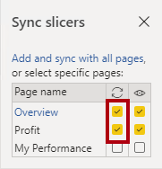
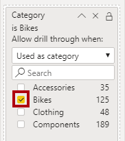
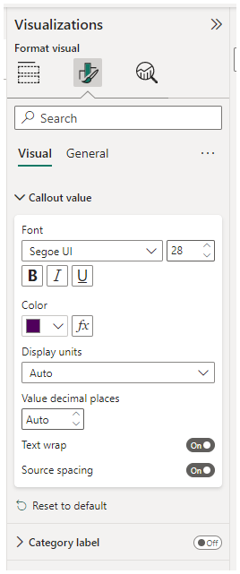
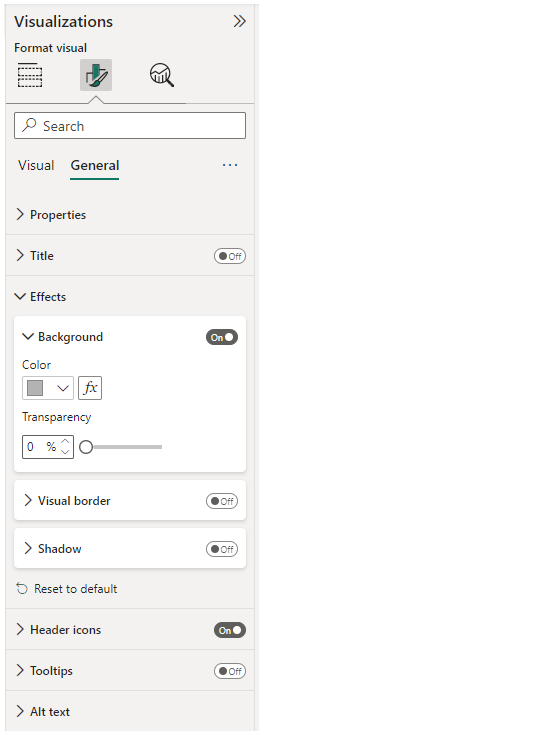
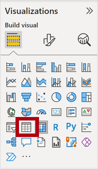
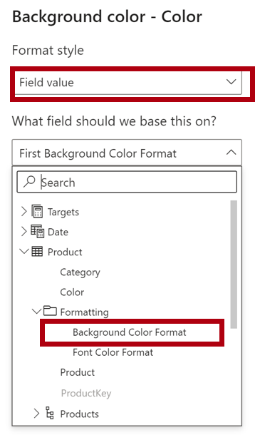
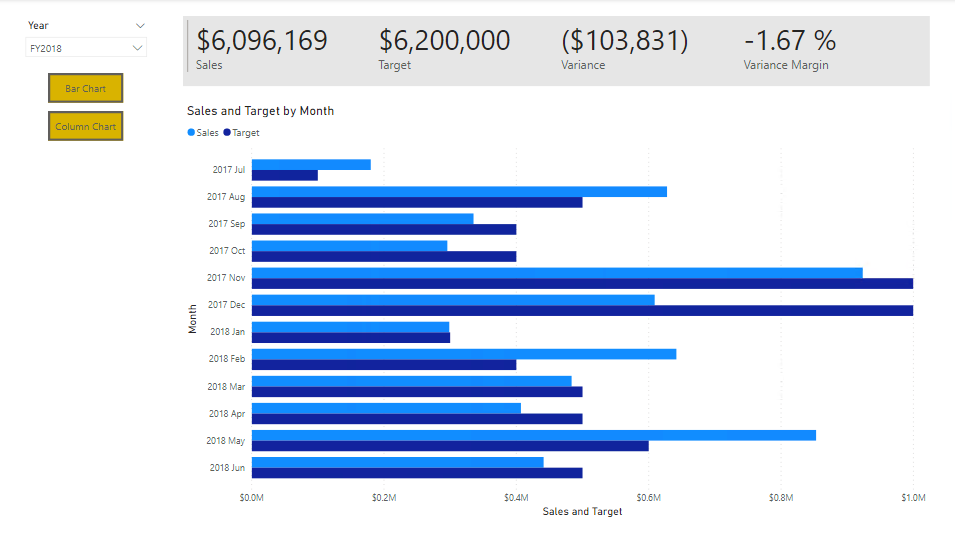

---
lab:
  title: "Verbessern eines Berichts in Power\_BI Desktop"
  module: Create Reports in Power BI desktop
---

# Verbessern eines Berichts in Power BI Desktop

## Labszenario

In diesem Lab optimieren Sie die Verkaufsanalyse **Sales Analysis** mit erweiterten Entwurfsfunktionen.

In diesem Lab lernen Sie Folgendes:

- Synchronisieren von Slicers
- Erstellen einer Drillthroughseite
- Anwenden von bedingter Formatierung
- Erstellen und Verwenden von Lesezeichen

**Dieses Lab sollte ungefähr 45 Minuten in Anspruch nehmen.**

## Erste Schritte

Um diese Übung abzuschließen, öffnen Sie zuerst einen Webbrowser, und geben Sie die folgende URL ein, um den ZIP-Ordner herunterzuladen:

`https://github.com/MicrosoftLearning/PL-300-Microsoft-Power-BI-Data-Analyst/raw/Main/Allfiles/Labs/07-design-report-in-power-bi-desktop-enhanced/07-enhanced-report.zip`

Extrahieren Sie den Ordner in den Ordner **C:\Users\Student\Downloads\07-enhanced-report**.

Öffnen Sie die Datei **07-Starter-Sales Analysis.pbix**.

> ***Hinweis**: Sie können die Anmeldung abbrechen, indem Sie **Abbrechen** wählen. Schließen Sie alle anderen Informationsfenster. Wählen Sie **Später anwenden**, wenn Sie aufgefordert werden, die Änderungen anzuwenden.*

## Synchronisieren von Slicers

In dieser Aufgabe synchronisieren Sie die Datenschnitte **Jahr** und **Region** und setzen die Entwicklung des Berichts fort, der im Lab **Entwerfen eines Berichts in Power BI Desktop** erstellt wurde.

1. Legen Sie In Power BI Desktop auf der Seite **Übersicht** den Slicer **Year** auf **FY2018** fest.

1. Wechseln Sie zur Seite **My Performance** (Meine Leistung). Sie sehen, dass der Slicer **Year** einen anderen Wert aufweist.

    > *Wenn Datenschnitte nicht synchronisiert werden, kann dies zur fehlerhaften Darstellung von Daten und zu Frustration bei den Benutzern des Berichts führen. Synchronisieren Sie nun die Datenschnitte im Bericht.*

1. Kehren Sie zur Seite **Übersicht** zurück, und wählen Sie dann den Slicer **Year** aus.

1. Wählen Sie auf der Registerkarte **Ansicht** des Menübands in der Gruppe **Bereiche anzeigen** **Slicer synchronisieren** aus.

     

1. Aktivieren Sie im Bereich **Slicers synchronisieren** (links im Bereich **Visualisierungen**) in der zweiten Spalte (für die Synchronisierung) die Kontrollkästchen für die Seiten **Übersicht** und **My Performance** (Meine Leistung).

     

1. Wählen Sie auf der Seite **Übersicht** den Slicer **Region** aus.

1. Synchronisieren Sie den Slicer mit den Seiten **Übersicht** und **Gewinn**.

     

1. Testen Sie die Synchronisierungsslicer, indem Sie verschiedene Filteroptionen auswählen und dann überprüfen, ob mit den synchronisierten Slicern nach der gleichen Auswahl gefiltert wird.

1. Um die Seite **Sync Slicer** zu schließen, wählen Sie die Option **Sync Slicer** auf der Registerkarte des Menübands **Ansicht**.

## Konfigurieren einer Drillthrough-Seite

In dieser Übung erstellen Sie eine neue Seite und konfigurieren sie als Drillthroughseite. Nach der Fertigstellung des Entwurfs sieht die Seite wie folgt aus:

1. Fügen Sie eine neue Berichtsseite mit dem Namen **Produktdetails** hinzu.

1. Klicken Sie mit der rechten Maustaste auf die Seitenregisterkarte **Produktdetails**, und wählen Sie dann die Option **Seite ausblenden** aus.

    > *Berichtsbenutzer*innen können nicht direkt zur Drillthroughseite navigieren. Sie müssen über Visuals auf anderen Seiten darauf zugreifen. In der abschließenden Übung dieses Labs wird beschrieben, wie Sie den Drillthrough zur Seite durchführen.*

1. Fügen Sie unterhalb des Bereichs **Visualisierungen** im Abschnitt **Drillthrough** im Feld **Drillthroughfelder hier hinzufügen** das Feld **Product \| Category** hinzu.

    > *In den Labs wird eine verkürzte Notation verwendet, um auf ein Feld zu verweisen. Das sieht folgendermaßen aus: **Product \| Category**. In diesem Beispiel ist **Product** der Tabellenname und **Category** der Feldname.*

     

1. Wählen Sie zum Testen der Drillthroughseite auf der Drillthrough-Filterkarte die Option **Fahrräder** aus.

     

1. Beachten Sie oben links auf der Berichtsseite die Pfeilschaltfläche.

    > *Es wird automatisch eine Pfeilschaltfläche hinzugefügt, wenn dem Drillthroughbereich ein Feld hinzugefügt wird. Sie ermöglicht es Berichtsbenutzern, zurück zu der Seite zu wechseln, auf der sie den Drillthrough gestartet haben.*

1. Fügen Sie der Seite das Visual **Karte** hinzu. Ändern Sie dann die Größe und Position so, dass es rechts von der Schaltfläche angeordnet ist und die restliche Breite der Seite ausfüllt.

    

    

1. Ziehen Sie das Feld **Product \| Category** auf das Visual „Karte“.

1. Konfigurieren Sie die Formatoptionen für das Visual, und legen Sie die Eigenschaft **Kategoriebeschriftung** dann auf **Aus** fest.

     

1. Legen Sie die Eigenschaft **Effekte > Hintergrundfarbe** auf einen hellen Grauton fest, wie z. B. auf *Weiß, 20 % dunkler*.

     

1. Fügen Sie der Seite ein Visual vom Typ **Tabelle** hinzu. Ändern Sie dessen Größe und Position anschließend so, dass es unterhalb des Kartenvisuals angeordnet ist und den restlichen Platz der Seite einnimmt.

     

     

1. Fügen Sie dem Visual die folgenden Felder hinzu:

     - **Produkt \| Unterkategorie**
     - **Produkt \| Farbe**
     - **Sales \| Quantity**
     - **Sales \| Sales**
     - **Sales \| Profit Margin**

1. Konfigurieren Sie die Formatoptionen für das visuelle Element und setzen Sie in den Abschnitten **Werte** und **Spaltenüberschriften** die Eigenschaft **Textgröße** auf **20pt**.

*Der Entwurf der Drillthroughseite ist nun fast abgeschlossen. In der nächsten Übung reichern Sie die Seite mit bedingter Formatierung an.*

## Hinzufügen von bedingter Formatierung

In dieser Übung erweitern Sie die Drillthroughseite, indem Sie eine bedingte Formatierung hinzufügen. Nach der Fertigstellung des Entwurfs sieht die Seite wie folgt aus:

1. Wählen Sie das Visual vom Typ „Tabelle“ aus. Klicken Sie im Bereich „Visualisierung“ beim Wert **Profit Margin** (Gewinnspanne) auf den Pfeil nach unten, und wählen Sie **Bedingte Formatierung \| Symbole** aus.

    

1. Wählen Sie im Fenster **Symbole – Profit Margin** in der Dropdownliste **Symbollayout** die Option **Rechts von den Daten** aus.

    

1. Wählen Sie links neben dem gelben Dreieck das **X** aus, um die mittlere Regel zu löschen.

    

1. Konfigurieren Sie die erste Regel (rotes Karo) wie folgt:

    - Entfernen Sie im zweiten Steuerelement den Wert.
    - Wählen Sie für das dritte Steuerelement **Zahl** aus.
    - Geben Sie im fünften Steuerelement **0** ein.
    - Wählen Sie für das sechste Steuerelement **Zahl** aus.

1. Konfigurieren Sie die zweite Regel (grüner Kreis) wie folgt und wählen Sie dann **OK** aus:

    > *Die Regeln können wie folgt interpretiert werden: Anzeige eines roten Karos, wenn der Wert für die Rendite kleiner als 0 ist, und Anzeige des grünen Kreises, wenn der Wert größer oder gleich 0 ist.*

    - Geben Sie im zweiten Steuerelement **0** ein.
    - Wählen Sie für das dritte Steuerelement **Zahl** aus.
    - Entfernen Sie im fünften Steuerelement den Wert.
    - Wählen Sie für das sechste Steuerelement **Zahl** aus.

    

1. Überprüfen Sie im visuellen Tabellenelement, ob die richtigen Symbole angezeigt werden.

    

1. Konfigurieren Sie die bedingte Formatierung der Hintergrundfarbe für das Feld **Farbe**.

1. Wählen Sie im Fenster **Hintergrundfarbe – Farbe** in der Dropdownliste **Formatstil** die Option **Feldwert** aus.

1. Wählen Sie in der Dropdownliste **Welches Feld sollten wir als Grundlage nehmen?** die Optionen **Produkt \| Formatierung \| Format der Hintergrundfarbe**  und anschließend **OK** aus.

    

1. Wiederholen Sie die obigen Schritte, um die bedingte Formatierung der Schriftfarbe für das Feld **Farbe** zu konfigurieren, indem Sie das Feld **Produkt \| Formatierung \| Font Color Format** (Format der Schriftfarbe) verwenden.

*Sie erinnern sich vielleicht daran, dass die Hintergrundfarben aus der Datei **ColorFormats.csv** im Lab **Vorbereiten von Daten in Power BI Desktop** stammen und dann mit der Abfrage **Product** auf der Registerkarte **Daten in Power BI Desktop laden** integriert wurden.*

## Hinzufügen von Lesezeichen und Schaltflächen

In dieser Übung erweitern Sie die Seite **My Performance** (Meine Leistung) durch Schaltflächen, damit Berichtsbenutzer den gewünschten Typ des visuellen Elements auswählen können. Nach der Fertigstellung des Entwurfs sieht die Seite wie folgt aus:

1. Navigieren Sie zur Seite **My Performance** (Meine Leistung). Wählen Sie auf der Registerkarte **Ansicht** des Menübands in der Gruppe **Bereiche anzeigen** **Lesezeichen** aus.

    

1. Wählen Sie auf der Registerkarte **Ansicht** des Menübands in der Gruppe **Bereiche anzeigen** **Auswahl** aus.

1. Wählen Sie zum Ausblenden des Visuals im Bereich **Auswahl** neben einem der Elemente unter **Sales and Target by Month** (Umsatz und Ziel nach Monat) das Augensymbol aus.

    

1. Wählen Sie im Bereich **Lesezeichen** **Hinzufügen** aus.

    > *Doppelklicken Sie auf das Lesezeichen, um es umzubenennen.*

    

1. Falls das Balkendiagramm angezeigt wird, sollten Sie das Lesezeichen in **Balkendiagramm EIN** umbenennen, und andernfalls in **Säulendiagramm EIN**.

1. Zeigen Sie zum Bearbeiten des Lesezeichens im Bereich **Lesezeichen** mit dem Cursor auf das Lesezeichen, klicken Sie auf die Auslassungspunkte, und wählen Sie dann **Daten** aus.

    > *Das Deaktivieren der Option **Daten** bewirkt, dass das Lesezeichen den aktuellen Filterstatus nicht verwendet. Das ist wichtig, da andernfalls das Lesezeichen zu einer dauerhaften Sperre in dem Filter führen würde, der aktuell vom Slicer **Year** angewandt wird.*

     

1. Zum Aktualisieren des Lesezeichens klicken Sie erneut auf die Auslassungspunkte und wählen dann **Aktualisieren** aus.

    > *In den folgenden Schritten erstellen und konfigurieren Sie ein zweites Lesezeichen, um das zweite Visual anzuzeigen.*

1. Schalten Sie im Bereich **Auswahl** die Sichtbarkeit der beiden Elemente unter **Sales and Target by Month** (Umsatz und Ziel nach Monat) um.

    > *Anders ausgedrückt: Blenden Sie das angezeigte Visual aus und das ausgeblendete Visual ein.*

     

1. Erstellen Sie ein zweites Lesezeichen, und benennen Sie es entsprechend (entweder **Säulendiagramm EIN** oder **Balkendiagramm EIN)**.

     

1. Konfigurieren Sie das zweite Lesezeichen so, dass Filter ignoriert werden (Option **Daten** AUS), und aktualisieren Sie das Lesezeichen.

1. Zeigen Sie im Bereich **Auswahl** einfach das ausgeblendete Visual an, um beide Visuals einzublenden.

1. Ändern Sie die Größe und Position beider Visuals so, dass sie die Seite unterhalb des Visuals mit mehreren Karten ausfüllen und einander vollständig überlappen.

    *Wählen Sie das verdeckte visuelle Element im Bereich **Auswahl** aus.*

    

1. Wählen Sie im Bereich **Lesezeichen** die beiden Lesezeichen aus. Sie sehen, dass nur ein Visual sichtbar ist.

*In der nächsten Entwurfsphase werden der Seite zwei Schaltflächen hinzugefügt, damit Berichtsbenutzer die Lesezeichen auswählen können.*

1. Wählen Sie im Menüband **Einfügen** in der Gruppe **Elemente** **Schaltfläche** und dann die Option **Leer** aus.

     

1. Platzieren Sie die Schaltfläche direkt unterhalb des Slicers **Year**.

1. Wählen Sie die Schaltfläche aus und dann im Bereich **Schaltfläche formatieren** die Option **Schaltfläche**, erweitern Sie den Abschnitt **Formatvorlage** und setzen Sie die Eigenschaft **Text** auf **Ein**.

     

1. Erweitern Sie den Abschnitt **Text**, und geben Sie dann in das Feld **Text** **Balkendiagramm** ein.

1. Erweitern Sie den Abschnitt **Füllen**, und legen Sie eine Komplementärfarbe als Füllfarbe fest.

1. Klicken Sie auf **Schaltfläche**, und setzen Sie die Eigenschaft **Aktion** auf **Ein**.

    

1. Erweitern Sie den Abschnitt **Aktion**, und wählen Sie dann in der Dropdownliste **Typ** die Option **Lesezeichen** aus.

1. Wählen Sie in der Dropdownliste **Lesezeichen** die Option **Balkendiagramm EIN** aus.

    

1. Erstellen Sie per Kopieren und Einfügen eine Kopie der Schaltfläche, und konfigurieren Sie die neue Schaltfläche dann wie folgt:

    *Tipp: Die Tastenkombination für das Kopieren und Einfügen ist **STRG+C** gefolgt von **STRG+V**.*

    - Legen Sie die Eigenschaft **Schaltflächentext** auf **Säulendiagramm** fest.
    - Wählen Sie im Abschnitt **Aktion** in der Dropdownliste **Lesezeichen** die Option **Säulendiagramm EIN** aus.

*Der Entwurf des Sales Analysis-Berichts ist nun fertig gestellt.*

## Veröffentlichen und Erkunden des Berichts

In dieser Übung veröffentlichen Sie den Bericht im Power BI-Dienst und erkunden das Verhalten des veröffentlichten Berichts.

> **Hinweis**: Sie können den Rest der Übung auch einsehen, wenn Sie keinen Zugriff auf den Onlinedienst „Power BI“ haben, um die Aufgaben direkt auszuführen.

1. Wählen Sie die Seite **Übersicht** aus.

1. Wählen Sie im Slicer **Jahr** die Option **FY2020** (GJ2020) aus.

1. Wählen Sie im Slicer **Region** die Option **Alles auswählen** aus.

1. Speichern Sie die Power BI Desktop-Datei.

1. Klicken Sie auf der Registerkarte **Start** des Menübands innerhalb der Gruppe **Freigeben** auf **Veröffentlichen**.

    > *Wenn Sie noch nicht bei Power BI Desktop angemeldet sind, müssen Sie sich für die Veröffentlichung anmelden.*

     

1. Beachten Sie, dass im Fenster **In Power BI veröffentlichen** die Option **Mein Arbeitsbereich** ausgewählt ist.

1. Wählen Sie **Auswählen** aus, um den Bericht zu veröffentlichen.
    1. Wenn Sie zum Ersetzen des semantischen Modells aufgefordert werden, wählen Sie **Ersetzen** aus.
    1. Wenn die Veröffentlichung erfolgreich war, klicken Sie auf **OK**.

1. Schließen Sie Power BI Desktop.

1. Navigieren Sie in einem Microsoft Edge-Browserfenster zum Power BI-Dienst > **Mein Arbeitsbereich**, und wählen Sie den Bericht **Verkaufsanalyse** aus.

1. Um das Drillthroughfeature zu testen, navigieren Sie zur Seite **Übersicht** und zum visuellen Element **Menge nach Kategorie**. Klicken Sie dann mit der rechten Maustaste auf die Leiste **Kleidung**, und wählen Sie **Drillthrough \| Produktdetails** aus.

     

1. Beachten Sie, dass die Seite **Produktdetails** Informationen zu **Clothing** (Bekleidung) enthält.

1. Klicken Sie links oben auf die Pfeilschaltfläche, um zur Ausgangsseite zurückzukehren.

1. Wählen Sie die Seite **My Performance** (Meine Leistung) aus.

     > *Wählen Sie die einzelnen Schaltflächen aus. Sie sehen, dass jeweils ein anderes Visual angezeigt wird.*

## Lab abgeschlossen
