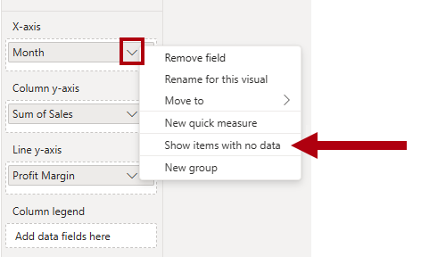
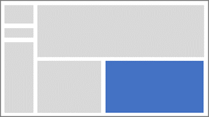
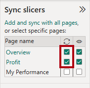
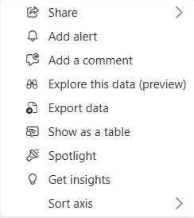

---
lab:
  title: Entwerfen von Power BI-Berichten
  module: Design Power BI reports
---

# Entwerfen von Power BI-Berichten

## Labszenario

In diesem Lab erstellen Sie einen dreiseitigen Bericht. Danach veröffentlichen Sie ihn im Power BI-Dienst, um ihn anschließend zu öffnen und mit ihm zu interagieren.

In diesem Lab lernen Sie Folgendes:

- Entwerfen eines Berichts
- Konfigurieren von Feldern und Formatierungseigenschaften für Visuals
- Synchronisieren von Datenschnitten
- Veröffentlichen Sie den Bericht im Power BI-Dienst.
- Interagieren Sie mit einem Bericht und seinen Visuals.

**Dieses Lab sollte ungefähr 45 Minuten in Anspruch nehmen.**

## Erste Schritte

Um diese Übung abzuschließen, öffnen Sie zuerst einen Webbrowser, und geben Sie die folgende URL ein, um eine ZIP-Datei herunterzuladen:

`https://github.com/MicrosoftLearning/PL-300-Microsoft-Power-BI-Data-Analyst/raw/Main/Allfiles/Labs/08-design-power-bi-reports/08-design-report.zip`

Extrahieren Sie die Datei in den Ordner **C:\Benutzer\Student\Downloads\08-design-report**.

Öffnen Sie die Datei **08-Starter-Sales Analysis.pbix** .

> _**Hinweis**: Sie können die Anmeldung abbrechen, indem Sie **Abbrechen** auswählen. Schließen Sie alle anderen Informationsfenster. Wählen Sie **Später übernehmen** aus, wenn Sie aufgefordert werden, die Änderungen anzuwenden._

## Entwerfen der ersten Seite

In dieser Aufgabe wird die erste Berichtsseite entworfen. Nach der Fertigstellung des Entwurfs sieht die Seite wie folgt aus:

1. Klicken Sie in Power BI Desktop zum Umbenennen der Seite links unten mit der rechten Maustaste auf **Seite 1**, und wählen Sie dann **Umbenennen** aus. Benennen Sie die Seite in _Übersicht_ um.

    > _Tipp: Sie können auch auf den Seitennamen doppelklicken, um die Seite umzubenennen._

1. Klicken Sie zum Hinzufügen eines Bilds auf der Registerkarte **Einfügen** des Menübands in der Gruppe **Elemente** auf **Bild**.

    

1. Navigieren Sie im Fenster **Öffnen** zum Ordner **C:\Benutzer\Student\Downloads\08-design-report**.

1. Wählen Sie die Datei **AdventureWorksLogo.jpg** aus, und klicken Sie anschließend auf **Öffnen**.

1. Ziehen Sie das Bild, um es in der linken oberen Ecke zu positionieren, und ziehen Sie auch die Führungslinienmarkierungen, um die Größe zu ändern.

    

1. Um einen Datenschnitt hinzuzufügen, heben Sie zuerst die Auswahl des Bilds auf, indem Sie auf einen leeren Bereich der Berichtsseite klicken, und wählen Sie dann im Bereich **Visualisierungen** den **Datenschnitt** aus.

    

1. Ziehen Sie im Bereich **Daten** das Feld `Date | Year` (nicht die Ebene `Year` der Hierarchie) in den Datenschnitt **Feld** im Bereich **Visualisierungen**.

    > _In den Labs wird eine verkürzte Notation verwendet, um auf ein Feld zu verweisen. Sie sieht wie folgt aus: `Date | Year`. In diesem Beispiel ist `Date` der Tabellenname und `Year` der Feldname._

1. Wenn Sie den Datenschnitt aus einer Liste in ein Dropdown konvertieren möchten, wählen Sie im Bereich **Visualisierungen** die Option **Visual formatieren** aus. Erweitern Sie die **Datenschnitteinstellungen**, und legen Sie dann das Dropdownmenü **Art** auf **Dropdown** fest.

    

1. Ändern Sie Größe und Position des Slicers so, dass er sich unter dem Bild befindet und die gleiche Breite wie das Bild hat.

    

1. Öffnen Sie die Dropdownliste im Slicer **Year**, wählen Sie **FY2020** aus, und klappen Sie die Dropdownliste dann zu.

    > _Die Berichtsseite wird nun nach dem Jahr **FY2020** gefiltert._

    

1. Heben Sie die Auswahl des Slicers auf, indem Sie auf einen leeren Bereich der Berichtsseite klicken.

1. Erstellen Sie einen zweiten Datenschnitt basierend auf dem Feld `Region | Region` (nicht auf der Ebene `Region` der Hierarchie).

1. Behalten Sie das Listenformat des Slicers bei, und ändern Sie Größe und Position so, dass sich der Slicer unter dem Slicer **Year** befindet.

    

1. Heben Sie die Auswahl des Slicers auf, indem Sie auf einen leeren Bereich der Berichtsseite klicken.

1. Klicken Sie im Bereich **Visualisierungen** auf den Visualtyp **Liniendiagramm und gestapeltes Säulendiagramm**, um der Seite ein Diagramm hinzuzufügen.

    

1. Ändern Sie Größe und Position des Visuals so, dass es sich rechts neben dem Logo befindet und über die Breite der Berichtsseite erstreckt.

    

1. Ziehen Sie die folgenden Felder per Drag & Drop in das Visual:

     - `Date | Month`
     - `Sales | Sales`

1. Im Bereich mit den Visualfeldern (unter dem Bereich **Visualisierungen**) sehen Sie, dass die Felder den Buckets **X-Achse** und **Spalte y-Achse** zugewiesen sind.

    > _Indem Sie Felder in ein Visual ziehen, werden sie den Standardbuckets hinzugefügt. Sie können Felder wie im nächsten Schritt auch direkt in Buckets ziehen, um eine höhere Genauigkeit zu erzielen._

    

1. Ziehen Sie das Feld `Sales | Profit Margin` im Bereich **Daten** in dem Bucket **Linie Y-Achse**.

    

1. Beachten Sie, dass das Visual nur 11 Monate umfasst.

    > _Für den letzten Monat des Jahres (Juni 2020) liegen noch keine Verkäufe vor. Monate mit `BLANK`-Verkäufen werden Visual standardmäßig entfernt. Im nächsten Schritt wird das Visual so konfiguriert, dass alle Monate angezeigt werden._

1. Klicken Sie im Bereich mit den Visualfeldern im Bucket **X-Achse** für das Feld **Monat** auf den Pfeil nach unten, und wählen Sie **Elemente ohne Daten anzeigen** aus.

    

    > _Wie Sie sehen, wird der Monat **Juni 2020** jetzt angezeigt._

1. Heben Sie die Auswahl des Diagramms auf, indem Sie auf einen leeren Bereich der Berichtsseite klicken.

1. Klicken Sie im Bereich **Visualisierungen** auf den Visualtyp **Gestapeltes Säulendiagramm**, um der Seite ein Diagramm hinzuzufügen.

    

1. Ändern Sie Größe und Position des Visuals so, dass es sich unter dem Säulen-/Liniendiagramm befindet und die halbe Breite des darüber liegenden Diagramms einnimmt.

    

1. Fügen Sie den Visualbereichen die folgenden Felder hinzu:

     - X-Achse: `Region | Group`
     - y-Achse: `Sales | Sales`
     - Legende: `Product | Category`

1. Heben Sie die Auswahl des Diagramms auf, indem Sie auf einen leeren Bereich der Berichtsseite klicken.

1. Klicken Sie im Bereich **Visualisierungen** auf den Visualtyp **Gestapeltes Balkendiagramm**, um der Seite ein Diagramm hinzuzufügen.

    

1. Ändern Sie Größe und Position des Visuals so, dass es die restliche Berichtsseite ausfüllt.

    

1. Fügen Sie den Visualbereichen die folgenden Felder hinzu:

     - y-Achse: `Product | Category`
     - X-Achse: `Sales | Quantity`

1. Öffnen Sie zum Formatieren des Visuals den Bereich **Format**.

    

1. Erweitern Sie den Abschnitt **Balken** und dann die Gruppe **Farbe**. Legen Sie anschließend die Eigenschaft **Farbe** auf eine geeignete Farbe fest (um das Säulen- bzw. Liniendiagramm zu ergänzen).

1. Legen Sie den Abschnitt **Datenbeschriftungen** auf **Ein** fest.

    

1. Speichern Sie die Power BI Desktop-Datei.

    > _Damit ist der Entwurf der ersten Seite fertig._

## Entwerfen der zweiten Seite

In dieser Aufgabe wird die zweite Berichtsseite entworfen. Nach der Fertigstellung des Entwurfs sieht die Seite wie folgt aus:

> _**Wichtig:** Da in den Labs bereits ausführliche Anweisungen bereitgestellt wurden, enthalten die folgenden Schritte zum Lab kurzgefasste Anweisungen. Wenn Sie die ausführlichen Anweisungen benötigen, können Sie zu den anderen Aufgaben in diesem Lab zurückkehren._

1. Klicken Sie zum Erstellen einer neuen Seite links unten auf das Plussymbol. Wenn die Seite hinzugefügt wird, benennen Sie sie in _Gewinn_ um.

1. Fügen Sie einen Datenschnitt basierend auf dem Feld `Region | Region` hinzu.

1. Verwenden Sie den Bereich **Format**, um die Option _Alles markieren_ anzuzeigen (befindet sich im Abschnitt **Datenschnitteinstellungen > Auswahl**).

1. Ändern Sie die Größe und Position des Datenschnitts so, dass er sich auf der linken Seite der Berichtsseite befindet und etwa die Hälfte der Seitenhöhe einnimmt.

    

1. Fügen Sie ein Matrixvisual hinzu, und ändern Sie seine Größe und Position so, dass es den restlichen Bereich der Berichtsseite einnimmt.

    

1. Fügen Sie die Hierarchie `Date | Fiscal` zum Matrixbucket **Rows** hinzu.

    

1. Fügen Sie dem Bucket **Values** die folgenden fünf Felder der Tabelle `Sales` hinzu:

     - `Orders` (aus dem Ordner `Counts`)
     - `Sales`
     - `Cost`
     - `Profit` (aus dem Ordner `Pricing`)
     - `Profit Margin` (aus dem Ordner `Pricing`)

    

1. Beachten Sie im Bereich **Filter** (links im Bereich **Visualisierungen**) den Bereich **Filter für diese Seite** (hierzu müssen Sie möglicherweise nach unten scrollen).

    

1. Ziehen Sie das Feld `Product | Category` im Bereich **Daten** in dem Bucket **Filter für diese Seite**.

    > _Mit Feldern, die dem Bereich **Filter** hinzugefügt werden, kann das gleiche Ergebnis erzielt werden wie mit einem Slicer. Ein Unterschied besteht darin, dass sie keinen Platz auf der Berichtsseite beanspruchen. Ein weiterer Unterschied besteht darin, dass sie für erweiterte Filteranforderungen konfiguriert werden können._

1. Klicken Sie rechts oben auf der Filterkarte auf den Pfeil, um die Karte zuzuklappen.

1. Fügen Sie dem Bucket **Filter für diese Seite** die folgenden Felder der Tabelle `Product` hinzu, und reduzieren Sie sie jeweils (direkt unter dem Feld `Category`):

     - `Subcategory`
     - `Product`
     - `Color`

    

1. Speichern Sie die Power BI Desktop-Datei.

    > _Damit ist der Entwurf der zweiten Seite fertig._

## Entwerfen der dritten Seite

In dieser Übung wird die dritte und letzte Berichtsseite entworfen. Nach der Fertigstellung des Entwurfs sieht die Seite wie folgt aus:

1. Erstellen Sie eine neue Seite, und benennen Sie sie in _My Performance_ um.

1. Um die Leistung von Filtern für die Sicherheit auf Zeilenebene zu simulieren, ziehen Sie das Feld `Salesperson (Performance) | Salesperson` in die Filter auf Seitenebene im Filterbereich.

    

1. Wählen Sie in der Filterkarte **Michael Blythe** aus.

    > _Die Daten auf der Berichtsseite werden jetzt gefiltert, sodass nur Daten für Michael Blythe angezeigt werden._

1. Fügen Sie einen auf dem Feld `Date | Year` basierenden Dropdowndatenschnitt hinzu, und ändern Sie Größe und Position so, dass er sich links oben auf der Seite befindet.

    

1. Legen Sie im Slicer die Seite so fest, dass Sie nach **FY2019** gefiltert wird.

    

1. Fügen Sie ein Visual vom Typ **Mehrzeilige Karte** hinzu, und ändern Sie Größe und Position so, dass es sich rechts neben dem Datenschnitt befindet und die restliche Breite der Seite einnimmt.

    

    

1. Fügen Sie dem Visual die folgenden vier Felder hinzu:

     - `Sales | Sales`
     - `Targets | Target`
     - `Targets | Variance`
     - `Targets | Variance Margin`

1. Formatieren Sie das Visual:

     - Erhöhen Sie im Abschnitt **Beschriftungswert** die Eigenschaft „Schriftgrad“ auf **28pt**.
     - Legen Sie auf der Registerkarte **Allgemein** im Abschnitt **Effekte** die Eigenschaft für die Hintergrundfarbe auf eine hellgraue Farbe fest (z. B. _Weiß, 10 % dunkler_), um Kontrast zu erzeugen.

        

1. Fügen Sie der Seite ein Visual vom Typ **Balkendiagramm (gruppiert)** hinzu, und ändern Sie Größe und Position so, dass es sich unter dem Visual „Mehrzeilige Karte“ befindet und die restliche Höhe der Seite sowie die Hälfte der Breite des Visuals „Mehrzeilige Karte“ einnimmt.

    

    

1. Fügen Sie den Visualbereichen die folgenden Felder hinzu:

     - y-Achse: `Date | Month`
     - x-Achse: `Sales | Sales` und `Targets | Target`

        

1. Drücken Sie **STRG+C**, um das Visual zu kopieren, und drücken Sie anschließend **STRG+V**.

1. Positionieren Sie das neue Visual rechts neben dem ursprünglichen Visual.

    

1. Wählen Sie zum Ändern des Visualisierungstyps im Bereich **Visualisierungen** die Option **Säulendiagramm (gruppiert)** aus.

    

     > _Nun werden die gleichen Daten mit zwei verschiedenen Visualisierungstypen dargestellt. Der Entwurf der letzten Seite ist abgeschlossen._

## Synchronisieren von Slicers

In dieser Aufgabe synchronisieren Sie die Datenschnitte _Year_ und _Region_.

1. Legen Sie auf der Seite _Übersicht_ den Datenschnitt _Year_ auf **FY2018** fest.

1. Wechseln Sie zur Seite _My Performance_. Sie sehen, dass der Datenschnitt _Year_ einen anderen Wert aufweist.

    > _Wenn Datenschnitte nicht synchronisiert werden, kann dies zu fehlerhaften Darstellungen von Daten und zu Frustration bei den Berichtsbenutzenden führen. Sie synchronisieren nun die Datenschnitte des Berichts._

1. Kehren Sie zur Seite _Übersicht_ zurück, und wählen Sie dann den Slicer _Year_ aus.

1. Wählen Sie auf der Registerkarte **Ansicht** des Menübands in der Gruppe **Bereiche anzeigen** **Slicer synchronisieren** aus.

    

1. Aktivieren Sie im Bereich **Slicers synchronisieren** (links im Bereich **Visualisierungen**) in der zweiten Spalte (für die Synchronisierung) die Kontrollkästchen für die Seiten _Übersicht_ und _My Performance_ (Meine Leistung).

    

1. Wählen Sie auf der Seite _Übersicht_ den Slicer _Region_ aus.

1. Synchronisieren Sie den Slicer mit den Seiten _Übersicht_ und _Gewinn_.

    

1. Testen Sie die Synchronisierungsslicer, indem Sie verschiedene Filteroptionen auswählen und dann überprüfen, ob mit den synchronisierten Slicern nach der gleichen Auswahl gefiltert wird.

1. Um den Bereich **Datenschnitt synchronisieren** zu schließen, wählen Sie die Option **Datenschnitt synchronisieren** auf der Registerkarte **Ansehen** des Menübands aus.

## Veröffentlichen und Erkunden des Berichts

In dieser Aufgabe veröffentlichen Sie den Bericht im Power BI-Dienst. Anschließend werden Sie das verhalten des veröffentlichten Berichts untersuchen.

> _**Hinweis**: Sie können den Rest der Übung auch durchgehen, wenn Sie keinen Zugriff auf den Power BI-Dienst haben, um die Aufgaben direkt auszuführen._

1. Wählen Sie die Seite _Übersicht_ aus, und speichern Sie dann die Power BI Desktop-Datei.

1. Klicken Sie auf der Registerkarte **Start** des Menübands innerhalb der Gruppe **Freigeben** auf **Veröffentlichen**.

    > _Wenn Sie noch nicht bei Power BI Desktop angemeldet sind, müssen Sie sich zuerst anmelden, bevor Sie den Bericht veröffentlichen._

    

1. Beachten Sie, dass im Fenster **In Power BI veröffentlichen** die Option _Mein Arbeitsbereich_ ausgewählt ist.

    > _In diesem Lab wird nicht im Detail auf die verschiedenen Elemente im Power BI-Dienst eingegangen._

1. Wählen Sie **Auswählen** aus, um den Bericht zu veröffentlichen. Warten Sie, bis die Veröffentlichung abgeschlossen ist.

1. Warten Sie, bis die Veröffentlichung erfolgreich abgeschlossen wurde, und wählen Sie dann **Alles klar** aus.

1. Öffnen Sie den Browser „Microsoft Edge“, und melden Sie sich unter `https://app.powerbi.com` an.

1. Erweitern Sie im Browserfenster im Power BI-Dienst im Bereich **Navigation** (links und möglicherweise zugeklappt) die Option **Mein Arbeitsbereich**.

    

1. Überprüfen Sie den Inhalt des Arbeitsbereichs.

    - Es gibt verschiedene Elemente, die in einem Arbeitsbereich vorhanden sein können. Wichtig für dieses Lab sind jedoch semantische Modelle und Berichte.
    - Möglicherweise müssen Sie den Browser aktualisieren, wenn das semantische Modell nicht angezeigt wird.
    - Wenn Sie dem Bericht veröffentlicht haben, wurde das Datenmodell als semantisches Modell veröffentlicht.

1. Klicken Sie auf den Bericht _08-Starter-Sales Analysis_, um den Bericht zu erkunden.

1. Beachten Sie links im Bereich **Seiten**, dass die Seite **Übersicht** ausgewählt ist.

1. Wählen Sie im Datenschnitt _Region_ mehrere Regionen aus, während Sie **STRG** gedrückt halten.

1. Wählen Sie im Säulen-/Liniendiagramm eine beliebige Monatsspalte aus, um eine Kreuzfilterung der Seite durchzuführen.

1. Drücken Sie die Taste **Strg** und wählen Sie einen anderen Monat aus.

     > _Bei der Kreuzfilterung werden standardmäßig alle anderen Visuals auf der Seite gefiltert._

1. Wie Sie sehen, wird das Balkendiagramm gefiltert und hervorgehoben. Der fett formatierte Teil der Balken stellt dabei die gefilterten Monate dar.

1. Zeigen Sie mit dem Cursor auf das Visual mit dem Balkendiagramm und anschließend rechts oben auf das Symbol **Filter**.

    

    > _Über das Filtersymbol können Benutzende nachvollziehen, welche Filter auf das Visual angewendet wurden, einschließlich Datenschnitten und Kreuzfiltern aus anderen Visuals._

1. Zeigen Sie mit dem Mauszeiger auf einen Balken, und sehen Sie sich die QuickInfo an.

1. Klicken Sie zum Rückgängigmachen der Kreuzfilterung im Säulen-/Liniendiagramm auf einen leeren Bereich des Visuals.

1. Zeigen Sie mit dem Cursor auf das Visual mit dem gestapelten Säulendiagramm, und klicken Sie anschließend rechts oben auf das Symbol für den **Fokusmodus**.

    > _Im Fokusmodus wird das Visual auf die volle Seitengröße vergrößert._

    

1. Zeigen Sie mit dem Cursor auf verschiedene Segmente der Balkendiagramme, um QuickInfos anzuzeigen.

1. Klicken Sie links oben auf **Back to Report** (Zurück zum Bericht), um zur Berichtsseite zurückzukehren.

    

1. Zeigen Sie mit dem Cursor erneut auf eines der visuellen Elemente, und klicken Sie dann rechts oben auf die Auslassungspunkte (...). Sehen Sie sich die Menüoptionen an. Probieren Sie jede der Optionen aus, mit Ausnahme der Optionen in **Freigeben**.

    

1. Wählen Sie links im Bereich **Seiten** die Seite **Profit** (Gewinn) aus.

    

1. Beachten Sie, dass der Datenschnitt _Region_ dank der synchronisierten Datenschnitte die gleiche Auswahl wie auf der Seite _Übersicht_ aufweist.

1. Erweitern Sie im Bereich **Filter** (rechts) eine Filterkarte, und wenden Sie einige Filter an.

    > _Im Bereich **Filter** können Sie mehr Filter definieren als in Form von Slicern auf eine Seite passen._

1. Verwenden Sie im Matrixvisual die Plusschaltfläche (+), um einen Drilldown für die Hierarchie `Fiscal` auszuführen.

1. Wählen Sie die Seite **My Performance** (Meine Leistung) aus.

    

1. Klicken Sie rechts oben in der Menüleiste auf **Ansicht**, und wählen Sie dann **Vollbild** aus.

    

1. Interagieren Sie mit der Seite, indem Sie den Datenschnitt ändern und eine Kreuzfilterung der Seite durchführen.

1. Beachten Sie links unten auf dem Fenster die Befehle zum Ändern der Seite, zum Navigieren zwischen Seiten sowie zum Beenden des Vollbildmodus.

1. Wählen Sie das Symbol rechts aus, um den Vollbildmodus zu beenden.

    

## Lab abgeschlossen
