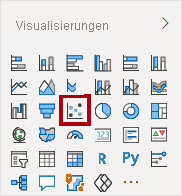
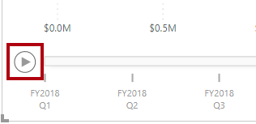
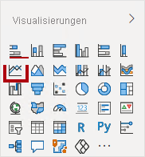
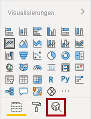

---
lab:
  title: Ausführen von erweiterten Analysen mit KI-Visuals
  module: Perform Data Analysis in Power BI
---

# Analysieren von Daten in Power BI

## Labszenario

In diesem Lab erstellen Sie den Bericht **Sales Exploration**.

In diesem Lab lernen Sie Folgendes:

- Erstellen von animierten Punktdiagrammen
- Verwenden eines Visuals zum Vorhersagen von Werten

**Dieses Lab sollte ungefähr 30 Minuten in Anspruch nehmen.**

## Erste Schritte

Um diese Übung abzuschließen, öffnen Sie zuerst einen Webbrowser, und geben Sie die folgende URL ein, um den ZIP-Ordner herunterzuladen:

`https://github.com/MicrosoftLearning/PL-300-Microsoft-Power-BI-Data-Analyst/raw/Main/Allfiles/Labs/08-perform-data-analysis-in-power-bi-desktop/08-perform-analysis.zip`

Extrahieren Sie den Ordner in den Ordner **C:\Users\Student\Downloads\08-perform-analysis**.

1. Öffnen Sie die Datei **08-Starter-Sales Analysis.pbix** .

> ***Hinweis**: Sie können die Anmeldung abbrechen, indem Sie **Abbrechen** wählen. Schließen Sie alle anderen Informationsfenster. Wählen Sie **Später anwenden**, wenn Sie aufgefordert werden, die Änderungen anzuwenden.*

## Erstellen eines animierten Punktdiagramms

In dieser Aufgabe erstellen Sie ein Punktdiagramm, das animiert werden kann.

1. Erstellen Sie eine neue Seite und nennen Sie sie **Punktdiagramm**.

1. Fügen Sie der Berichtsseite ein **Punktdiagrammvisual** hinzu und ändern anschließend seine Position und Größe, damit es die gesamte Seite ausfüllt.

    > *Das Diagramm kann animiert werden, wenn dem Bereich **Wiedergabeachse** ein Feld hinzugefügt wird.*

     

     

1. Fügen Sie den Visualbereichen die folgenden Felder hinzu:

    > *In den Labs wird eine verkürzte Notation verwendet, um auf ein Feld zu verweisen. Das sieht folgendermaßen aus: **Reseller** **\|** **Unternehmenstyp**. In diesem Beispiel ist **Reseller** der Tabellenname und **Unternehmenstyp** der Feldname.*

     - X-Achse: **Sales \| Umsatz**
     - Y-Achse: **Sales \| Gewinnspanne**
     - Legende: **Reseller \| Unternehmenstyp**
     - Größe: **Sales \| Menge**
     - Wiedergabeachse: **Date \| Quartal**

1. Fügen Sie im Bereich **Filter** das Feld **Product \| Category** im Bereich **Filter für diese Seite** hinzu.

1. Filtern Sie auf der Filterkarte nach **Bikes** (Fahrräder).

1. Wählen Sie links unten **Wiedergabe** aus, um das Diagramm zu animieren.

    

1. Sehen Sie sich den gesamten Animationszyklus vom ersten Quartal im Jahr 2018 (**FY2018 Q1**) bis zum viertel Quartal im Jahr 2020 (**FY2020 Q4**) an.

    > *Das Punktdiagramm ermöglicht Ihnen, die Measurewerte gleichzeitig aufzuschlüsseln, also in diesem Fall die Bestellmenge (order quantity), den Nettoumsatz (sales revenue) und die Gewinnspanne (profit margin).*
    > 
    > *Jede Blase stellt einen Handelspartner-Unternehmenstyp dar. Änderungen an der Blasengröße spiegeln eine größere oder kleinere Bestellmenge wider. Horizontale Bewegungen stellen eine Erhöhung/Abnahme des Nettoumsatzes dar, und vertikale Verschiebungen stellen eine Erhöhung/Abnahme der Rentabilität dar.*

1. Wenn die Animation angehalten wird, klicken Sie auf eine der Blasen, um die Nachverfolgung für einen Zeitraum anzuzeigen.

1. Bewegen Sie den Cursor auf eine beliebige Blase, um eine QuickInfo mit den Measurewerten für den Handelspartnertyp zu diesem Zeitpunkt anzuzeigen.

1. Filtern Sie im Bereich **Filter** nach **Clothing** (Kleidung), und beachten Sie, dass das Ergebnis ein anderes ist.

1. Speichern Sie die Power BI Desktop-Datei.

## Erstellen einer Vorhersage

In dieser Aufgabe erstellen Sie eine Vorhersage, um den möglichen zukünftigen Umsatz zu ermitteln.

1. Fügen Sie eine neue Seite hinzu, und benennen Sie dann die Seite in **Vorhersage** um.

1. Fügen Sie der Berichtsseite ein **Liniendiagrammvisual** hinzu und ändern anschließend seine Position und Größe, damit es die gesamte Seite ausfüllt.

     

     

1. Fügen Sie den Visualbereichen die folgenden Felder hinzu:

     - x-Achse: **Date \| Date**
     - y-Achse: **Sales \| Sales**

1. Fügen Sie im Bereich **Filter** das Feld **Date \| Year** im Bereich **Filter für diese Seite** hinzu.

1. Filtern Sie auf der Filterkarte nach zwei Jahren: **FY2019** und **FY2020**.

    > *Wenn Sie eine Vorhersage über eine Zeitachse treffen, benötigen Sie mindestens zwei Zyklen (Jahre) von Daten, um eine präzise und beständige Vorhersage zu erhalten.*

1. Fügen Sie ebenso das Feld **Product \| Category** im Bereich **Filter für diese Seite** hinzu, und filtern Sie nach **Bikes** (Fahrrädern).

1. Wählen Sie zum Hinzufügen einer Vorhersage unter dem Bereich **Visualisierung** den Bereich **Analyse** aus.

     

1. Erweitern Sie den Abschnitt **Vorhersage**.

    > *Wenn der Abschnitt **Vorhersage** nicht verfügbar ist, wurde das visuelle Element wahrscheinlich nicht ordnungsgemäß konfiguriert. Die Vorhersage ist nur verfügbar, wenn zwei Bedingungen erfüllt sind: Die Achse verfügt über ein einzelnes Feld vom Typ „Date“ (Datum), und es gibt nur ein Wertfeld.*

1. Legen Sie die Option **Vorhersage** auf **Ein** fest.

1. Konfigurieren Sie die folgenden Vorhersageeigenschaften, und klicken Sie dann auf **Anwenden**:

    - Einheiten: **Monate**
    - Vorhersagezeitraum: **1 Monat**
    - Saisonalität: **365**
    - Konfidenzintervall: **80 %**

    

1. Beachten Sie, dass die Vorhersage im Linienvisual einen Monat über die Verlaufsdaten hinaus verlängert wurde.

    > *Der graue Bereich stellt die Konfidenz dar. Je breiter die Konfidenz, desto weniger beständig und präzise ist wahrscheinlich auch die Vorhersage.*
    >
    > *Wenn Sie die Länge des Zyklus kennen (in diesem Fall jährlich), sollten Sie die Saisonalitätspunkte eingeben. Manchmal ist sind diese wöchentlich (7) oder monatlich (30).*

1. Filtern Sie im Bereich **Filter** nun nach **Clothing** (Kleidung). Sie sehen, dass das Ergebnis sich verändert.

## Lab abgeschlossen
