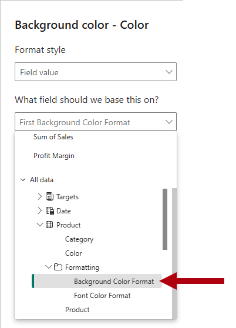
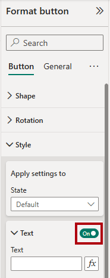
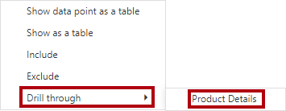

---
lab:
  title: "Verbessern des Entwurfs von Power\_BI-Berichten"
  module: Enhance Power BI report designs for the user experience
---

# Verbessern des Entwurfs von Power BI-Berichten

## Labszenario

In diesem Lab optimieren Sie den Bericht_Sales Analysis_ mit erweiterten Entwurfsfeatures.

In diesem Lab lernen Sie Folgendes:

- Erstellen einer Drillthroughseite
- Anwenden einer bedingten Formatierung
- Erstellen und Verwenden von Textmarken und Schaltflächen

**Dieses Lab sollte ungefähr 45 Minuten in Anspruch nehmen.**

## Erste Schritte

Um diese Übung abzuschließen, müssen Sie zuerst einen Webbrowser öffnen und die folgende URL eingeben, um die ZIP-Datei herunterzuladen:

`https://github.com/MicrosoftLearning/PL-300-Microsoft-Power-BI-Data-Analyst/raw/Main/Allfiles/Labs/09-enhance-power-bi-reports/09-enhanced-report.zip`

Extrahieren Sie die Datei in den Ordner**C:\Benutzer\Student\Downloads\09-enhanced-report**.

Öffnen Sie die Datei**09-Starter-Sales Analysis.pbix**.

> _**Hinweis**: Möglicherweise wird beim Laden der Datei ein Anmeldedialogfeld angezeigt. Wählen Sie**Abbrechen** aus, um das Anmeldedialogfeld zu schließen. Schließen Sie alle anderen Informationsfenster. Wählen Sie**Später übernehmen** aus, wenn Sie aufgefordert werden, die Änderungen anzuwenden._

## Konfigurieren einer Drillthroughseite

In dieser Übung erstellen Sie eine neue Seite und konfigurieren sie als Drillthroughseite. Nach der Fertigstellung des Entwurfs sieht die Seite wie folgt aus:

1. Erstellen Sie eine neue Seite, und benennen Sie sie in_Product Details_um.

1. Klicken Sie mit der rechten Maustaste auf die Seitenregisterkarte**Produktdetails**, und wählen Sie dann die Option**Seite ausblenden** aus.

    > _Berichtsbenutzende können nicht direkt zur Drillthroughseite navigieren. Sie müssen über Visuals auf anderen Seiten darauf zugreifen. In der abschließenden Übung dieses Labs wird beschrieben, wie Sie den Drillthrough zur Seite durchführen._

1. Fügen Sie unter dem Bereich**Visualisierungen** im Abschnitt**Drillthrough** das Feld`Product | Category` zum Feld**Drillthroughfelder hier hinzufügen** hinzu.

    > _In den Labs wird eine verkürzte Notation verwendet, um auf ein Feld zu verweisen. Sie sieht wie folgt aus:`Product | Category`. In diesem Beispiel ist`Product` der Tabellenname und`Category` der Feldname._

    

1. Wählen Sie zum Testen der Drillthroughseite auf der Drillthrough-Filterkarte die Option_Fahrräder_ aus.

    

1. Beachten Sie oben links auf der Berichtsseite die Pfeilschaltfläche.

    > _Der Berichts-Designer fügt automatisch eine Pfeilschaltfläche hinzu, wenn dem Drillthroughbucket ein Feld hinzugefügt wird. Sie ermöglicht es Berichtsbenutzer*innen, zurück zu der Seite zu wechseln, auf der sie den Drillthrough gestartet haben._

1. Fügen Sie der Seite das Visual**Karte** hinzu. Ändern Sie dann die Größe und Position so, dass es rechts von der Schaltfläche angeordnet ist und die restliche Breite der Seite ausfüllt.

    

    

1. Ziehen Sie das Feld`Product | Category` in die Visualkarte.

1. Konfigurieren Sie die Formatoptionen für das Visual so, dass die Eigenschaft**Kategoriebeschriftung** auf**Aus** festgelegt ist.

    

1. Legen Sie auf der Registerkarte**Allgemein** im Abschnitt**Effekte** die Eigenschaft für die Hintergrundfarbe auf eine hellgraue Farbe fest (z. B._Weiß, 10 % dunkler_), um Kontrast zu erzeugen.

    

1. Fügen Sie der Seite ein Visual vom Typ**Tabelle** hinzu. Ändern Sie dessen Größe und Position anschließend so, dass es unterhalb des Kartenvisuals angeordnet ist und den restlichen Platz der Seite einnimmt.

    

    

1. Fügen Sie dem Visual die folgenden Felder hinzu:

    - `Product | Subcategory`
    - `Product | Color`
    - `Sales | Quantity`
    - `Sales | Sales`
    - `Sales | Profit Margin`

1. Um die Formatoptionen für das Visual zu konfigurieren, legen Sie im Abschnitt**Raster** die Eigenschaft**Globaler Schriftgrad** auf**20pt** fest.

    > _Der Entwurf der Drillthroughseite ist nun fast abgeschlossen. In der nächsten Übung optimieren Sie die Seite mit einer bedingten Formatierung._

## Hinzufügen von bedingter Formatierung

In dieser Übung erweitern Sie die Drillthroughseite mit einer bedingten Formatierung. Nach der Fertigstellung des Entwurfs sieht die Seite wie folgt aus:

1. Wählen Sie das Visual vom Typ „Tabelle“ aus. Klicken Sie im Bucket**Columns** für das Feld**Profit Margin** auf den Pfeil nach unten, und wählen Sie**Bedingte Formatierung > Symbole** aus.

    

1. Wählen Sie im Fenster**Symbole – Profit Margin** in der Dropdownliste**Symbollayout** die Option**Rechts von den Daten** aus.

    

1. Wählen Sie links neben dem gelben Dreieck das**X** aus, um die mittlere Regel zu löschen.

    

1. Konfigurieren Sie die erste Regel (rotes Karo) wie folgt:

    - Entfernen Sie im zweiten Steuerelement den Wert.
    - Wählen Sie für das dritte Steuerelement**Zahl** aus.
    - Geben Sie im fünften Steuerelement**0** ein.
    - Wählen Sie für das sechste Steuerelement**Zahl** aus.

1. Konfigurieren Sie die zweite Regel (grüner Kreis) wie folgt:

    - Geben Sie im zweiten Steuerelement**0** ein.
    - Wählen Sie für das dritte Steuerelement**Zahl** aus.
    - Entfernen Sie im fünften Steuerelement den Wert.
    - Wählen Sie für das sechste Steuerelement**Zahl** aus.

    

    > _Die Regeln können wie folgt interpretiert werden: Anzeige eines roten Karos, wenn der Wert für die Rendite kleiner als 0 ist, und Anzeige des grünen Kreises, wenn der Wert größer oder gleich 0 ist._

1. Wählen Sie im Fenster**Symbole – Profit Margin** in der Dropdownliste**Anwenden auf** die Option**Values and totals** aus.

    

1. Wählen Sie**OK** aus.

1. Überprüfen Sie im visuellen Tabellenelement, ob die richtigen Symbole angezeigt werden.

    

1. Konfigurieren Sie die bedingte Formatierung der Hintergrundfarbe für das Feld**Farbe**.

1. Wählen Sie im Fenster**Hintergrundfarbe – Farbe** in der Dropdownliste**Formatstil** die Option**Feldwert** aus.

    

1. Wählen Sie in der Dropdownliste**Welches Feld sollten wir als Grundlage nehmen?** in der Gruppe_Alle Daten_ das Feld`Product | Formatting | Background Color Format` aus.

    

1. Wiederholen Sie die vorherigen Schritte, um die bedingte Formatierung der Schriftfarbe für das Feld**Farbe** mithilfe des Felds`Product | Formatting | Font Color Format` zu konfigurieren.

 > _Sie erinnern sich vielleicht daran, dass die Hintergrund- und Schriftfarben aus der Datei**ColorFormats.csv** im Lab**Vorbereiten von Daten in Power BI Desktop** stammen und dann mit der Abfrage**Product** im Lab**Laden von Daten in Power BI Desktop** integriert wurden._

## Hinzufügen von Lesezeichen und Schaltflächen

In dieser Übung erweitern Sie die Seite_My Performance_ mit Schaltflächen, damit Berichtsbenutzende den gewünschten Visualtyp auswählen können. Nach der Fertigstellung des Entwurfs sieht die Seite wie folgt aus:

1. Navigieren Sie zur Seite_My Performance_ (Meine Leistung).

1. Wählen Sie auf der Registerkarte**Ansicht** des Menübands in der Gruppe**Bereiche anzeigen****Lesezeichen** aus.

    

1. Wählen Sie auf der Registerkarte**Ansicht** des Menübands in der Gruppe**Bereiche anzeigen****Auswahl** aus.

    

1. Wählen Sie zum Ausblenden des Visuals im Bereich**Auswahl** neben einem der Elemente unter_Sales and Target by Month_ (Umsatz und Ziel nach Monat) das Augensymbol aus.

    

1. Wählen Sie im Bereich**Lesezeichen****Hinzufügen** aus.

    

    > _Tipp: Doppelklicken Sie auf die Textmarke, um sie umzubenennen._

1. Falls das Balkendiagramm angezeigt wird, sollten Sie das Lesezeichen in_Balkendiagramm EIN_ umbenennen, und andernfalls in_Säulendiagramm EIN_.

1. Zeigen Sie zum Bearbeiten des Lesezeichens im Bereich**Lesezeichen** mit dem Cursor auf das Lesezeichen, klicken Sie auf die Auslassungspunkte, und wählen Sie dann**Daten** aus.

    > _Das Deaktivieren der Option**Daten** bewirkt, dass die Textmarke nicht den aktuellen Filterstatus verwendet. Das ist wichtig, da die Textmarke den Filter, der aktuell vom Datenschnitt „Year“ angewandt wird, andernfalls dauerhaft sperren würde._

    

1. Zum Aktualisieren des Lesezeichens klicken Sie erneut auf die Auslassungspunkte und wählen dann**Aktualisieren** aus.

    > _In den folgenden Schritten erstellen und konfigurieren Sie eine zweite Textmarke, um das zweite Visual anzuzeigen._

1. Schalten Sie im Bereich**Auswahl** die Sichtbarkeit der beiden Elemente unter_Sales and Target by Month_ (Umsatz und Ziel nach Monat) um.

    > _Anders ausgedrückt: Blenden Sie das angezeigte Visual aus und das ausgeblendete Visual ein._

    

1. Erstellen Sie eine zweite Textmarke, und benennen Sie es entsprechend (entweder_Column Chart ON_ oder_Bar Chart ON)_.

    

1. Konfigurieren Sie das zweite Lesezeichen so, dass Filter ignoriert werden (Option**Daten** AUS), und aktualisieren Sie das Lesezeichen.

1. Zeigen Sie im Bereich**Auswahl** einfach das ausgeblendete Visual an, um beide Visuals einzublenden.

1. Ändern Sie die Größe und Position beider Visuals so, dass sie die Seite unterhalb des Visuals mit mehreren Karten ausfüllen und einander vollständig überlappen.

    > _Wählen Sie das verdeckte visuelle Element im Bereich**Auswahl** aus._

    

1. Wählen Sie im Bereich**Lesezeichen** die beiden Lesezeichen aus. Sie sehen, dass nur ein Visual sichtbar ist.

    > _Die nächste Entwurfsstufe besteht darin, der Seite zwei Schaltflächen hinzuzufügen. Mit diesen Schaltflächen können Berichtsbenutzende die Textmarken auswählen._

1. Wählen Sie im Menüband**Einfügen** in der Gruppe**Elemente****Schaltfläche** und dann die Option**Leer** aus.

    

1. Platzieren Sie die Schaltfläche direkt unterhalb des Slicers_Year_.

1. Wählen Sie die Schaltfläche aus, und erweitern Sie dann im Bereich**Schaltfläche "Format"** den Abschnitt**Art**, und legen Sie dann den Abschnitt**Text** auf**Ein** fest.

    

1. Geben Sie im Abschnitt**Text** im Feld**Text** den Namen_Balkendiagramm_ ein.

1. Legen Sie den Abschnitt**Füllend** auf**Ein** fest, und legen Sie mithilfe einer Komplementärfarbe eine Farbe fest.

1. Legen Sie den Abschnitt**Action** auf**Ein** und die Eigenschaft**Typ** auf**Textmarke** fest.

1. Klicken Sie auf**Schaltfläche**, und setzen Sie die Eigenschaft**Aktion** auf**Ein**.

1. Erweitern Sie den Abschnitt**Aktion**, und wählen Sie dann in der Dropdownliste**Typ** die Option**Lesezeichen** aus.

1. Wählen Sie in der Dropdownliste**Lesezeichen** die Option**Balkendiagramm EIN** aus.

    

1. Erstellen Sie per Kopieren und Einfügen eine Kopie der Schaltfläche, und konfigurieren Sie die neue Schaltfläche dann wie folgt:

    > _Tipp: Die Tastenkombination für das Kopieren und Einfügen ist**STRG+C** gefolgt von**STRG+V**._

    - Legen Sie den Schaltflächentext auf_Säulendiagramm_ fest.
    - Legen Sie die „Action“-Textmarke auf**Column Chart ON** fest.

    > _Der Entwurf des Sales Analysis-Berichts ist nun fertig gestellt._

## Veröffentlichen und Erkunden des Berichts

In dieser Übung veröffentlichen Sie den Bericht im Power BI-Dienst und erkunden das Verhalten des veröffentlichten Berichts.

> _**Hinweis**: Sie benötigen mindestens eine**Power BI Free**-Lizenz, um den Bericht zu veröffentlichen. Öffnen Sie den Microsoft Edge-Browser, und navigieren Sie zu_`https://app.powerbi.com`_.  Melden Sie sich mit den Anmeldeinformationen für den Microsoft 365-Mandanten an, die von Ihrem autorisierten Labhoster (ALH) bereitgestellt werden. Wenn Sie aufgefordert werden, ein Puzzle zu lösen oder eine kostenlose Fabric-Testversion zu starten, können Sie dies überspringen und den Browser schließen._

> _**Hinweis**: Sie können den Rest der Übung auch durchgehen, wenn Sie keinen Zugriff auf den Power BI-Dienst haben, um die Aufgaben direkt auszuführen._

1. Wählen Sie die Seite_Übersicht_ aus.

1. Wählen Sie im Slicer_Jahr_ die Option**FY2020** (GJ2020) aus.

1. Stellen Sie im Datenschnitt_Region_ sicher, dass keine Regionen ausgewählt sind.

1. Speichern Sie die Power BI Desktop-Datei.

1. Klicken Sie auf der Registerkarte**Start** des Menübands innerhalb der Gruppe**Freigeben** auf**Veröffentlichen**.

    > _Wenn Sie noch nicht bei Power BI Desktop angemeldet sind, müssen Sie sich zuerst anmelden, bevor Sie den Bericht veröffentlichen._

    

1. Beachten Sie, dass im Fenster**In Power BI veröffentlichen** die Option_Mein Arbeitsbereich_ ausgewählt ist.

1. Wählen Sie**Auswählen** aus, um den Bericht zu veröffentlichen. Warten Sie, bis die Veröffentlichung abgeschlossen ist.

1. Warten Sie, bis die Veröffentlichung erfolgreich abgeschlossen wurde, und wählen Sie dann**Alles klar** aus.

1. Schließen Sie Power BI Desktop.

1. Öffnen Sie den Browser „Microsoft Edge“, und melden Sie sich unter`https://app.powerbi.com` an (oder verwenden Sie eine bestehende Browsersitzung).

1. Wählen Sie im Browserfenster im Power BI-Dienst im Bereich**Navigation** (links und möglicherweise zugeklappt) die Option**Mein Arbeitsbereich** aus.

1. Klicken Sie auf den Bericht_09-Starter-Sales Analysis_, um sich diesen anzusehen.

1. Wählen Sie zum Testen des Drillthroughfeatures auf der Seite_Übersicht_ im Visual_Sum of Quantity by Category_ mit der rechten Maustaste die Leiste_Clothing_ und dann**Drillthrough > Produktdetails** aus.

    

1. Beachten Sie, dass die Visuals zu_Clothing_ auf der Seite_Produktdetails_ gefiltert werden.

1. Klicken Sie links oben auf die Pfeilschaltfläche, um zur Ausgangsseite zurückzukehren.

1. Navigieren Sie zur Seite_My Performance_ (Meine Leistung).

1. Wählen Sie die einzelnen Schaltflächen aus. Sie sehen, dass jeweils ein anderes Visual angezeigt wird.

## Lab abgeschlossen

1. Schließen Sie den Microsoft Edge-Browser.
1. Schließen Sie Power BI Desktop.