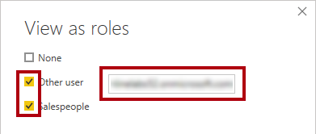

---
lab:
  title: Sicherer Datenzugriff in Power BI
  module: Secure data access in Power BI
---

# Sicherer Datenzugriff in Power BI

## Labszenario

In diesem Lab erzwingen Sie die Sicherheit auf Zeilenebene, um sicherzustellen, dass ein Vertriebsmitarbeiter nur die Vertriebsdaten für die ihm zugewiesenen Regionen analysieren kann. Folgendes wird vermittelt:

- Implementieren Sie in Power BI Sicherheit auf dynamischer Zeilenebene (Row-Level Security, RLS).
- Erstellen und testen Sie mithilfe von USERPRINCIPALNAME() eine Rolle.

**Dieses Lab sollte ungefähr 20 Minuten in Anspruch nehmen.**

## Erste Schritte

Um diese Übung abzuschließen, öffnen Sie zuerst einen Webbrowser, und geben Sie die folgende URL ein, um den ZIP-Ordner herunterzuladen:

`https://github.com/MicrosoftLearning/PL-300-Microsoft-Power-BI-Data-Analyst/raw/Main/Allfiles/Labs/11-secure-data-access/11-secure-data.zip`

Extrahieren Sie den Ordner in den Ordner **C:\Benutzer\Student\Downloads\11-secure-data**.

Öffnen Sie die Datei **11-Starter-Sales Analysis.pbix**.

> _**Hinweis**: Möglicherweise wird beim Laden der Datei ein Anmeldedialogfeld angezeigt. Wählen Sie **Abbrechen** aus, um das Anmeldedialogfeld zu schließen. Schließen Sie alle anderen Informationsfenster. Wählen Sie **Später übernehmen** aus, wenn Sie aufgefordert werden, die Änderungen anzuwenden._

## Erzwingen von Sicherheit auf Zeilenebene

In dieser Aufgabe erzwingen Sie Sicherheit auf Zeilenebene, um sicherzustellen, dass Vertriebsmitarbeiter nur Umsätze in den zugewiesenen Regionen anzeigen können.

1. Wechseln Sie zur **Tabellenansicht**.

   

1. Wählen Sie im Bereich **Daten** die Tabelle **Salesperson (Performance)** aus.

1. Wenn Sie die Daten überprüfen, werden Sie bemerken, dass Michael Blythe (EmployeeKey 281) den UPN-Wert **`michael-blythe@adventureworks.com`** hat.
    
    > *Sie werden sich erinnern, dass Michael Blythe drei Vertriebsregionen zugewiesen ist: „USA, Nordosten“, „USA, Mitte“ und „USA, Südosten“.*

1. Wählen Sie auf der Registerkarte des Menübands **Startseite** innerhalb der Gruppe **Sicherheit** die Option **Rollen verwalten**.

    

1. Wählen Sie im Fenster **Sicherheitsrollen verwalten** im Abschnitt **Rollen** die Option **Neu**.

1. Ersetzen Sie im Feld den ausgewählten Text durch den Namen der Rolle: Geben Sie **Salespeople** ein, und drücken Sie dann die **EINGABETASTE**.

   

1. Um einen Filter zuzuweisen, wählen Sie die Tabelle **Salesperson (Performance)** und anschließend im Abschnitt **Regeln** die Option **Zum DAX-Editor wechseln** aus.

   

1. Geben Sie im DAX-Editorfeld den folgenden Ausdruck ein:

    ```DAX
    [UPN] = USERPRINCIPALNAME()
    ```

   

    > *USERPRINCIPALNAME() ist eine DAX-Funktion (Data Analysis Expressions), die den Namen des authentifizierten Benutzers zurückgibt. Dies bedeutet, dass die Tabelle **Salesperson (Performance)** nach dem Benutzerprinzipalnamen (User Principal Name, UPN) des Benutzers gefiltert wird, der das Modell abfragt.*

1. Wählen Sie **Speichern** und **Schließen** aus.

1. Um die Sicherheitsrolle zu testen, wählen Sie auf der Registerkarte des Menübands **Startseite** in der Gruppe **Sicherheit** die Option **Anzeigen als**.

   

1. Aktivieren Sie im Fenster **Als Rollen anzeigen** das Element **Anderer Benutzer**, und geben Sie dann in das entsprechende Feld Folgendes ein: **`michael-blythe@adventureworks.com`**

1. Aktivieren Sie die Rolle **Salespeople**, und klicken Sie auf **OK**.
    
    > *Diese Konfiguration führt dazu, dass die Rolle **Salespeople** verwendet und die Identität des Benutzers mit dem Namen „Michael Blythe“ angenommen wird.*

   

1. Beachten Sie das rote Banner oberhalb der Seite „Bericht“, das den Sicherheitskontext für Tests beschreibt.

   

1. Beachten Sie, dass im Tabellenvisual nur der Vertriebsmitarbeiter **Michael Blythe** aufgeführt ist.

   

1. Wählen Sie auf der rechten Seite des roten Banners die Option **Anzeige beenden** aus, um den Test zu beenden.

   

1. Um die Rolle **Salespeople** zu löschen, wählen Sie auf der Registerkarte des Menübands **Startseite** in der Gruppe **Sicherheit** die Option **Rollen verwalten**.

   

1. Wählen Sie im Fenster **Sicherheitsrollen verwalten** die Auslassungspunkte (...) bei der Rolle **Salespeople** und wählen Sie **Löschen**. Wenn Sie aufgefordert werden, den Löschvorgang zu bestätigen, wählen Sie **Ja, Löschen** aus.

   

*Hinweis: Wenn die Power BI Desktop-Datei im Power BI-Dienst veröffentlicht wird, müssen Sie noch eine Aufgabe nach der Veröffentlichung durchführen, um der Rolle **Salespeople** Sicherheitsprinzipale zuzuordnen. Das erledigen Sie in diesem Lab nicht.*

## Lab abgeschlossen

Sie können Ihren Power BI-Bericht speichern, aber für dieses Lab ist dies nicht erforderlich. 

1. Schließen Sie das Microsoft Edge-Browserfenster.
1. Navigieren Sie in Power BI Desktop zum Menü **Datei** in der oberen linken Ecke, und wählen Sie **Speichern unter** aus. 
1. Wählen Sie **Dieses Gerät durchsuchen** aus.
1. Wählen Sie den Ordner aus, in dem Sie die Datei speichern möchten, und geben Sie ihm einen aussagekräftigen Namen. 
1. Wählen Sie die Schaltfläche **Speichern** aus, um den Bericht als PBIX-Datei zu speichern. 
1. Wenn ein Dialogfeld angezeigt wird, in dem Sie aufgefordert werden, ausstehende Abfrageänderungen anzuwenden, wählen Sie **Übernehmen** aus.
1. Schließen Sie Power BI Desktop.
