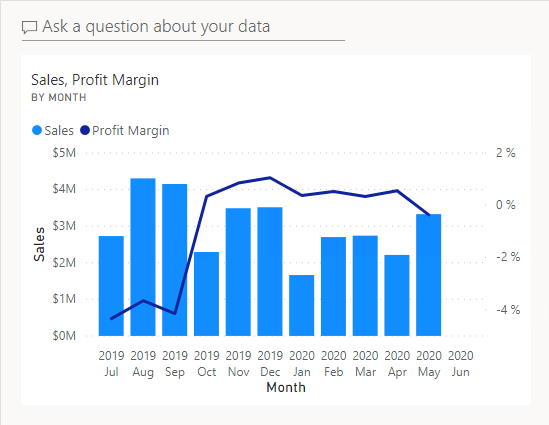
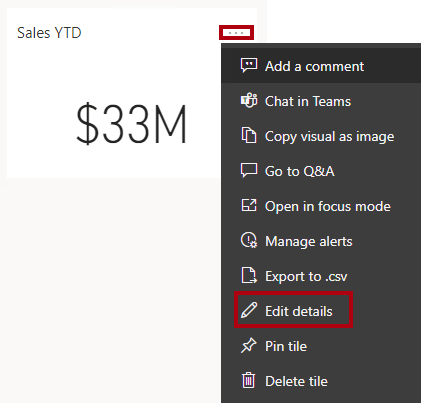
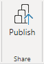

---
lab:
  title: (Optional) Erstellen von Dashboards in Power BI
  module: Create dashboards in Power BI
---

# Erstellen von Dashboards in Power BI

## Labszenario

In diesem Lab erstellen Sie das Dashboard **Sales Monitoring** im Power BI-Dienst mithilfe eines vorhandenen Berichts.

In diesem Lab lernen Sie Folgendes:

- Anheften von Visuals an ein Dashboard
- Verwenden von Q&A zum Erstellen von Dashboardkacheln

**Dieses Lab sollte ungefähr 30 Minuten in Anspruch nehmen.**

## Erste Schritte

Um diese Übung abzuschließen, öffnen Sie zuerst einen Webbrowser, und geben Sie die folgende URL ein, um den ZIP-Ordner herunterzuladen:

`https://github.com/MicrosoftLearning/PL-300-Microsoft-Power-BI-Data-Analyst/raw/Main/Allfiles/Labs/12-create-power-bi-dashboard/12-create-dashboard.zip`

Extrahieren Sie Sie den Ordner in den Ordner **C:\Benutzer\Student\Downloads\12-create-dashboard**.

> _**Hinweis**: Sie benötigen mindestens eine **Power BI Free**-Lizenz, um den Bericht zu veröffentlichen. Öffnen Sie den Browser „Microsoft Edge“, und melden Sie sich unter `https://app.powerbi.com` an. Wenn Sie aufgefordert werden, ein Puzzle zu lösen oder eine kostenlose Fabric-Testversion zu starten, können Sie dies überspringen und den Browser schließen.

## Veröffentlichen des Berichts

In dieser Aufgabe richten Sie die Umgebung für das Lab ein, indem Sie ein semantisches Modell erstellen.

1. Navigieren Sie im Browserfenster von Microsoft Edge im Power BI-Dienst zu **Mein Arbeitsbereich**.

1. Wählen Sie **Importieren > Bericht, paginierter Bericht oder Arbeitsmappe > Von diesem Computer** aus.

1. Navigieren Sie zum Ordner **C:\Benutzer\Student\Downloads\12-create-dashboard**.

1. Wählen Sie die Datei **12-Starter-Sales Analysis.pbix** aus und dann **Öffnen** aus.

    > *Wenn Sie zum Ersetzen des semantischen Modells aufgefordert werden, wählen Sie **Ersetzen** aus.*

## Erstellen eines Dashboards

In dieser Aufgabe erstellen Sie das Dashboard **Sales Monitoring**. Sie heften ein Visual aus dem Bericht an, fügen eine Kachel auf der Grundlage eines Imagedaten-URIs hinzu, und verwenden Q&A, um eine Kachel zu erstellen.

1. Öffnen Sie im Power BI-Dienst den Bericht **12-Starter-Sales Analysis**.

1. Legen Sie auf der Seite **Übersicht** den Slicer **Year** auf **FY2020** fest.

    

1. Legen Sie den Slicer **Region** auf **Alle auswählen** fest.

    > *Angeheftete visuelle Elemente werden mit dem Filterkontext zum Zeitpunkt des Anheftens festgelegt. Wenn sich das zugrunde liegende visuelle Element ändert, müssen Sie auch die Dashboardkachel aktualisieren. Für zeitbasierte Filter ist es besser, einen relativen Datumsschnitt zu verwenden (oder Q&A unter Verwendung einer relativen zeitbasierten Frage).*

1. Zeigen Sie mit dem Mauszeiger auf das visuelle Element **Umsatz und Gewinnspanne nach Monat** (Spalte/Zeile), um ein Dashboard zu erstellen und ein visuelles Element anzuheften, und wählen Sie die Reißzwecke aus.

    

1. Geben Sie im Fenster **An Dashboard anheften** im Feld **Dashboardname** den Namen **Sales Monitoring**  (Umsatzüberwachung) ein, und wählen Sie **Anheften** aus.

    

1. Öffnen Sie **Mein Arbeitsbereich** und anschließend das Dashboard **Sales Monitoring**.

1. Beachten Sie, dass das Dashboard über eine einzelne Kachel verfügt.

    

1. Zum Hinzufügen einer Kachel, die auf einer Frage basiert, klicken Sie oben links im Dashboard auf **Stellen Sie eine Frage zu Ihren Daten**. 

    *Sie können die Q&A-Funktion verwenden, um eine Frage zu stellen, und Power BI antwortet mit einem visuellen Element.*

    

1. Klicken Sie auf eine der vorgeschlagenen Fragen, die unterhalb des Q&A-Felds angegeben sind, und überprüfen Sie die Antwort.

1. Entfernen Sie den gesamten Text aus dem Q&A-Feld, und geben Sie Folgendes ein: **Sales YTD**

1. Die Antwort lautet **(Leer)**.

    > *Sie erinnern sich vielleicht daran, dass Sie die Kennzahl **Umsätze seit Jahresbeginn** im **Erstellung von erweiterte DAX-Berechnungen in Power BI Desktop** Lab hinzugefügt haben. Diese Kennzahl ist ein Zeitintelligenz-Ausdruck und erfordert daher einen Filter für die Tabelle **Datum**, um ein Ergebnis zu erhalten.*

    

1. Erweitern Sie die Frage um **in year FY2020** (im Jahr 2020).

1. Die Antwort lautet nun **$33M**.

    

1. Zum Anheften der Antwort an das Dashboard klicken Sie oben rechts auf **Visualisierung anheften**.

    

1. Wählen Sie bei entsprechender Aufforderung im Dropdownmenü die Option **Sales Monitoring** und anschließend **Anheften** aus.

1. Klicken Sie links oben auf **Q&amp;A beenden**, um zum Dashboard zurückzukehren.

1. Wählen Sie in der Menüleiste **Bearbeiten** und **Kachel hinzufügen** aus, um das Firmenlogo hinzuzufügen.
    
    > *Mithilfe dieses Verfahrens zum Hinzufügen einer Dashboardkachel können Sie das Dashboard mit Medien erweitern, einschließlich Webinhalten, Bildern, Textfeldern mit umfangreicher Formatierung und Videos (mit YouTube- oder Vimeo-Links).*

1. Klicken Sie im Bereich **Kachel hinzufügen** rechts auf die Kachel **Image** und dann auf **Weiter**.

1.Navigieren Sie zum Ordner **C:\Benutzer\Student\Downloads\12-create-dashboard**, und öffnen Sie die Datei **AdventureWorksLogo_DataURL.txt**. 

2. Fügen Sie im Bereich **Imagekachel hinzufügen** im Feld **URL** die URL aus der Textdatei ein, und **Übernehmen** Sie diese.
    
    > *Sie können ein Bild mithilfe der zugehörigen URL einbetten oder eine Daten-URL verwenden, die Inhalte inline einbettet.*

1. Um die Größe der Logokachel zu ändern, ziehen Sie die untere rechte Ecke. Ändern Sie die Größe der Kachel so, dass sie eine Einheit breit und eine Einheit hoch ist.
    
    > *Kachelgrößen sind auf eine rechteckige Form beschränkt.*

1. Ordnen Sie die Kacheln so, dass das Logo ganz oben links angezeigt wird. Daneben ordnen Sie die Kachel **Sales YTD** und rechts die Kachel **Sales, Profit Margin** an.

    

## Bearbeiten von Kacheldetails

In dieser Aufgabe bearbeiten Sie die Details von zwei Kacheln.

1. Zeigen Sie mit dem Mauszeiger auf die Kachel **Sales YTD**, klicken Sie dann oben rechts auf der Kachel auf die Auslassungspunkte und anschließend auf **Details bearbeiten**.

    

1. Geben Sie im Bereich **Kacheldetails** (rechts) im Feld **Untertitel** den Text **FY2020** ein, und wählen Sie **Übernehmen** aus.

1. Nun wird auf der Kachel **Sales YTD** ein Untertitel angezeigt.

    

1. Bearbeiten Sie die Kacheldetails für die Kachel **Sales, Profit Margin** (Umsatz, Gewinnspanne).

1. Aktivieren Sie im Bereich **Kacheldetails** im Abschnitt **Funktionalität** die Option **Zeitpunkt der letzten Aktualisierung anzeigen**, und wählen Sie **Übernehmen** aus.

    

1. Die Kachel gibt jetzt den Zeitpunkt der letzten Aktualisierung an (bei der Aktualisierung des Datenmodells in Power BI Desktop).

*In der nächsten Übung aktualisieren Sie das semantische Modell. Abhängig von Ihren Daten und Berichten können Sie jederzeit eine Ad-hoc-Datenaktualisierung durchführen oder einen Zeitplan festlegen. Geplante Aktualisierungen erfordern jedoch Gateways, die wir für dieses Lab nicht konfigurieren können. Von Power BI Desktop aus führen Sie also eine manuelle Datenaktualisierung durch und laden die Datei dann in Ihren Arbeitsbereich hoch.*

## Aktualisieren des semantischen Modells

In dieser Übung laden Sie zuerst Bestelldaten für Juni 2020 in die Datenbank **AdventureWorksDW2020**. Anschließend öffnen Sie die Power BI Desktop-Datei, führen eine Datenaktualisierung aus und laden die Datei in Ihren Arbeitsbereich hoch.

> ***Hinweis**: Wenn Sie keine Verbindung zur Datenbank herstellen können, können Sie die Datei **12-Solution-Sales-Analysis.pbix** verwenden. Statt die Datenbank zu aktualisieren und das Semantikmodell zu aktualisieren, laden Sie die Lösungsdatei zu **Mein Arbeitsbereich** hoch und sehen Sie sich die Änderungen an, auf die in den folgenden Aufgaben verwiesen wird.*

## Aktualisieren der Lab-Datenbank

In dieser Aufgabe führen Sie ein PowerShell-Skript aus, um Daten in der Datenbank **AdventureWorksDW2020** zu aktualisieren.

1. Klicken Sie im Datei-Explorer im Ordner **C:\Benutzer\Student\Downloads\12-create-dashboard** mit der rechten Maustaste auf die Datei **UpdateDatabase-2-AddSales.ps1**, und wählen Sie dann **Mit PowerShell ausführen** aus.

    

1. Wenn Sie aufgefordert werden, die Ausführungsrichtlinie zu ändern, drücken Sie auf die Taste **A**.

1. Wenn Sie aufgefordert werden, zum Schließen eine beliebige Taste zu drücken, drücken Sie erneut die **EINGABETASTE**.

*Die Datenbank **AdventureWorksDW2020** enthält nun Bestellungen vom Juni 2020.*

## Aktualisieren der Power BI Desktop-Datei

In dieser Aufgabe öffnen Sie die Power BI Desktop-Datei **12-Starter-Sales Analysis**, führen eine Datenaktualisierung aus, und laden die Datei anschließend in den Arbeitsbereich **Verkaufsanalyse** hoch.

1. Klicken Sie in der Power BI Desktop-Datei im Bereich **Daten** mit der rechten Maustaste auf die Tabelle **Sales**, und wählen Sie dann **Aktualisieren > Daten** aus.

    

1. Wenn die Aktualisierung abgeschlossen ist, speichern Sie die Power BI Desktop-Datei.

1. Klicken Sie auf der Registerkarte **Start** des Menübands innerhalb der Gruppe **Freigeben** auf **Veröffentlichen**, und wählen Sie **Auswählen** aus, um die Datei in Ihrem Arbeitsbereich zu veröffentlichen.

    

1. Wenn Sie zum Ersetzen des semantischen Modells aufgefordert werden, wählen Sie **Ersetzen** aus.

1. Schließen Sie Power BI Desktop.

*Das semantische Modell im Power BI-Dienst enthält jetzt Umsatzdaten vom Juni 2020.*

## Überprüfen des Dashboards

Bei dieser Aufgabe überprüfen Sie das Dashboard, um aktualisierte Umsatzdaten anzuzeigen.

1. Öffnen Sie im Microsoft Edge-Browserfenster Power BI-Dienst, und überprüfen Sie dann das Dashboard **Sales Monitoring** in **Mein Arbeitsbereich**.

2. Auf der Kachel **Sales, Profit Margin** (Umsatz, Gewinnspanne) können Sie im Untertitel **Refreshed: NOW** sehen, dass die Daten JETZT aktualisiert wurden.

3. Beachten Sie auch, dass nun eine Spalte für **2020 Jun** vorhanden ist.

    > *Wenn die Daten für Juni 2020 nicht angezeigt werden, müssen Sie möglicherweise **F5** drücken, um den Browser zu aktualisieren.*

    

## Lab abgeschlossen

1. Schließen Sie das Microsoft Edge-Browserfenster.